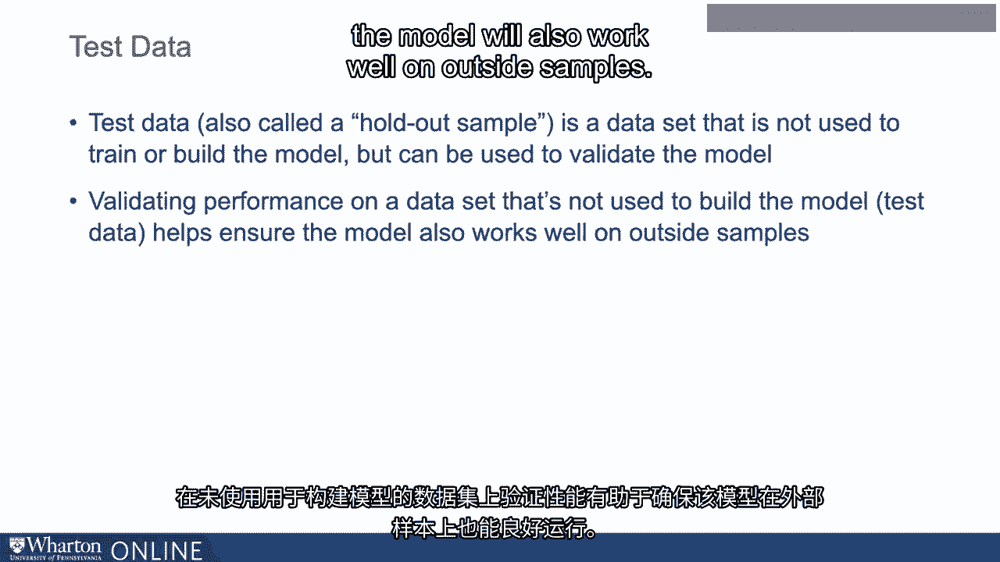
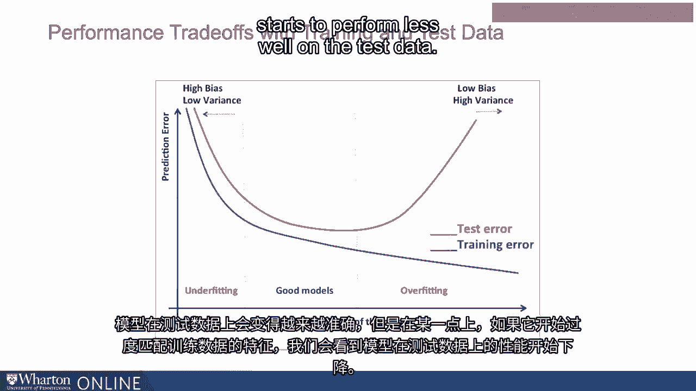
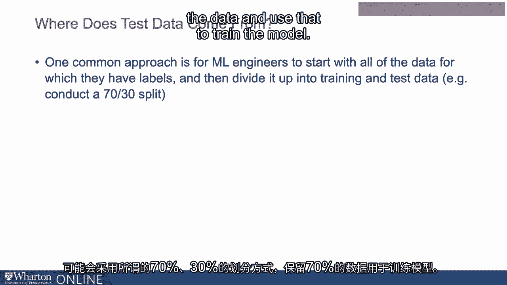
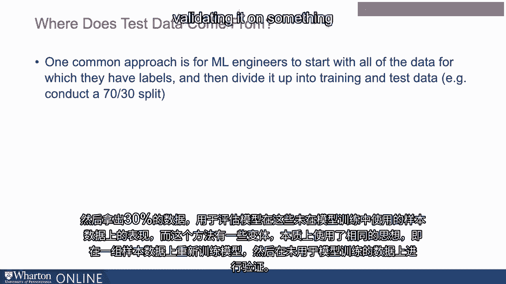
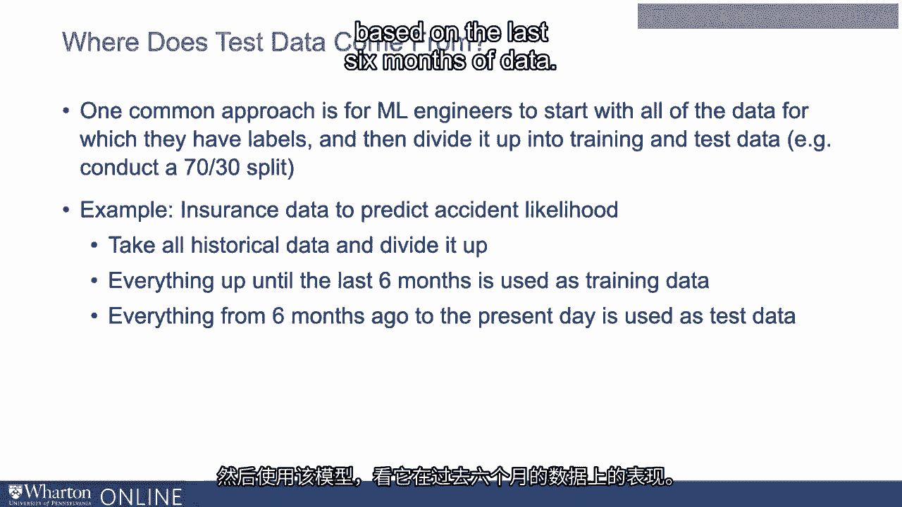

# 沃顿商学院《AI For Business（AI用于商业：AI基础／市场营销+财务／人力／管理）》（中英字幕） - P23：22_测试数据.zh_en - GPT中英字幕课程资源 - BV1Ju4y157dK

 When thinking about the overfitting problem， it's important to understand the concept of。

 test data， which is one of the tools that engineers use to avoid overfitting。 So test data。

 also called a holdout sample， is a data set that is not used to train or， build the model。

 but that we can use to validate the model。 So validating performance on a data set that's not used to build the model helps ensure that。

 the model will also work well on outside samples。

 So one can think about having two data sets， training data set， and a test data set。

 And we can make the model， build the model on the training data， and it's going to get。

 more and more accurate on the training data。 It's going to get more and more accurate on the test data。

 At a certain point though， if it starts to fit itself too well to specific characteristics。

 of the training data， we start to see a divergence and it starts to perform less well on the test。

 data。

 So having these two data sets available at the same time helps us manage this overfitting。

 problem and helps us ensure that the training that the model is undergoing is applicable。

 to outside samples as well。 So where does test data come from？

 So keep in mind that we need a data set that was not used to build the model， that the machine。

 learning algorithm did not learn from， but we still need the correct answers to be available。

 in the data。 We need those labels to be available in the data for the test data as well。

 So a common approach is for machine learning engineers to start with all of the data for。

 which they have labels。 So a large data set for which they have labels available。

 the correct answers available， and， then simply divide it up into training and test data。

 So you might do what's called like a 70/30 split where you keep 70% of the data and use。

 that to train the model and then take 30% of data that you hold out and use that to evaluate。

 how the model is doing on that out of sample data。

 And there are variations on this that essentially use the same idea which is you're training。

 the data on one set of the sample or one set of data and you're basically validating it。

 on something that wasn't used to train the model。

 So as an example if you're trying to use insurance data for instance to predict accident likelihood。

 based on customer attributes driving characteristics so on。

 What you might do is you might take all of your historical data on accidents as well。

 as customer attributes and characteristics and you might divide it up。

 You might say let me take everything up until the last six months and use that as my training。

 data and then everything from six months ago onto the present day I'll use my test data。

 and so I'll train the model from all the data before six months。

 I'll use that model and see how it's doing based on the last six months of data that。

 way the accidents in the last six months of data are not used to build the model but can。

 still be used to sort of validate how it's doing on data that are not used to actually。

 build the model。 And then after that after you're comfortable that the model performs well on the test data。

 it can then be rolled into deployment to kind of predict accidents that are going to happen。

 in the future based on different customer attributes and characteristics。 [ Silence ]。

