# 沃顿商学院《AI For Business（AI用于商业：AI基础／市场营销+财务／人力／管理）》（中英字幕） - P26：25_生成对抗网络和变分自编码器.zh_en - GPT中英字幕课程资源 - BV1Ju4y157dK

 One of the most exciting areas of machine learning is generative models。

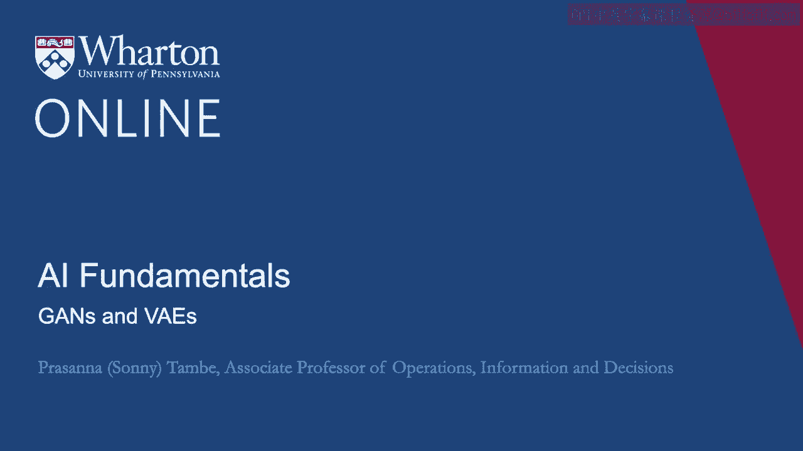

 Generative models are becoming increasingly important and more and more widely used。

 We've been talking about models mostly that essentially discriminate between two categories。

 They mark something as being true or false or one or zero。 That's called a discriminative model。

 A generative model does something slightly different。

 Instead of classifying data into two categories， a generative model asks the question what。

 the underlying process is that could have generated the type of data that we're seeing。

 in the sample。 What that means practically is that generative models can create new instances of the data。

 once they learn。 Once they understand the process that can generate the data that we're observing。

 it， can then start to use that to create new instances of the data。

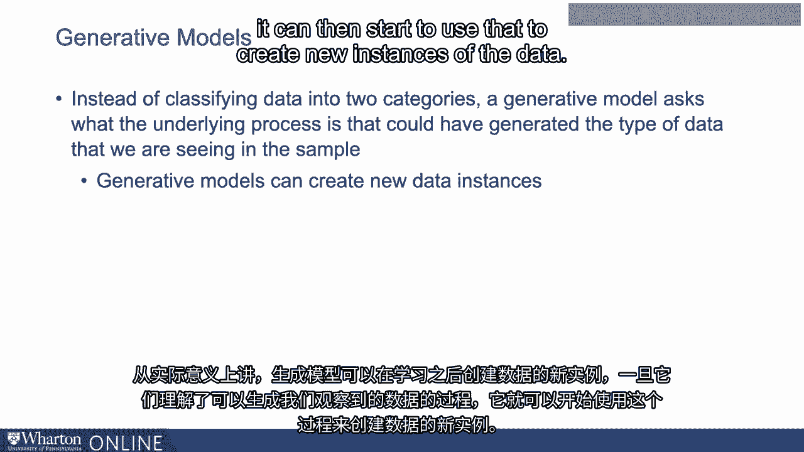

 That gets really interesting because it starts to blur the lines a little bit between machine。

 learning and what we think about as traditional areas of human creativity。

 There have been many examples of generative models applied to areas like art and music。 For example。

 there have been generative models used to generate new songs that are in particular。

 styles like country or jazz。 These generative models produce the instrumentation， the lyrics。

 even the vocals they can emulate， as well。 There are generative models that are used to produce new styles of arts。

 There are also generative models that can be used to produce art in styles that mimic。

 those of traditional masters。 Van Gogh， for instance。

 You can use generative model to basically create art in the style of Van Gogh。

 The most famous generative model perhaps is text applications， particularly GPT-3， GPT-2。

 which received a lot of press。 These types of generative models can generate text in a way that could have been written。

 by a student essay or a journalist。 So with a generative model like GPT-3。

 you can give it a starting point， you can give。

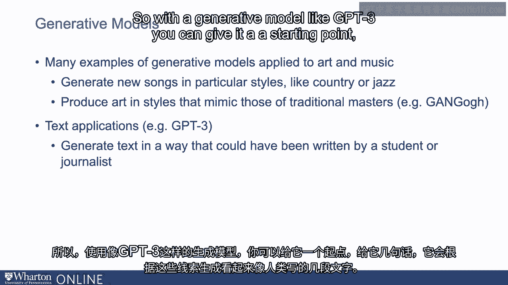

 it a few sentences， and it will essentially generate text along those lines to fill out。

 several paragraphs that look like they were written by a human。

 So lots of examples and applications of GPT-3。 So while the media。

 the press has covered certainly a lot of the interesting demonstrations， of GPT-3。

 one can certainly think about business applications。

 And many of these are -- there are a number of ventures these days that are trying to develop。

 products around this type of technology。 You could think about using technologies like this to create full emails or make it easier。

 to respond to emails given just a few bullet points， for instance。

 Lots of applications of technologies -- of a technology that can generate new text just。

 given a starting point。 Now one variation on this called a generative adversarial network is a particularly important。

 application of a generative model。 And this is a type of technology that is used to generate artificial content that is increasingly。

 hard to tell apart from real content。 So the way a generative adversarial network or again。

 as it's sometimes called， works is， it uses two networks competing with one another。

 It uses a generative network that creates new content， and then it uses another network。

 that is basically used simply to tell whether the output of the first network is real or， fake。

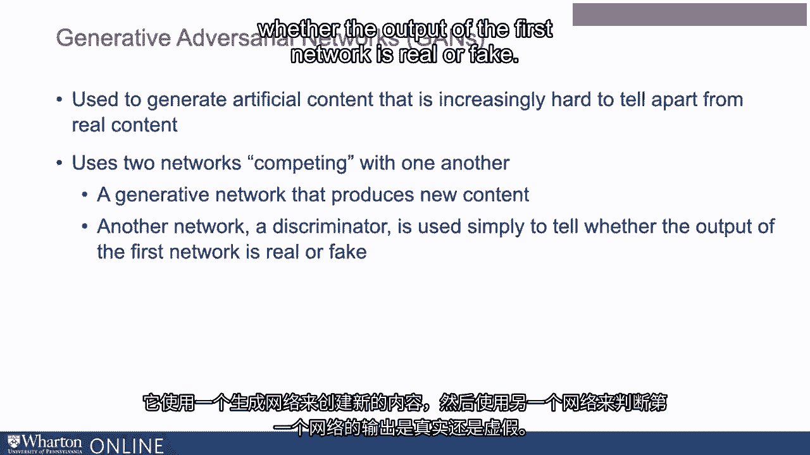

 So a generator is constantly putting out new artificial content， and the discriminator is。

 looking at that content that's putting put out and saying it's real or fake。 And over time。

 that generator will then learn what it needs to do to create content that。

 is harder and harder for the discriminator to identify as being fake content。

 And through that process， the generator develops more and more content that is hard to distinguish。

 in terms of its authenticity。 And there are a number of examples of organs that have been used to quickly advance our。

 ability to generate artificial content using algorithms。

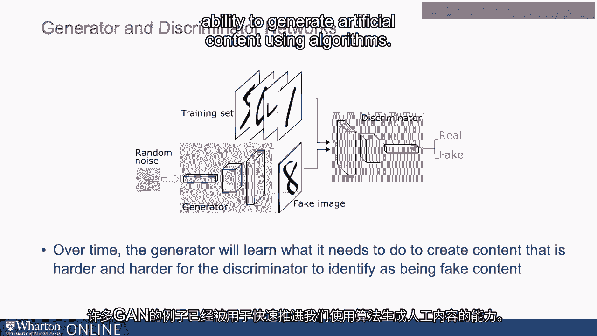

 For example， GANS have been used to generate artificial faces at scale in a way that a。

 machine or a human has a very difficult time looking at the picture and saying whether this。

 is a picture of a human， a human face or something else。 Lots of applications around this。

 A lot of controversy around these types of applications as well。

 So as we think about these technologies， these are where some of the concerns around things。

 like deep-fakes arise。 When we take pictures， when we take products。

 when we take images and make artificially。

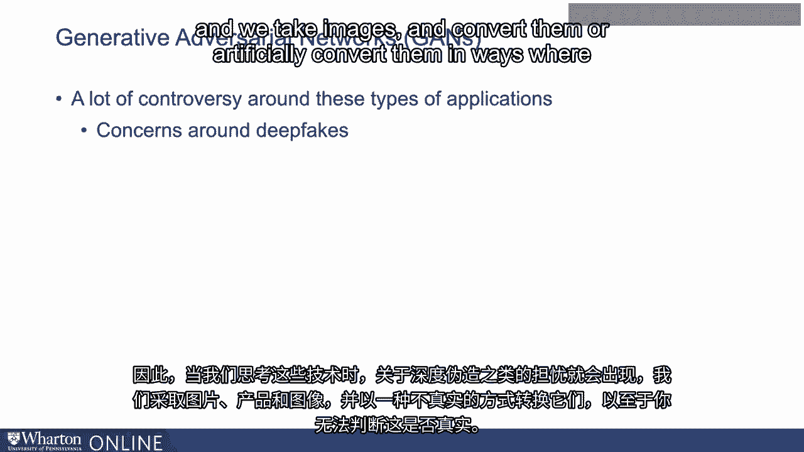

 convert them in ways where you can't tell if this is authentic or real， this is where。

 a lot of the controversy arises around their use。

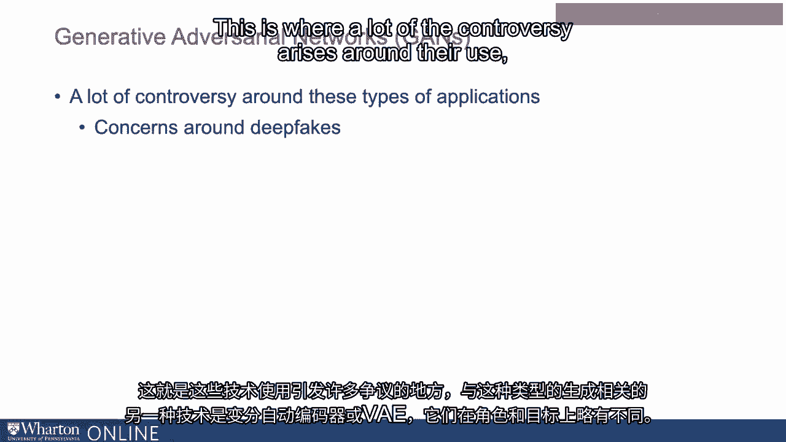

 Another technology that's related to some of this type of generation is variational auto。

 encoders or VAEs。 They have a slightly different role and goal。 So encoders themselves。

 what they do is they take data， they boil it down to a simpler， representation。

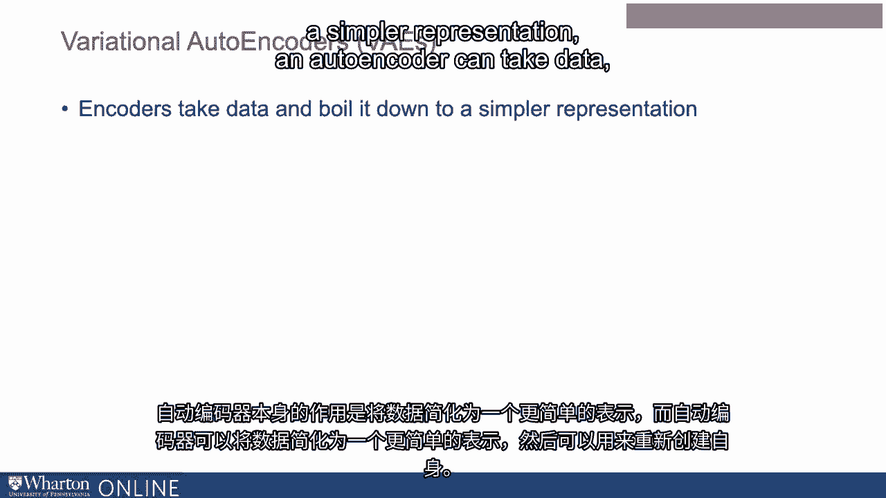

 An auto encoder can take data， boil it down to a simpler representation which can then。

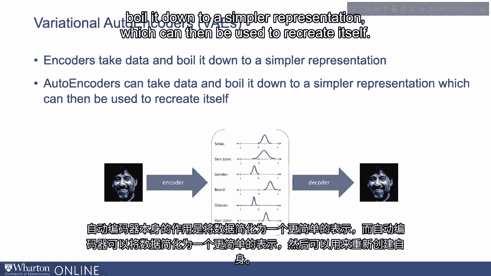

 be used to recreate itself。 So an auto encoder will take something like an image or a song。

 boil it down to a simpler， representation of itself that can then be used to recreate itself。

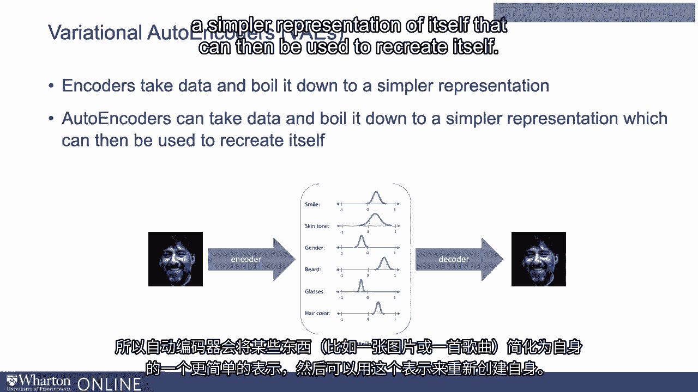

 Now a variational auto encoder is particularly interesting because it can be used to slightly。

 vary some attributes or aspects of the image in ways that we might care about。

 So we can take an image， we can boil it down into its parts， maybe tweak it in some ways。

 We can change the hair color for instance and then recreate the image。

 This is going to allow for something called control generations。

 We're not just generating artificial content， but we're generating artificial content in。

 a way that we can start to control how it's different or how it gets tweaked。

 And this introduces a lot of use cases that are new in novel that have implications for。

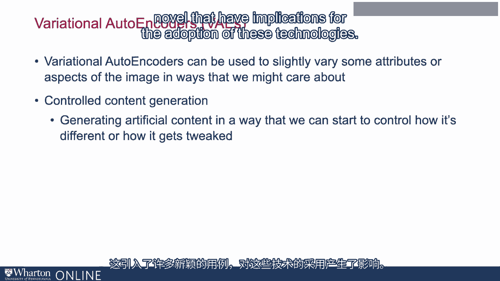

 the adoption of these technologies。 So we can take faces for instance。

 we can use VAEs to alter the faces in particular ways。

 that might be useful in terms of modeling things or simplifying how different types。

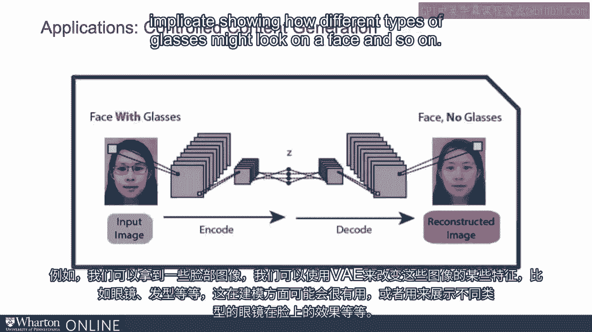

 of glasses might look on a face and so on。 And so these technologies are very promising for these kinds of use cases。

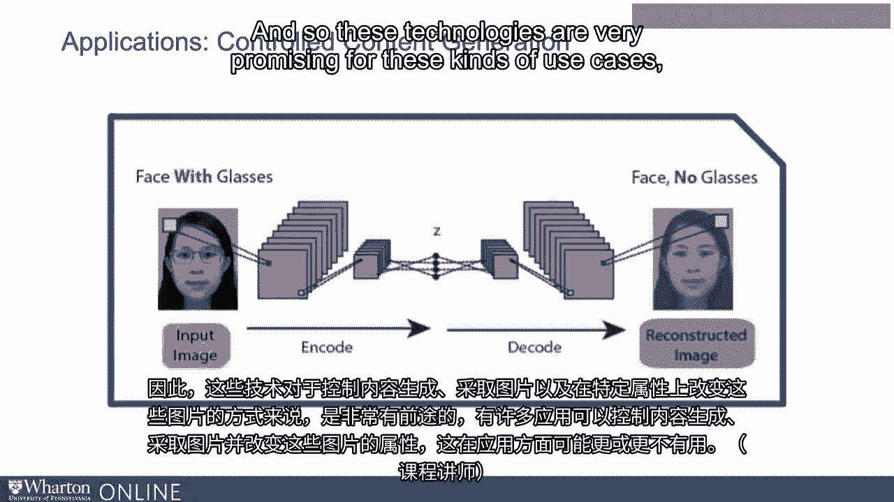

 Lots of applications for controlled content generation for taking pictures， for changing。

 attributes or particular attributes of those pictures in ways that might be more or less。

 useful for the use case。 [BLANK_AUDIO]。

