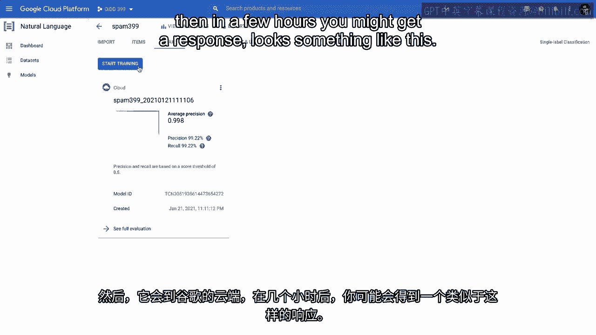
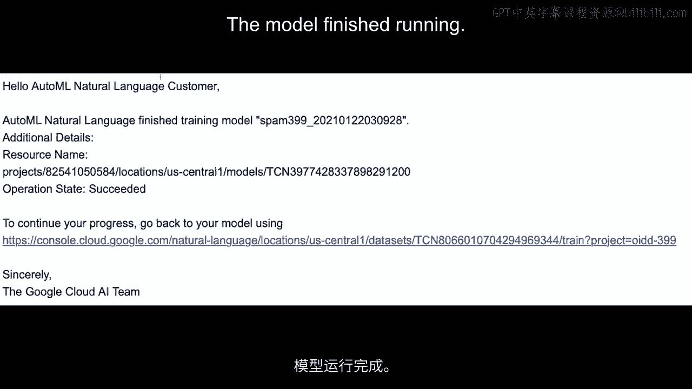
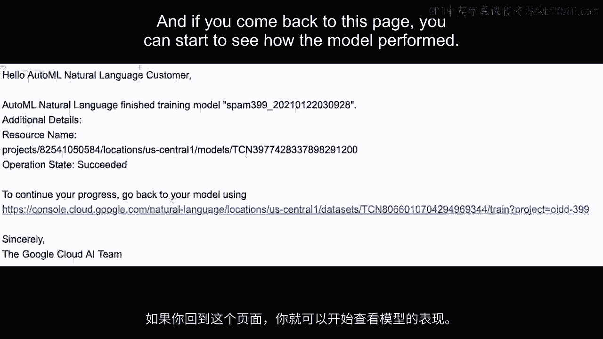
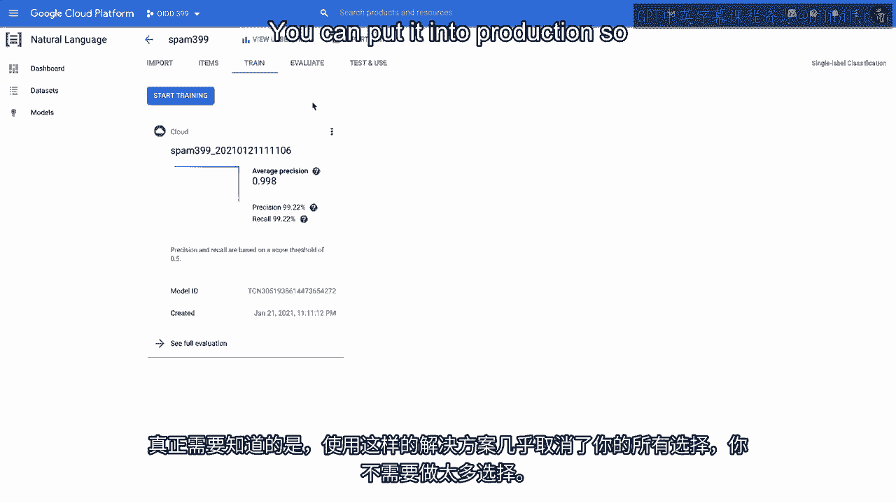

# 沃顿商学院《AI For Business（AI用于商业：AI基础／市场营销+财务／人力／管理）》（中英字幕） - P28：27_使用自动机器学习.zh_en - GPT中英字幕课程资源 - BV1Ju4y157dK

 Let's do an example of AutoML work just to get a sense of what the workflow looks like。

 and how many of the steps are automated。 So we'll do an example where we're using a machine learning algorithm to identify spam。

 text messages。 So as you know， email text messages。

 a lot of spam coming through the system and a major。

 application of algorithms these days is automatically throwing them into a spam bucket。

 So let's say we had a file of text messages and we wanted to build an algorithm to identify。

 which ones were spam and which ones were not。 So as you know。

 the first thing we need is a training data set。 So we need a data set with a lot of text messages and then whether or not in a column essentially。

 identifying them as whether or not they are spam。 So you do need the data but once you have the data。

 the idea behind AutoML is to make， the rest of the process as easy as possible。

 So looking here with something like a AutoML platform or a solution， you do of course have。

 to import your data。 So it's asking you here to import the data。

 I've got this data that's available which is going to be the spam text messages and their， labels。

 Let me just take a quick look at it here。 So this is showing me the spam text messages and their labels。

 So on the left here， I have a number of text messages and they are marked as to whether。

 they are spam or ham which basically means whether they are spam or not。

 And so the idea is that we are going to use Google's AutoML Natural Language platform。

 to learn from a data set like this how to identify text messages of spam or not and be。

 able to use that in the future。 The key thing to know is that where in the past we would have had to do a lot of steps。

 up until this point and after this to get the model in shape。 When you are using AutoML。

 you essentially have you upload the data and you have a single， choice。 Ignoring this for now。

 this is for a model that's already been run but you essentially， have one choice here。

 Start training。 That's really all you can do is train the model and you train the model what happens。

 is it goes off into Google's cloud and uses a lot of computation to figure out the best。

 model to use to make this kind of prediction。 So you just leave it alone。 You start training。

 You don't have anything other choices to do or to make than to start the system running。

 What happens then is it goes to Google's Google Cloud and then in a few hours you might get。

 a response look something like this。 This response basically says hello AutoML Natural Language customer。

 the model finished。

 running and if you click on this link you can basically see how your model performed。

 And if you come back to this page you can start to see how the model performed。

 It gives you some statistics about the model， precision， recall， so on and you can evaluate。

 the model as well and then you can just go ahead and use the model once you're happy。

 with how it's performing。 You can put it into production so that you can start to use it then to classify text。

 messages or spam or not。 So really the key thing to know is that with a solution like this is taking away almost。

 all your choices in a sense and you don't have to make too many choices。 Again。

 the stated goal of something like AutoML is making machine learning available for people。

 who don't have any expertise。 Really once you have the data all you do is you start training。

 you wait and it comes back， later with a message saying that it's completed。

 Of course the other side of this is that because we are using Google servers it's going to。

 come back with a bill as well。 So it's automatically in this case going to bill me some amount of money that according。

 to how much server capacity was used to build this algorithm。 Thank you。 [BLANK_AUDIO]。

