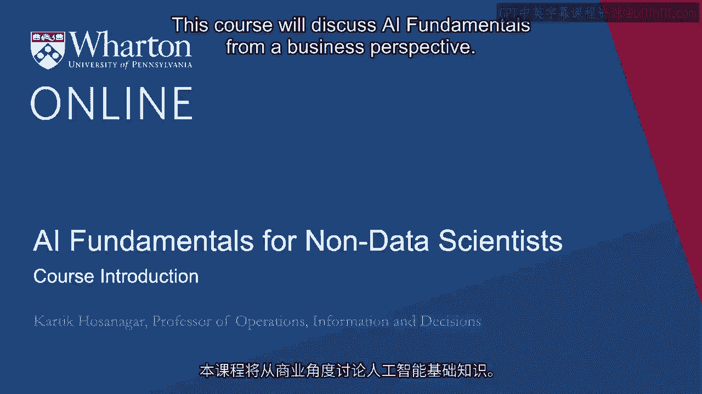

# 沃顿商学院《AI用于商业：AI基础／市场营销+财务／人力／管理》（中英字幕） - P2：1_课程介绍.zh_en - GPT中英字幕课程资源 - BV1Ju4y157dK

本课程将从商业角度讨论人工智能基础。

我们将从大数据的介绍开始。具体来说，什么是大数据？

如何使用它？大数据可以帮助你回答哪些类型的商业问题？

我们接下来将介绍人工智能。

我们将讨论什么是人工智能，什么是机器学习，它们之间的关系。

机器学习方法有哪些不同类型？接下来。

我的同事Sunny Thambbe教授将讨论机器学习在实践中的应用。

他将讨论机器学习可视化，以及最近的发展，例如AutoML，这使得...

非工程师和非数据科学家如何利用人工智能在非常简单的界面中回答商业问题。

最后，我将讨论数据在构建人工智能系统中的作用。具体来说。

现代人工智能建立在大规模训练数据集之上，这意味着公司要想在人工智能实践中蓬勃发展。

它们确实需要访问大量数据。但小公司如何在没有数据的情况下开始人工智能实践？

或者一般来说，公司如何在没有数据的情况下在企业中推行人工智能？

我们将在本课程的最后模块中讨论如何在没有数据的情况下构建人工智能系统。[BLANK_AUDIO]。

