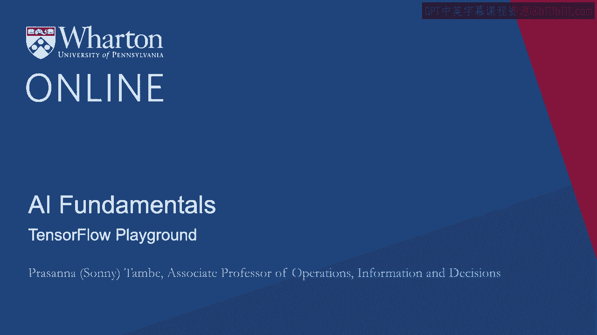
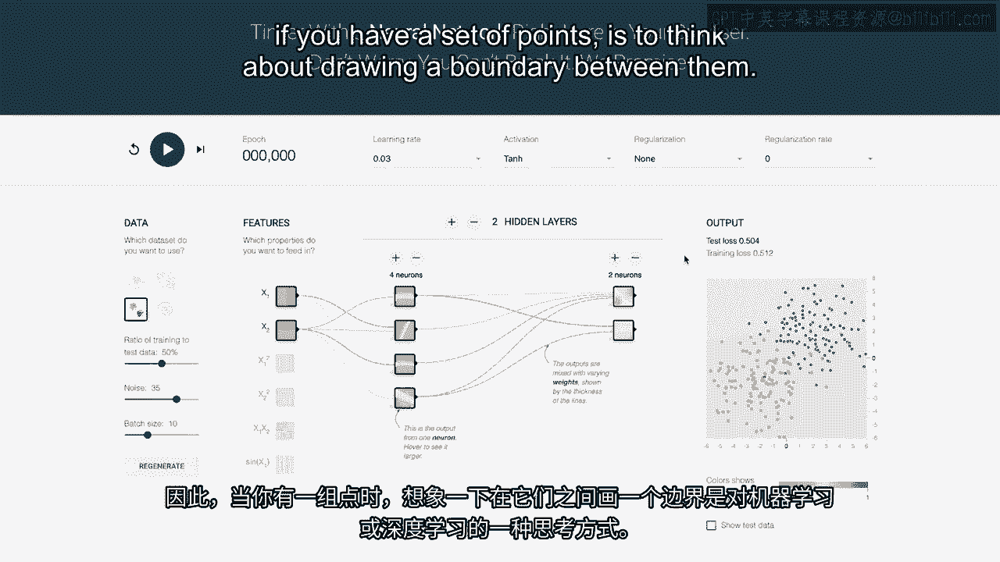
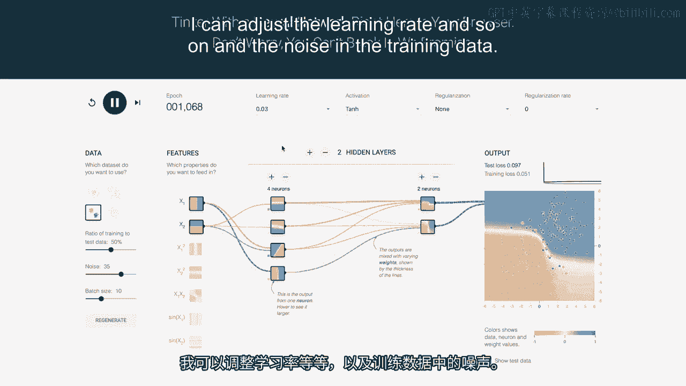

# 沃顿商学院《AI用于商业：AI基础／市场营销+财务／人力／管理》（中英字幕） - P30：29_TensorFlow游乐场.zh_en - GPT中英字幕课程资源 - BV1Ju4y157dK

随着越来越多的人使用机器学习，越来越多的企业也在。

使用机器学习，有越来越多的工具可以帮助理解一些。

更好地教会机器学习是如何工作的，以及你可以做出的不同选择。

权衡是什么。这是一个名为TensorFlow游乐场的示例。

针对谷歌的TensorFlow包，它封装了许多深度学习的内容。

逻辑，还有其他一些选项。

谷歌在提供一些这样的工具方面一直处于领先地位。

他们当然有兴趣尽可能简单或透明地进行。

让人们使用他们的软件，并理解不同部分和元素的。

如何组合在一起。因此，这是TensorFlow游乐场。

这是众多可在线使用的工具之一，用于理解不同类型的。

深度学习或机器学习，深度学习的工作。

所以TensorFlow游乐场本质上就是突出或说明不同的。

你在深度学习网络中有哪些选择。我们正在讨论深度学习。

我们已经讨论了如何将数据输入到网络中。这里运行着神经网络。

学习如何进行预测。并不需要很多领域专业知识，但有许多超参数。

仍然需要调整和调优，以使网络高效学习。

学习工程师必须理解如何以最佳方式调整这些参数，以使得。

尽可能准确地进行预测。这只是一个界面，让你可以玩弄一些这类参数。

对它们的作用和神经网络的理解，以及它们如何结合在一起。

所以我们讨论了神经网络是由深度学习网络组成的。

一些隐藏层。在这里你可以调整或减少层的数量。

这将是一个深度学习引擎，它接受多个点并进行分类。

它们基本上绘制了一个作为分类器的边界。

所以，考虑机器学习或深度学习的一种方法是如果你有一组点。

是考虑在它们之间绘制一个边界。

这个想法是给定这样的点，在哪里是我可以画出一个边界的最佳位置。

如果我说边界一侧的所有内容都是类别A，另一侧的所有内容。

类别B的地方，我仍然会尽可能准确。哪里是划定那个边界的最佳方法？

因此，这将让你从多种不同的点分布开始。

开始观察网络在不同假设和不同参数下的表现。

设置中。因此在这种情况下，如果我可以始终在这里运行网络，你可以改变这些参数。

如果我在这里运行网络，它将画一条线并分割这些点。

这是我在这里展示给你的训练数据集。

所以它可能会学习到在对角线某处进行分割。

说对角线右上方的所有点将属于某个类别。

蓝色对应于。左下角将是对应的类别。

想法是，当我获得一个在右上角空间中的点时。

它将在未来被分类。它将被分类为蓝色或其他类别。

橙色也是同样的情况。所以如果我运行这个。

它可能会在对角线某处创建一条线。所以它在思考。

主要要知道的是，它基本上是在向你展示或说明深度学习的工作原理。

引擎正在思考。它在向你展示每个不同节点层的输出，以及它们是如何工作的。

组合以创建下一步。所以这又是。

另一个——这是一个学习深度学习引擎如何构建的工具。

什么不同的参数会影响它们的性能。

我可以开始调整激活函数。我可以调整学习率、噪声和训练数据。

所以我可以进行各种调整，看看它们如何影响深度学习的效果。

网络学习以及如何做出预测。[沉默]。

