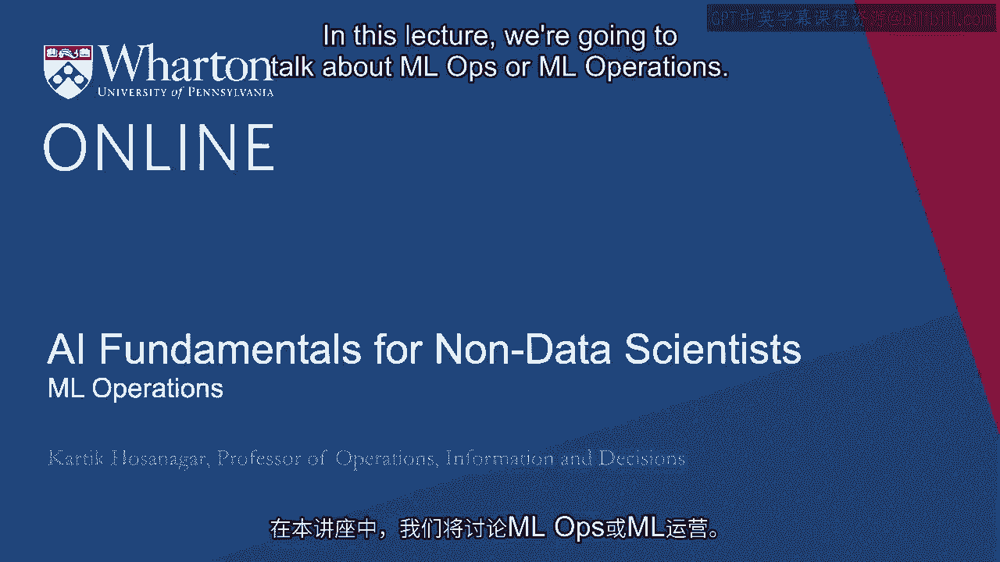
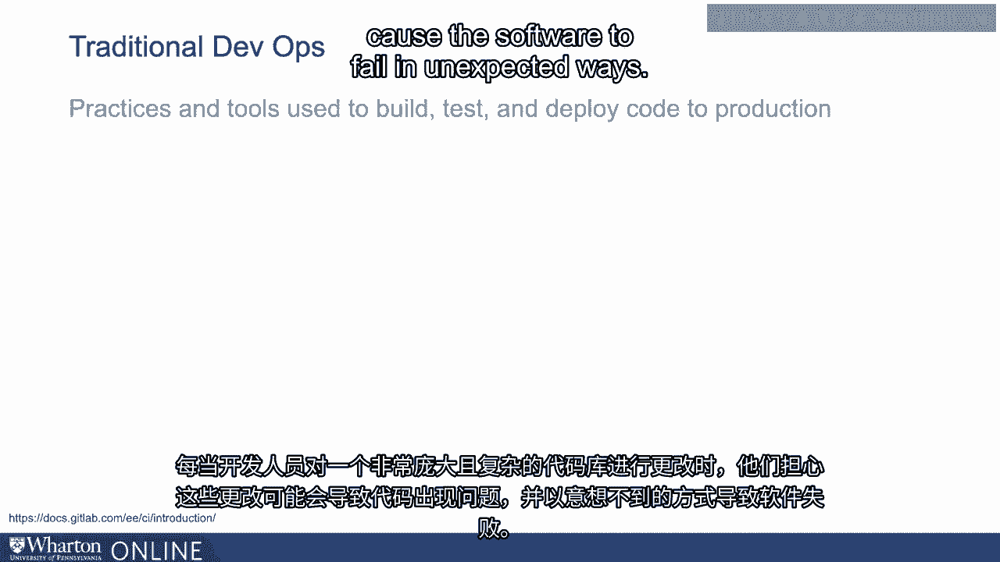
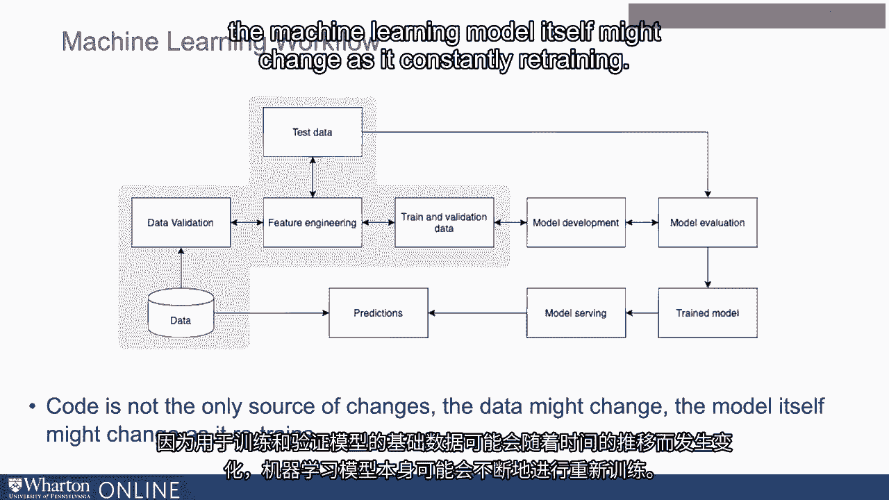
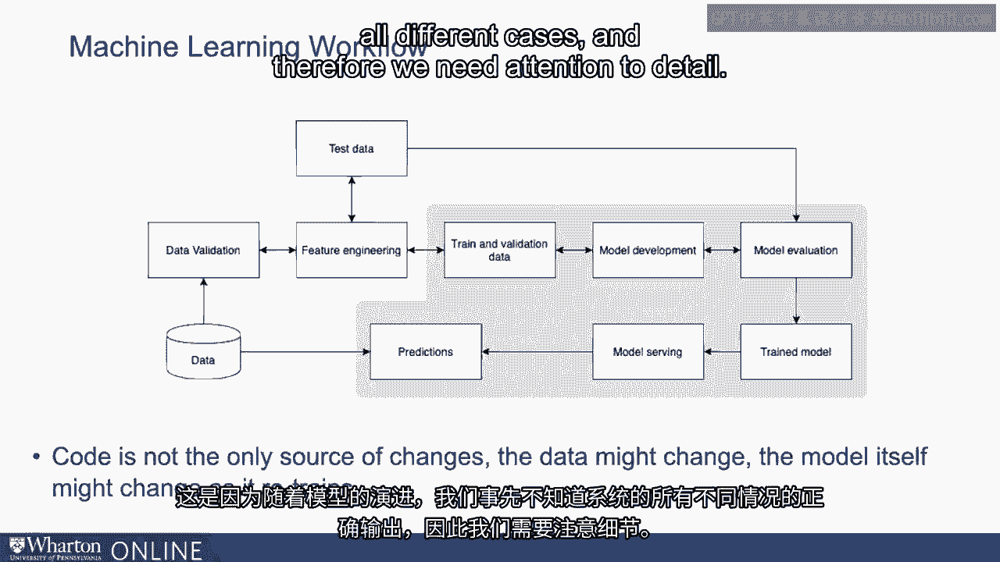
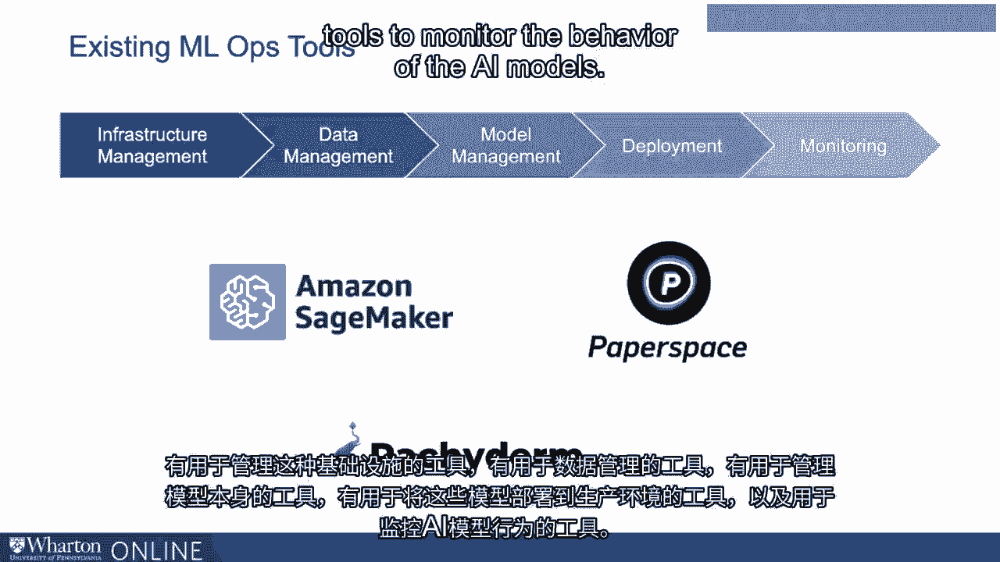
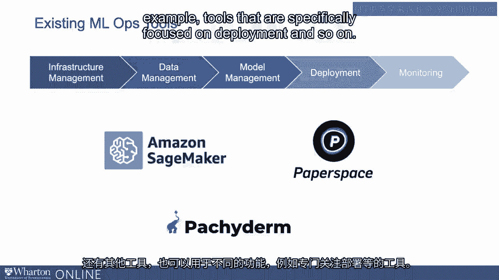

# 沃顿商学院《AI For Business（AI用于商业：AI基础／市场营销+财务／人力／管理）》（中英字幕） - P31：30_机器学习运维.zh_en - GPT中英字幕课程资源 - BV1Ju4y157dK

 In this lecture， we're going to talk about MLOps or ML operations。

 This is a term you're likely to run into when working with data scientists。

 And it's a term that's useful to understand。 But before we go into MLOps。

 it's useful to talk about DevOps or developer operations。

 which is a term that has been around and used quite frequently in the world of software。

 development。 ML DevOps refers to practices and tools that developers used to build， test。

 and deploy， code in production。 Any time a developer makes changes to a very large and complex code base。

 the fear is that， these changes could cause problems in the code and cause the software to fail in unexpected。

 ways。 So we need a more systematic approach to make changes to software。

 One that involves creating a new branch of code， make changes to that branch without。

 touching the production code， and then testing the software using automated tests before。

 merging the code back with the main code and finally pushing it into production。

 Now there are two main components of traditional DevOps。

 One is called continuous integration and the other is called continuous deployment or CI/CD。

 for short。 CI refers to the practice of creating branches of your main code。 You make your changes。

 you push it in， you test it， and eventually you merge the changes。

 Continuous deployment or CD refers to the tests that are run before the code is finally pushed。

 into production。 And so this is the standard CI/CD pipeline。

 Now the development of machine learning models also requires careful attention to details。 However。

 there are some key differences from traditional developer operations。 In a machine learning system。

 the code is not the only source of changes。 As the underlying data that is used to train and validate a model might change over time。

 the machine learning model itself might change as it constantly retrains。

 And in any machine learning system， also the outputs of the machine learning model might。

 also need to be validated and checked for quality。 This is because as the model is evolving。

 we do not know beforehand what are the correct， outputs of the system for all different cases。

 And therefore we need attention to detail。

 There are a number of tools in the marketplace that are used by data scientists and developers。

 for MLOps。 They serve a wide range of functions。 They include tools for managing the hardware infrastructure for machine learning。

 Machine learning typically requires some customized hardware such as different kinds of processors。

 known as GPUs to do the machine learning。 There are tools to manage that kind of infrastructure。

 There are tools for data management。 There are tools for managing the models themselves。

 Tools for deploying these models into productions。

 And tools to monitor the behavior of the AI models， meaning monitor the outputs of AI models。

 and ensure that the outputs are consistent with what we might expect。 Now。

 there are a number of tools out there。 For example。

 Amazon is a tool called SageMaker that takes care of a number of these functions。

 of MLOps that I mentioned。 Tools like paper space and a few others out there as well。

 And there are also specialized tools。 For example。

 PackyDerm is a tool that specializes in data management and model management。

 And there are other tools that can also be used for different functions， for example。

 tools that are specifically focused on deployment and so on。

 These kinds of tools are important for data scientists to be able to ensure that the ML。

 applications they're building at scale can function well and are fail-proof。 [ Silence ]。

