# 沃顿商学院《AI For Business（AI用于商业：AI基础／市场营销+财务／人力／管理）》（中英字幕） - P32：31_鸡生蛋还是蛋生鸡.zh_en - GPT中英字幕课程资源 - BV1Ju4y157dK

 In this lecture， we'll talk about the role of data in building machine learning systems。

 And the challenge is associated with building AI without having access to very large datasets。

 In fact， many years ago， I spoke with a gentleman from the financial services industry and he。

 was telling me about the vast amounts of money their industry loses to credit card fraud。

 And I started imagining how a machine learning system can better detect or predict fraudulent。

 transactions and help prevent those massive losses to banks。

 And so I briefly considered the idea of creating a startup that would create these kinds of。

 systems。 But of course， in order to build those systems， you need training data。

 And in speaking to the banks， it became obvious that this was important proprietary data that。

 banks were not willing to share。 And that highlighted the problem with having an idea for a system that can solve important。

 business problems， but not having the data to build those systems。

 This is a common problem in machine learning。 In an earlier course。

 we talked about how the performance differences between various machine。

 learning algorithms can often be relatively small compared to the performance difference。

 between the same algorithms with more versus less data。 In other words。

 what was more important in many settings was having access to the right。

 kind of data and having lots of that kind of data to train these machine learning algorithms。

 Now existing companies generally don't have a problem with this because they usually have。

 a stream of data that they can use to start their AI flywheel。

 But new products can face a chicken and egg problem because without users， they don't have。

 the data and without the data， they cannot build their AI product as easily。

 And entrepreneurs certainly face this problem， but so do product managers that are trying。

 to build new products。

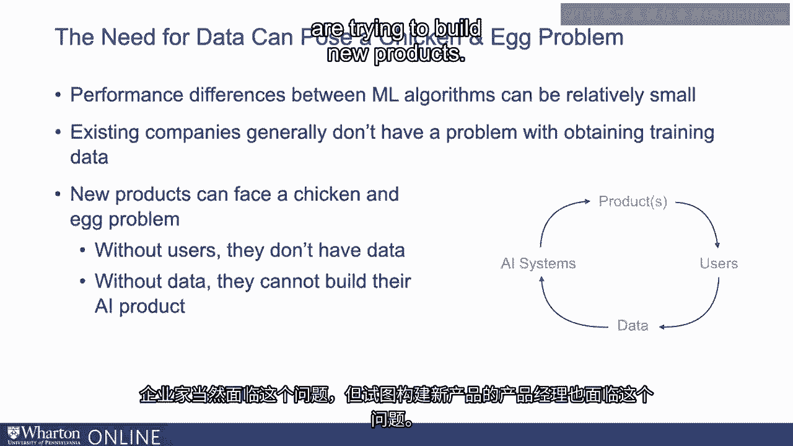

 I'm going to discuss five different strategies that can be used to solve this chicken and。

 egg problem in building AI products。 The first strategy is to start with a non-AI product that generates the data one needs。

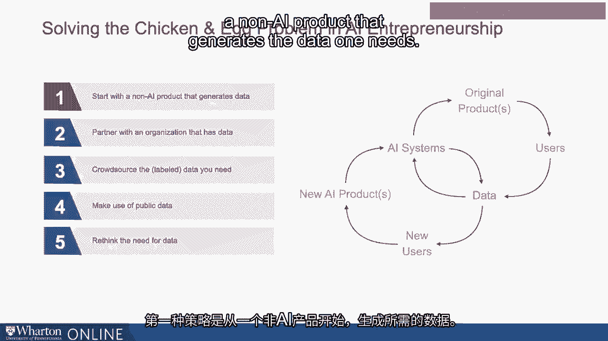

 So creating a non-AI product or service that solves customer problems can help generate， the data。

 That data can then be used to train an AI system that either enhances the existing product。

 or service or helps create a completely new but related service。 For example。

 let's look at Facebook。 Today， Facebook is a very heavy user of AI。

 but Facebook didn't start by using AI because， they didn't have the data to do that。 Instead。

 the social networking platform was focused on solving a different problem which。

 is helping people connect。 But once that platform was built， a lot of data was generated。

 This data was then used to train AI systems that help predict what kinds of information。

 people want to consume， which in turn helped personalize the news feed on Facebook and。

 also made it possible to do targeted advertising。

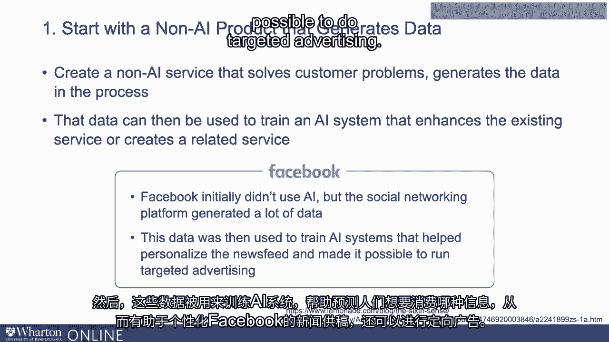

 Similarly， let's look at the insurance tech company Lemonade。

 Lemonade is a user-friendly insurance product。 Lemonade didn't start by having the data to build the AI systems。

 They instead built a product that was very easy for consumers to use and once they had。

 enough consumers， now they had the data that could be used to build the AI systems。 Over time。

 they're using AI to create insurance quotes。 They're using it to process claims in an automated fashion。

 detect insurance fraud in， an automated fashion。 According to the company， today。

 the first notice of loss for 96% of claims are actually， managed by AI。 Similarly。

 claim resolution for a number of insurance claims are handled without human。

 involvement with AI systems。 This is an interesting example where even though the vision was always to build a company。

 that uses AI and reimagines what insurance looks like， they started with a simple product。

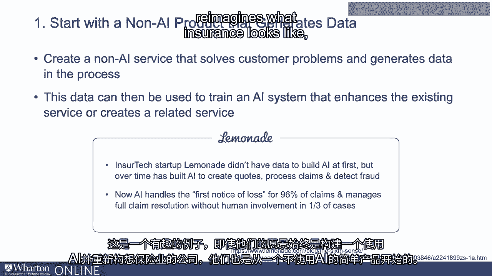

 that did not use AI but then slowly got in and added new AI capabilities once they had。

 enough users and they broke the AI flywheel as a result。

 Another strategy that can be used is to partner with organizations that have the data you。

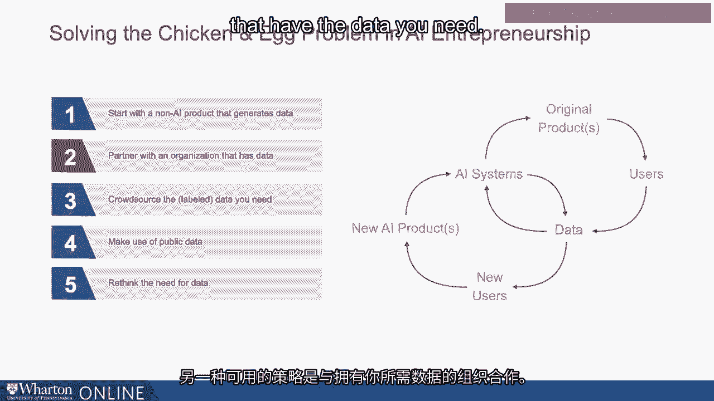

 need。 For example， you might be able to partner with companies that have the data but lack。

 the AI expertise。 This is particularly useful if it is difficult to create a product that generates the kind。

 of data you need。 For example， suppose you need medical data from patients and it's hard to get that kind。

 of data and it's hard to break into that AI flywheel and it's useful in those instances。

 to partner with companies。 For example， recently Google and Stanford Medicine have partnered together where they。

 take data of patients from Stanford's hospital and they combine it with Google's cloud and。

 their AI capabilities to solve important questions in healthcare settings。 For example。

 one of the things they're doing is looking at alarm data， basically alarms。

 coming in hospital settings and to be able to distinguish between false alarms from real。

 ones that require attention and this can be very valuable in hospitalized patient settings。

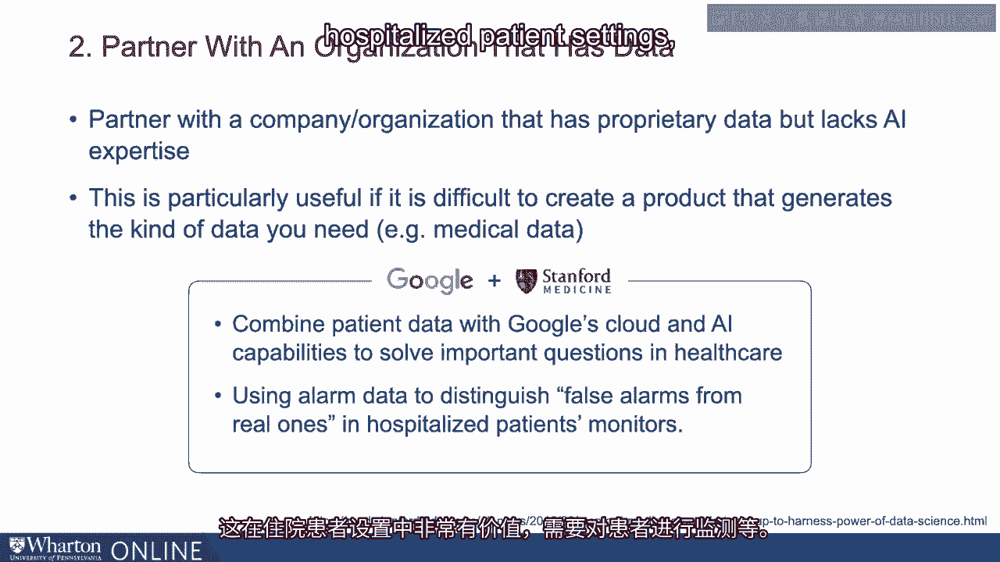

 where you need to monitor the patients and so on。 Now pitfall with this approach is that potential partners might prefer to work with established。

 large tech companies like Google as opposed to smaller companies。

 This is where it's important to identify the right kind of partner and also to think creatively。

 For example， you might be able to get data from a family business and be able to leverage。

 that to build new AI products and services。 A third strategy is to crowdsource the label data that you need。

 There are many settings in which data are available but it is not well labeled。 For example。

 a massive data set of images might be available but these images might not。

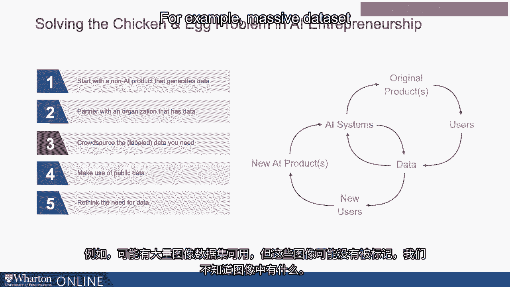

 be labeled and we don't know what is in that image。

 Here we can use cloud sourcing platforms like Amazon Mechanical Turk or scale。ai to get。

 the label data we need。

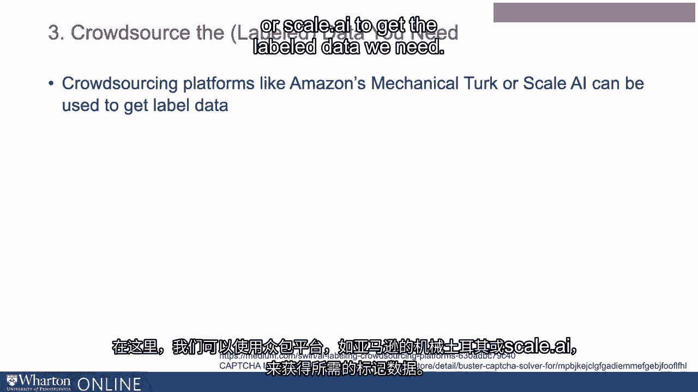

 For example， consider Google's use of captures。 This is where we look at images and label what's in the images in order to be able to。

 access a website for example or to verify that we are actually humans who are trying。

 to access a website。 This serves an important security purpose but at the same time。

 Google is able to use， this to simultaneously crowdsource a large number of images that then can be used for。

 other machine learning tasks。 As a product manager。

 it's also useful to ask how do we create workflows which allow。

 customers to help label new data in the course of using the product so that it's not a distraction。

 for the user but actually they can be helpful in creating the label data we need。

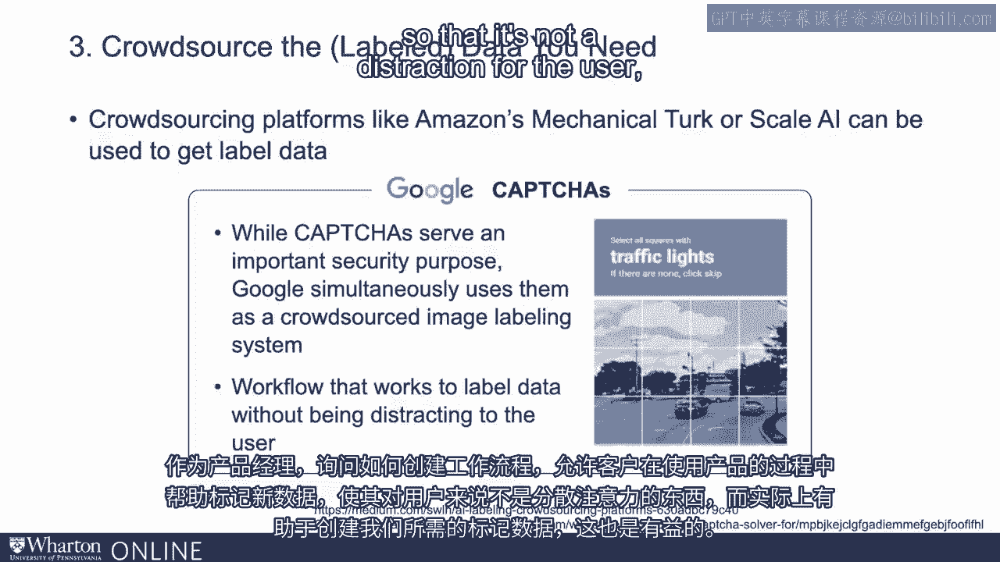

 For example， consider a cyber security product that generates alerts and it has a workflow。

 in which an operations engineer might resolve those alerts by labeling which alerts are real。

 and which ones are a false alarm really。 And in designing such a workflow。

 we are automatically getting the label data that allows us to then。

 build a machine learning product that can automatically resolve these kinds of alerts。

 Really consider music recommendation services like Pandora and others where users can provide。

 feedback on recommendations like a thumbs up or a thumbs down。

 That again allows the system to get the label data which then in turn allows the ML algorithms。

 to improve over time。 Another strategy available is to make use of publicly available data。

 There are many sources of data available online today and also a number of data marketplaces。

 are emerging in recent years。

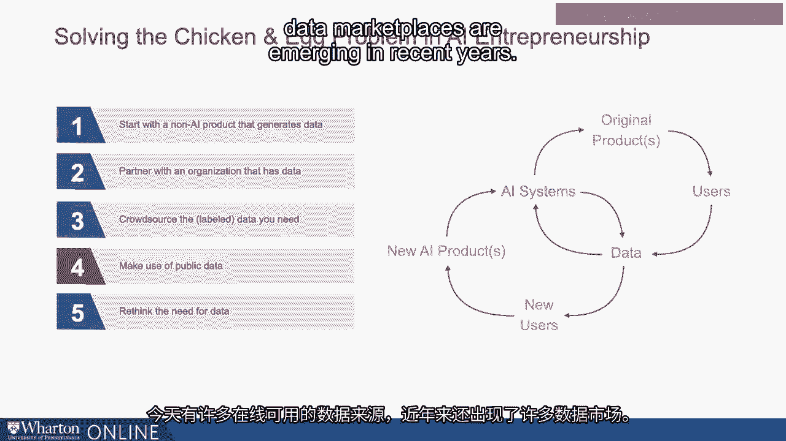

 While products built on publicly accessible data may be less defensible， defensibility can。

 be built through other product innovations。 And not only are there many publicly available datasets。

 there are also publicly available， pre-trained machine learning algorithms that can be downloaded and then further customized。

 using machine learning approaches like transfer learning。

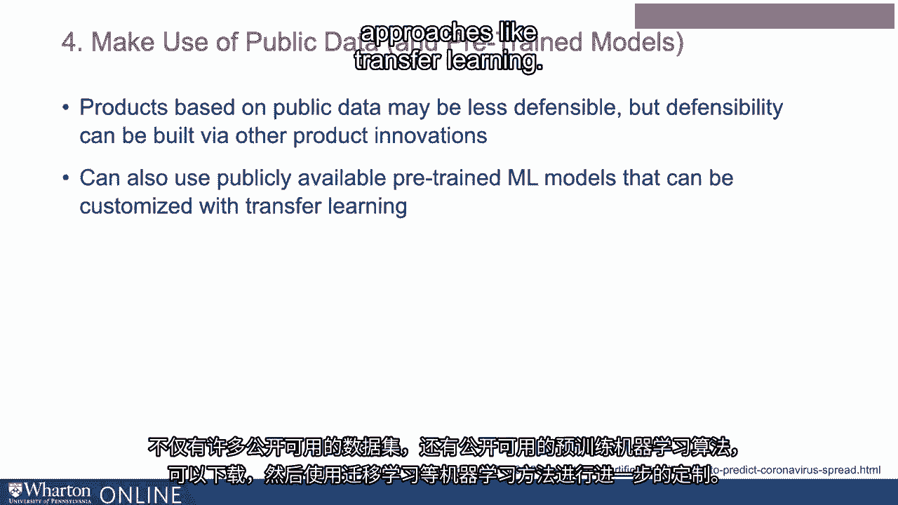

 In short before we conclude that the dataset we need might not be available， we should look。

 for many publicly accessible datasets as well as publicly accessible machine learning。

 models and see how we can build our AI systems on top of the available datasets and machine。

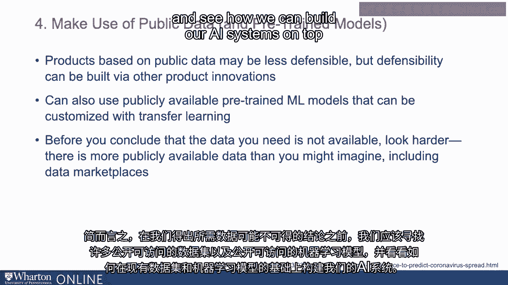

 learning models。

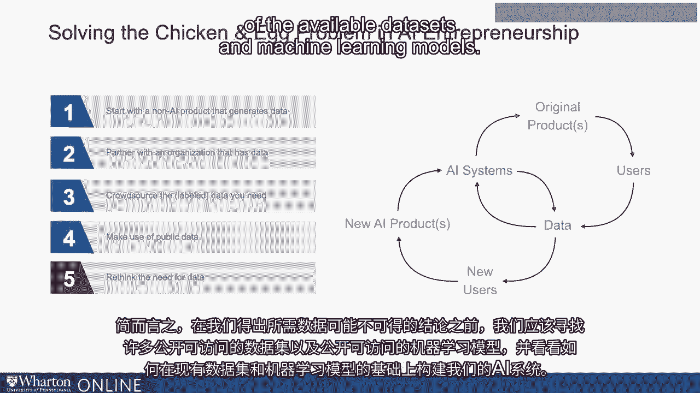

 Lastly， I would urge you to also rethink the need for data。

 While most of the practical AI today is built on machine learning and in particular supervised。

 machine learning which requires large training datasets， there are many other approaches to。

 building AI without large datasets。 In fact in an earlier course we have talked about reinforcement learning and expert systems。

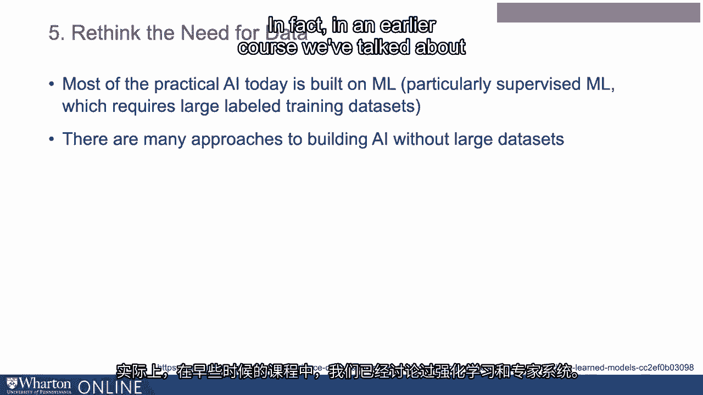

 Reinforcement learning algorithms are techniques wherein AI systems don't begin with large training。

 datasets instead they learn by taking actions and observing what happens。

 In fact Google built an AI called AlphaGo to play the strategy game of Go and that system。

 was able to beat world champions of Go。 Later Google built AlphaZero which was an AI system with zero training data。

 This was based on reinforcement learning， a system that essentially used experimentation。

 to learn good and powerful AI strategies。

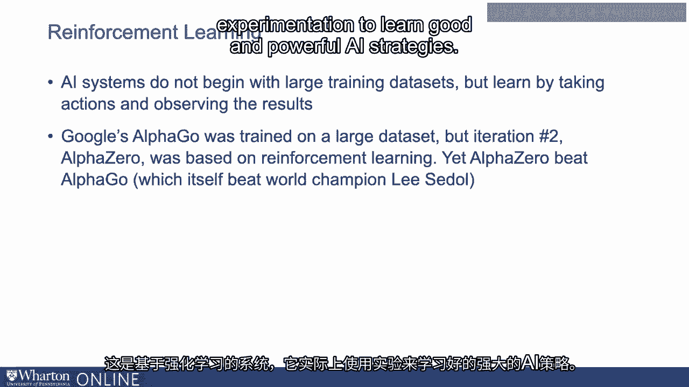

 Another approach available is to build expert systems。

 Recall that expert systems are simple rule based AI systems that codify rules that are。

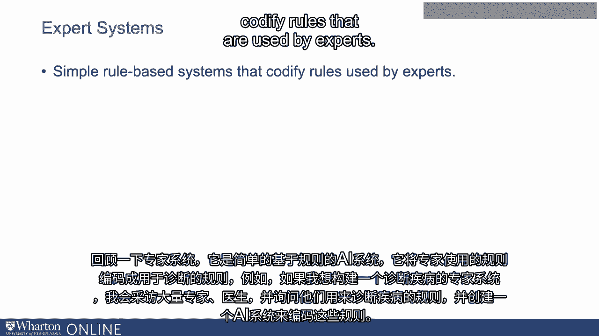

 used by experts。 So for example if I wanted to build an expert system to diagnose diseases I would interview。

 a large number of experts， doctors and ask them about rules they use to diagnose diseases。

 and I would create an AI system that codifies these rules。

 Such an expert system is unlikely to perform as well as a supervised machine learning system。

 built on very large massive training datasets but these systems might be good enough to get。

 started and once you get started and you have enough early users you can then build more。

 complex AI systems using training data。

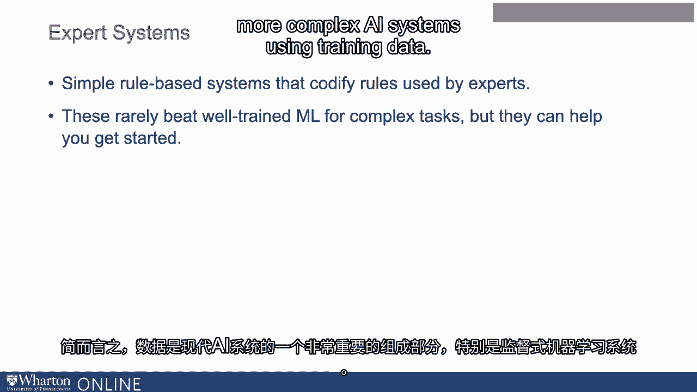

 In short data is a very important piece of modern AI systems and in particular supervised。

 machine learning systems。 Any strategy around AI should involve a strong and carefully developed strategy around data。

 management， data collection and data labeling。 However when data access is a bottleneck that shouldn't deter a company from embarking on。

 ambitious AI projects。 One can be creative using some of the strategies that we just discussed。

 Thank you。 [BLANK_AUDIO]。

