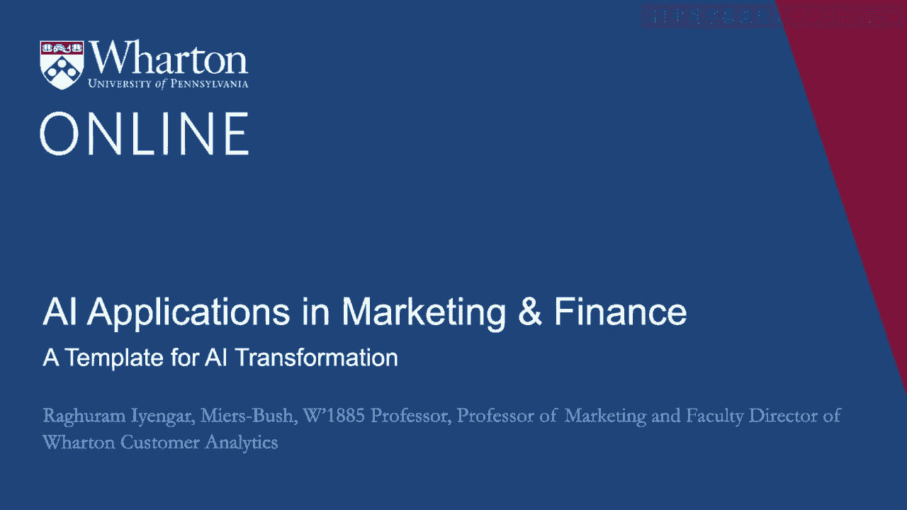
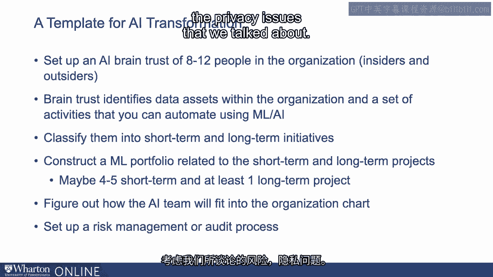

# 沃顿商学院《AI For Business（AI用于商业：AI基础／市场营销+财务／人力／管理）》（中英字幕） - P41：7_AI转型模板.zh_en - GPT中英字幕课程资源 - BV1Ju4y157dK

 I want to talk a little bit about how can you find success。

 within your organization to make sure that any of the AI projects， that you're undertaking。

 any different kinds， of new machine learning models that you're using。

 how can we make sure that they're actually implementable， and it can bring about a change。

 As you go through these steps， again， think about your own company。

 think about the organization that you're in， and see how much of this can be customized for you。

 So I think the first thing that is very helpful is， to start thinking about within the organization。

 who are perhaps the 8 to 12 people that share similar ideas。

 This could be a combination of some insiders from the org， and also outsiders。

 What you want to make sure is to have a set of people， hopefully diverse。

 coming from different functional areas， that can identify what might be some properties。

 in terms of adopting the new technology， whether it be AI， machine learning。

 whatever the case might be。 The key idea here is ask the right managerial questions。

 going back to what we asked before。 It is about the why。 Think very carefully about， you know。

 what are the customer needs that you're trying to solve？

 And the more diversity you have in this AI brain trust。

 the more different perspectives you will have。 And this way， you're trying to make sure。

 that both insiders and outsiders can coalesce around a set。

 of ideas that are implementable and set of ideas， that can actually change the organization。 Now。

 what they also want to do is then start identifying， perhaps。

 the data assets that are within the organization。 And a set of activities that you think you can automate。

 And it's again very important when you start thinking， about the data assets， the activities。

 always keep your customers journey and all their needs， and hurdles in mind。 I think it's very。

 very important not to， in some sense， get enticed with the technology per se， the shiny new objects。

 so to speak， but keep the idea of what is the problem it's trying to solve。

 Once you keep that perspective into account， the problem driven perspective。

 then you can start making， a better decision based on what type of technology is helpful。

 and what type of technology perhaps is helpful， but not now， but in the future。 And of course。

 you want to also start thinking about， what are ways in which the problems that you've come up。

 with the customer needs can be put together， in terms of short-term versus long-term。 Clearly。

 there's some technology and some initiatives， might take some long time。

 either from an organizational， perspective or also from a customer change perspective。

 There are some things which customers， your customers。

 whether you're a B2C company or a B2B company， your customers might easily take two。

 So if you're offering perhaps a mobile app， some easy way perhaps of drop off。

 if you're a retail company and so on and so forth， this might be short-term initiatives。

 But of course， any long-term initiative， requires customer change。

 a change in the habits of customers。 So something that a longer term， you might want to prioritize。

 as longer term， not because of just organizations， but also from your customer's perspective。

 Then start thinking about the portfolio related， to the short-term and the long-term。

 I think it's very important within an organization， to show quick returns， so to speak。

 You want to be able to see what are the low-hanging fruit that。

 can show you what investments in AI and ML， can actually do for you。

 So start thinking about short-term project， maybe four or five。 Again。

 diversified in different areas within the company， that can help you get those quick gains。

 But at the same time， also start thinking about， what are some long-term projects that can change。

 the entire company？ As we start thinking about the AI team itself， the brain trust and so on。

 think back to what we talked， about the analytics organization and the structure。

 Where will these people set？ Will you have a center of excellence model？

 Will you have a functional model？ What kind of model would you have？ Of course。

 it depends on the maturity organization， but thinking carefully about the type of organization。

 who will have accountability， where will you start with。

 is very critical right at the beginning itself。 Where I think the more bind that you have， the more。

 in some sense， understanding you have， who's responsible for the different projects。

 and what that accountability would be like， the more success you can have。 And finally， of course。

 as you go through this entire process， you need to always start thinking about the ROI。

 Think about the risks that we talked about， the privacy issues that we talked about。

 Think about the ROI that we talked about， which is how do we ensure that we're not just getting。

 enticed by the shiny new object。 But keeping into account the customer journey。

 keeping the account the investments that we're making。

 and how do we track those investments over time， to make sure that all the investments that we're doing。

 actually has positive ROI。 So thank you for watching。 Good luck for AI journey。 Again。

 what I would suggest is， as you think about adopting new technologies。

 as you start thinking about the latest AI， ML， I think there's lots and lots of new developments out there。

 Keep up with those developments。 But at the same time， don't forget your customers。

 I think it's very， very important to marry the customer， journey。

 to understand what customer's hurdles are， the why， the managerial questions。

 and marry those managerial questions， with the how， which is the latest technology。

 It's the synergy that will basically get you， the best success that you can have。 So thank you。

 [BLANK_AUDIO]。

