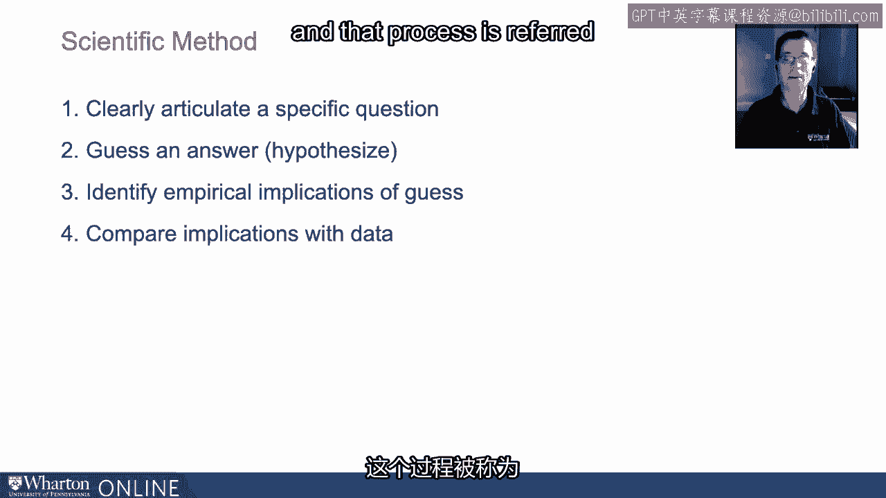
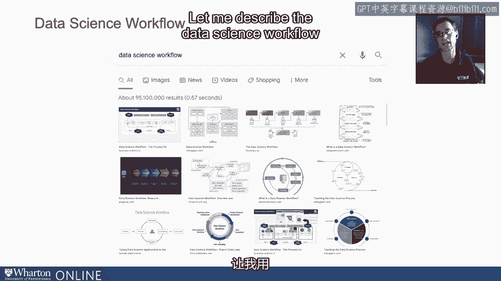
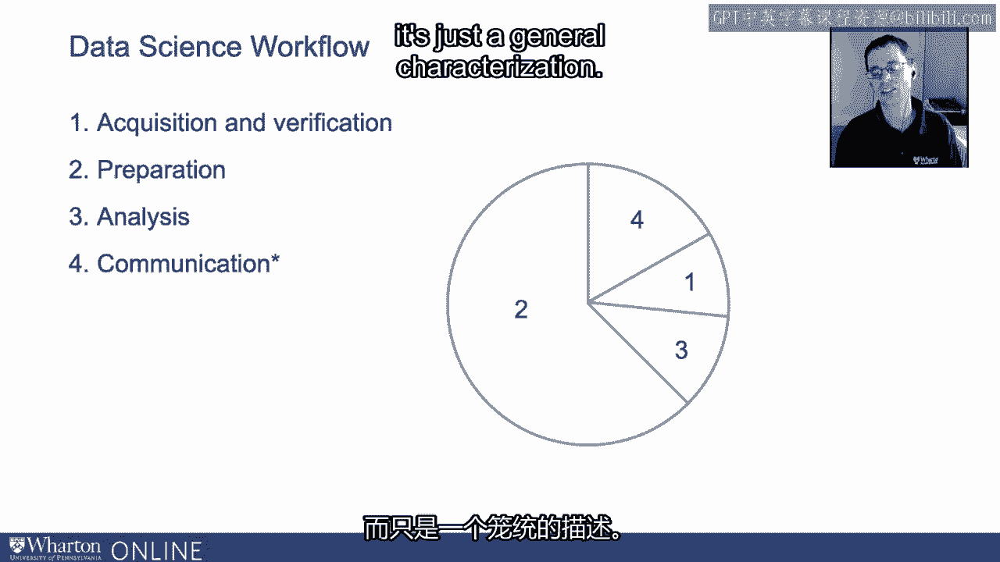

# 沃顿商学院《AI For Business（AI用于商业：AI基础／市场营销+财务／人力／管理）》（中英字幕） - P48：14_过程数据科学工作流程.zh_en - GPT中英字幕课程资源 - BV1Ju4y157dK

所以在这个视频中，我想谈谈数据科学工作流程。在深入探讨之前。

让我提醒你我们刚才谈到的，即科学方法。

所以这是一个四步过程，我们首先要明确地阐述一个具体或精确的问题。

然后我们猜测一个或多个答案。也就是说，我们对那个问题假设答案。

然后我们识别这些不同假设或猜测的经验影响。也就是说。

如果这些假设或猜测是正确的，我们应该在数据中看到什么？

然后最后一步是将这些影响与数据中实际存在的内容进行比较。

在这个视频中，我想重点关注最后一步，因为有一个实际的过程来比较这些影响与我们在数据中看到的内容。

这个过程被称为数据科学工作流程。

像往常一样，我们从谷歌搜索数据科学工作流程开始，在这种情况下，你会得到。

超过9500万次点击。或许更有趣的是，有很多不同的图像描述数据科学工作流程。

有些非常色彩丰富，正如你在屏幕上看到的那样。

但是，虽然描述这个工作流程的方法有很多。

对于不同步骤的许多不同标签，我想保持简单和直观。

让我用以下四个步骤来描述数据科学工作流程。

第一步骤是获取和验证。所以首先你得获取数据。

你必须获取数据，这可能是一个非常简单的过程，就像从本地计算机上抓取电子表格一样简单。

这可能涉及从组织的不同部分获取数据。也可能是。

这可能涉及连接外部API来下载数据。

这可能是从网络上抓取数据，也可能是从不同的供应商那里购买专有数据。

数据无处不在，获取数据的方式几乎同样多。

但这本身就是这个过程的一部分。当然，一旦我们有了数据。

你必须验证它。里根曾经说过，要信任但要验证。

在处理数据时，这一点尤其真实。

所以数据通常会附带某种数据字典或文档。

千万不要轻信这一点。我们总是想通过实际查看数据来验证它。

通过开始使用数据并确保我们理解它。

现在，经过获取和验证数据后，确认它确实是我们认为的那样。

第二步是为分析准备数据。

这听起来可能是一个简单的步骤。但正如我稍后提到的，事实并非如此。

数据通常有多种格式。我们将不得不整理这些数据。

我们需要清理数据，并通过探索性数据分析来探索数据。

也许是EDA。再次提高我们的理解以进一步验证。

也许我们需要回到第一步以获取更多或不同的数据。

但准备工作本身就是数据科学工作流中的一个重要步骤。

一旦我们准备好了数据，再次确保我们理解它且它是正确的。

使其处于我们打算进行的任何分析所需的格式。

然后我们分析数据，分析数据可以简单到得出一个平均值或标准差。

一些总结统计，或者复杂到运行机器学习或人工智能管道以进行探索。

我们训练和测试多种不同的模型，以得出最终的模型，投入生产。

数据科学工作流的最后一步稍微被提及。

但不常被视为正式步骤的我称之为沟通。

所以经过获取、准备和分析数据的过程。

这可以说是最重要的部分，或者至少是同样重要的部分。

能够以清晰而有说服力的方式向决策者传达你的结果，以便他们能够采取行动。

通常，步骤一到三与步骤四之间存在脱节，这对职场中的数据分析造成了损害，限制了数据分析的强大和实用性。

因为数据科学家或其他使用数据的人只是。

能够以一种能够引起管理层共鸣的方式传达他们的发现，而管理层可能并不熟悉数据的使用。

统计学家和其他人可能也是如此。这就是数据科学工作流的四个步骤，我在幻灯片上放了一个非常简单的饼图，来说明我认为的数据科学工作流中时间和努力的总体分配。

饼图中的数字对应于数据科学工作流中的数字或步骤。

你会看到，准备工作在饼图中占大多数。

这肯定是我的经验，也是我几乎所有同事的经验。

准备、清理和理解数据花费了很多时间，这是我个人的经验。

至少有75%到80%的时间，而你知道的。

一旦数据整理成干净的格式，实际分析相对简单。

将数据推入模型相对容易，但对输入模型的数据有信心是完全不同的事情。

因此，你可以看到，仅准备工作就需要大量时间，不要低估这一点。

当然，总会有例外。这不是一条规则，只是一般的特征描述。

[BLANK_AUDIO]。

