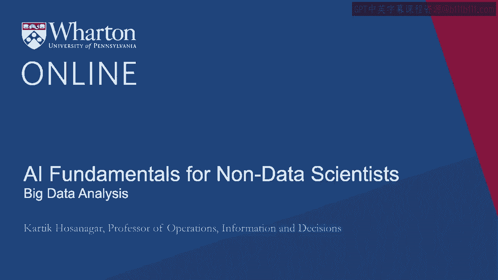
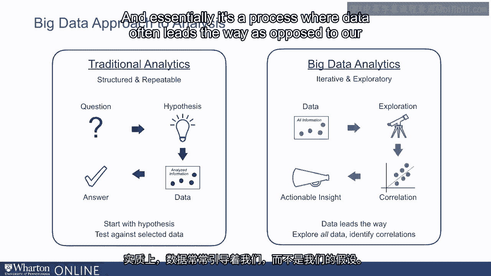
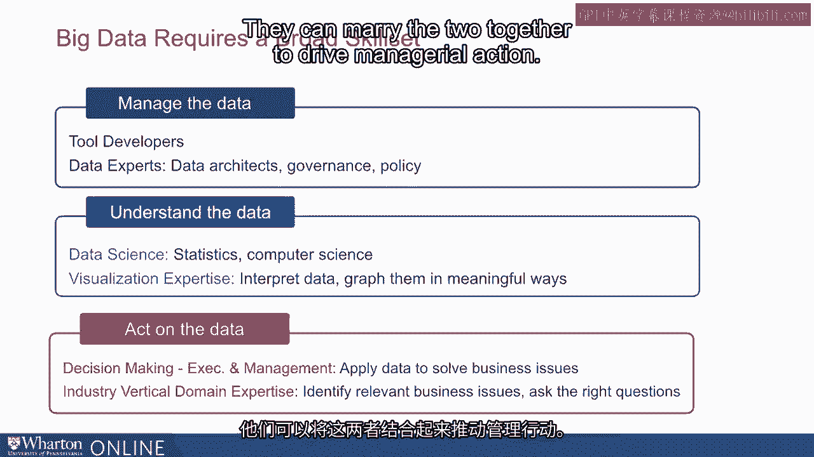
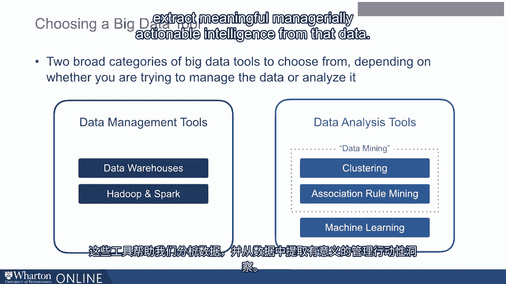

# 沃顿商学院《AI For Business（AI用于商业：AI基础／市场营销+财务／人力／管理）》（中英字幕） - P4：3_大数据分析.zh_en - GPT中英字幕课程资源 - BV1Ju4y157dK

 In this lecture， we'll talk about what makes big data analysis different from traditional。

 data analysis。 And in turn， what does that mean in terms of the kinds of skills and tools。

 companies need within their organization？ Now， traditional data analysis is often very， structured。

 It might start with a managerial question which might result in a hypothesis。

 that is posed by a statistician or a data scientist。 The goal then is to analyze the。

 data in order to test that hypothesis。 The data analysis confirms or suggests that our。

 hypothesis is incorrect。 In short， it is very much hypothesis-driven。 In contrast， big。

 data analysis is far more exploratory。 It starts by looking at data not necessarily with a specific。

 hypothesis but with a broad set of business questions。 We might conduct more exploratory。

 analysis and find certain patterns or relationships or correlations in our data。 That might suggest。

 certain insights， business insights。 And sometimes。

 that might in fact even lead to certain hypothesis。

 and we might then conduct more former hypothesis testing or traditional analysis on that。 In， short。

 big data analysis is about being more iterative， being more exploratory and essentially。

 it's a process where data often leads the way as opposed to our hypotheses。 Big data。

 analysis also needs a new set of skills or capabilities within the organization。 I tend。

 to think of these skills in terms of three main types of skills， managing the data， understanding。

 the data and acting on the data。 Managing the data is all about organizing data so that。

 it can be analyzed subsequently。 Sometimes this involves buying third-party tools and。

 often it's these tool developers that focus on how best to manage data and they provide。

 us nice solutions that we can buy off the shelf。 But sometimes within a company， we also。

 need data experts who can help manage the data internally。 These might be in the form of data。

 architects or chief data officers who might set data governance policies who might also。

 figure out the architecture of how our data is going to be organized either on premise。

 or in the cloud。 Understanding the data is all about using tools to extract intelligence， from data。

 This is broadly the domain of data science。 It includes statisticians who often。

 conduct traditional data analysis。 It also includes machine learning and data mining。

 experts who might apply more modern techniques from computer science in order to analyze the， data。

 It also includes the ability to visualize data because often one of the key abilities。

 in data science is not just being able to analyze the data but it's also being able to construct。

 stories and visualize it in meaningful ways so that the insights can be easily consumed。

 by all stakeholders。 The third set of skills is acting on the data。 This is where managers， come in。

 It requires managers to apply insights from the data analysis and apply them to make。

 managerial decisions。 It requires two kinds of skills。 The first is data skills。 Managers。

 need to be able to interpret and understand what data scientists are telling them。 They。

 need to be able to challenge the data analysis when appropriate because data insights can。

 also be misleading。 Sometimes data analysis can find spurious correlations and acting。

 on them without really challenging the data analysis can be problematic。 It really does。

 require managers to have a basic understanding of data science to understand what are the。

 limitations of data analysis to appreciate when data analysis is correct and when it needs。

 to be modified or challenged appropriately。 The second related skill that managers need。

 is domain expertise。 Data is often telling us what patterns we see in the past but it requires。

 managers who have relevant domain expertise to ask the right questions to figure out how。

 do we go from the data insights to manage a real action。 So the most successful managers。

 in a data world are managers who are simultaneously data savvy and also have strong vertical domain。

 expertise。 They can marry the two together to drive managerial action。 Lastly big data。

 analysis not only requires new sets of skills within the organization。 It also requires new。

 sets of tools within the organization。 In terms of tools we can think about two kinds， of tools。

 The first is data management tools which is essentially about tools that help。

 us collect and organize all the data within the company and the second is data analysis， tools。

 These are tools that help us analyze the data and extract meaningful， manageable。

 intelligence from the data。 In the next lecture we will dive into the data management tools。

 [BLANK_AUDIO]。