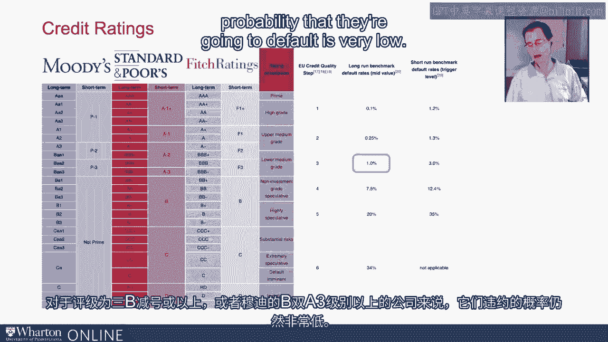
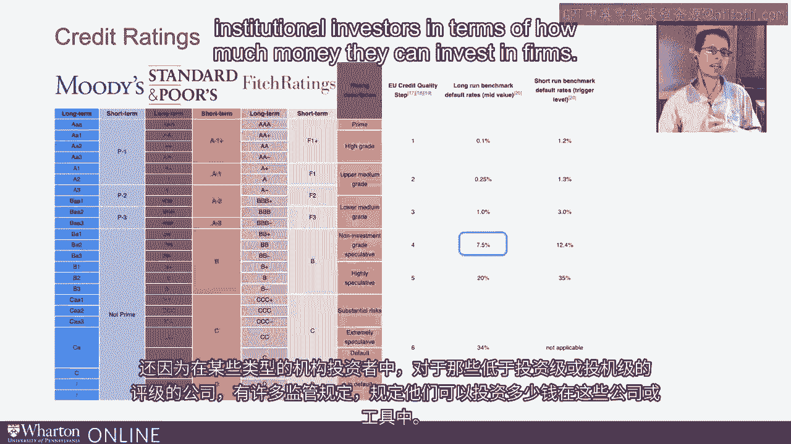
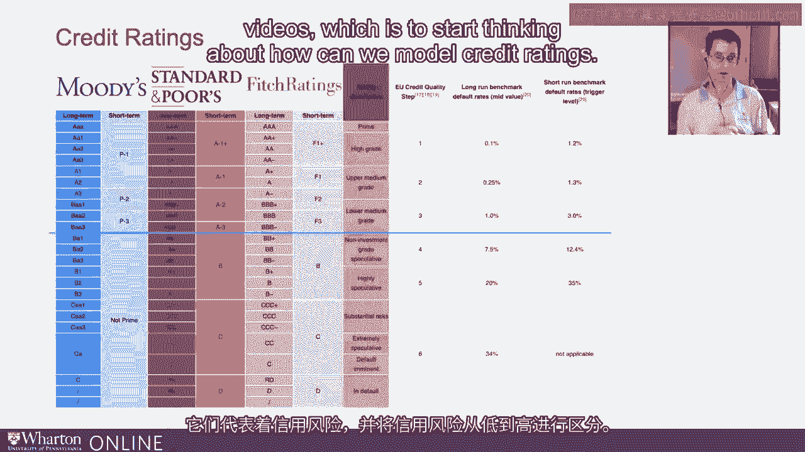

# 沃顿商学院《AI For Business（AI用于商业：AI基础／市场营销+财务／人力／管理）》（中英字幕） - P51：17_信用风险信用评级.zh_en - GPT中英字幕课程资源 - BV1Ju4y157dK

 So now I want to build on what we've been discussing thus far with regards to credit risk。

 corporate credit risk that is。 And I want to introduce credit ratings， something many of you。

 which many of you may already be familiar with。 So let me put up a little slide here and this is really just a screen grab from a Wikipedia page。

 Now there's a lot of information here， so let's try and walk through some of this。

 One step at a time and see how it relates to what we've been discussing。 Alright。

 so there are actually many ratings agencies， but the three largest in terms of their size and breadth of their ratings。

 are Moody's standard and whores and bitch。 And the idea behind a credit rating is really simple。

 You know， it's an attempt to characterize， not quite quantified。

 but characterize the credit risk of different companies， different financial instruments。

 So when we talk about， you know， Intel being less risky than AMD， as we did in our past videos。

 you know， how much less risky is a natural question to ask， right。

 or how much more risky is AMD than Intel？ And so credit ratings are one way in which we can move closer to quantifying that risk。

 or at least providing some notion of a relative ranking。

 So let's take a look at this first column on the left-hand side here， Moody's long-term ratings。

 And we can see they run， the ratings run from AAA all the way down to single C。

 And as we move from AAA down to single C， we're moving from less risky to more risky firm。

 So the safest firms from a credit risk standpoint are rated AAA。 The riskiest firms， in fact。

 the firms that are all but in default， if not in default， are rated single C on the Moody's scale。

 Standard and whores have similar rating scales， those slightly different letter notations。

 So standard and whores， again， starts with AAA， but rather than going to AA1。

 which is one notch below the safest， it goes to AA plus。 And on and on all the way down to single C。

 though， that's in some sense slightly above Moody's single C rating。

 And Fitch is actually very similar， if not identical。

 in terms of its long-term ratings to standard and whores。 Now。

 there's a distinction between short-term and long-term。 I'm going to put that aside for now。

 I don't want to bite off more than we can chew well。 Let's focus on the long-term ratings。

 which are a bit more well-known and perhaps more widely referenced。

 So each of these ratings categories you can think of as a bucket of loosely similar firms in terms of their corporate credit risk。

 Now， how does this relate to the probability of default？ So over in this column。

 Wikipedia was nice enough to put up whoever constructed the page， some default rates。 Now。

 I'm not going to be wed to them， but they will give you some general sense because I did check。

 They are in the ballpark of the actual default rates。 Each credit rating， each individual rating。

 AAA， AA plus， AA， has its own default rate， and different types of default rates for that matter。

 but I don't want to go down that rabbit hole。 So let's focus sort of big picture here。

 For a relatively safe firm， a firm that's rated AA or above， according to standard and whores。

 or Moody's for that matter or pitch， what is the probability that that firm is going to default？

 Well， it's 0。1%。 So 10 basis points， 0。1%。 That's very low。 As we move down the rating scales。

 you can see that the probability default starts creeping up。

 But notice that even as we get down to the triple B rated firms。

 the probability of default is only 1%。 It's still highly unlikely that a firm rated triple B minus or above。

 or a firm rated B AA 3 or above on the Moody scale。

 probability that they're going to default is very low。

 But as soon as we move below that single B AA rating。

 as soon as we move below that to the double B or the BA1。

 we see a big jump in the default rate from 1% to 7。5%。

 And what's happening is as soon as you cross this divide。

 so from triple B minus to double B plus on the standard and whores scale。

 and analogously from B AA3 to BA1 on the Moody scale。

 you are moving from what is called an investment grade rating， to a speculative grade rating。

 And that distinction is important for a lot of reasons。

 not just because we see this almost discrete jump in the likelihood of default。

 but also because there's many regulations on certain types of institutional investors in terms of how much money they can invest in firms that。

 or instruments that are rated below investment grade or speculative grade。

 So this line that I'm drawing right here is an important delineation。

 And you can see the rating description here， right？ We have investment grade above the line， right？

 Below investment grade， sorry。 Below investment grade or speculative grade below the line。

 So what's sort of the upshot of this discussion？ Credit ratings are sort of a useful characterization of credit risk profiles。

 And they abstract away a little bit but are closely related to default rates， but getting a rating。

 I like to think of it as a grade in a class， right？ A， B， C， D and F， right？

 If you got an A in the class， you did outstandingly well， okay？ Just like if you're rated AAA or AA。

 that is incredibly safe。 It's a very safe， low credit risk firm。 If you got a B in the class。

 you did okay。 It's not great， but you did all right。

 So if you're rated single A or maybe high triple B， you're still a relatively safe firm。

 very low probability of default， but it's clearly different from a AAA or AA rated firm。

 And likewise， for lower and lower ratings。 So they're a useful characterization of credit risk。

 They're a popular characterization。 Though despite all the attention that they receive。

 relatively few firms in the economy， I mean relatively few publicly traded firms in the economy have credit ratings。

 In fact， it's not even the majority。 It's probably around 30 to 40% if I had to guess based on memory。

 So， you know， not many firms in the grand scheme of things have credit ratings。

 but those firms tend to be extremely large and responsible for a great deal of economic activity。

 And so credit ratings rightfully so get a great deal of attention。 So that's， you know。

 the whirlwind introduction to credit ratings， right？

 They represent credit risk and delineate between different buckets of credit risk from low to high。

 And this is going to provide the backdrop for what we want to do in the coming videos。

 which is start thinking about how can we model credit ratings。

 [ Silence ]。

