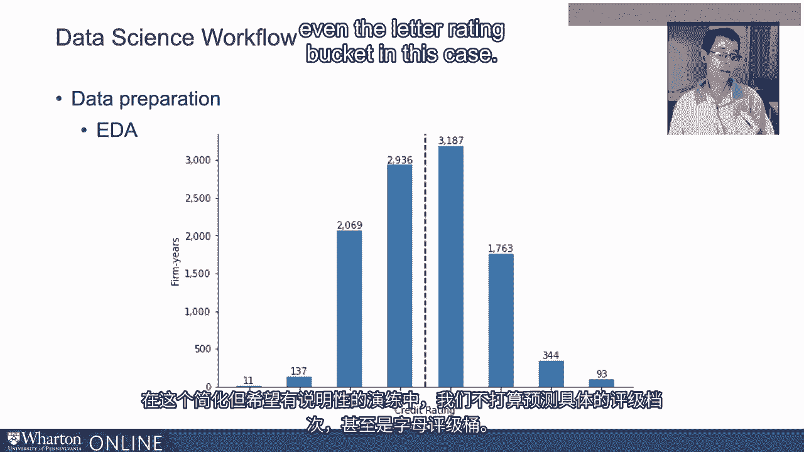
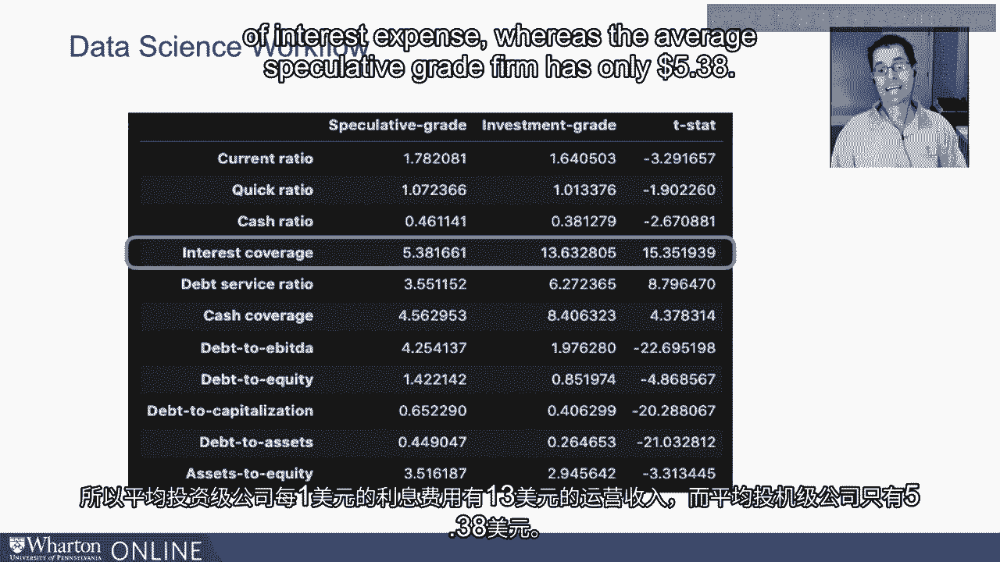
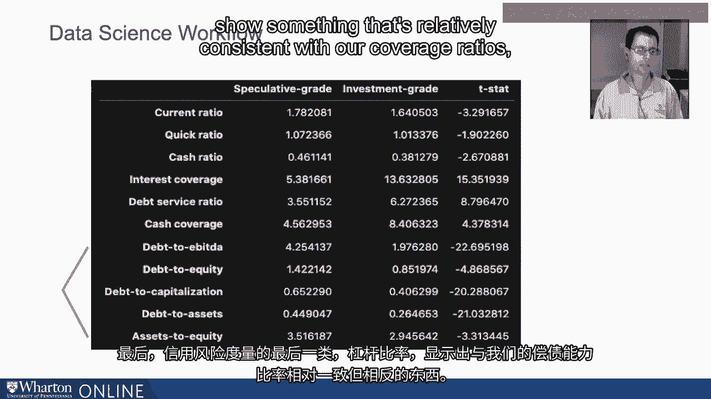
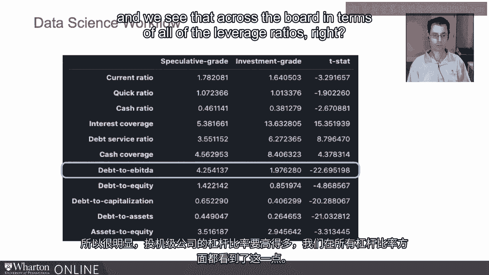
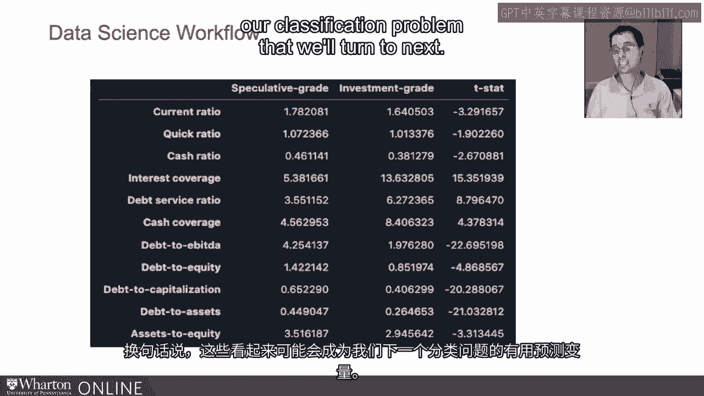

# 沃顿商学院《AI For Business（AI用于商业：AI基础／市场营销+财务／人力／管理）》（中英字幕） - P53：19_信用风险数据.zh_en - GPT中英字幕课程资源 - BV1Ju4y157dK

 In this video， I want to start talking about the data that we're going to use for our classification model。

 Let's see， here we go。 So， remember， let's take a step back first。

 Everything starts with a scientific process， clearly articulating the question。

 starting with some hypothesis developments and guesses and answers to the question。

 understanding the empirical implications of those hypotheses and then testing it out in the data。

 Where we are now is really in testing it out with the data。

 That is the start of the data science workflow。 And that begins with acquisition and verification。

 So， I'm going to grab a standard and porous CompuSAT database which contains credit rating and financial information for most all publicly traded firms in the United States。

 as well as some privately held firms as well。 That will be the base of our data。

 I'm going to impose some screens， do a little bit of cleaning and verification， as we always do。

 but not bore you with that at this point in time， which isn't to de-emphasize the importance。

 but simply to gloss over a bunch of tedious code that had to be done to prepare this data。

 The result of that is a sample consisting of 10，540 observations for 1。

400 firms ranging from 1995 to 2016。 So remember from the last video in which I spoke about firm year observations。

 we have data for 1，400 firms at multiple points in time。 So， let's take a look at our data。

 In particular， let's do a little exploratory data analysis， EDA。

 What I'm going to do here is just plot the distribution of ratings in the sample。

 And what I've done to sort of ease the presentation is I've collapsed ratings。

 these are S&P ratings， into whole letter buckets。 So。

 what I mean by that is the double A bucket consists of double A minus double A and double A plus。

 The triple B bucket consists of triple B minus triple B triple B plus。

 and similarly for most of the other ratings where it's relevant。

 And so what we can see here is something that's roughly symmetric， almost bell shaped in some sense。

 not to suggest that it's normally distributed for a number of reasons。

 not the least of which is that it's discrete， but you can see that most of the data。

 most of the observations are clustered here around this dashed line。

 which is meant to distinguish between investment grade to the right and speculative grade to the left。

 So this is where most of the data is between the B and A rated firms。 In fact。

 we see relatively few ninety three from your observations out of the ten thousand that are triple A and even fewer that are rated double C。

 which is on the verge of default。 Now， this of course is not our outcome variable。

 We're not trying in this exercise， which is stylized。

 but hopefully illustrative to predict the specific rating notch or even the letter rating bucket in this case。

 What we're trying to do is distinguish between investment grade。

 investment grade and speculative grade。 And if I look at that distribution here where one corresponds to investment grade。

 zero corresponds to speculative grade， you can see we get about really almost a fifty fifty split in the ratings。

 Fifty one point one percent of the ten thousand five hundred and forty observations are investment grade and forty eight point nine percent are speculative grade。

 It's actually going to make our job a little bit easier in some sense because we've got nice representation of both both categories。

 both both classes。 In contrast to some data sets such as bank fraud。

 where the vast majority ninety nine percent or even more sometimes of the data is non fraudulent transactions and you have a very small fraction。

 a very small number of fraudulent transactions that you're trying to identify。 Not the case here。

 This last table， what I'm going to do is I'm actually going to take my sample and bifurcated into two groups based on whether you're speculative grade or investment grade。

 And then I'm going to compute the average credit risk KPI that we discussed previously for each of those groups。

 And then I'm going to run a little pair t test and show you the t statistic over here in the third column。

 So if we look at the first row， I see that speculative grade firms have an average current ratio。

 remember current ratio is a measure of liquidity， current assets。

 current liabilities of about one point seven eight。

 Investment grade firms actually have a slightly lower liquidity ratio of one point six four。

 which at first glance might seem a little bit odd。 But remember。

 the investment grade firms don't need the liquidity to support their finances。

 They can run sort of a leaner meaner operation on the liquidity side because they've got a lot more money coming in through operations relative to any sort of financial obligations they might have。

 We see that in fact the current ratio is statistically significantly larger among speculative grade firms and investment grade firms is indicated by this t statistic of negative three point two nine。

 So， looking across the current ratio， quick ratio and cash ratio。

 we see that on average speculative grade firms actually have tend to have more liquidity。 Now。

 when we turn to coverage ratios， most notably the interest coverage ratio。

 debt service and cash coverage， we see the exact opposite。

 Investment grade firms have a much stronger coverage profile than speculative grade firms。

 And let's focus on the interest coverage ratio to make the discussion a little bit more specific and precise。

 Remember， interest coverage is the ratio of EBITDA， proxy for operating income to interest expense。

 So， the average investment grade firm has $13 of operating income per dollar of interest expense。

 whereas the average speculative grade firm has only $5。38。

 If we throw in principle， those numbers both move down。

 but you can see how we're getting very close to almost one for one among speculative grade。

 speculative grade firms have $3。55 of operating income per dollar of interest in principle owed over the next year。

 compared to the $6。27 that investment grade firms have。

 And these differences across the speculative grade investment grade divider aren't just economically significant。

 they're statistically significant as well as suggested by the large t statistics。 Finally。

 the last category of credit risk metrics， the leverage ratios。

 show something that's relatively consistent with our coverage ratios， albeit in reverse。

 So， let's think about debt to EBITDA， the debt to EBITDA ratio or leverage ratio of a speculative grade firm is 4。

25 suggesting that they have， on average， $4。25 of debt outstanding for each dollar of operating income that they're pulling in。

 So， we've compared to the $1。97 of debt outstanding for each dollar of operating income that an investment grade firm has。

 So， clearly， right， speculative grade firms are quite a bit more heavily levered and we see that across the board in terms of all the liquid。

 all of the leverage ratios。

 And so， if we look at debt to assets， 45 cents of each asset is funded with debt as opposed to equity for speculative grade。

 in contrast to the 26 cents of debt financing for each dollar of asset among investment grade firms。

 And these are all highly significant as well。 And you can see that there are stark differences in the credit risk characteristics。

 credit risk KPIs between speculative grade and investment grade firms。

 And that's important because that's going to prove useful when we want to go predict or classify firms as speculative。

 grade or investment grade， because we'll get a lot of spread。

 big differences between things like coverage ratios， liquidity ratios， and to some lesser extent。

 liquidity ratios， put differently。 These appear as though they will likely be useful predictors for our classification problem that we'll turn to next。

 Thank you。

 you。