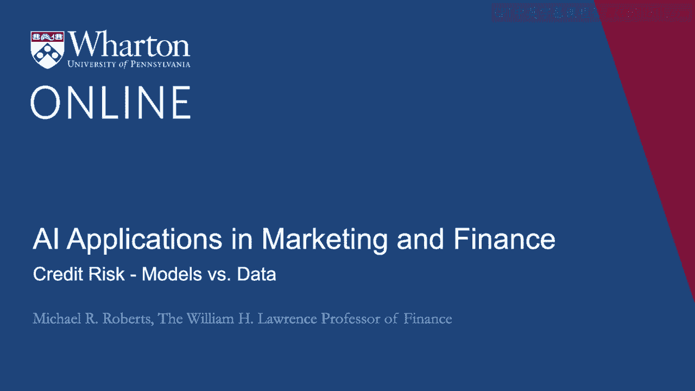
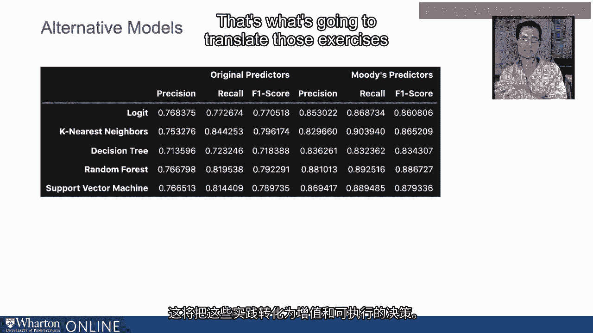

# 沃顿商学院《AI For Business（AI用于商业：AI基础／市场营销+财务／人力／管理）》（中英字幕） - P56：22_信用风险模型与数据.zh_en - GPT中英字幕课程资源 - BV1Ju4y157dK

现在我想谈谈模型与数据。

让我提醒你我们到目前为止所做的事情。

我们估计了一个logit模型，以预测一个公司是投资级别还是投机级别。

我将重复我们之前讨论的11个预测变量的结果。

11个信用风险KPI。我将展示它们的精确度、召回率和F1分数。

我们的logit模型在这里，为了比较提供一个基准。以刷新你的记忆。

请记住，精确度是正确预测的概率。

条件预测投资级别结果时，预测投资级别更为普遍。

对吧？当我们预测投资级别时，我们要么预测正确，要么预测错误。

所以我们的正确率为76.8%。然后，召回率是正确预测的概率。

当数据中是投资级别结果时，投资级别结果。

数据可以是投资级别或投机级别。我们的正确率为77。

3%的时间。我们在数据中与模型重叠。

F1分数是精确度和召回率的调和平均值或加权平均值。

大约为77.1%。然后，我查看了几种替代模型。

分类投机级别和投资级别公司。具体而言，K最近邻。

一个决策树、一个随机森林和一个支持向量机。

我还对所有模型进行了交叉验证，包括logit模型。

确保我不是仅仅在一个特定样本上过拟合。好的。

细节并不重要。我们保持在相对高层次上。

我想表达的观点是，当我查看替代模型时。

我在不同维度上确实看到了一些改善。例如，K最近邻模型的表现非常好。

召回率相对较高，为84%，与其他所有模型相比，虽然这并不令人惊讶。

与logit随机森林和支持向量机相比，精确度似乎有所下降。

决策树在任何指标上都表现得不好。

相对其他模型而言。在整体精确度和召回率F1分数方面。

我们可以看到随机森林和K最近邻表现得不错。

K最近邻模型略微获胜，达到了79.6%。

因此，我们确实看到不同模型的预测准确性有所变化。

鉴于我们当前的输入规格，我们可以比logit做得更好。

我现在想谈的是比较不同模型之间的表现。

但也包括不同的预测变量。请记住，我们最初的预测变量是这11个信用KPI。

然后我去找了一个旧的，不是太旧的模型。

有些旧的穆迪研究报告详细描述了一些预测因素。

他们在信用评级模型中使用的。现在，这不会导致完全准确的预测。

有各种原因，尤其是我关注 S&P 信用评级。

但也因为信用评级不仅仅涉及这些。

企业的可量化利润和资产负债表数据。讨论很多。

有行业分析、竞争分析等。

但我想看看，如果我通过模型推动更好的数据、更具信息量的数据。

这会导致改进吗？而这种改进与我获得的改进相比如何？

通过观察不同模型。因此我把所有这些都放在了屏幕上。

让我逐步讲解一下这意味着什么。

所以前面三列测量了我们五个模型的精准率、召回率和 F1 分数。

不同模型使用我们之前提到的 11 个原始预测因素。

本系列的开始。最后三列展示了相同模型的相同指标。

但使用不同的输入、不同的 X 变量、不同的预测因素。

我将其称为穆迪的预测因素。我认为从这张表中重要的是增长。

在所有度量中，从原始数据转变为预测准确性。

或者原始预测因素与穆迪的预测因素。

显著大于从其他模型获得的任何准确性提升。

所以我们只关注 F1 分数，以使事情具体而简单。

我们可以看到，使用原始预测因素时，F1 分数从 71 到 79.6% 不等。

但当我们使用穆迪的预测因素时，这些数字跃升至 88.6%。

在随机森林的情况下。那么这里的信息是什么？信息是数据，而不是模型。

这就是导致成功的机器学习实现的原因。让我再说一遍。数据。

不是模型。模型可以帮助。我并不否定模型的重要性。

我只是说，在相对排名方面，你想花费你的。

资源在于更好的数据，更好地理解数据生成过程。

这将推动成功的机器学习工作。

这将使这些工作转化为价值。

增长的可行决策。[BLANK_AUDIO]。

