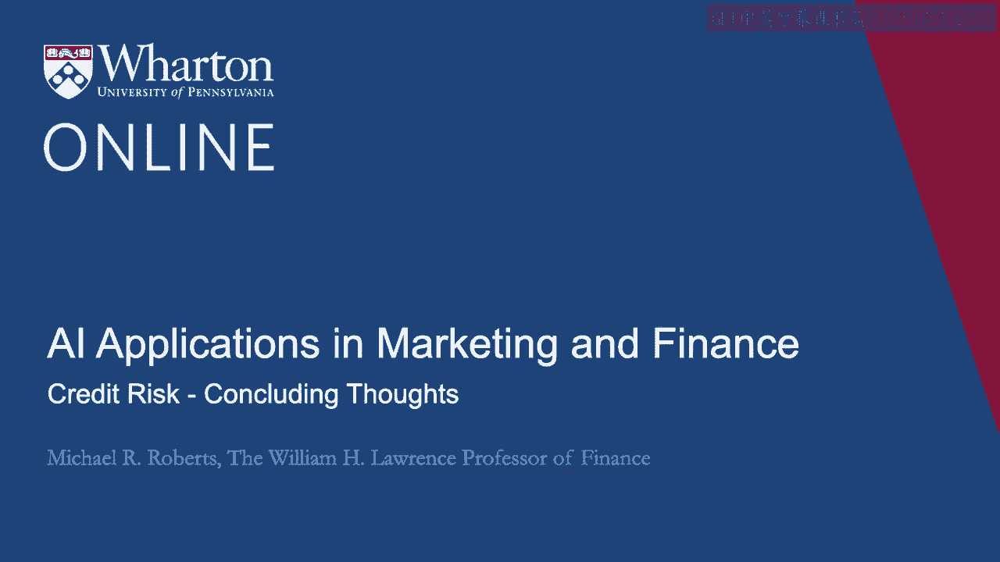
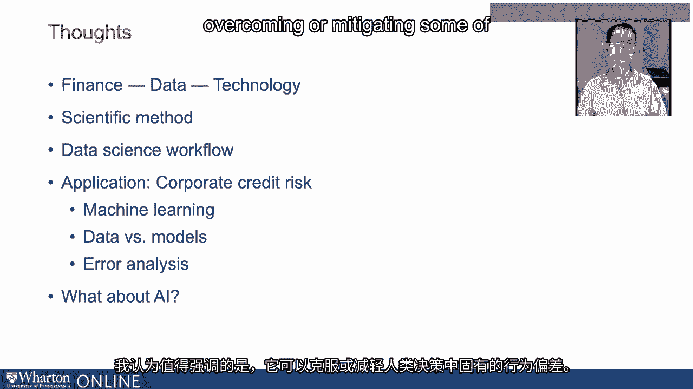
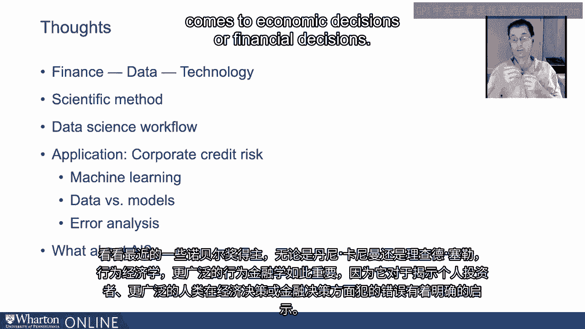
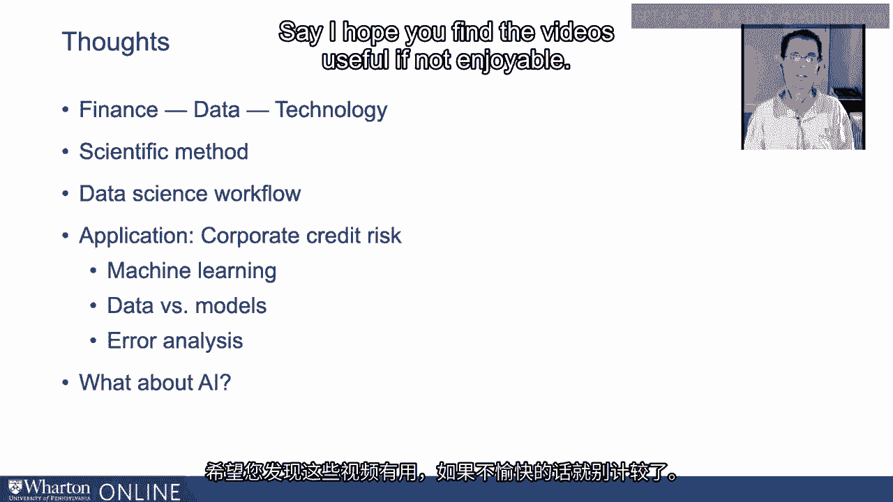

# 沃顿商学院《AI For Business（AI用于商业：AI基础／市场营销+财务／人力／管理）》（中英字幕） - P58：24_信用风险总结思考.zh_en - GPT中英字幕课程资源 - BV1Ju4y157dK

 All right， let's bring things together in this last video。

 Finance data technology， as we said at the outset， are intimately related。

 Really since almost as the beginning of finance， data has played a central role and as technology。

 has progressed， it has creeped into finance， at least the practice of finance， not to mention。

 the academic study almost immediately。 And so there's this nice combination among the three areas that has led us to where we。

 are today in which concepts such as machine learning and AI are playing a central role。

 What we've done in this set of videos is we've really sort of talked about a variety of things。

 all of which are related in a linear sort of way。 Some solving starts with the scientific method。

 clearly articulating a question， being very， precise， hypothesizing answers to the question。

 understanding the implications of those answers， for what you might see in the data and then taking those hypotheses to the data by way。

 of the data science workflow， beginning with acquisition and verification of the data， followed。

 by preparation of the data， by getting it ready for analysis， performing exploratory data analysis。

 on it and then eventually modeling。 And we showed all of this in the context of an application just as an illustrative vehicle。

 specifically corporate credit risk。 We talked about what corporate credit risk was。

 how important it is not just for firms， but for a variety of different stakeholders in firms。

 We talked， walked through the basics of assessing credit risk in a firm by looking at its financial。

 statements， by looking at key performance indicators。

 Then we transitioned into talking about credit ratings， recognizing that credit ratings are。

 getting us towards a quantification of credit risk built on the analysis that we started。

 off with in terms of financial statement analysis。 Then we actually decided to model credit ratings。

 albeit at a somewhat coarse level of looking， at speculative grade versus investment grade。

 Then we implemented a machine learning process， starting with a logit model and exploring a。

 variety of other models， including K nearest neighbors。

 We avoided the technical details because this is neither the time nor place for that。

 We just sort of want a general overview introduction to some of these concepts。

 There's tons of information elsewhere on the gory details for those that are interested。

 But one of the lessons that came out of this that isn't often emphasized elsewhere is the。

 importance of data versus models。 If you have to spend resources， spend it on the data。

 not on fancier models， because models， are limited by what goes into them， period。

 The other thing we learned is it's just as important to understand where you're making， mistakes。

 arguably more important than where you're being successful because that's where。

 improvement's going to come in terms of the modeling process。 Through all of this。

 you might be wondering， "What about AI？ We haven't talked about AI， artificial intelligence。"。

 I like to think of AI as really a superset that encompasses machine learning， but other。

 stuff as well。 To keep things digestible and this video series under a reasonable time cap。

 let me just speak， a little bit off the cuff here。

 There's many different roles that AI can play in finance。

 One that I think is worth emphasizing is in overcoming or mitigating some of the behavioral。

 biases that are inherent in human decision making。 Look at some recent Nobel Prize winners。

 whether it's Danny Kahneman or Richard Thaler。 Real economics， behavioral finance more broadly。

 is so important because it has shown a very， bright light on the mistakes that individual investors。

 humans more broadly， make when it， comes to economic decisions or financial decisions。

 We make mistakes all the time。 What I think AI can do， among many other things。

 is it can really help discipline decision making。 It can help us avoid making some common sense mistakes when it comes to investing decisions。

 or other finance related decisions。 There's enormous scope and we're already seeing some of this in sort of robo-investing。

 and advice， but I'm not going out on any limb in saying that that is only going to grow。

 and the role for AI in helping people make better financial decisions is only going to。

 become more and more important as time progresses as we get more data and computing power ramps， up。

 So let me just stop talking。

 Thank you。 [BLANK_AUDIO]。

