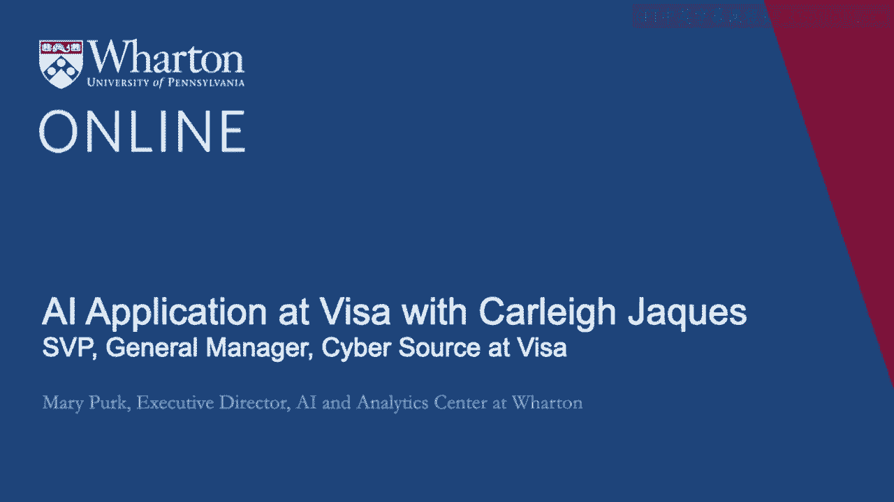
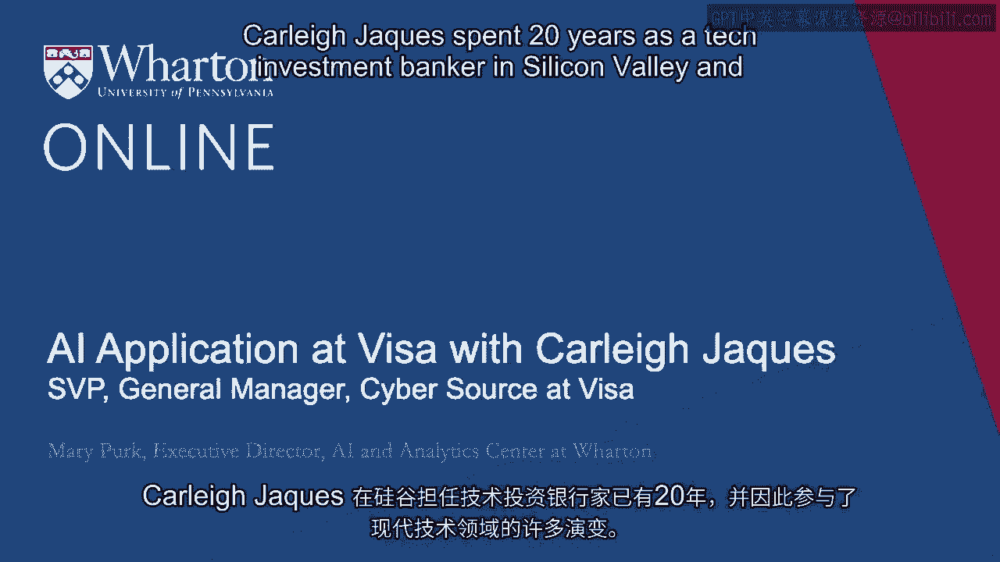

# 沃顿商学院《AI For Business（AI用于商业：AI基础／市场营销+财务／人力／管理）》（中英字幕） - P62：28_Carleigh Jaques访谈.zh_en - GPT中英字幕课程资源 - BV1Ju4y157dK

 Carli Jake spent 20 years as a tech investment banker in Silicon Valley and thus has participated。

 in much of the evolution of the modern technology staff。 13 years ago。

 Carli joined Visa to lead strategy and corporate development。 Four years ago。

 she assumed the general manager role at CyberSource， which is Visa's global。

 merchant and acquirer platform。 Welcome， Carli。 To Grom is in your perspective。

 can you tell us about your role at Visa and the business， CyberSource that you lead？ Absolutely。

 thank you so much， Mary。 So CyberSource is what we would call a payment management platform or sometimes in the industry。

 we would call it a gateway。 What that really means is if you think about the traditional countertop experience where。

 you tap or dip your card with that device on the counter， that is routing a payment， transaction。

 What CyberSource is is effectively the digital version of that。

 So if you think about a mobile experience， whether it's waking up in the morning and buying。

 your coffee or your transit ticket or perhaps paying your parking， buying a sweater later。

 in the day， getting a snack from a vending machine， chances are we power that transaction。

 And in 2020， we powered about 21 billion transactions worth approximately $600 billion in payment。

 volume。 Wow， those are some really big numbers。 So given that and a very big job。

 what is the biggest value driver to Visa and indirectly。

 CyberSource's customers related to AI applications and possibly how is AI being applied to address。

 solve problems for your customers？ Like for example。

 what are some use cases that Visa is deploying specifically through。

 the use of AI and machine learning？ In the digital world。

 the merchant bears the liability of a bad transaction。 So merchants really care a lot about this。

 Acquires who are the folks who underwrite merchants care a lot about this。

 So it was organic for CyberSource to participate actively in fraud tools in support of merchants。

 and acquires。 We processed about 200 billion in payment volume last year again on the fraud front。

 That's about two billion transactions。 And the types of work we're doing is to really look at transactions again across the globe。

 to be thinking about fraud signals from over 250 different sources and applying that to。

 a situation。 And one of the things that's happened in COVID perversely is we've seen a massive spike。

 in e-com traffic。 We've unfortunately also seen a massive spike in fraudulent activity。

 So in our experience， what we've seen is that merchants are deploying our capabilities in。

 the traditional manner。 But they've also been incredibly creative in terms of partnering with us to develop new。

 use cases。 So early on in the pandemic， kind of a fun one is that there was a lot of hoarding behavior。

 happening。 And one of our clients used our capabilities to dial in very granularly at the skew level。

 and look at hoarding behavior and basically cap the number of bottles of Clorox that you。

 could buy so that it was available for the broader community。

 So it's a capability set that was developed for a specific use case， but the flexibility。

 of our technology has really made it adaptable to a whole host of scenarios。

 So given that exact example that you've shared， seems like COVID has really accelerated how。

 visa and cyber sources had to approach AI differently from five years ago。

 So more specifically around that， are you finding you're more iterative with your customers。

 now versus five years ago？ And what has allowed you to be more agile？

 And when you do pull in your data scientists into those customer business problems， do you。

 pull them in earlier or how has it changed over these last five years？ I know COVID is accelerated。

 but maybe give people some perspective over that five year， period。

 So I would say just foundationally， our development approach has changed pretty radically。

 And when you sit in an industry that is very technical， that is very complex， it's a very。

 complex ecosystem。 It's very easy to build from a lens that I would call inside out。

 Our teams loved to go to the whiteboard and draw the flows of the way the transaction was。

 going to navigate across the globe。 And what we've really seen is that it's critically important to think about the customer experience。

 To think about， we use the term a lot， customer journeys。 And really。

 what is that experience of interacting with our technology？

 What is the business problem very specifically that we're trying to solve？

 And those types of approaches have absolutely transformed the experience of our products。

 just across the board。 So again， it's a lot of things like JAD sessions， right？

 Join application development session with our client， with our technologists and our product。

 development teams。 And data scientists are absolutely in the mix in those types of sessions because the。

 way fraud works is it's very industry specific。 And unless we understand the business context of our clients。

 we might have phenomenal technology， but we're not actually optimizing against the outcome we're looking for。

 So when you talk about the business context and you've set that up with this context of。

 processes and your data scientists， can you talk and your customers？

 Can you talk about a little bit more about how important it is to frame the business problem。

 and potentially who is involved in helping to frame that business problem， why it is so， important？

 So again， fraud is very industry specific。 And if you're the emergent in the transaction environment。

 what you're thinking about is， how do I optimize and accept as many good transactions as possible？

 And then how do I weed out the bad transactions？ But the cost of a bad transaction can be very different depending on your industry。

 If you have digital goods， right， you're incredibly high margin and a bad transaction。

 really is not as impactful to your business。 On the flip side of it。

 if you're in a very thin margin business， every bad transaction。

 is incredibly impactful to your bottom line。 So that's the type of thing you need to understand。

 And again， that iterative element of business context is just incredibly important。 So again。

 harkening back maybe a little bit to a COVID example of also just how dynamic。

 business context can be。 Even if your industry has stayed the same。

 One of the things we saw early on was that there were a lot of one way international。

 airline tickets happening。 And we have a very large footprint in the airline industry。

 It's a place where there actually is a reasonable amount of fraud。

 People steal a credential by a ticket and then move on。

 So a lot of international one way tickets normally would be a very bad outcome and those。

 would have sailed through。 And in fact， what happened is that the models were blocking them。

 But we looked at it and we said in COVID， this is actually a lot of people who are just。

 trying to get home。 We need to change the way the models are working to support a very current business environment。

 So again， just context is an evergreen phenomenon， I guess would be the point。

 So from your experience， can you highlight the key elements to building out not only good。

 models and why it's critical， but that your model is only as good as your data。

 And maybe provide an example of why normalization of data is so important。

 So I mean data is kind of the secret sauce and your model is only as good as your data。 I mean。

 the way I simplistically think about this is， you know， it's algebra。

 And if you don't have a good set of values you are solving for， then you're going to。

 be off the mark really just from the get go。 And in our industry。

 one of the things that we've seen is we really do need to understand， the data。

 understand where what we would call truth data comes into place。

 So if there is a bad transaction in the credit card industry， it actually has to be reported。

 to your bank by the consumer or by the merchant。 That process to adjudicate the outcome often takes about 90 days。

 So you can have a 90 day period where you don't know whether it was in fact a legitimately。

 good transaction or a bad transaction。 And where this becomes really relevant is that if you have a merchant。

 for example， who's， setting up a mobile channel。 That actually can have a different fraud vector than an e-comm channel or a face-to-face channel。

 And so as you think about your insights that you're taking away from your data and analytics。

 the model gets better once you cross that 90 day marker because you've seen how fraud。

 is working specifically in that channel。 And again。

 the big takeaway is that you need to understand how your models are working before。

 you decide the value they're driving in terms of a business outcome。

 And that's really one of the key things we've focused on is listening to our data scientists。

 and understanding where our models are in terms of their maturity。

 And then also development of new data insights， for example。 We might also ingest a new data set。

 We want to see if that data set produces the lift that we expect。

 It's not enough for it to be a hypothetical。 And as you break down the good data that you're speaking about。

 finally， can you tell us just， a bit more about your data definitions。

 data governance at Visa and CyberSource and their， importance。 I mean， we take data definition。

 data governance extremely seriously。 We have a vast set of data。

 We're also incredibly mindful of privacy and all of those different dimensions that go。

 around data usage。 And then there is this whole element of normalization， again。

 because we have -- it's not something， average consumer might know。

 but they're almost -- they're at least 20 different ways you could， affect a transaction。

 And they all have different attributes。 When those get rolled up to think about a card not present transaction。

 so think maybe， more of a digital transaction or a face-to-face transaction。

 If you don't have those mapped correctly across different data sources， you're going。

 to destroy your outcomes。 And then similarly， if you think about ingesting incremental data sources。

 which is something， we do regularly， and there are just more and more ways to think about augmenting data today。

 For example， what are the attributes of the device that you're working on？ Where is it coming from？

 What IP address has it hit？ Is the behavior of the consumer on that web property consistent with the way we traditionally。

 see a real person interact versus a bot interact？ All of those are the types of data we can apply to augment。

 But if our definitions don't have the same baseline， we will get distortion。 So we're very。

 very focused on that。 It's amazing， Carly， all the things that you have to consider when making a credit card。

 transaction。 I don't think I'll ever look at those machines simply again and just know all the different。

 things that occur。 But I just want to thank you so much for enlightening us how AI and ML is applicable within Visa。

 and CyberSource and credit card transactions。 And thank you for your time today。

 It was great getting to know you and the business。 So thank you so much。 Thank you， Mary。

 [BLANK_AUDIO]。

