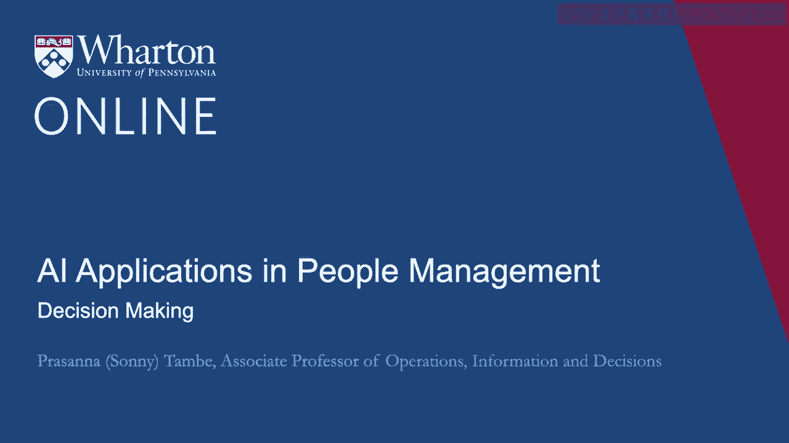
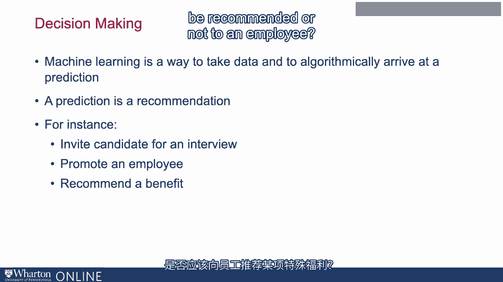
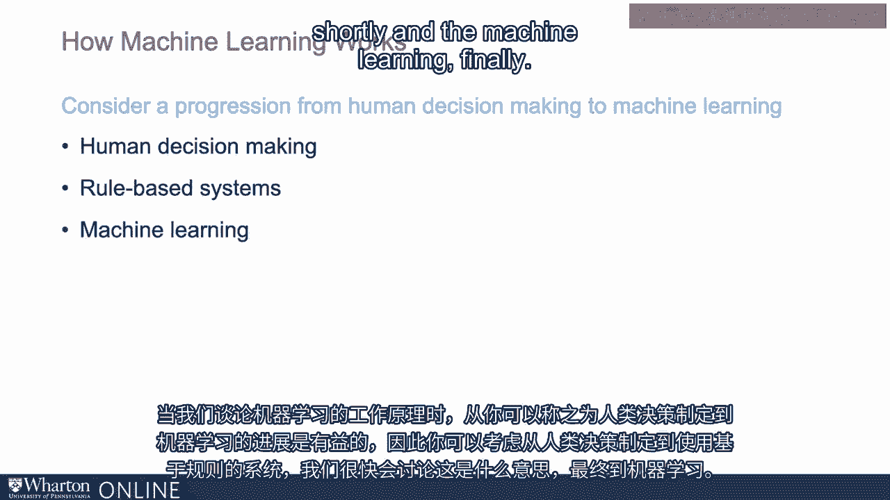
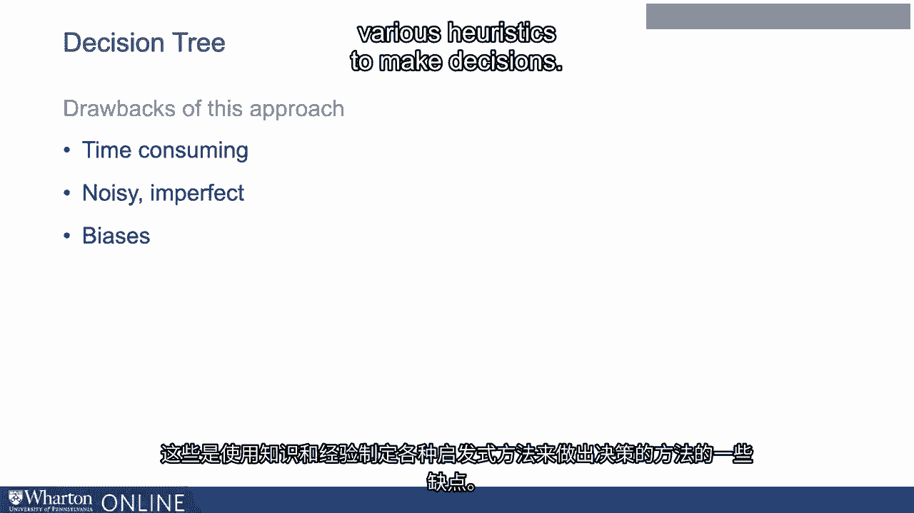

# 沃顿商学院《AI用于商业：AI基础／市场营销+财务／人力／管理》（中英字幕） - P66：3_决策.zh_en - GPT中英字幕课程资源 - BV1Ju4y157dK

嗨，我是**普拉萨娜·坦巴**。

我是沃顿商学院OID系的教职员工。OID系。

代表操作、信息和决策。

我个人的兴趣领域是技术与劳动的经济学。

其中一个领域是人工智能在人力资源系统和招聘中的应用。

在这个过程中，我与多家公司合作，这些公司充当劳动市场中介。

并且处于关于算法如何在HR流程中应用的前沿思考之中。

我很享受与多个数据科学团队合作，他们在处理各种问题时遇到挑战。

关于人力资源数据及其能帮助我们预测什么。当思考数据科学时。

在人力资源中，AI的使用及未来的使用，思考机器学习作为一种获取数据并通过算法得出结果的方法是很有用的。

在你可能称之为预测的内容中。现在，当我提到预测时，是在HR的背景下。

这也相当于只说一个建议。因此，例如。

我们是否应该邀请候选人进行面试？如你所知。

申请工作变得比以往更便宜，因此人力资源筛选员通常。

由于申请数量激增，机器学习工具变得非常有价值。

推荐或预测某个候选人是否会是一个好的面试候选人。

你也可以从促进员工的角度考虑一个预测或建议。

你不应该被晋升或不晋升。某项特定福利是否应该推荐给员工？

因此，目标始终是利用数据进行某种预测。

所以我们希望最终能够回答的问题是：什么上下文，什么决策。

上下文非常适合机器学习预测的原因是什么？

什么使它们适合使用，考虑使用时可能会有哪些权衡？

这些类型应用的**机器学习**？现在，去做吧。

了解一下机器学习的工作原理是很有用的。

在我们讨论机器学习如何工作时，我发现思考这个问题是很有用的。

从你可能称之为人类决策的过程到机器，思考这种演变是很有用的。

学习。因此，你可能会考虑一个从人类决策到使用的进展。

规则基础系统的内容。我们稍后会讨论这意味着什么。然后是机器学习，最后。

所以让我们谈谈人们如何自己做决定。 所以当我们做决定时。

我们运用我们的知识和经验来制定启发式方法。

这在信息不完善的环境中尤为真实。

我们常常被要求快速做出决定。我们没有所需的所有信息。

人力资源是一个很好的例子。再次强调，人力资源或筛选人员或招聘人员看到的申请越来越多。

招聘信息的给定列表。你永远无法知道关于候选人的所有想要了解的事情。

因此，我们利用过去获得的经验和知识，以及我们所掌握的启发式方法。

随着时间的推移，发展出决定候选人是否适合该组织的标准。

一种思考这种决策过程的方法是将其视为一棵树。

这是一种常见的决策思维方式，即决策树。

因此，在考虑是否要进行时，我们可能会权衡多个因素。

个人或者我们可能想把简历提升到员工的最上面。

我们可能在关注这个人申请中的不同因素。

这可能与他们上过的学校有关。

这可能与之前的经历或前雇主有关。

这可能与我们在他们身上所关注的技能或某种文化契合有关。

应用。通过这些不同的信息形成一棵树。

我们可以说，如果他们进入了某个特定学校的某个特定项目，我们就知道这一点。

他们在某个特定领域受过良好的训练，这可能暗示这个人可能会。

适合你想要填补的组织角色。

所以想象一下，你有一堆简历需要评估，并思考你可能会创建的树。

这将包括哪些因素？如果你深入思考一下。

这可能取决于各种独特或特有的因素。

关于你所在组织或你对所要填补职位的具体知识。

这可能取决于你所工作的或所关注的组织的具体情况。

在寻找新候选人时，深切关心。

所以这需要人力资源筛选者的角色，需要与招聘相关的经验。

该特定组织。这与之前为该特定角色招聘的经验可能有关。

这一直是过去普遍采用的做法，这是一个不错的方法，但还有其他。

这种方法有一些缺点。当我们有一些人使用他们的先前知识时。

利用以往经验来开发启发式方法，招聘组织中的人员，这个过程非常耗时。

显然，对于一个人处理一堆简历所需的时间。

这样做非常耗时。它也是嘈杂和不完美的。

尽管我们随着时间积累的知识经验极其宝贵，但它。

无法捕捉到世界的整体状态。它无法捕捉到我们所看到的申请者市场的所有信息。

当然，申请者会变化，信号也会变化。

至少要捕捉所有这些内容并将其整合起来是不可能的或非常困难的。

纳入我们的决策中。而且人们，总是存在偏见。

因此，这些是人们运用他们知识的这种方法的一些缺点。

并且经验发展出各种启发式方法来做决策。

在下一个视频中，我们将开始关注所谓的基于规则的系统。

至少解决其中一个问题，并开始触及其他问题。

感谢观看。 [BLANK_AUDIO]。

