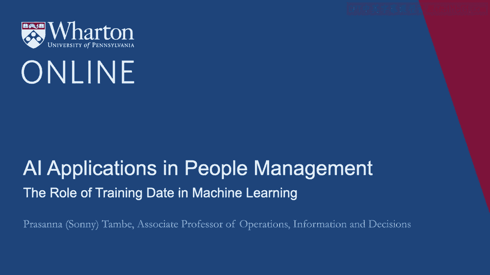
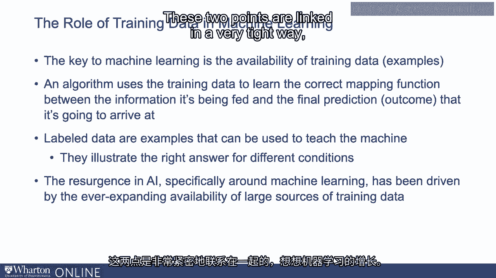
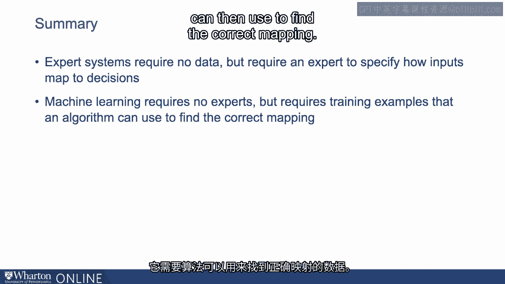

# 沃顿商学院《AI For Business（AI用于商业：AI基础／市场营销+财务／人力／管理）》（中英字幕） - P69：6_训练数据在机器学习中角色.zh_en - GPT中英字幕课程资源 - BV1Ju4y157dK

 The key to developing machine learning systems is being able to feed the algorithm examples。

 from which it can learn。 This is called training data。 And so again。

 this is the key to these systems。 An algorithm uses these training data to be able to learn the right mapping function you。

 might say between the information that's being fed and the final prediction that it。

 needs to or that's going to arrive at。 These examples which we call labeled data are examples that can be used to teach the。

 machine and you can think about them as illustrating the right answer for different case conditions。

 So going back to our applicant screening example， you might think about applicants applying。

 with different types of backgrounds。 If you have a database which has lots of examples of applicants applying with different backgrounds。

 and labeled data， these are the decisions that were actually made historically by an HR。

 practitioner by a recruiter。 This teaches the machine what to do under the different conditions。

 So by looking at the examples that it's given by looking at the different applicant backgrounds。

 and what the decision maker did in those different contexts， the machine learns how to think about。

 the different case conditions and what decision to arrive at。

 Now if we think about the resurgence in AI， the growth of interest in AI which of course。

 has been quite dramatic recently， most of that has been around machine learning and most。

 of that has really been driven by the expanding availability of large sources of training data。

 So these two points are kind of linked in a very tight way。

 Think about the growth of machine learning。 The reason machine learning has been so successful is because it can be built using training data。

 and training data is becoming more and more easily available in a variety of different。

 application contexts。 So lots of places you can get training data or corporations or firms can get training data。

 So archival data is probably the most common place。 So this is historical database。

 Firms have enormous databases on historical information。 There's going to be prices。

 there's going to be marketing， there's going to be accounting， there's going to be HR。

 Lots and lots of sources of archival data in the firm that can be used to train machine。

 learning systems。 It's often the case as well that you can generate training data。

 You can generate databases that have examples using various platforms。

 So let's say you had a data set of information of let's say you had a data set of again going。

 back to our applicant example， a data set of applicants and you wanted to generate decisions。

 even if you didn't have historical data available。

 You could have somebody in the firm sit down and make decisions artificially just to create。

 that guidance， those labeled examples for the machine learning algorithm。

 You could also outsource those to a platform。 There are lots of platforms out there that will take in information and start to label。

 it or make decisions for you so that you can use that data for training data。

 You can use that for examples to build an algorithm。 So again。

 just to put this in the context of a workflow for a different example， let's， talk about X-rays。

 So one place AI machine learning has really taken off is in diagnostic imaging in the。

 medical domain。 So some modern systems， machine learning systems can look at a medical image and make a prediction。

 on whether somebody has a certain health condition or not。

 This obviously has tremendous potential benefit in the health domain for both the practitioners。

 and for patients。 So how you would do this in the machine learning workflow is you would want lots and lots and。

 lots and lots of images and a column of decisions that doctors historically made about patients。

 with those images。 If you fed that data into a machine learning system， so again。

 all you're feeding into the， system is the images themselves and the decisions that were made by say the radiologists。

 That is all the machine learning algorithm would need to learn to mimic the decisions。

 of a highly trained healthcare worker who could look at images and make predictions。

 So I'd never need to step back and learn anything about medicine。

 I never need to even really discuss with the radiologist what they're looking for in the， image。

 All I need is just a data set which has thousands and thousands of images and the final decision。

 that was made and the machine learning algorithm can then do the rest。

 It can learn the right mapping between the image data and what decision it should come， to。

 And this is why this is exactly why the AI economy values data so much is because this。

 is the relationship that's really driving AI。 That's the availability of data like those data sources like this or really what's making。

 the application of machine learning to so many contexts possible。

 So just to summarize the last few points here， expert systems require no data。

 Rule based systems require no data。 They require a human expert to specify how people should be thinking in terms of decision。

 making and maybe a developer puts that into code。 Machine learning requires no experts but it does require examples generated by experts。

 It requires data that an algorithm can then use to find the correct mapping。

 And that's it。 Thanks。 Thank you。 Thanks。 [BLANK_AUDIO]。

