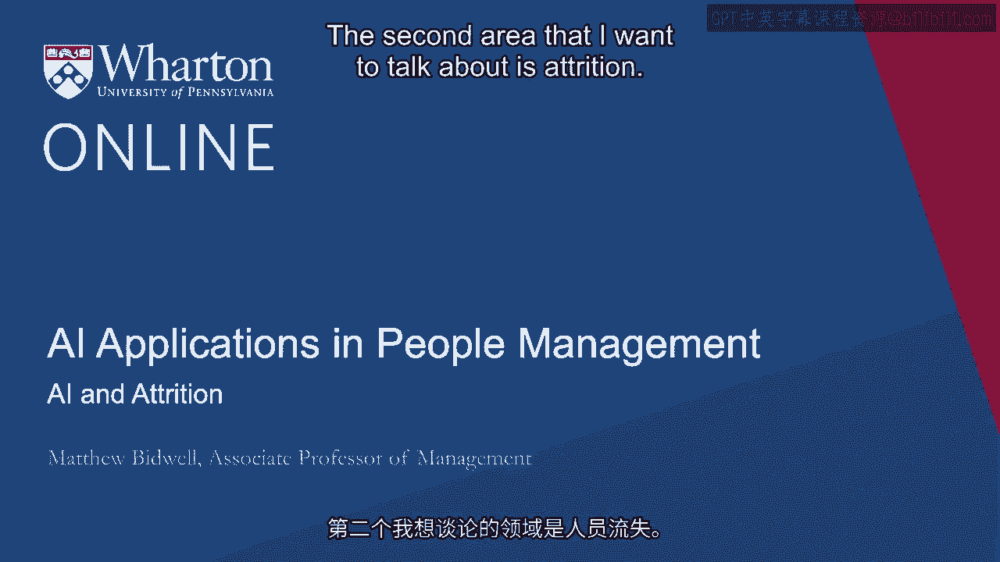
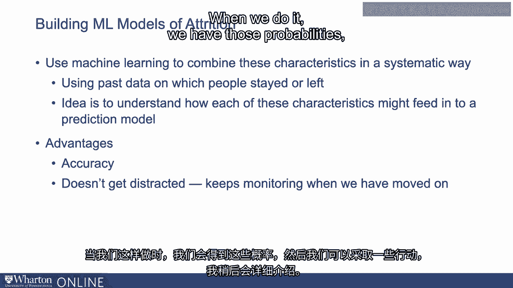

# 沃顿商学院《AI For Business（AI用于商业：AI基础／市场营销+财务／人力／管理）》（中英字幕） - P76：13_AI与流失.zh_en - GPT中英字幕课程资源 - BV1Ju4y157dK

 The second area that I want to talk about is attrition。

 I mentioned already in one of the earlier videos， organizations pay an immense amount。

 of attention to attrition， trying to figure out why people are leaving and what they can。

 do about it， because attrition is so costly to them。 Probably because of this。

 attrition is along with hiring the area where I think there。

 have been the most advances and where organizations are already using machine learning tools the。

 most to change how they manage people。 If you think about what these machine learning tools do。

 again， it's not terribly complex， right？ If we were asking one of our friends to figure out who's going to leave。

 they would do， something that's much like a machine learning model， right？

 We're trying to figure out who's going to leave and say， "Okay， what information would， we look at？

"， There's a bunch of things that are obvious。 So， we'd think about for each person。

 what are their personal circumstances and where， are they in their career？ So， for example。

 we know young people tend to change jobs a lot more partly。

 They're still trying to figure out where they fit。

 They may also be more likely to leave to go back to school， so if they're young， maybe。

 they're bigger flight risk。 We'd also look at their resumes。

 There's somebody who changes firms a lot。 If they've done so in the past。

 chance are they more likely to do so again？ So， yeah。

 we might include some of those in our estimate。 We'd probably look at the job that they're in。 So。

 some roles tend to have higher attrition。 Could be because they're boring。

 It could be because these are jobs where the skills are in high demand and it's easier。

 to find those jobs elsewhere。 But between the two that would tell us something about their chances。

 I talked already about engagement。 Certainly， we'd look at any signals that they're either engaged or disengaged。

 We might look at whether things are going well for them at work and how withdrawn are they？ So。

 if we were going to sit down and look at any individual person， do I think they're。

 going to leave in the next year？ These are a bunch of the things that we might look at。

 When we're using machine learning， that's pretty much what we're doing。 Only。

 we're combining all these characteristics in a systematic way using past data and all。

 of those features of people and then also past data on which people stayed and which。

 people left to understand how each of these characteristics might feed in to a prediction， model。

 When we do that， we get two advantages relative to just having supervisors guess who's likely。

 to leave。 The first is the model is going to be more accurate。

 We do okay with some of these estimates。 We tend not to be very good at effectively waiting multiple different criteria。

 These machine learning models do it much better than we can。

 The other advantage is you can get your manager to sit down and say who's likely to leave。

 Maybe we'll do it every six months， but managers get distracted， they move on to other things。

 One of the nice things about machine learning， it doesn't get distracted。

 We can set up a model that is constantly trawling through the data and constantly flagging up。

 looks like this person might be at flight risk。 When we do it， when we have those probabilities。

 then we can do something about it as I'll go。

 into in a little bit。 [BLANK_AUDIO]。

