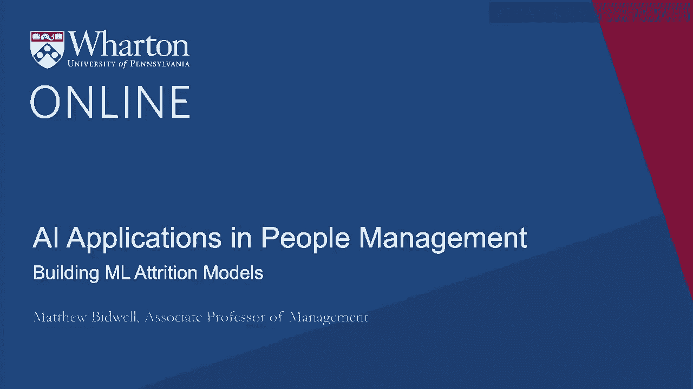
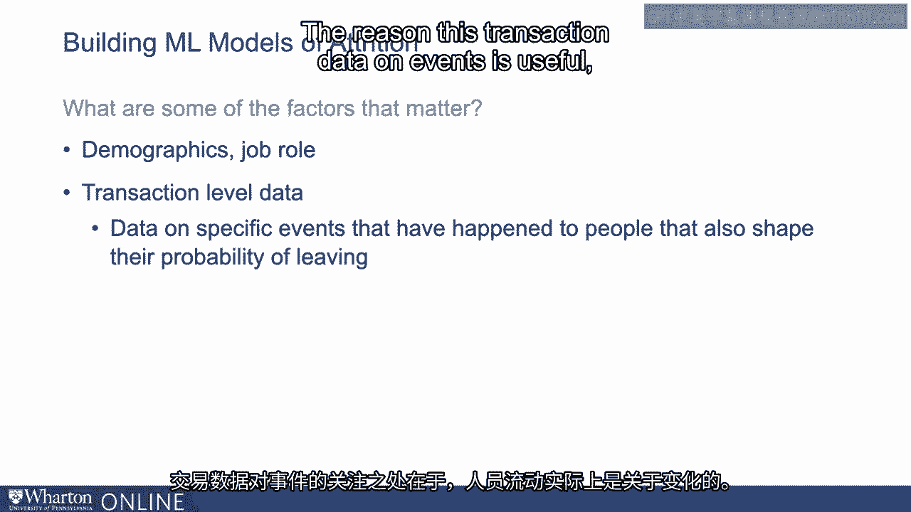
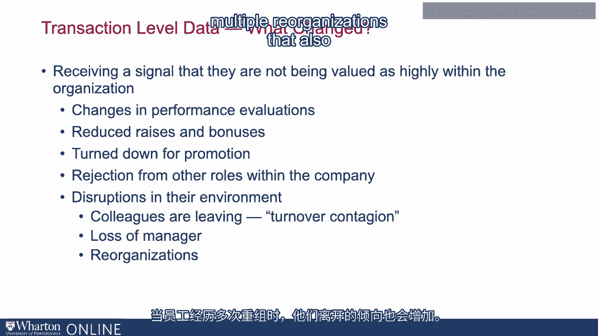
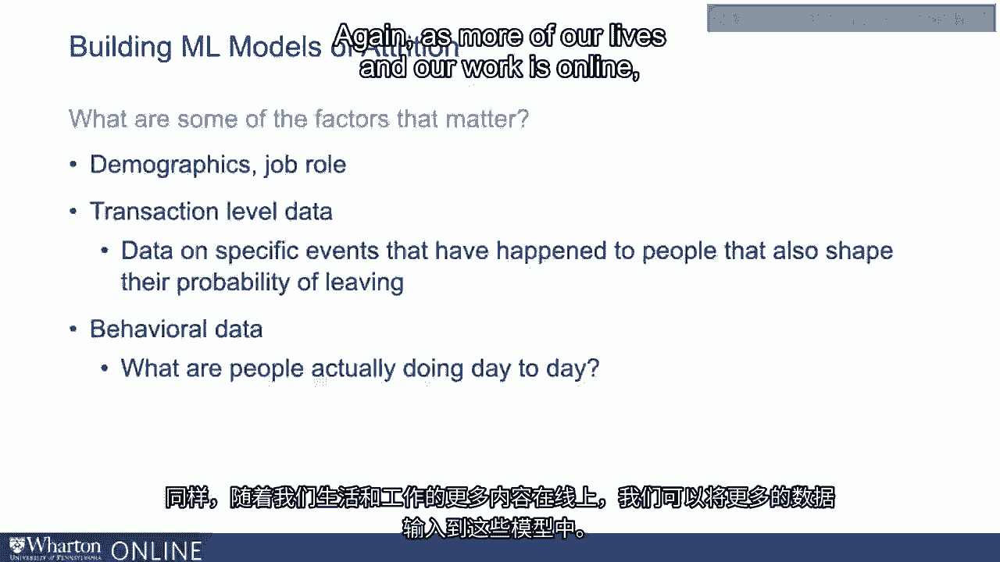
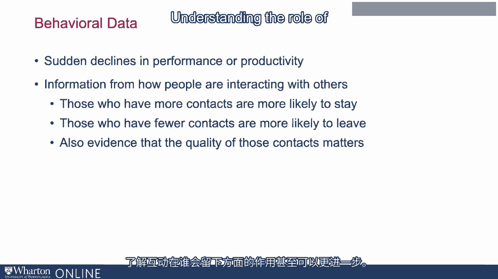
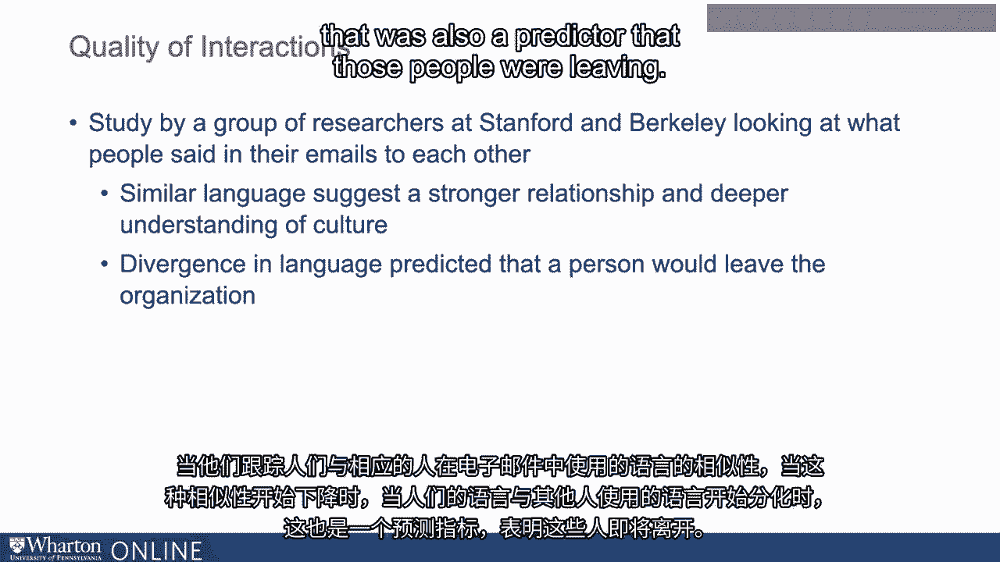
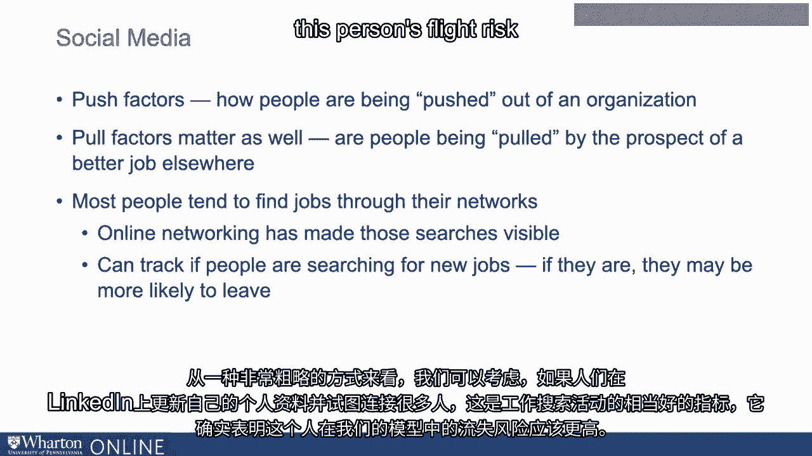

# 沃顿商学院《AI For Business（AI用于商业：AI基础／市场营销+财务／人力／管理）》（中英字幕） - P77：14_构建流失机器学习模型.zh_en - GPT中英字幕课程资源 - BV1Ju4y157dK

 When we look at these machine learning models， a lot of the clever stuff is actually not the models themselves。

 It's figuring out what kind of data to put into them。

 And I think changes in the way that we work and particularly changes in the way that so much of what we do is online。

 Because there's now more and more data that goes into these that can enable us to get better and better estimates of who's going to leave。

 So what are some of these factors that matter？ We're going to try and build a machine learning model to predict who's going to stay and who's going to leave。

 What are some of the pieces of information that we might put into it？ So obviously as I mentioned。

 there's some information around demographics， the kind of job role that people are in。

 that is very useful for understanding who's likely to leave and who's likely to stay。

 The other thing that I think can be very useful is transaction level data。

 They try on specific events that have happened to people that also shape their probability of leaving。

 The reason this kind of transaction data data on events is useful is that turnovers really about change。

 So if you think about why people leave organizations， in a sense the answer is obvious。

 We usually leave because we think the job we're in is worse than the alternatives for us。

 Baron also made me just have to figure out how bad the job is。

 The thing that's interesting about it though is we leave because the job's worse than the alternatives。

 but we also took that job。 So the fact that we previously took that job。

 that point it must have been better than the alternatives。 So we want to ask ourselves what changed？

 What has changed for somebody so that now they think their job's worse than the alternatives。

 but previously they thought it was better。 And we can use a lot of HR data on how people are being managed to give us insight into that。

 So what might have changed？ One thing that can change for people that might make them more likely to leave is receiving a signal。

 that they're not really being valued as highly within the organization that they thought they were。

 and therefore their prospects in the future are not so strong。

 So what might some of those signals look like？ So they might have changes in their performance evaluation。

 So it might be in my performance， valuations are doing okay。 Now I'm getting lower valuations。

 The evaluations go down。 People see they're not a good fit。 They're more likely to leave。

 If I'm not getting raises， not getting bonuses， or my bonuses and raises alone。

 that again is a pretty bad sign for me。 I'm doing less well at this organization than I might have expected。

 and so probably I should look to leave。 So not getting raises is one thing that's often a red flag for people being expected to leave。

 Another big one is being turned out for promotion。

 People go out for promotion and they don't get it。 They're much more likely to leave。 Indeed。

 we find more broadly that when people apply to other roles within the organization。

 often I think you see in a lot of organizations you can apply to jobs internally。

 If people apply to those jobs and get rejected， again they're more likely to leave。

 It could be written to that maybe that's partly explicitly because it's a rejection。

 Sometimes it could be because the fact they're applying to jobs inside the organization。

 is a good sign they're ready to leave their job， and if they can't move to another job inside the organization。

 they're going to move to one outside。 Either way， if we can incorporate that information into our models。

 whether or not they're applying to other jobs， again we have better evidence of their flight risk。

 Another piece of information about change that can predict turnover。

 is how their environment's changing。 So we know people more likely to leave if their colleagues are leaving。

 often described as turnover contagion。 They have all the trouble of learning to work with new colleagues。

 Maybe those colleagues were friends， it's not as much fun coming into work anymore。

 It may also just be that when those people leave it， it gives them a sense of， "Hey。

 there are possibilities outside this organization。"， Maybe I should be doing more with my life。

 So when we see their colleagues leaving， they're at high risk。 Certainly when their manager leaves。

 particularly if it was a good manager， their manager leaves， that can be a big disruption。

 can lead to turnover。 More generally， reorganizations， other organizations of fact。

 when employees are subject to multiple reorganizations。

 that also raises their propensity to leave。 And so we can look through all of the data that we're acquiring in our HR system。

 and look at all of these changes， all of these different flags。

 to start getting input to our attrition models to help us do a better prediction。

 of when people might leave。 A second set of data that we can use to understand。

 whether people might leave is behavioral data。 What are they actually doing day-to-day it？ Again。

 as more and more of our lives and our workers online。

 there's more data we can put into these models。 So a lot of people。

 once they start thinking about leaving， they start to withdraw more generally， right？

 Their performance goes down， and so sudden declines in performance productivity。

 That might suggest that they're a flight risk。 Even more so。

 we can use information about how people are interacting with others。

 to get a sense of whether or not they're likely to stay。

 So we generally expect people who have more ties in the organization。

 or spending more time interacting with others。 Well。

 they're going to get more support from those others， so that makes us an attractive place to be。

 We tend to enjoy our relationships， and so the more kind of socially embedded we are in the organization。

 the more likely we are to stay。 And so generally we find in studies that when we look at interactions with the organization。

 those people who have more contacts and those people are kind of communicating more with them。

 are more likely to stay。 Those people are kind of more peripheral in organizational networks。

 Those are the people who are more likely to leave。 We even see that the quality of contacts matter。

 So for example， the people who stay are not only the people who have more contacts。

 but also connected to those people who themselves have more contact and are high status。

 So there's a lot of interesting evidence that tracking the communication networks that people are part of。

 can give us further information we can put into these kind of attrition models。

 to get a sense of who's likely to stay and who's likely to leave。

 Understanding the role of interactions in who stays can even go further。

 There's a nice study by a group of researchers at Stanford and Berkeley。

 that looked at what people said in the emails they sent to one another。

 So their theory was that the extent to which our language and an email with somebody else mirrors their language。

 is a good indicator of the extent to which we're kind of making an effort to adapt to each other。

 making an effort more broadly to adapt to the culture。

 So when people use similar language to one another， it suggests they're really trying to fit in。

 When people don't use similar language， it may suggest that they're withdrawing。

 And they found evidence for this。 So when they track kind of the similarity of the language people using in their emails with the people they're corresponding to。

 when that similarity started to go down， when people kind of diverging to the language other people using。

 that was also a predictor that those people were leaving。 And so it's interesting。

 it's possible not just looking at who people talk to。

 but even looking at the kind of language they use can also potentially be an input to a model to try and build an even more accurate。

 understanding of who stays and who leaves。 I'm not even done yet。

 There are other things that we can look at。 Some of the most interesting comes from social media。

 So there have been some startups such as High Q Labs and Clara Analytics that for a number of years have been trying to build businesses。

 around the idea that people's social media profiles can tell you a lot about where they're going to leave and inform these flight risk models。

 I actually think there's a nice logic behind these ideas。

 All of the things that I've been talking about before。

 really being different indicators of how much people are attached to the organization in their job。

 We've got to think about these as push factors， how much， you know。

 they're being pushed out by the organization。 We also know that when it comes to turnover。

 pull factors matter as well。 So you know， how much am I likely to get a good job elsewhere？

 You know， those jobs matter whether or not I leave。 You know。

 we also know that most people tend to find jobs through their networks。

 We find jobs through people we know and online networking has made those searches visible。

 And so by looking at people's social media activity。

 one thing we can really track is how much are they actually searching for new jobs and if they're searching for new jobs。

 clearly they're more likely to leave。 In a very crude way， one thing we can think about it。

 if people are updating their profile in LinkedIn and trying to connect for a lot of people。

 that's a pretty good indicator of job search activity。

 And it does suggest this person's flight risk should be that much higher in our model。

 [BLANK_AUDIO]。

