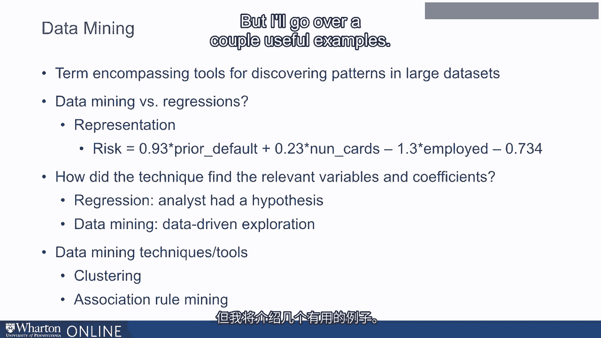
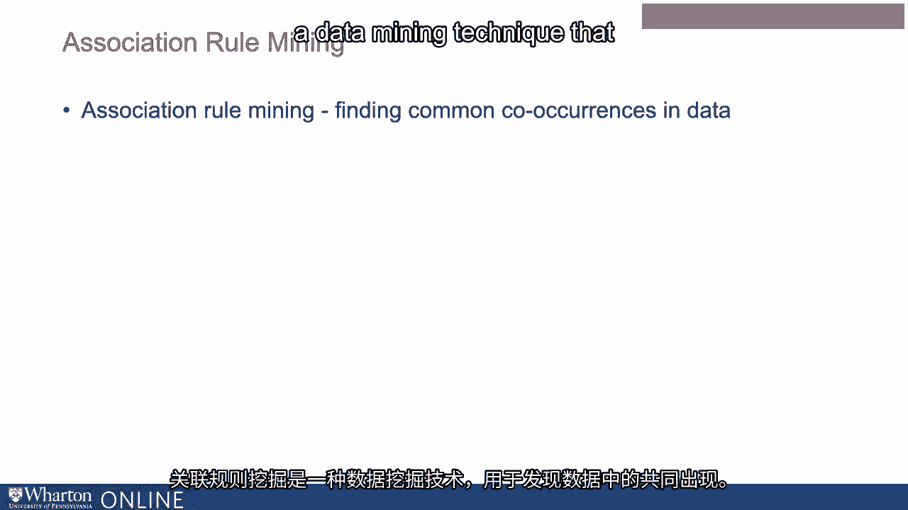
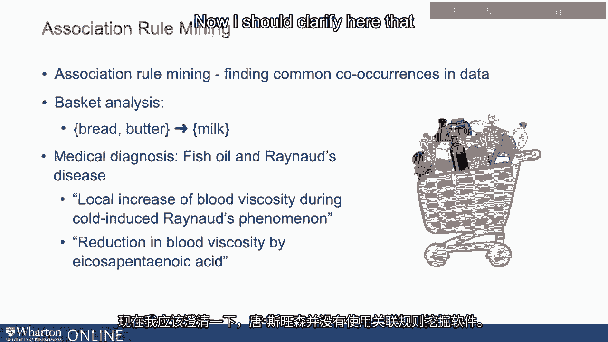
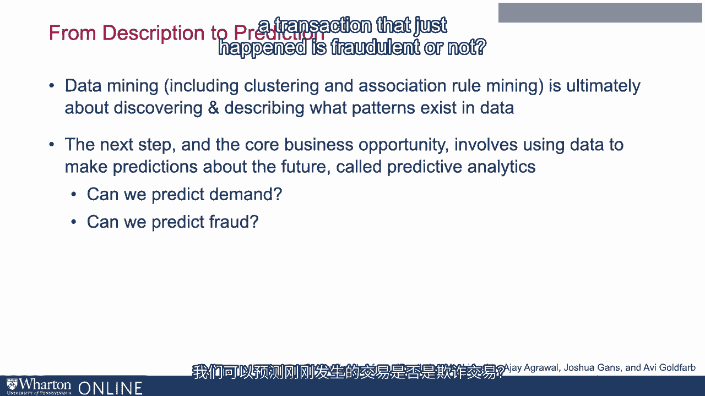
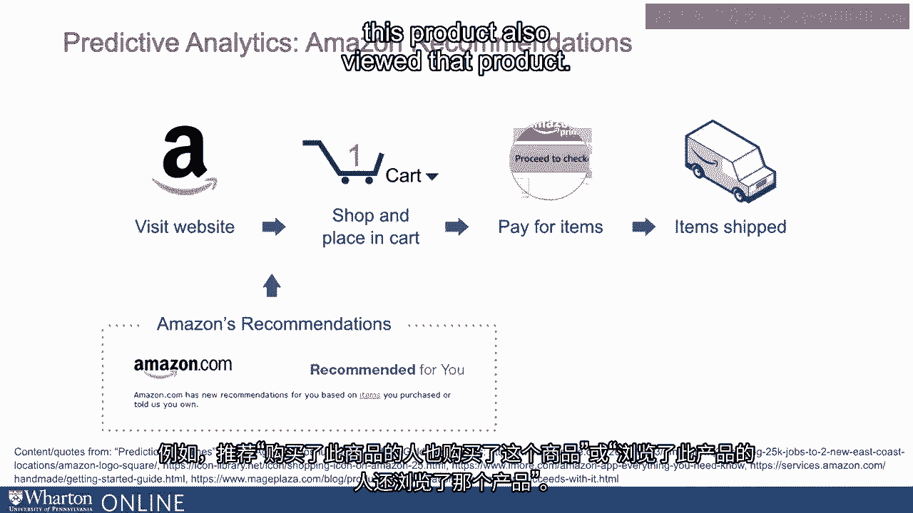
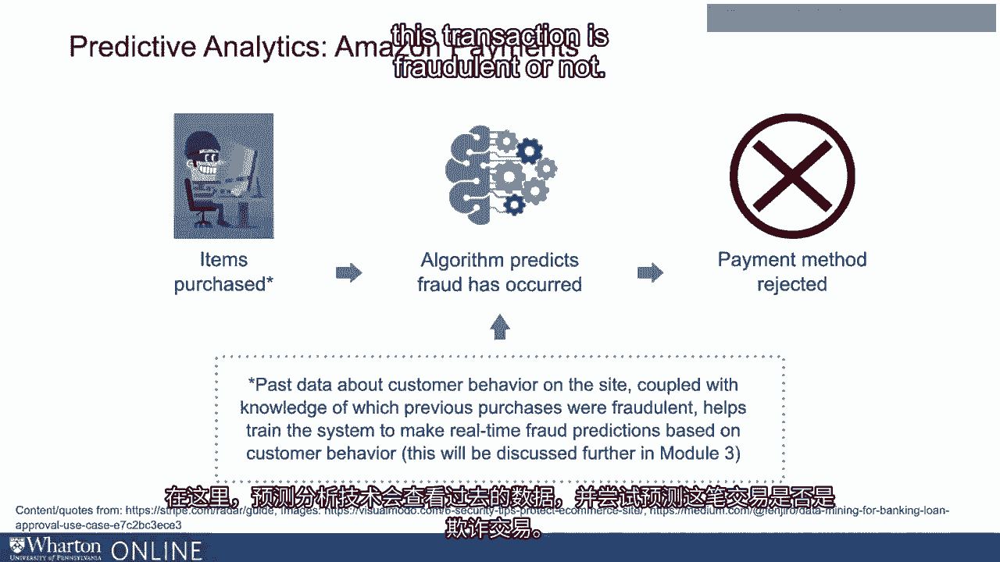

# 沃顿商学院《AI For Business（AI用于商业：AI基础／市场营销+财务／人力／管理）》（中英字幕） - P7：6_从大数据中提取情报的数据分析.zh_en - GPT中英字幕课程资源 - BV1Ju4y157dK

 In this lecture， we are going to talk about data analysis。 In particular， we will begin。

 by discussing data mining。 Now data mining is a broad term that refers to tools for discovering。

 patterns in large datasets。 To understand what exactly is data mining， it is useful。

 to contrast data mining from something many of you understand， which is simple statistical。

 regressions。 Now， when we are conducting regressions， we might start off with a hypothesis。

 For example， we are trying to understand what are the factors that predict whether a customer。

 might default and not pay their credit card dues。 So we might come up with a hypothesis。

 that the risk of default depends on a number of factors such as whether they have defaulted。

 in the past。 That is， we have a hypothesis that people who have defaulted previously are。

 likely to default again。 We might also have a hypothesis that people who have a large。

 number of credit cards are likely to default because they are perhaps struggling to manage。

 their finances。 Lastly， we might have a hypothesis that people who are employed might be less。

 likely to default。 Now， the goal of the regression might be to test these hypotheses。 So we might。

 run a regression based on past data where we test what is the risk of a person defaulting。

 and whether it depends on these factors， meaning prior default number of credit cards and whether。

 they are employed or not。 The regression tells us whether these factors matter or not。 And。

 it also tells us how much it matters。 So on the slide， you see that whether a person。

 defaulted in the past or not has an impact on whether they default again in the future。

 and the regression coefficient 0。93 tells us how important it is。 Now， notice that all。

 these important variables like number of credit cards， whether they are employed or not。

 whether they have defaulted in the past or not。 These came from a hypothesis the analyst， had。

 That is at the heart of traditional data analysis。 That is at the heart of regression。

 testing as well。 Data mining in contrast is more about data driven exploration。 So it。

 may not start with a hypothesis as I previously mentioned。 There are a number of different。

 techniques that are part of data mining。 And in fact， data mining is a catch all term。

 for a number of these techniques。 I will not go over all of the techniques that are part。

 of data mining because really there are a very large set of such techniques。 But I will。

 go over a couple useful examples。 The first one is clustering。 Clustering is a data mining。

 technique that is used to group our data。 And so essentially clustering will break up。

 our data into a bunch of smaller groups or clusters such that data points within a cluster。

 are similar to each other and data points in different clusters are different from each， other。

 A classic application of clustering might be in determining customer segments， in our data。

 The old way of doing customer segmentation might be from your gut。 A marketing manager。

 might say based on their experience that we have three kinds of customer segments。 And。

 they might describe these customer segments in terms of some customer demographics。 Like。

 they might say one of those customer segments might be soccer moms in families of four or。

 five people who live in suburban places。 And that might be how they might articulate what。

 one of the customer segments is like。 In contrast， when you use clustering， we're trying to figure。

 out the customers and the customer segments from a data driven manner without these hypotheses。

 And clustering might either validate the gut of the manager and might indicate and show。

 that the purchasing patterns of suburban soccer moms are different from the purchase patterns。

 of other customers。 Or it might suggest that the differences are not that important and。

 maybe there's a different way we should be thinking about customer segments。 Another。

 data mining tool is association rule mining。 Association rule mining is a data mining technique。

 that finds common co occurrences in the data。 For example， we might analyze shopping cart。

 data or purchase patterns of customers at a grocery store。 And we might look at common。

 patterns in there。 And association rule mining software might find a pattern such as people。

 who tend to buy bread and butter in a transaction also tend to buy milk in that same transaction。

 If we find this transaction， we might take action based on it。 For example， a traditional。

 grocery store， meaning a brick and mortar grocery store might decide to stock bread， butter and。

 milk close by。 Or an online grocery store might decide that if a customer has already added。

 bread and butter to their shopping cart， then it's going to make a recommendation to the。

 customer to also add milk。 There are many applications of association rule mining techniques。

 in business data in order to find patterns in those data。 Another example might be applications。

 in healthcare。 One example that comes to my mind is an analysis of Reynolds disease that。

 was done by a computer scientist or information scientist by the name of Don Swanson。 Don Swanson。

 was interested in studying Reynolds disease， which is a syndrome that affects the musculoskeletal。

 system。 He was in particular interested in identifying novel treatments for Reynolds disease。

 because at that time there were not very many known treatments for Reynolds disease or Reynolds。

 syndrome。 In order to answer that， Don Swanson looked at a number of research papers on Reynolds。

 disease and found what kinds of concepts are associated with Reynolds disease。 In other， words。

 what are the common co-occurrences with the term Reynolds disease？ He found that blood。

 viscosity is a term that often co-occurs with a discussion of Reynolds disease。 He also。

 found that musculoskeletal issues are often discussed in articles that talk about Reynolds， disease。

 For example， he found that articles that talk about Reynolds phenomenon or Reynolds。

 syndrome talk about an increase of blood viscosity during Reynolds syndrome。 Next， he asked what。

 kinds of other concepts are commonly co-occurring with ideas such as blood viscosity and musculoskeletal。

 weakness。 He found one concept which is EPA or icosopentanoic acid， which was commonly discussed。

 along with blood viscosity， along with musculoskeletal weakness and along with a number of ideas that。

 are associated with Reynolds disease。 For example。

 he found phrases such as EPA or icosopentanoic acid， helps reduce blood viscosity。 In contrast。

 Reynolds disease increases blood viscosity。 EPA is also associated with strengthening the musculoskeletal system and in contrast。

 Reynolds disease is associated with weakening of the musculoskeletal system。 Based on this。

 Don Swanson came up with the hypotheses that EPA， which is found commonly in， fish oil。

 can help treat Reynolds disease。 And indeed， later clinical trials showed that fish oil。

 is an effective treatment for Reynolds disease。 Now， I should clarify here that Don Swanson did。

 not use association rule mining software。 Instead， he used the same idea and did it manually。

 But in his later research， he talked about how his scientific process could perhaps be automated。

 using tools that are finding common co-occurrences in data。

 This is what is at the heart of association， rule mining software。 Now。

 data mining techniques such as clustering and association rule mining。

 ultimately are about finding patterns in data。 The next step beyond just finding patterns。

 is to perhaps make predictions about the future and take action from it。 For example。

 can we predict， demand for our product in the future and figure out production decisions based on that？

 Can we predict whether a transaction that just happened is fraudulent or not？ That is where。

 the domain of predictive analytics comes in。 And let's look at a couple examples of what。

 we can do with predictive analytics。 Let's look at a large retail company such as Amazon。

 A customer might visit the website。 They might actually look and or browse at a few products。

 They might eventually pay for these products and the items are shipped by Amazon。 Now。

 the goal of the retailer is to convince the customer to buy the product。

 Often retailers like Amazon will show recommendations to the consumer。 For example。

 recommendations such as people who bought this also bought this or people who viewed this product。

 also viewed that product。 At the heart of these recommendations is an attempt to try and figure。

 out what kinds of products might this customer be interested in。 That ultimately is hoping to。

 convince the customer to buy a product。 That's an example of a predictive analytics application。

 that is trying to predict what kinds of product a customer might be interested in。

 Another example might be that when a customer is ready to buy the product， they might enter their。

 credit card information and hit purchase now or buy now。 At this point， algorithms at the。

 retailer's website have to figure out whether this is a legitimate transaction or not。

 In particular， whether the credit card is a legitimate credit card that is owned by this customer who is placing。

 the order or is it likely that this is stolen。 Here， predictive analytics techniques look at past。

 data and try to predict whether this transaction is fraudulent or not。 Ultimately， this is just one。

 example of predictive analytics in retail。 Indeed， there are many applications of these approaches。

 In the next module， we will look at these predictive analytics techniques。 In particular。

 we'll look at machine learning as a tool to make predictions that are managed really actionable。

 [BLANK_AUDIO]。