#  P38：4_向上游移动客户体验.zh_en - GPT中英字幕课程资源 - BV1Ju4y157dK

在这个模块中，我们将讨论一些令人兴奋的内容。

这是关于公司如何在客户旅程中向上游移动。

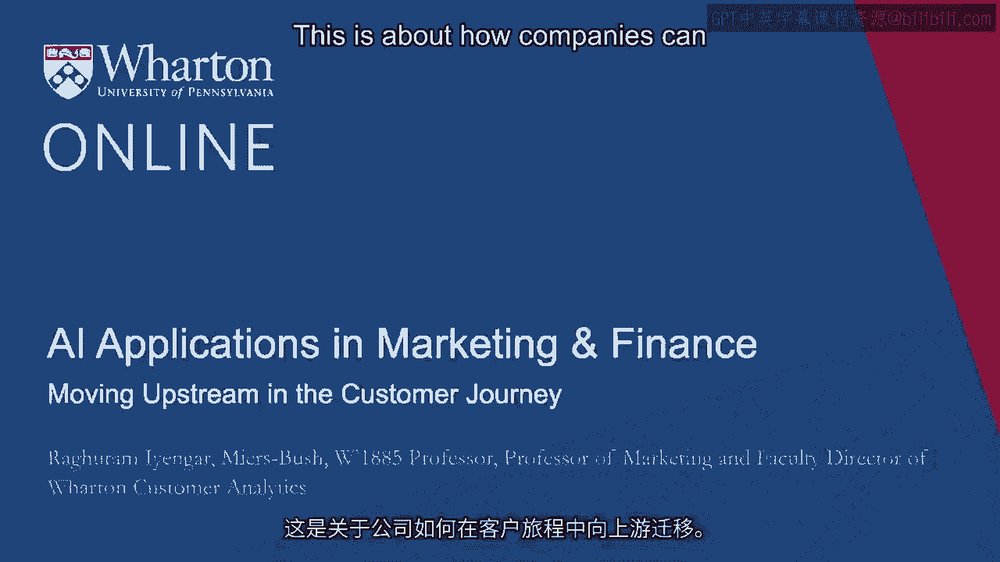

现在我们谈到了预测客户旅程，使其更短。

让我们尝试对比一下。首先以一个例子开始。

当你开始思考搜索时，或许谷歌是你首先想到的公司。

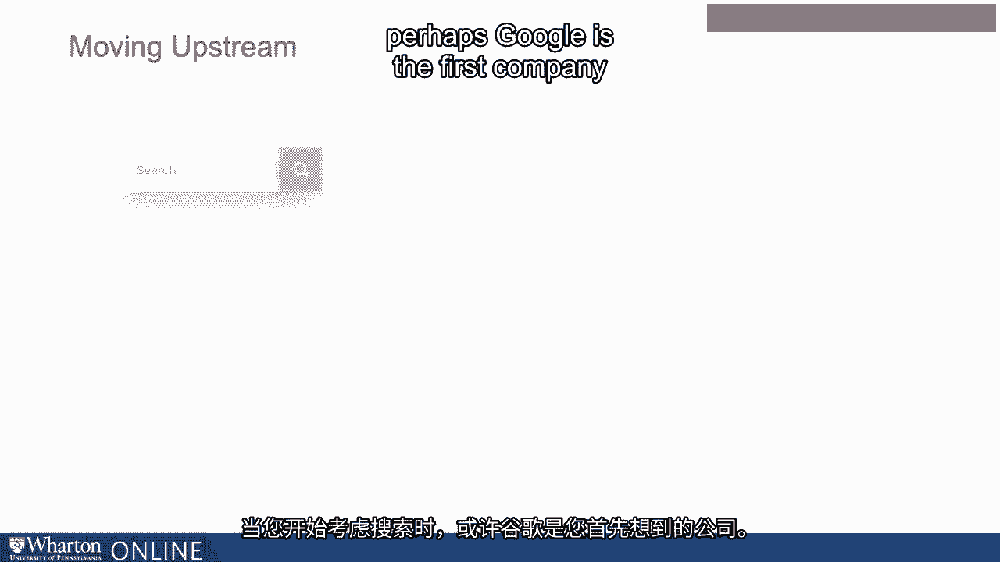

但是看看这些数字。它们暗示的是，当人们在寻找购买的产品时。

事实上，如果有什么的话，亚马逊的能力远超谷歌。对于会员用户。

亚马逊和谷歌之间的差异更大。这表明了什么？

这表明，如果你是亚马逊的会员，当你访问亚马逊网站时。

亚马逊所能做的，不仅仅是推荐产品给你。

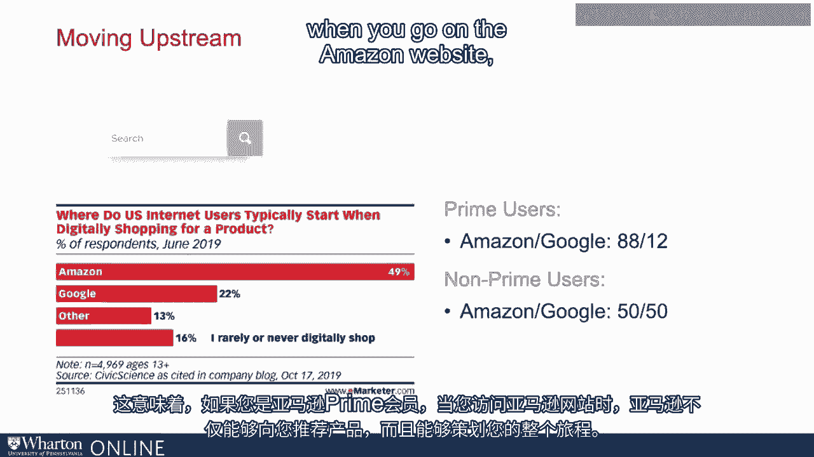

当然，他们可以做到这一点。但他们能够做的是策划你整个旅程。这是。

如果你考虑购买智能手机，你会在亚马逊上查看你的过去购买记录。

查看他们对你所知道的所有事情，他们可能不会。

只是能够推荐你应该购买的智能手机，但他们可能能够。

也就是说，查看你整个客户旅程，看看你应该如何购买。

所以这就是在客户旅程中向上游移动的理念。

那么让我们重新审视亚马逊Alexa和谷歌Home的例子。

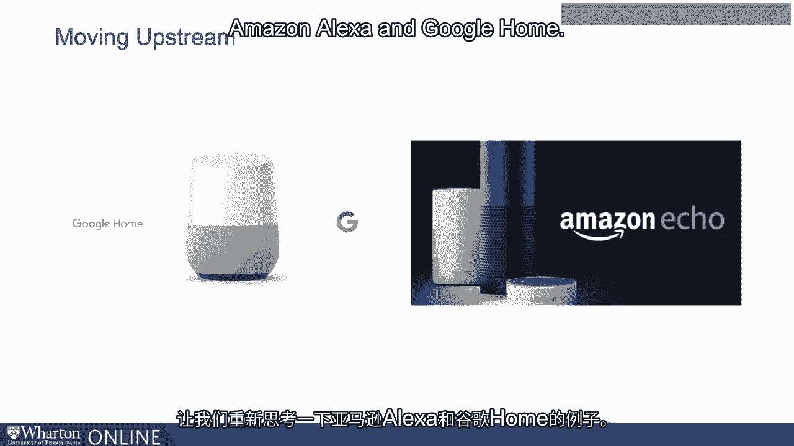

所以当我谈论这个例子时，我们谈到了谷歌Home和亚马逊Alexa。

缩短客户旅程。让我们进一步探讨一下这个例子，看看他们如何拥有客户旅程。

亚马逊，例如，当然也拥有Whole Foods。

那么让我们想象一个在亚马逊Alexa上的应用，在某种程度上你可以制作。

购物清单。你当然可以制作购物清单并将其保存在那里。

这很好。但是你在某种程度上也可以决定从Whole下订单。

Whole Foods。那么这在做什么呢？这不仅仅是缩短客户旅程的方式。

这完全是在策划整个旅程，从你可能开始使用的认知阶段。

使用亚马逊Alexa来制作你的购物清单。然后你可以直接从Alexa下单。

它还会为你完成购买。同样，对于谷歌Home也是如此。

你可以开始搜索附近的餐厅，但你也可以在上面预订。

所以这是我想要传达的重点，结合许多其他例子，作为一家公司。

你可以开始思考的不仅仅是缩短客户旅程或预测。

客户旅程。你可以开始思考我所称之为拥有客户旅程的概念。

我想引起您注意的就是超级应用。比如说。

您可能在手机上使用Facebook应用时会感到舒适。

也许是Twitter应用或Spotify应用。当然这些都是独立的应用。

这意味着您在Twitter上浏览，看看Twitter上发生了什么。

您回到外面，去Facebook等，您正在访问不同的应用。

但是在许多其他国家也发生了很多事情，许多应用程序。

被称为超级应用，这在某种意义上已成为您的起始页面。

每个人都可以获得各种不同的东西。例如，在韩国是K-Talk。

在中国是VChat等，这些应用将做什么？

它们已经成为大型门户。

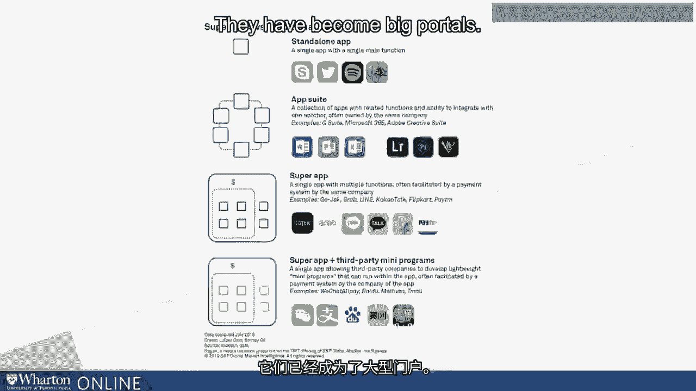

例如，在中国，您可以使用VChat像支付给同龄人一样付款。

在美国，这里使用Venmo。您当然可以在这里拥有社交网络环境。

您可以进行购买，您可以与其他企业交流。

基本上它已成为起始页面。您可以想象，使用VChat或K-Talk时客户体验的不同。

与使用Facebook或Twitter相比，为什么？因为在某种意义上，VChat。

K-Talk和在印度的PTM，它们想要做什么？

它们在某种意义上正成为您客户旅程的策展人。

所以这就是我所说的向上走。您在某种意义上成为客户开始他们旅程的地方。

让我们从娱乐的角度再举一个例子。

而且在美国，您有许多不同的流媒体平台。Roku是其中之一。

Apple TV等设备。

现在当您开始思考这个问题时，为什么我说它们在某种意义上。

理清如何向上走？对于那些使用过Roku的人来说，平台的设置是。

您会有不同的页面，比如您有Netflix、Amazon Prime等许多其他应用。

那么，您最终会做什么？您会考虑想观看的内容。

您访问Netflix的页面，然后进入Netflix流媒体应用。寻找内容等。

例如，Apple TV与Amazon Fire完全不同。

您最终会查看想搜索的内容，他们可能会展示所有。

您可以在不同地方找到它。所以看看使用Roku时的不同方式。

Apple TV、Amazon、Firestick，您以某种方式获得了非常不同的策划体验。

您的客户旅程是不同的。比如说，Roku通过不同的流媒体平台策划这段旅程。

您决定想访问Netflix、Amazon Prime或其他迪士尼+等内容。

而在Apple TV上，您是从想观看的内容开始思考的。

注意你可以采取的两种不同方式。

当然，这两种不同的方式对客户的旅程有不同的影响。

让我们考虑一下医疗保健。

当然，医疗保健行业是一个非常分散的行业。医疗保健中发生了很多事情。

所以我想引起你对“谁拥有数据”的关注，为什么我要提这个。

与我们之前讨论的那些公司相同。

我在这页上的例子是关于苹果、亚马逊和谷歌的。

我们之前谈到的那些公司现在正逐渐进入医疗保健。

对于苹果来说，很多是我称之为移动技术的内容。全是关于可穿戴设备。

你佩戴的苹果手表，你拥有的手机，当然变得更加。

更加兼容你可能想进行的各种测量。

所以，苹果手表可以查看你的心率等等。

正如苹果的口号所说，科技让医疗保健更加个性化。

同样，亚马逊也进入了医疗保健领域。

例如，谷歌正在关注许多其他公司，例如它们正在探索的。

进行大量早期测试和研究等。这里的大问题是你是否会选择苹果的路径。

Google路线、亚马逊，无论情况如何，他才是拥有数据的人。

数据在哪里以及会发生什么样的应用将会是重点。

可以基于这些数据构建。所以再次回到苹果的例子。

通过查看他们的手机、手表和应用程序，显然可以做到。

他们正在努力在某种意义上使医疗保健更加个性化。

显然，如果你购买了苹果生态系统的产品，你可能在某种程度上被锁定。

这个生态系统涉及他们拥有的各种设施。

所以在医疗环境中，思考谁拥有数据变得非常关键。

现在我们来举一个我称之为上游和下游的例子。这里的想法是什么？

这里的想法是，我们举了很多例子，展示公司如何向上游发展。

这是思考意识，思考如何缩短旅程，拥有那个。

旅程等等。但当然，一旦有人购买，旅程并不会停止。

旅程继续，为什么？因为还有很多其他的购买选择。

例如，卡斯珀公司在美国提供的床垫价格更低。

它想成为他们所称的“睡眠的耐克”。这里的想法是什么？

它们在某种意义上想拥有那个特定的“睡眠”垂直领域。

所以他们想考虑提供哪些其他设施，能提供哪些其他产品。

提供的产品超出了床垫。所以，Nectar另一家竞争者想扩展他们的产品线。

所以这里的想法是，当您开始思考客户旅程时，您不仅仅是。

想想客户旅程的最初阶段，那就是向上游去。

您还可以开始思考当特定购买完成后会发生什么。

还有什么其他东西可以提供给客户？让我们再举一个例子。

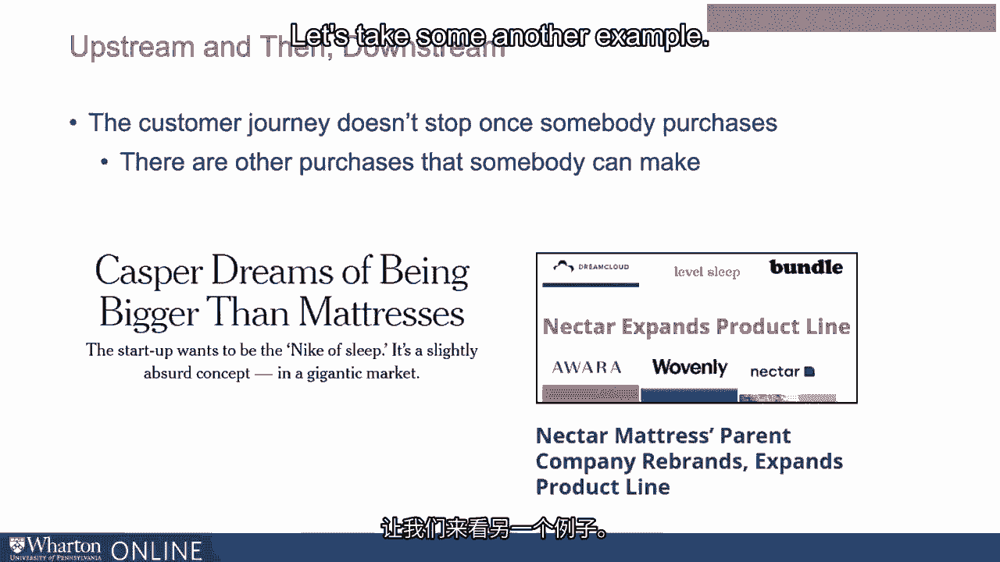

Airbnb。 当然，Airbnb是一项非常受欢迎的服务，从某种意义上说，您可以继续进行。

您想度假时，可以选择租用某人家的房间。

您可以租用整栋房子等等。但Airbnb也意识到，当人们度假时，他们不仅仅是去。

在某人的公寓或房子里住宿。他们想做很多其他活动。

因此，如果您注意到Brian Chesky，他是Airbnb的联合创始人之一，他基本上说对于。

在酒店消费的每一美元，您在那个城市的消费是三美元。您在那里的用餐。

娱乐，您全天所做的事情。他们基本上希望将此视为一个长期机会。

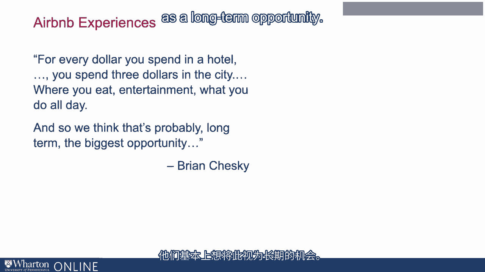

所以有一个叫做Airbnb体验的东西。因此，如果您访问Airbnb，您可以看到，例如，假设您想去费城。

或者在纽约，您可以看看在那个城市还有什么其他事情可做。

旅行。所以这就是我谈到向上游和向下游去的地方，这就是拥有。

客户旅程不仅仅是从初始选择的角度出发，还有拥有。

整个体验。

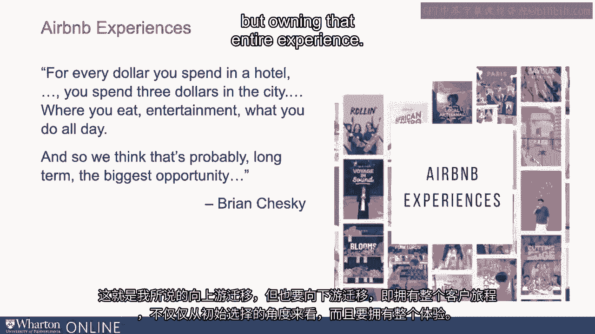

让我们再举一个例子。这次从B2B的角度来看，企业与企业之间的视角。

Shopify当然是一家非常大的公司，它帮助中小型企业进入网络。

这就是他们的起点。在某种意义上，您可以想象当地的小商店想要上线。

互联网他们是如何搭建的。Shopify使这变得简单。那么他们是从哪里开始的呢？

他们基本上是通过提供服务开始的，在某种意义上，您知道放置。

您可以非常轻松地在网上拥有自己的网站，设置所有后端等等。

因此，作为公司老板，您并不需要非常懂技术。Shopify会处理这一切。

然后他们基本上说，一旦您在某种意义上让人们上网，进入网站。

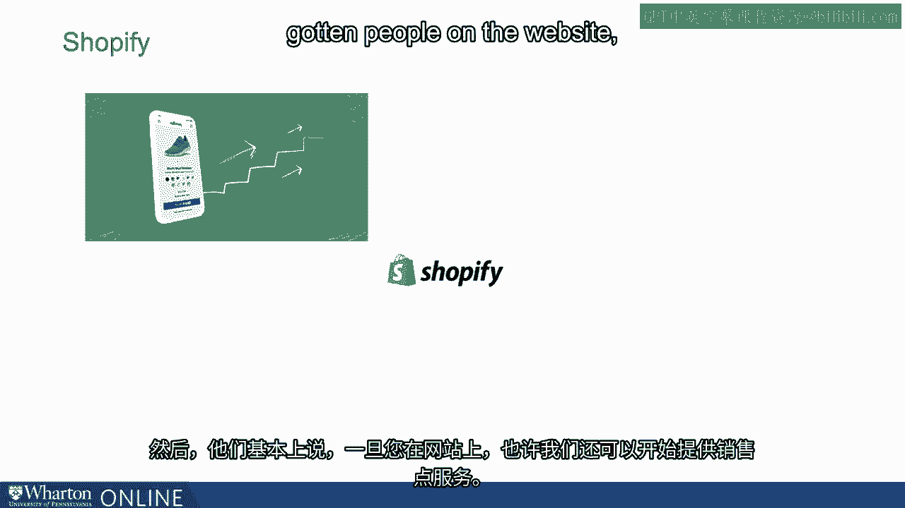

好吧，也许我们也可以开始提供销售点服务。

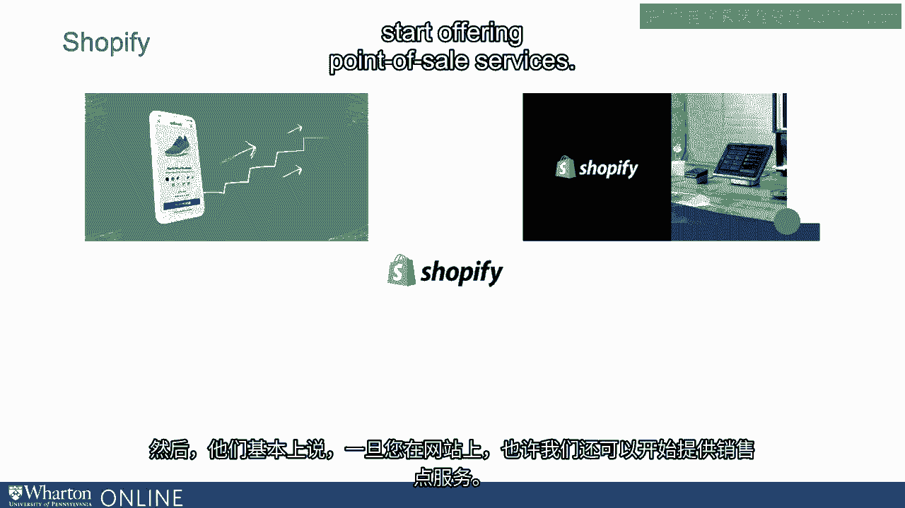

因此，Shopify开始在店内提供销售点服务。

所以他们首先是在线的，然后变成了离线的。

所以在某种意义上，他们开始与客户的其他业务整合得更多。

然后他们说好的，非常棒。现在我们有了在线和离线，我们可以开始考虑一个重要的需求。

为公司的服务，即库存。

然后他们开始进入Shopify履行网络。

以这种方式，他们实际上已成为亚马逊的竞争对手，但他们提供 Shopify 履行服务。

网络服务于他们的小型和中型企业。

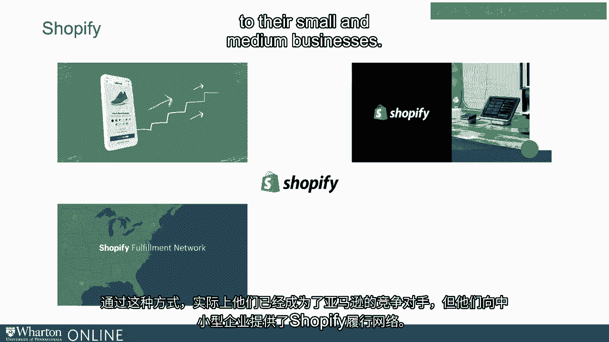

这也很好。当然，随着 Shopify 更加了解客户，你可以想象他们还能做什么。

开始思考？那么，我们应该把钱给哪些客户？

这就是他们获得资金的地方。所以，从 Shopify 和他们客户的视角来看整个旅程。

可以说 Shopify 是从最后开始的。他们开始思考客户如何。

他们的客户是企业，可以在网络上进行操作。

然后他们开始向上游或向下游移动。所以思考资金问题。

思考履行或不同的痛点。

他们客户的其他企业可能拥有的资源。这就是我所说的，仔细思考客户旅程并向上游移动。

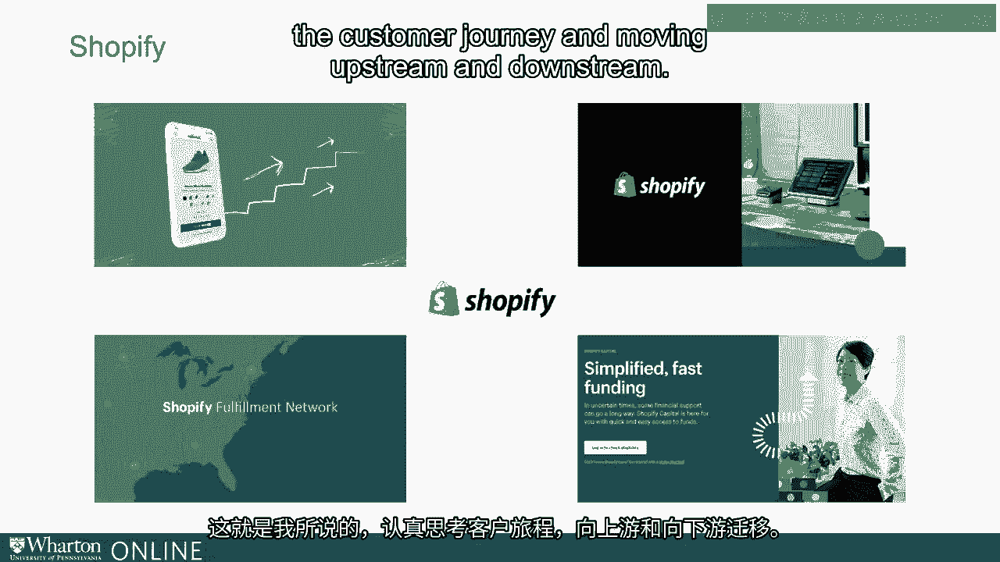

以及下游。所以我在这里看到的是，在我们接触新技术之前，我们开始思考。

AI 应用不应本末倒置。

从“为什么”开始。你的客户需求是什么？你究竟是在解决什么问题？

你如何解决这个问题很重要，但有时从“如何”开始可能会使事情变得复杂。

你会忘记“为什么”。所以首先要认真思考“为什么”，无论你是 B2B 公司。

无论你是 B2C 公司，考虑客户需求是至关重要的。

一旦你考虑到客户需求，就开始思考什么样的技术。

可能会有帮助。是视觉 AI 吗？是语言 AI 吗？还是为什么是 AI？它是什么？

在我看来，这是思考“如何”的下一个方式。

然后你就会在“为什么”和“如何”之间形成良好的协同。

所以，这是我想请你思考的。当你开始考虑如何满足客户需求时，你扮演的角色是什么？

你在其中扮演什么角色？你在客户旅程中扮演着向上游移动的角色吗？

我给你举的例子是关于 Shopify、Roku 的例子，甚至是亚马逊 Prime。

以及 Google Home，你在策划整个旅程。如果你能做到这一点，那就是一个很大的胜利。

当然你也可以先从小处开始。首先思考你能否预测下一个客户旅程。

这就是关于预测。因此，那些是我给你举的关于亚马逊的例子，例如它的预测。

根据你购买的商品，你接下来可能会买什么。

当然，你也可以开始考虑缩短客户旅程。

所以思考你可以发挥的最佳角色，然后开始思考技术。

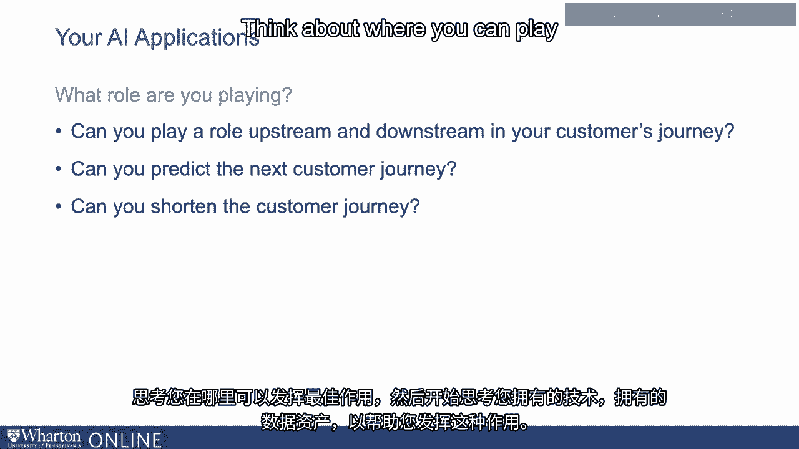

你所拥有的数据资产可以帮助你发挥这一角色。[BLANK_AUDIO]。

