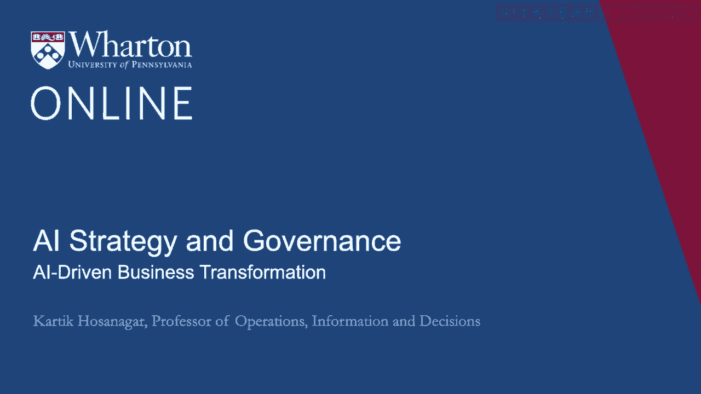
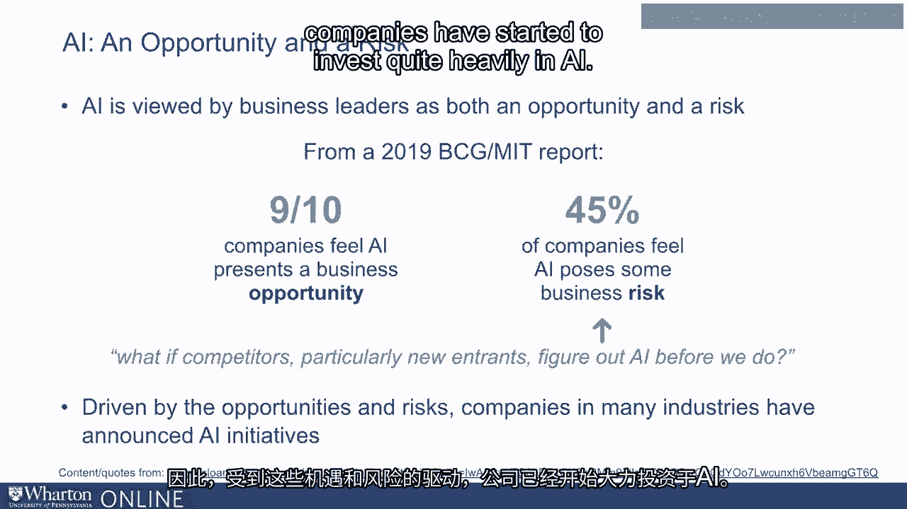
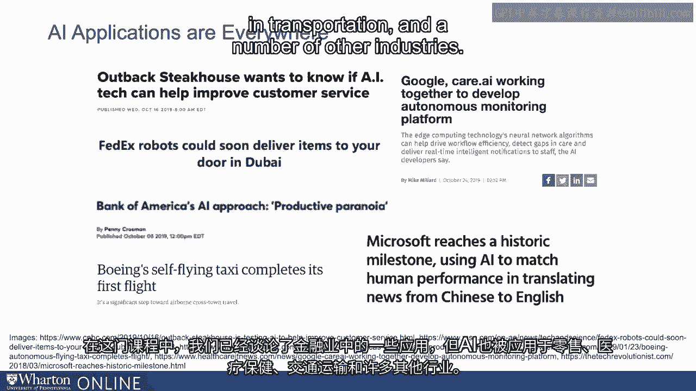
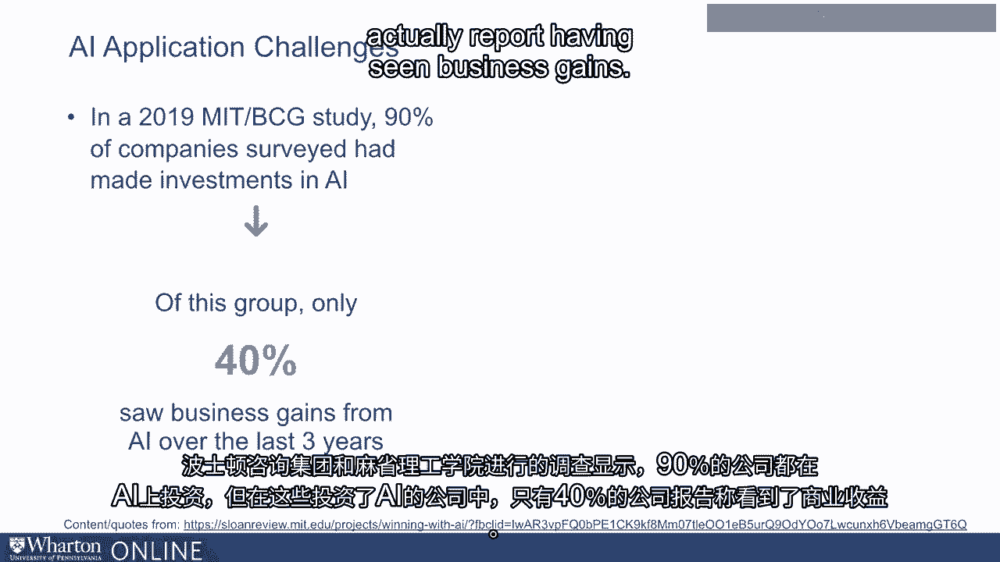
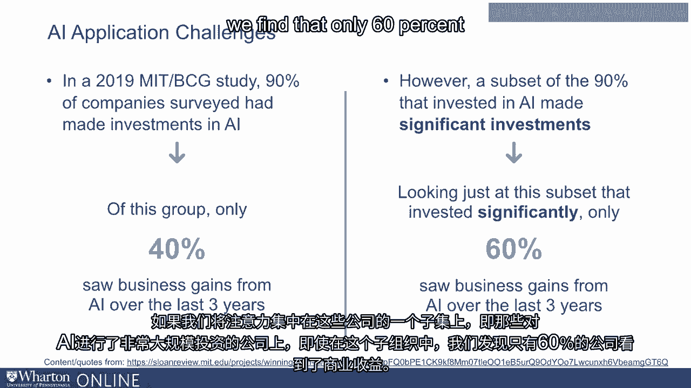
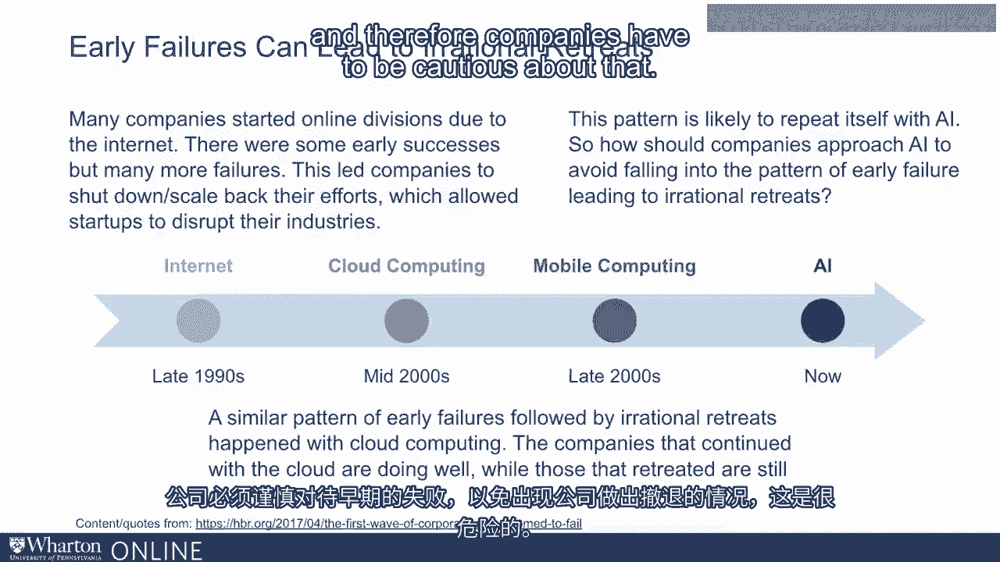

# P102：1_AI驱动的业务转型.zh_en - GPT中英字幕课程资源 - BV1Ju4y157dK

你好，本模块将专注于AI战略和治理。

在本次讲座中，我将专注于AI驱动的业务转型。

我们还将稍微讨论一下AI的机会，以及有哪些。

在AI方面面临的挑战和潜在失败。在本模块后面的讲座中。

我们将探讨战略框架，以确保公司。

可以从他们的AI投资中获得回报。我们还将讨论AI治理框架。

现在商业领袖将AI视为机会和风险。

最近，波士顿咨询集团和NMIT对许多大型公司的高管进行了调查。

报告显示，十分之九的公司认为AI是一个重要的商业机会。

与此同时，45%的公司将AI视为潜在的商业风险。

风险在于竞争对手可能能够使用AI并超越公司。

因此，在这些机会和风险的驱动下，公司开始大量投资。

在AI方面。我们在许多不同的行业中看到许多AI应用。在这门课程中。

我们讨论了一些在金融领域的应用，但AI也正在零售中得到应用。

AI正在医疗、交通等领域得到应用。

许多其他行业。但同时。

我们倾向于注意到早期投资并不总是获得回报。

由BCG和MIT进行的调查报告称，90%的公司已经在AI上进行了一些投资。

但在这些已经在AI上投资的公司中，只有40%的公司实际上。

报告称看到业务收益。

如果我们关注这些公司的一个子集，并仅关注这些公司。

在这些对AI进行了非常重要投资的子群体中，我们发现。

只有60%的人看到了业务收益。

换句话说，早期对AI的投资尚未产生结果。

这引发了一个担忧，即早期的失败可能导致这些组织的非理性撤退。

我们以前见过这种情况。例如，在90年代末。

当互联网开始出现时，许多公司进行了投资。

互联网和创建在线部门，并对这些投资抱有很高的期望。

早期投资没有获得回报。实际上，互联网泡沫破灭，许多公司撤回甚至关闭。

他们的在线部门。这些公司为这些撤退付出了沉重的代价。在2000年代中期。

再次，企业投资于云计算。但有些因为安全或合规等监管问题而撤回。

而那些坚持下来的公司能够创造出一定的商业敏捷性，实际上。

使他们在长期内处于非常有利的位置。而那些实际上撤退的公司仍在努力追赶。

2000年代末，移动计算也发生了类似的事情。我相信人工智能也是如此。

我之前已经论证了为什么人工智能应该被视为一种通用技术。

可以对多个不同的行业产生影响。

因此，早期失败导致公司撤退的类似模式可能是危险的。

因此，公司必须对此保持谨慎。在接下来的几场讲座中。

我将讨论公司可以采取的一些框架。

用于规划他们在人工智能上的投资，并确保这些早期投资能够产生回报。

在中长期来看。[BLANK_AUDIO]。
