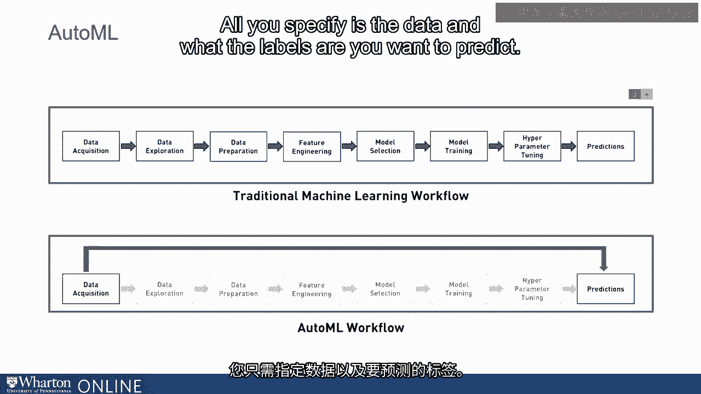
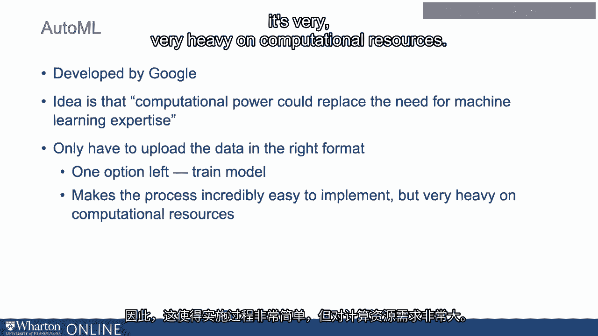
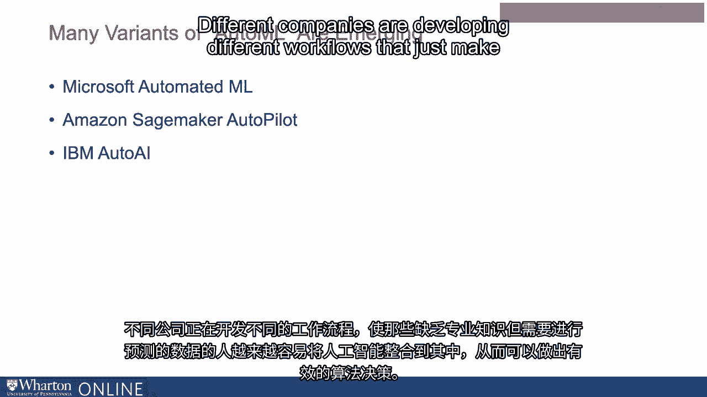
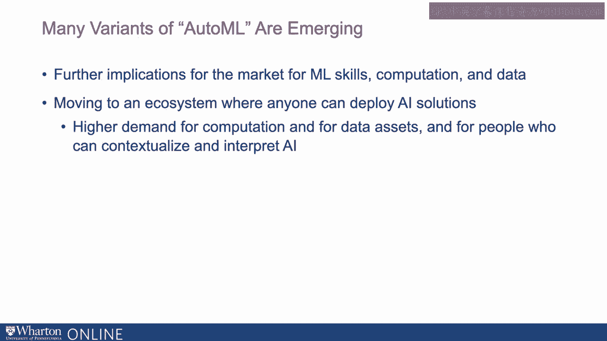

# P109：8_自动机器学习的经济学.zh_en - GPT中英字幕课程资源 - BV1Ju4y157dK

我们一直在讨论数据和计算在机器学习中变得越来越重要。

在这个过程中，软件和技能的重要性可能会稍微降低。

差异化因素。下一个阶段可能会将其提升到更高的层次。

越来越多的工作流程正在被提供，真正允许人们开发机器。

学习应用几乎没有软件或技能专业知识可用。

例如，AutoML 或者说自动化机器学习，基本上是一个将。

我们如何看待机器学习，从数据收集到清理再到标记。

数据准备和特征工程结合在一起，然后运行模型并进行优化的工作流程。

查看预测。AutoML 将该工作流程基本上接管几乎所有步骤。

你需要做的就是获取数据，然后运行它直到得到预测。

AutoML 的工作方式本质上是不断投入计算，直到它。

它可以替代许多不同类型的专业知识。

所以 AutoML 能够对这个问题进行大量计算，从而尝试不同的变体。

直到它找出最佳模型。所以你甚至不需要指定要运行的模型。

它也会找出最佳模型。它只是在这个问题上投入了大量计算。

你只需指定数据以及你想要预测的标签。

而且，AutoML 是 Google 开发的一款产品。

这可以通过 Google Cloud 运行。因此这里的想法是，我们从 Google 的人那里听到的关于 AutoML 的讨论。

这个想法是，他们将能够利用计算能力来替代机器学习的需求。

任何类型的专业知识，只是让运行变得越来越简单。如果你按照工作流程进行。

你只需要以正确的格式上传数据。

到那个时候，实际上只有一个选项。你上传带有训练标签的数据。

只剩下一个选项，那就是训练模型。

因此，它使得这个过程变得极其容易实现，但在计算上却非常非常消耗资源。

资源。

因此，例如，如果我通过 AutoML 运行模型，我已经做过好几次，如果我上传。

我将数据输入，训练模型。然后在几个小时内，我会收到一封包含结果的电子邮件。

所以 Google 基本上会尝试不同的模型，告诉我哪个是最佳的。我会得到结果。

当然，我也会收到账单。所以这是通过他们的云服务运行的。

我正在利用他们的计算来运行这个模型。使得这一切比以往任何时候都更简单。

但它将一些我所需的专业知识成本转移到了后端的计算上。

他们只需将结果发送到电子邮件，并附上云服务的账单。

所使用的技术。因此，实际上这意味着用越来越多的原始计算能力来交换专业知识。

现在，我们谈到了 AutoML，但还有许多不同类型的自动化机器学习。

从不同公司出现的学习。微软称之为自动化机器学习。

亚马逊提到 SageMaker，Autopilot，IBM 则称之为 AutoAI。

这些不同的公司正在开发不同的工作流程，使其变得越来越简单。

对于那些专业知识较少但有强大数据和预测需求的人来说。

以一种能够做出有效算法决策的方式整合 AI。这些当然会有影响。

这只会对市场、机器学习、技能和计算产生进一步的影响。

我们本质上正在朝着一个生态系统发展，任何人都应该能够部署 AI 解决方案。

但对计算和数据资产的需求将会更高。

正如我们接下来将讨论的，也许对于能够上下文化和解释数据的人。

AI 预测。[BLANK_AUDIO]。

