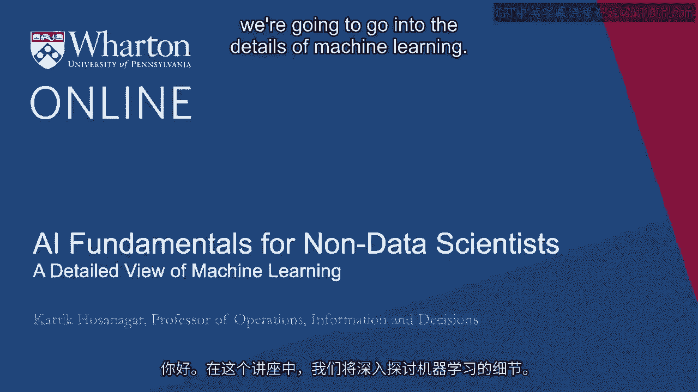
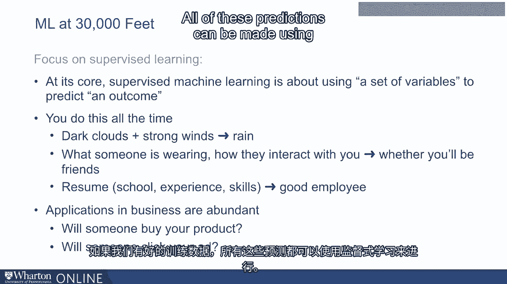
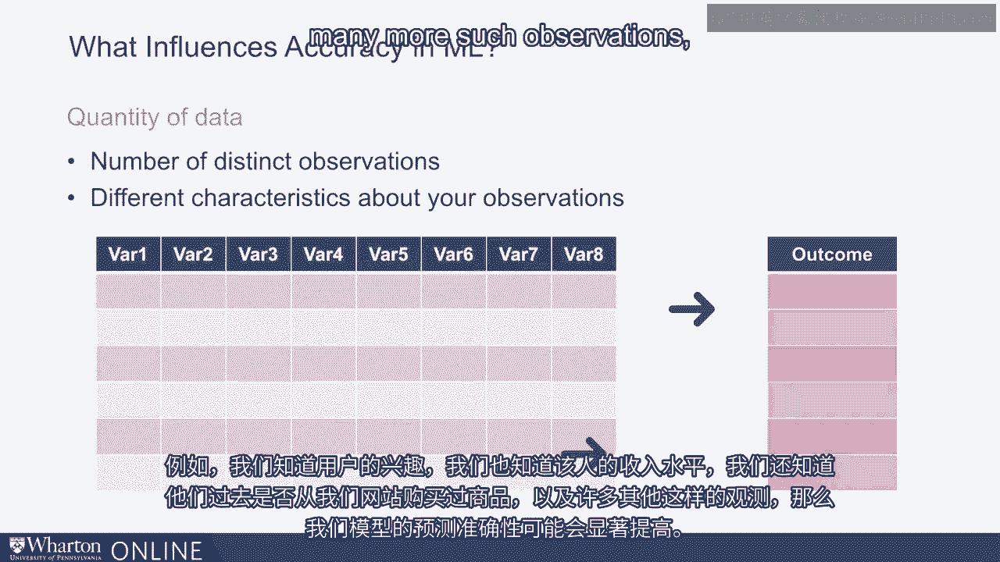
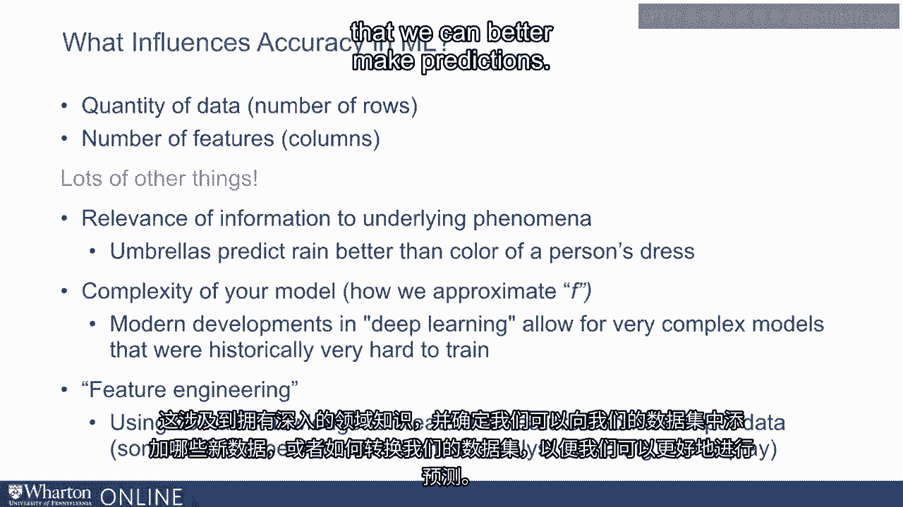

# P11：10_机器学习的详细视图.zh_en - GPT中英字幕课程资源 - BV1Ju4y157dK

你好，在这次讲座中，我们将深入探讨机器学习的细节。

特别是，我会尽量提供机器学习的高层次视角，以及它的驱动因素。机器学习模型的准确性。在这个讨论中。我将专注于监督学习技术。这是有充分理由的。如果我们观察AI的实践，我会说几乎90%甚至更高。90%的实际商业AI应用往往是机器学习。如果你查看机器学习，几乎90%的机器学习实践。通常是监督机器学习。所以在一个非常高层次的讨论中，机器学习。我会将注意力集中在监督学习算法上。正如我之前提到的。

编辑得分，监督机器学习就是处理一组数据。输入变量和预测某个结果变量。现在我们在现实生活中经常这样做。例如。如果你观察到乌云密布和强风，我们可以预测可能会下雨。或者我们可能会看看某人穿着的衣服，或者更好的是，他们如何互动。和我们在一起。我们可能会对我们是否可能成为好朋友做出一些推测或预测。在与他们的工作场所中，我们可能会查看一个人的教育背景。我们可能会查看他们的工作经验和技能，预测他们是否会成功。

在工作中。这些都是我们日常解决的典型预测问题。现在，这些预测有许多商业应用。例如。在商业环境中，我们试图预测某人是否会购买产品。我们试图预测某人是否会点击或添加。如果我们有良好的训练，所有这些预测都可以通过监督学习来实现。

数据。让我们考虑一个例子。假设我们有关于用户访问我们网站的数据。我们可能知道他们过去在我们网站上查看了多少页面。我们可能根据他们的IP地址知道他们的邮政编码。我们可能知道他们是从哪个设备访问我们的页面。我们可能还知道该设备的操作系统。最终。我们试图预测这个人是否会购买产品，或者不会。现在这是一个典型的预测问题。至于我们关于用户的数据。这意味着我们用来做预测的输入数据。

一般将这些输入数据称为我们模型的预测变量或特征。有时仅仅是数据和模型的变量或协变量。有许多不同的名称，但最终我们可以将所有这些变量视为。我们模型的输入。现在给定这些输入，我们也在试图预测某些东西。这是我们模型的输出或结果变量。所以我们可能用字母 X 描述输入变量，我们可能描述结果。用字母 Y 表示变量。现在我们面临的预测问题是，我们试图弄清楚给定输入。X 我们试图预测 Y。也就是说，我们试图弄清楚某个函数 F，它将 X 作为输入并预测。

Y。监督机器学习的整个任务归结为提出一个高准确度的。这个函数 F 的近似，以便我们能够在给定情况下尽可能准确地预测 Y。输入 X。现在准确性的概念内嵌在我刚刚描述的内容中。对于任何预测问题，我们将准确性视为本质上是衡量预测。

预测的真实性或预测与现实的接近程度。比如说，如果我们试图预测一个人是否会购买，如果我们进行。如果有100次预测，其中93次是正确的，我们可能会说这个预测。我们模型的准确性为93%。我们希望这个预测准确性尽可能高，因此自然问题是。

询问是什么驱动模型的预测准确性。驱动机器学习模型准确性的一个因素是数据的数量，意味着。我们作为模型输入的不同观测数量。比如说，如果我们只有过去访问过我们网站的100个客户的数据。我们很难对未来客户做出准确的预测。基于这100个用户的观察，访问我们的网站。另一方面，如果我们有一百万用户的数据，那么我们会有更多的数据，因此显然。更多的观测有助于提高我们模型的准确性。

预测准确性的另一个驱动因素是我们对每个观测的了解有多少。现在在我刚刚描述的例子中，对于每个消费者，我们只知道页面的数量。他们过去的浏览记录，我们知道他们使用的操作系统，我们还恰好知道。它们的位置。但这些数据量可能不足以让我们实际做出预测。

另一方面，如果我们有关于每个用户更多的数据，比如我们知道。用户的兴趣，我们还知道这个人的收入水平，我们还恰好知道是否。他们过去曾在我们网站上购物，以及更多类似的观测。

那么我们模型的预测准确性可能会显著提高。换句话说，似乎驱动模型准确性的两个因素是数量。行的数量我们可以视为数据点的数量，以及列的数量。我们可以将其视为可用特征的数量或每行中的 x 变量数量。它们共同驱动机器学习模型的准确性，以非常显著的方式。但这绝不是唯一的两个因素，还有许多其他因素，例如如何。相关的信息是你拥有的。如果我们试图预测今天是否会下雨。了解今天有多少人带着伞，比仅仅知道衣服的颜色更有用。

人们穿的衣服。因此，显然拥有更多相关数据是重要的。同样，模型的复杂性也很重要，如果我们限制使用非常简单的。模型可能无法捕捉到非常复杂的关系。在环境中。因此，一些更现代的机器学习方法，如深度学习，我将描述。

在后续的讲座中，我们将能够建立更灵活和更复杂的关系。输入变量和结果变量，这有助于提高预测准确性。模型的另一个因素是所谓的特征工程。本质上，这是分析师利用其领域知识创造新特征的能力。作为结果预测的特征或新的输入变量。这归结为拥有深厚的领域知识，并识别我们可能添加的新数据。以便于我们的数据集，或者我们如何变换数据集以更好地进行预测。

总之，驱动机器学习模型成功的因素有很多。当然，人们必须考虑许多这些因素。一切都始于拥有高质量和大量的数据，包含许多行和许多。列的数量。在下次讲座中，我们将讨论一些具体的机器学习算法，以便于。让你更好地理解这些机器学习算法究竟是做什么的。[BLANK_AUDIO]

