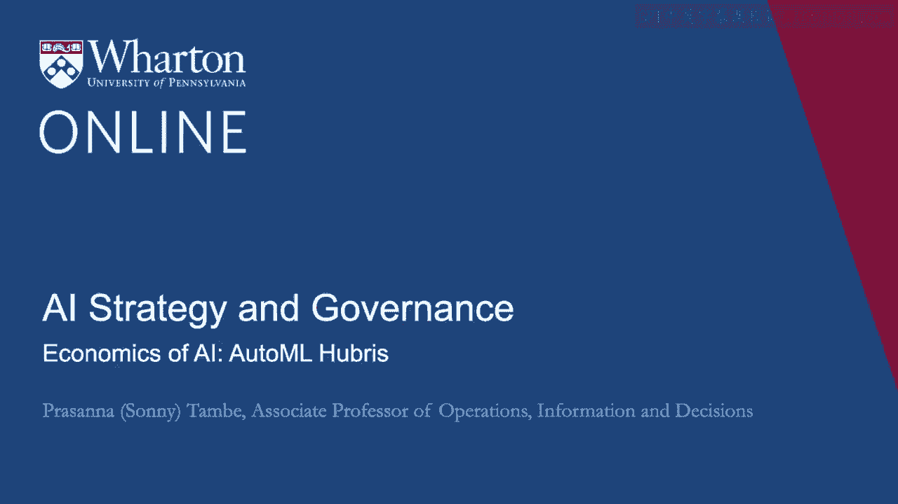
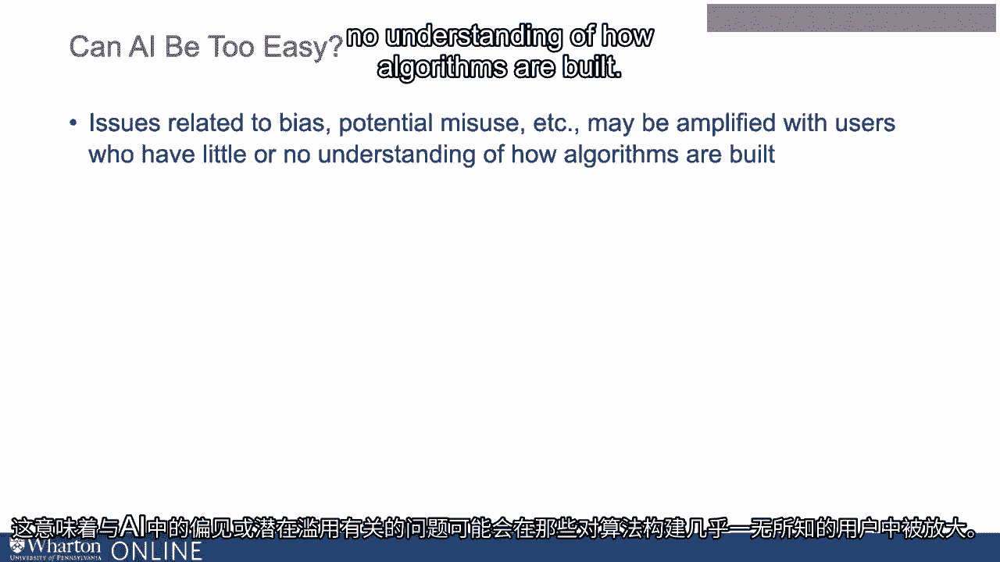
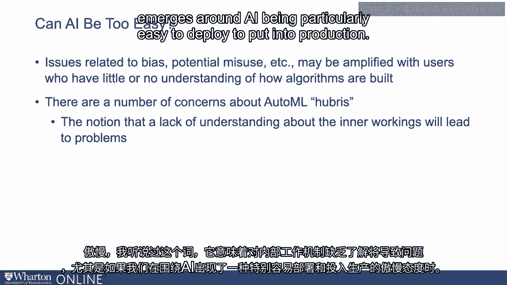

# P110：9_自动机器学习的傲慢经济学.zh_en - GPT中英字幕课程资源 - BV1Ju4y157dK

关于推出自动机器学习等工具的讨论之一，这使得工具变得极其。

对几乎所有拥有强大数据集的人来说，开发AI应用变得简单。

是人工智能在某种意义上是否过于简单的问题。

这意味着，与人工智能的偏见或潜在误用相关的问题。

对人工智能的理解不足可能会加剧使用者的问题，尤其是对算法的运作。

构建这些工具时，任何构建算法的人都必须稍微深入。

理解数据内部结构的能力，了解数据问题可能出现的位置以及预测。

引擎可能会面临与数据相关的问题，或者它们可能产生。

偏见或误导性的结果。借助自动机器学习，这一切发生得如此简单，问题随之而来：我们能否足够关注。

在部署之前，从用户的角度关注算法正在做什么。

真正做好治理，确保我们没有将不当内容投入生产。

导致社会伤害的算法。关于自动机器学习傲慢的问题引发了许多担忧。

这种对内部运作缺乏理解的观点将导致问题，尤其是在。

如果我们围绕人工智能发展出一种傲慢，尤其是在人工智能特别。

部署或投入生产变得容易。这可能会推动能够应对其影响的人迅速增加。

关于算法决策的内容。对更安全的人工智能伦理学家或真正理解决策过程的人可能有更高的需求。

是如何得出结论的，并思考这从算法的角度意味着什么。

一些陷阱和危险点可能存在。谢谢。[BLANK_AUDIO]
