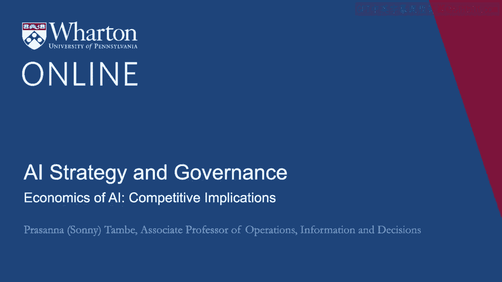
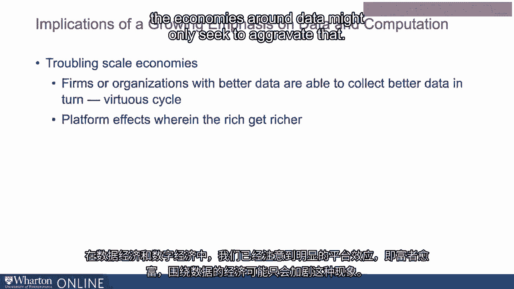
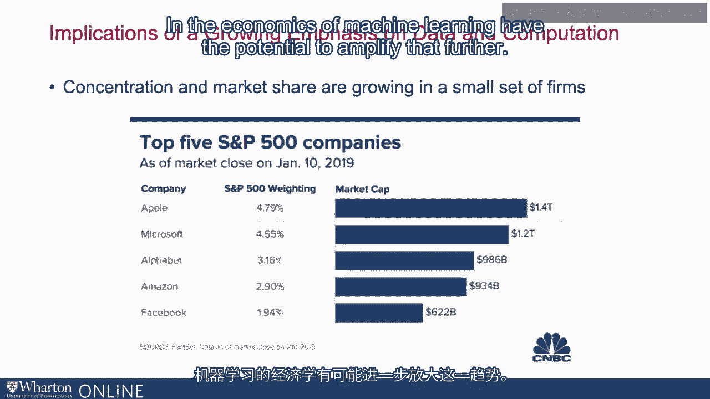
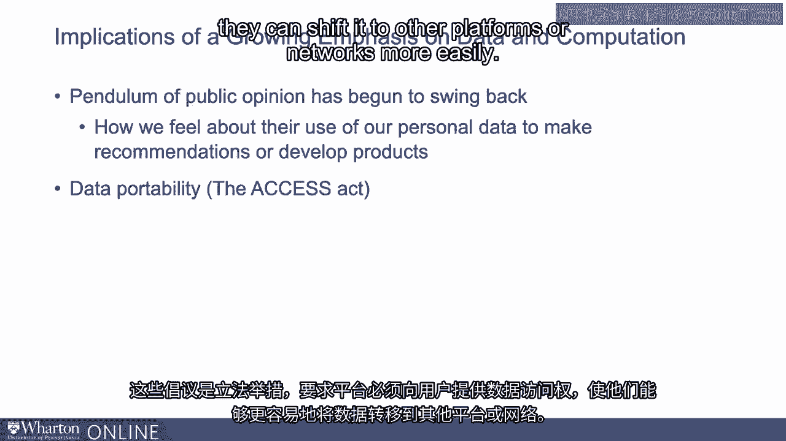
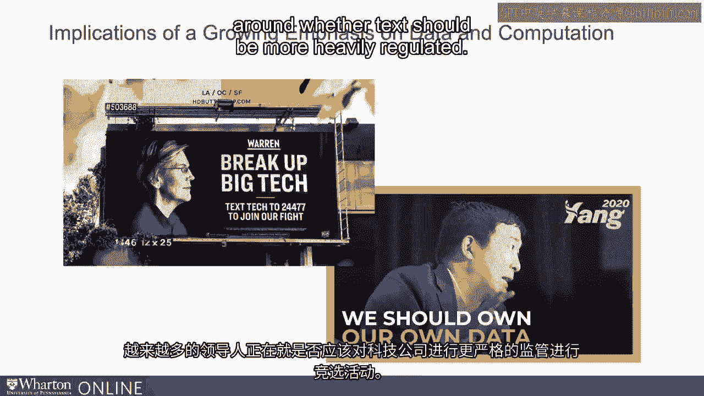
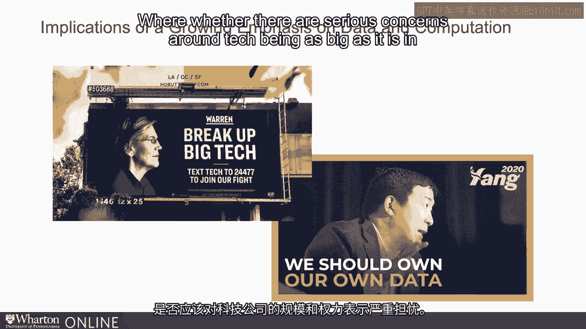
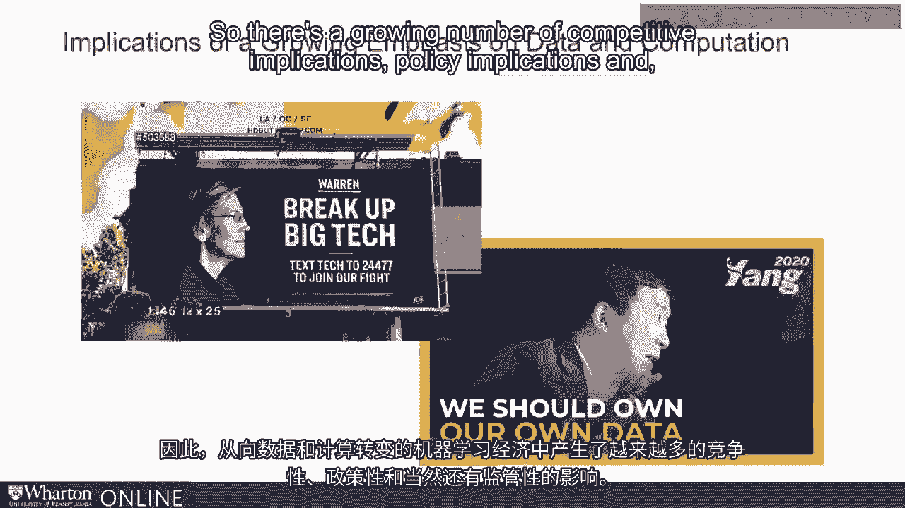

# P111：10_AI的竞争影响经济学.zh_en - GPT中英字幕课程资源 - BV1Ju4y157dK

思考日益增强的竞争影响也是很重要的。

在算法决策制定中对数据和计算的影响。我们讨论过数据在某种意义上存在令人担忧的规模经济。拥有更好数据的公司或组织能够在某种程度上收集更好的数据。成为一个良性循环。我们已经注意到在数据经济和数字经济中显著的平台。

影响是富者越富，数据经济可能只会加剧这一现象。这些。

我们确实看到，在过去十年左右，市场集中度不断增加。在相对较小的一组技术密集型数据丰富的公司之间分享和经济学。机器学习的潜力进一步放大这一问题。

由此产生的副产品是，我们在近几年看到的另一件事是，摆动的钟摆。公众舆论在我们对数据资产的感受上开始有所转变。这些公司所拥有的个人数据的使用可能用于推荐或开发产品。所以公众舆论和政策制定者的观点有了些许变化。

以及这些数据关系周围的情况。因此，围绕数据可移植性等事宜已经有了一些立法倡议。一些倡议使平台必须向用户提供对其的访问。以便他们可以更轻松地将数据转移到其他平台或网络。

越来越多的领导者正在就技术是否应该。受到更严格的监管，是否对技术规模过大存在严重担忧。

在公司、公司规模和权力方面也是如此。现在有一些领导者正在围绕数据的问题进行竞选。所有权以及数据是否真的应该属于这些平台，是否应该。属于提供这些数据的用户。

所以，竞争影响、政策影响以及当然还有其他方面正在不断增加。随着向数据和计算转变而产生的监管影响。机器学习经济。谢谢。[BLANK_AUDIO]。

