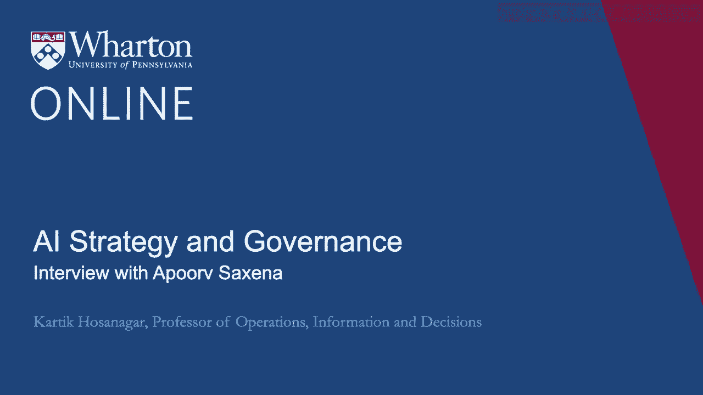

# P112：11_Apoorv Saxena访谈.zh_en - GPT中英字幕课程资源 - BV1Ju4y157dK

我们谈过使用投资组合来管理AI项目。

我们讨论过机器学习的民主化进程。

这是我与曾在此工作的Appur Saxena广泛撰写的主题。

谷歌并实施了许多AI倡议。

目前他是摩根大通的全球人工智能负责人。

我们撰写的这些文章作为本课程的一部分，提供为可选阅读。

我鼓励大家去看看它。现在让我们与Appur进行对话。

所以Appur作为全球AI负责人，显然你个人。

但你的组织整体上在AI方面投入很多。当公司在AI方面大量投资时。

问题是，你需要具备哪些条件才能获得回报？

因为正如我们所见，许多公司正在投资于AI。

但不仅仅是看到回报。所以告诉我们你对此的看法。

你认为哪种AI战略有效，并且可能在长远中产生回报？

>> 这是一个非常好的观点。我认为要注意的一点是，开始AI是非常简单的。

我觉得你实际上可以雇佣几位数据科学家。

给他们一台笔记本电脑，他们应该能够启动并运行AI或。

从事机器学习或数据科学。我认为你需要关注的是如何产生巨大的影响。

AI的变革性影响？我认为我们看到的有效方式有三种。

首先，你必须具备合适的基础设施以规模化开展AI。这意味着什么？

本质上，这意味着要有数据就位。数据要易于发现，易于标注。

然后是训练模型的能力，大规模模型的能力。

所以这基本上就是我所称的AI基础设施。和Facebook，谷歌。

世界在这方面投入了大量资金。这就是他们能够超越行业的原因。

第二部分是你必须从头到尾审视你的业务流程。

观点并看看AI如何应用于整体流程。

而不是整体流程的一小部分。第三部分我会说。

你必须提出方案，并且可以利用AI，也应该利用AI来创造新的数字体验。

这就是你将随着时间推移看到最大影响的地方。

>> 你能通过AI创造出什么样的新数字体验？

>> 我认为AI一直无法做到的事情，但也能做出惊人的成果。

通过对话创造新体验。语音转文本的准确性大幅提高。

生成新文本的能力，完全由AI生成的文本大幅增加。

现在你可以想到在两三年前根本不可能的体验。

就在两三年前。因此正确的例子。

如果你在私营领域讨论，有很多低接触的机会。

高频交易通常是银行希望自动化的。例如，嘿。

你早上醒来想检查你的投资组合，看看情况如何，为什么下跌？

所以你醒来，跟Alexa对话，这个数字助手，告诉她。

为什么我的投资组合下跌了百分之二？然后AI助手会分析你的投资组合。

它提供非常合理的原因来解释为什么下跌，并给你提供交易信息。当然。

在这一切体验中，如果你想深入探讨，能够深入了解。

你实际上打电话给你的财富顾问。但这就是我们所讨论的那种体验。

>> 所以显然可以清楚地看到如何应用AI来改善现有的体验。

但当你谈论创造新体验时，你具体指的是什么？

>> 所以AI使得如何与之互动的体验发生了彻底的变革。

与机器对话以及如何生成新的文本，机器生成的文本。

所以这两项进展可以转变你与银行的互动方式。举个例子。

通常与之的低接触、高频率的互动。

你的私人财富顾问通常是银行希望自动化的内容。

这方面的一个例子是，你早上醒来，通过你的Alexa对话。

通过Alexa联系银行，询问，嘿，我的投资组合今天表现如何？我昨天的表现如何？

然后它会说，嘿，下跌了百分之二，然后你开始更深入地挖掘，嘿。

为什么下跌了百分之二？它告诉你你的投资组合是如何构建的。

这就是下跌的原因，依此类推。

这种交互非常低接触，但频率非常高。

但今天你可以轻松自动化的事情。

这就是我所说的体验。>> 好吧，我们就这样吧。

三个支柱如同建议的那样。第一个是在我们开始大型AI项目之前。

确保基础设施、数据基础设施和平台到位。

第二，不要单独考虑个别接触点，而是。

实际上，考虑整个端到端的流程，看看AI如何改变这一切。

整个流程。最后，利用AI确实可以转变现有体验，但。

还要认真考虑AI如何为你创造全新的体验。

客户的体验可以是战略性的，也是公司改变游戏规则的关键。>> 向上。

再次感谢你们的参与。>> 感谢你们的邀请。[BLANK_AUDIO]。

