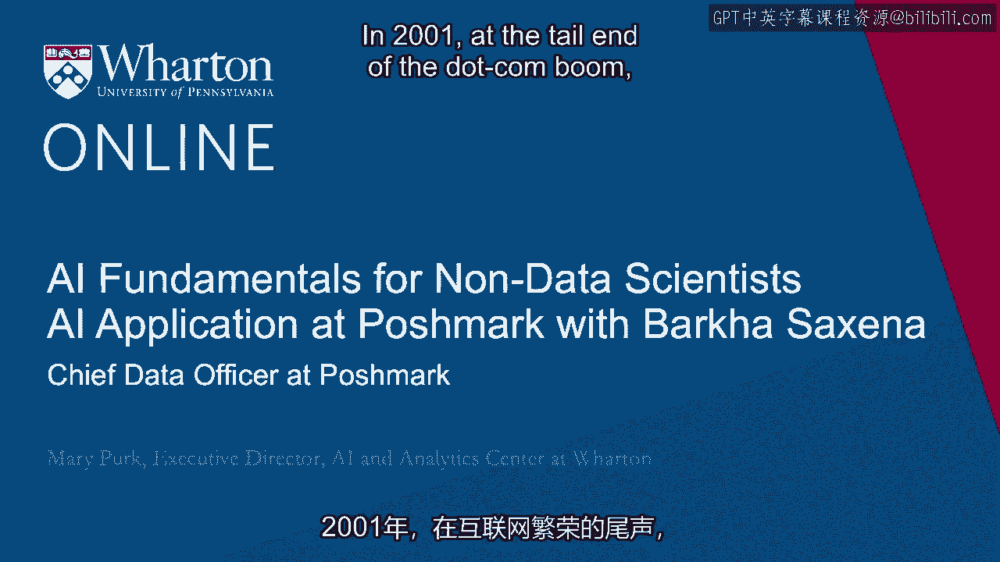

# P114：13_Barkha Saxena访谈.zh_en - GPT中英字幕课程资源 - BV1Ju4y157dK

在2001年网络泡沫末期，Barka Saxena开始了她的数据科学职业生涯。

现在她是Poshmark的首席数据官，Poshmark是一家领先的新旧风格社交市场。

通过结合实体购物的人际连接，结合规模和便利性。

电子商务的选择优势，Poshmark让买卖变得简单而社交。

而且可持续。生态系统中的每个人都是潜在的。

在市场的两边，作为买家和卖家。Barka，欢迎。 - 谢谢你，Mary。

感谢如此精彩的介绍。嗯，我非常兴奋不仅能谈谈你的职业生涯。

但是你在Poshmark的影响力。发生了很多事情。

尽管今年受到疫情的影响，但仍然如此。因此让我们从你的角度开始。

你能告诉我们一些关于你在Poshmark担任首席数据官的当前角色吗？

你和你的团队自加入以来产生的影响？ - 是的，绝对如此。

所以我负责Poshmark的整体数据策略，并管理一个集中化的团队。

数据科学家、机器学习、分析和数据工具的领域。

我们在所有业务职能中工作。我的团队的任务是提供更高的投资回报率。

以更快的速度。我在2014年加入了Poshmark，那时它还处于起步阶段。

从大约30到35人的小公司开始，到今天我们刚刚上市。

这是一段漫长的旅程。吸引我来到Poshmark的是Manisha的强大愿景。

在移动空间中将社交引入商业。如果你想想。

那是移动商务的早期阶段。我清晰地看到了数据将发挥的作用。

在那个领域。像今天，我们是一家拥有超过8000万用户的公司。

我们有超过3亿个产品，来自9000多个品牌。

我们的用户每天在平台上花费27分钟。到了2020年。

我们看到了来自这些用户的300亿次互动。所以你可以想象它创造的数据量。

而在其中是机会，能够跨越所有业务职能工作。

从市场营销到产品到运营到社区服务。

并利用这些数据为我们的买家和卖家提供美好的体验。所以，是的。

在过去七年里我们一直很忙，从建立数据基础设施开始。

这是我做的第一件事，现在只是提供许多数据解决方案。

从分析、统计分析到机器学习模型等各种类型。

为每个职能带来很多价值。 - 我认为这就是你所建立的。

所有不同的问题你必须处理，基本上在一夜之间因为疫情。

这真的帮助我们深入了解，逐渐剥离出更深的层次。

我真正想和你谈的第一件事是，帮助你的算法。

通过你的运营效率，服务你的客户，吸引你的用户。

所以在你的生态系统中的客户，可能同时是两方。

你在市场上的买家和卖家。你是如何训练算法的。

识别消费者的数据，可能同时是买方和卖方。

我相信这种情况经常发生。所以如果你能稍微告诉我们一些。

在不泄露你们秘密的方法的情况下，更详细地说明。

你和你的团队如何训练这些模型，以识别数据的细微差别。

供应商可以在卖方找到的利益。- 如果这是种很好的感觉。

我们发现这是平台的一大优势，因为人们在同一平台上买卖。

所以他们非常投入。要回答一个具体的问题，比如，我们如何训练算法？

玛丽，你和许多其他从业者交谈过，我相信你对此有所了解。

所有这些问题的答案，从数据本身开始。

如果没有数据，算法将无所作为。所以我们所做的，如我所提到的。

我在Poshmark的旅程始于构建数据基础设施。就像。

在构建过程中，我们建立了数据基础设施。

这是一个经过深思熟虑的事件模式，你用它来收集新数据。

以及在数据建模方面，你是如何丰富数据的。

最后一步是数据表，数据存储的方式。

无论是临时的还是实时的。但我们花费了大量时间和精力。

花费了很多小时的对话，来构思结构，即使它是相同的。

我们在收集所有信息和卖方意图。通过使用这些。

仅仅拥有数据基础设施，使我们能够区分。

这就是第一步。从这里开始，当我们开始建立这些算法时。

一切从，嘿，我们到底想做什么开始？在建立算法之前。

你心中有一个商业问题。如果那个商业问题是以购买为中心。

然后我们创建我们的特征，经过整个特征工程等。

以这样的方式，你主要关注购买网站的功能。举个例子。

我们有一个美丽的个人推荐，去往公司的推荐，每天推荐。

所有买家一套策划好的项目，适合你的品味。

基于你过去提供的所有信号。当我们为此提取数据时。

我们只提取与您的购买行为相关的数据。所以关注。

无论是社交联系，还是商业行为或喜欢等。

你在其他人的衣橱、其他人的物品上所做的，而不是在你的类别内。

因为我们在寻找信号，关于你和谁互动。

因为当你去其他人的衣橱时，那是你对购买物品感兴趣的时候。

所以我们使用信号的买方侧。再说一次，数据基础设施。

我们存储数据的方式使我们能够从买方侧提取数据。

以销售网站为例，我们有列表评分。

我们试图了解列表的质量。

这就是卖方行为重要的地方。

这就是我们知道卖家分享的内容，卖家关注的人。

当你创建内容时，有很多相关的信息。

因此，我们提取卖方侧的属性，以创建特征来构建模型。

当然，每个算法的目标函数。

确保我们在为买方侧而非卖方侧进行培训。这样说来。

在某些情况下，我们确实需要一起考虑双方。

客户细分中，我们有这种核心用户细分，这是一个案例。

因为当你想到核心用户时，你并不是说核心买家或核心卖家，对吗？

你在谈论核心用户。这就是我们实际创建特征的地方。

来自双方的合作。我们训练这些算法。

基于多个目标函数。在完成这项工作后。

我们实际上与双方的业务利益相关者进行了很多讨论。

获取他们的反馈。这些地方，我认为商业专长。

知识确实很重要。有时我可能会称之为。

像是特征的精挑细选，这为我们提供了双方的良好视角。

然后我们最终训练模型，以便我们能够描绘出核心用户的图像，具有不同的维度。

但我通常是一个很大支持人们所称的可解释AI的支持者。

我需要能够向任何人解释最复杂的模型，用简单的英语。

如果我需要的话。但是，当你面临这种情况时，这就变得更加关键。

每个用户从买方和卖方的两个不同视角被观察。

- 我认为这真的帮助我们理解你是如何。

你如何框定和分类你的数据，并组织你的数据。

因此，它可以在双方使用。但这确实是这些买方信号。

当他们查看他人的衣橱时，你确定了这就是意图。

然后与主题专家合作。

或专家关于哪些具体数据片段或数据对象。

对回答问题至关重要。我怀疑如果你能谈谈。

当你谈论模型的可解释性时。

这是Poshmark内的一个目标，不仅仅是你的团队，还有这些。

主题专家，让人们理解这些模型是如何工作的。

或者可解释性只是局限于你的团队，他们能够解释模型。

每个人都明白这些模型在Poshmark内是如何工作的吗？- 是的，实际上我们。

这是一个有意识的努力，没有任何模型会被称为最终模型。

在经过我们称之为业务团队的审核之前。

他们可能是商业利益相关者，或者可能是产品团队。

因为在这个领域工作了 20 多年，从人们那里听到这一点非常有价值。

这些人在日常工作中进行此项工作。当你尝试构建某样东西时。

关于客户留存，你真的需要和市场人员交谈。

采取这些行动的人，因为他们有一些学习，这将帮助我们确保。

你正在构建一个模型，这个模型能够经得起时间的考验。

这不仅仅是完全由历史数据驱动。

一旦市场人员改变了策略，这种情况就会发生变化。

所以将他们纳入其中是非常重要的。

这就是我们组建团队并建立流程的原因，让它成为书面流程的一部分。

在经过审核之前，是不会完成的。- 好吧，Tiffany，你能解释一下吗？

但你能解释一下为什么 Poshmark 的移动应用从一开始就非常重要吗？

在早期与买家的互动中，这一点非常重要。关于这一点的第二个问题是。

AI 和机器学习如何真正促进买家的无缝旅程？- 是的。

好问题。老实说，我已经，我是说，我在 Poshmark 时。

当时你们已经在实施移动战略。所以我也对 Manish 的远见感到惊讶。

所以在 2010 年，他开始参与 Poshmark 时。

网络曾是人们购物的主要方式。移动端虽然出现了，但并不是很好。

人们会在网上找到东西，然后他们会稍微使用一下移动设备，对吧？

也许你正在重新检查某些东西，等等。但他明显看到随着移动电话的持续发展。

为了改善，这将是人们购物的方式。所以他基本上押注于移动端。

这是将成为人们主要购物的设备。

当 iPhone 4 发布时，那是第一款手机。

这款产品配备了优秀的相机和良好的视觉效果，屏幕也很出色，可以查看物品。

质量确实很高。这就是为什么变得非常明确。

现在我们准备下注，因为看起来这是一种设备。

许多人认为可以实现的事情。所以我们全力投入了移动优先的战略。

我们的用户对此作出了回应，因为从购买的角度来看。

他们发现能轻松滚动许多列表和各种风格，真是太方便了。

你不必坐着。而这就是时尚发展的方向，对吧？

当你获得时尚灵感时，它可以在任何地方发生，对吧？

它不会等你回到家。因此，偏见确实对此有所反应。

卖家们喜欢能随时随地快速拍照的便利。

能够在60秒内列出商品。所以从双方的角度来看都很有效。

但我会说这是一种恶意的视野，以及他对移动设备的押注。

我想他对苹果非常有信心，推出了那款美丽的手机。

- 所以我喜欢你如何分类，他真的有后艺术的信条，与时尚相结合。

而且由于这个前瞻性，利用它作为一个如此关键的平台。

你能否再多解释一下，机器学习方面的情况。

你是否需要加大对机器学习和人工智能的投入，使之成为无缝的旅程。

或者你团队当前的压力是什么，以确保这一过程是成功的。

在疫情结束后你们会如何前进？ - 是的，确实如此。

正如我提到的数据量，对吗？当你有300亿次互动时。

在平台上发生的事情，你需要能够利用这些数据。

因为这是你能够为用户提供无缝体验的唯一方式。

但当你作为买家进入平台时，你会看到个性化信息流。

你希望它个性化为你喜欢的东西，你会期望，嘿。

我已经使用你的平台这么长时间，你显然知道我喜欢什么。

我不喜欢，所以为我个性化处理。同样，当你搜索时。

两个人可以在“黑色”这个词上搜索，但他们期望不同的东西，对吧？

根据上下文。因此，用户期望我们应该提供的内容。

所以我们对此作出回应，唯一的回应方式是，当你有超过8000万用户时。

而你所拥有的数据量，实际上是用来利用这些数据。

你利用过去的信号，提供买家体验，使其为你量身定制。

但同时你仍然留有发现的空间，对吧？否则。

如果你只是不断向用户展示他们过去的互动。

你将如何接触新事物？所以我们在推荐中平衡了这两者。

因为Poshmark也是一个寻找新时尚灵感的地方，对吧？所以，我的意思是。

使用机器学习，在各种购物体验中提供那种体验，我会说。

不是渠道，但你知道，买家在跟踪时有很多方式。

无论是个性化信息流，还是我们给你推荐，或者你在搜索。

但基本上就是你与买家的互动方式。当涉及到卖方时。

他们创建所有这些列表，并在市场营销上投入所有时间。

它们在平台上的列表，无论是通过分享还是互动。

与买家一对一，他们提供这些折扣。

这就是我们利用所有数据，帮助我们的卖家提高效率的地方。

当他们想要提供折扣时。

Poshmark为其配备了某种运输折扣。

这增加了他们能够以更快的速度销售商品的机会。再一次。

像这样，拥有超过两亿个正在销售的商品，这些商品在Poshmark上列出。

我们需要引入数据和机器学习，以确保商品在销售。

最终，它回归到，我喜欢称之为的。

这是买家和卖家之间的匹配，或者是商品与买家所寻找的东西之间的匹配。

唯一能做到这一点的方法是，像我们内部使用的这些鸟。

比如需求匹配和供应匹配。没有其他高效的方式。

或以高质量而不使用机器学习。

机器学习之所以有用，是因为数据如此庞大。

你不能写规则来处理它。你需要构建智能。

以这样的方式引入它，随着时间的推移，它将继续学习，变得越来越好。

随着我们对用户了解得更多，及对环境中变化趋势的更多了解。

我们处于一个幸运的位置，用户给我们提供了如此多的数据。

幸运的是，我们在管理和维护数据方面做得很好。

并以一种方式构建它，以便我们可以利用它。与此同时，像。

你知道，一些过程等，我曾提到过的，我谈到过，像。

你知道，在解决任何问题之前，我们从最上面开始。

我们试图解决的商业问题是什么。信不信由你，很多时候。

人们实际上没有花足够的时间在那里。然后你可能最终构建一个模型。

这并不完全解决问题。所以我们非常执着于花费大量时间。

精确聚焦于，好的，这正是我们要解决的问题。

然后我们从架构图的角度来看。

从怎样与决策整合的角度来看。

有时这是一个产品特性。有时是你所提供的某些东西。

向你的市场经理或产品经理。

谁会利用它来做决策。但整个画面必须清晰。

在你真正开始提取数据，构建模型之前。

然后我与商业利益相关者和内部人员讨论了整个视频过程。

我们在这方面花了很多时间。再次，目标是，随着Poshma的不断扩展。

用户不断给我们更多信号。事物必须自动继续扩展。

所以并不是说我们必须拆除并重建。我们必须建立这个。

以这种增长和扩展为目标进行构建，以便我们能继续延迟。

通过我们的买家，提供他们期望的这种令人惊叹的体验。- 就是这样。

非常感谢你今天的时间，巴尔卡。- 谢谢，玛丽。

与你交谈总是一种愉悦。（嗡嗡声），（嗡嗡声）。

