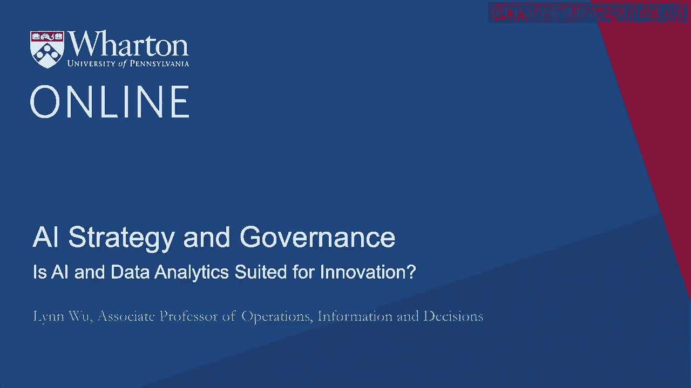
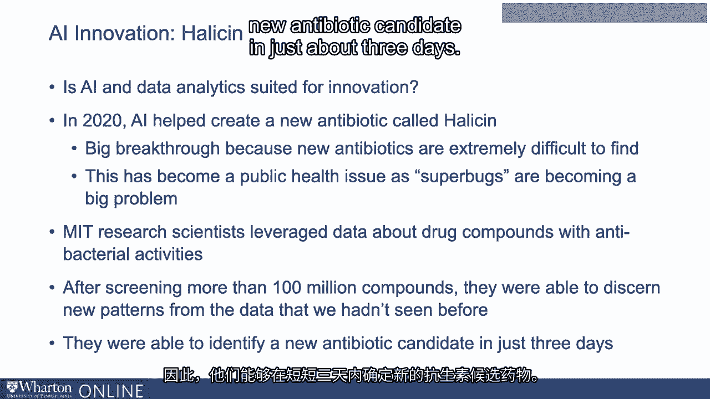
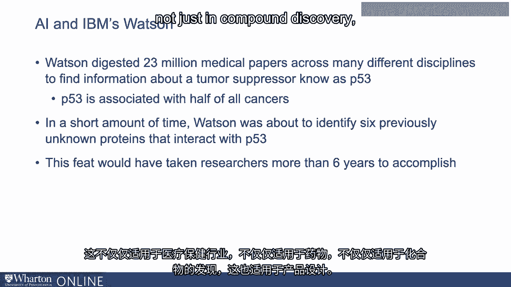
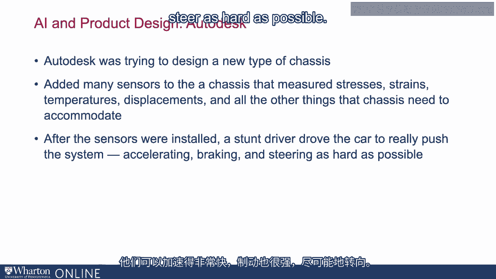
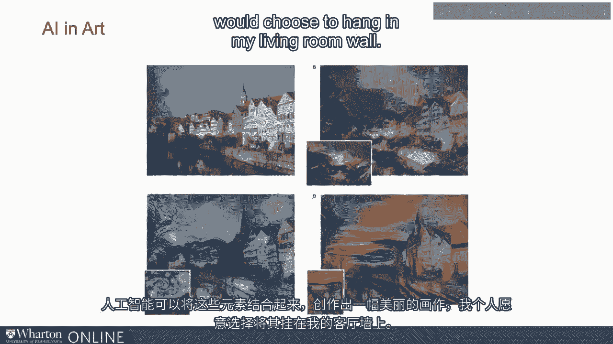
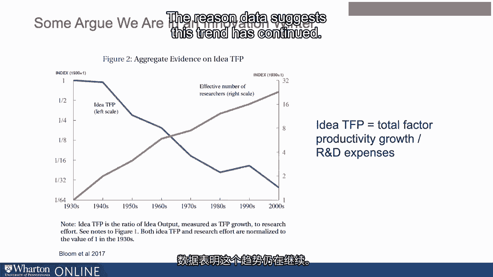
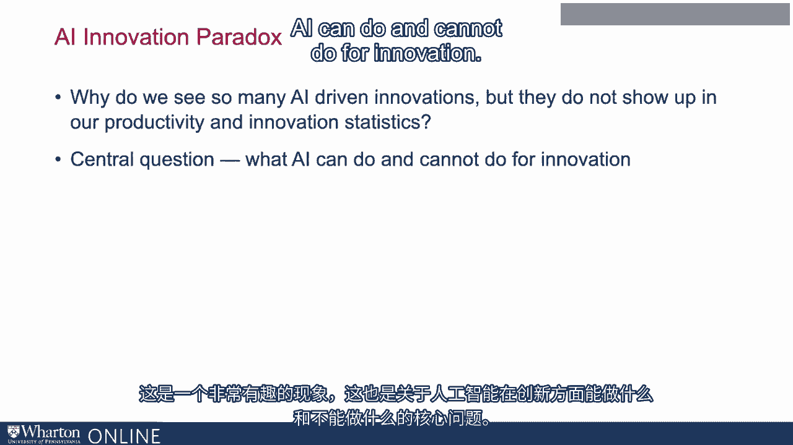

# P115：14_AI和数据分析适合创新吗.zh_en - GPT中英字幕课程资源 - BV1Ju4y157dK

我叫林吴。我是Wern商学院运营信息系的副教授。

决策部门。我的专业是AS对组织的影响，尤其是来自。从创新的角度来看。在这个视频中，我们将讨论AI和数据分析是否适合创新。你可能在过去几年听到了很多关于AI驱动的有趣新闻。创新。最著名的一个是在2020年。AI创造了，帮助创造了一种新的抗生素。

被称为halosine。这是一个重大突破，因为抗生素，特别是新型抗生素。是极其难以发现的。这已经成为一个重大公共健康问题，因为这个超级箱。正在成为一个大问题。因此在2020年，一群MIT研究科学家利用了。关于各种化合物的数据，它们的抗菌活性等等。在此之后。

筛选超过一亿种化合物后，他们能够辨别出新的模式。我们之前未见过的数据。因此，他们能够识别出新的抗生素。

仅用大约三天时间。Halosine在几个方面都是独特的。首先，它被发现。通过AI平台在科学家的帮助下。第二，不仅非常有效。halosine在其化学结构和其他类型抗生素上也是独特的。在人体内也是可以容忍的。

几年前，IBM沃森以其技术发现了一种新型的。医疗创新的一个重要方面。在这种情况下，沃森能够消化大约2300万。跨越许多不同学科的医学论文，以寻找关于肿瘤抑制剂的信息。被称为P53。P53很重要，因为它与几乎所有癌症的一半相关。

所以在短时间内，沃森能够消化所有这些论文，找到。这数据中的隐藏模式，并识别出六种之前未知的相互作用蛋白质。与P53一起。这一成就本来需要研究人员超过六年的时间才能完成，而沃森。他们在几周内完成了这一切。这不仅仅是在医疗行业，也不仅仅是在药物。

不仅仅是在化合物发现方面。这也体现在产品设计上。例如，Autodesk。

正在尝试设计一种新型底盘。他们所做的是增加了许多传感器。到一个可以测量应力、温度、位移的底盘上。所有与底盘相关的其他事情，以及让底盘正常工作。还有。所有这些传感器都非常便宜，能够在这个底盘上部署许多传感器。

安装传感器后，一位特技车手驾驶这辆车并且真的。尝试推动一个系统。好的。所以他们可以加速得非常快，他们的刹车也很猛。尽可能用力转向。经过约2000万数据点，AI与八位科学家合作。

用全新的底盘。好的。如果你看看这张底盘的照片，它并不真的像。一辆车。看起来像一根带有猛犸象的骨头。但请注意这辆车的非对称性。左侧。左侧和右侧并不是彼此的镜像。通常你会看到左侧。左侧和右侧的汽车非常相似。这是因为如果你看看。

这些数据表明，汽车在一个方向上的转向频率远高于另一个方向。所以当然，一侧必须承受更多的压力。一侧的压力和位移比另一侧多。这就是为什么你会看到之前的非对称性。即使在艺术和科学的领域，这也是。

我们认为这是非常人性化的行为。我们看到AI可以创造出我们可能感兴趣的艺术。并挂在我们的客厅墙上。如果你看看顶部的这张照片。这是一张美丽的照片。然后你将它与梵高的《星空》结合，你就会得到一个美丽的组合。这两张照片的元素。然后创造一张包含《星空》元素的全新照片。

你可以对许多其他著名画作进行同样的操作，将你的照片与另一幅结合。著名的画作。AI可以结合这些元素，创造出一幅美丽的画作，我个人会。我会选择挂在我客厅的墙上。所以我刚给你一些关于AI的精彩例子。

驱动的创新。然而，如果你查看尼古拉斯·布恩所制作的这张图表。2017年的共同作者，你会看到不同的画面，因为有人辩称，不仅仅是。我们为何没有看到伟大的创新出现，但平均而言，我们看到了创新的下降。所以这就是如何阅读这张图表。绿色线可以看作是我们投入了多少钱。

我们在研发上投入的资源。蓝色线可以看作是人均支出。基本上是每个人均产生了多少创新。你可以看到我们投入了很多。更多的钱和资源以绿色线有效研究人员数量衡量。但如果你。查看这一资源投资的生产力，蓝色线表明我们的。

人均投资，我们的人均创新产出下降了不少。这是一个从1930到2000的较长趋势。数据表明这个趋势的原因。

这一趋势持续。那这里发生了什么？为什么我们看到这么多由AI驱动的创新？

但是不知为何，它们并没有体现在我们的生产力、创新和统计数据中。这是一个非常有趣的现象。这引出了AI能做什么和不能做什么的核心问题。

进行创新。在我们下一个视频中，我将解释什么样的AI是合适的，什么样的AI是不合适的。针对各种类型的创新活动。[BLANK_AUDIO]。

