# P116：15_AI和过程创新.zh_en - GPT中英字幕课程资源 - BV1Ju4y157dK

在这个视频中，我将讨论人工智能如何帮助你改善流程并生成数据。

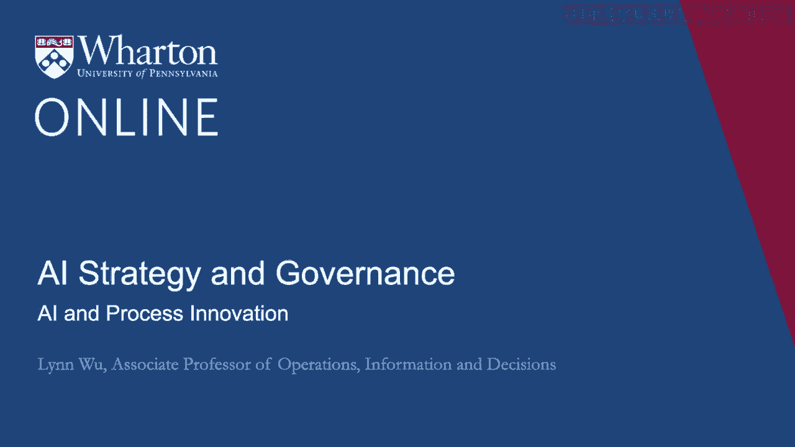

过程相关的创新。你可能不会惊讶于大数据的爆炸为先进技术提供了良机。人工智能和数据瓶颈及各种技术。从社交媒体、移动媒体，每一秒钟。我们生成数千吨、数百万条印象、文本消息。对社交帖子发表评论、反应，所有这些都涉及大量文本、图片的爆炸。

视频和声音。尽管这些数据可能来自用户生成内容。但很多数据也可以来自商业过程。一旦公司能够仔细整理其业务过程数据，并利用先进技术进行真正分析。机器学习分析工具，这可以在他们的流程中带来显著改进。创新。

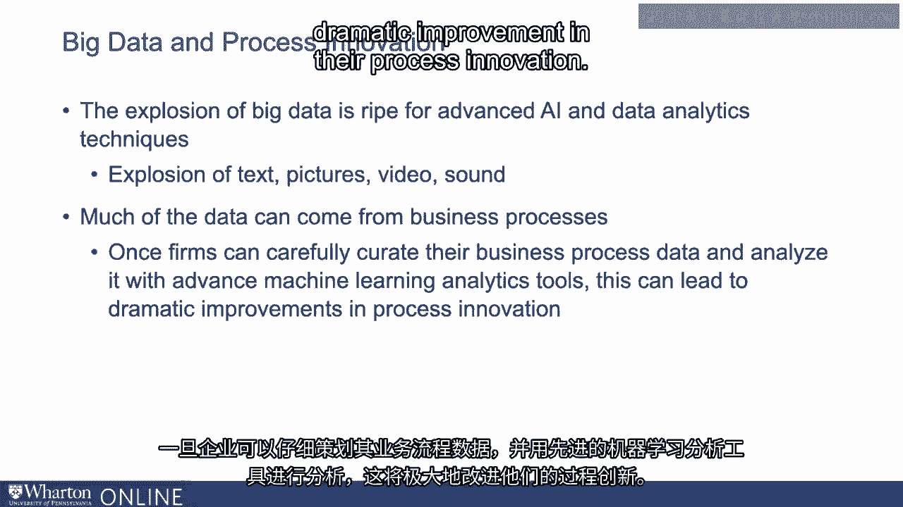

让我以谷歌的数据中心为例。谷歌运营着世界上最大的几个数据中心。而这些数据中心的能耗非常高。这意味着它们可以提供超过100的能量。000台服务器。保持服务器冷却是很重要的。冷却挑战进一步加剧，因为计算负载是变化的。这相当复杂。因为很难预测随着时间的推移会消耗多少电力。人们使用这些服务器的频率，以及外部温度也会影响它。湿度等。在过去，人类通常控制这些泵。

这些冷却设备、冷却塔和其他设备。保持数据中心在合适的温度下非常重要。否则。如果服务器出现故障。这些人会监控他们的温度计、压力表。以及许多其他传感器，随着时间的推移做出决策。深度学习是一个机器学习平台。我们来看看是否能自动化其中一些工作。

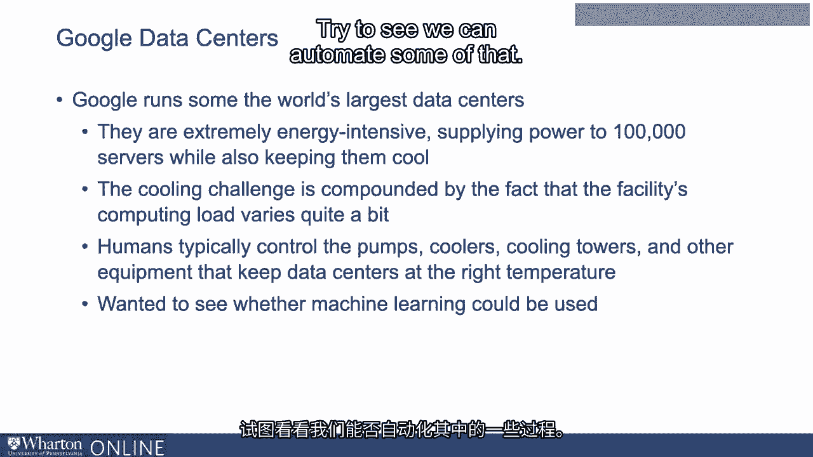

他们所做的是对数据中心的历史数据、计算负载和各种情况进行了多年的收集。传感器读数、湿度和温度等环境因素，进行汇总。所有这些信息用来训练一个大型神经网络。所以这是深度学习模型。这个神经网络用于控制所有可用的冷却设备。

这也是一个强化学习算法，用于训练深度学习神经网络。

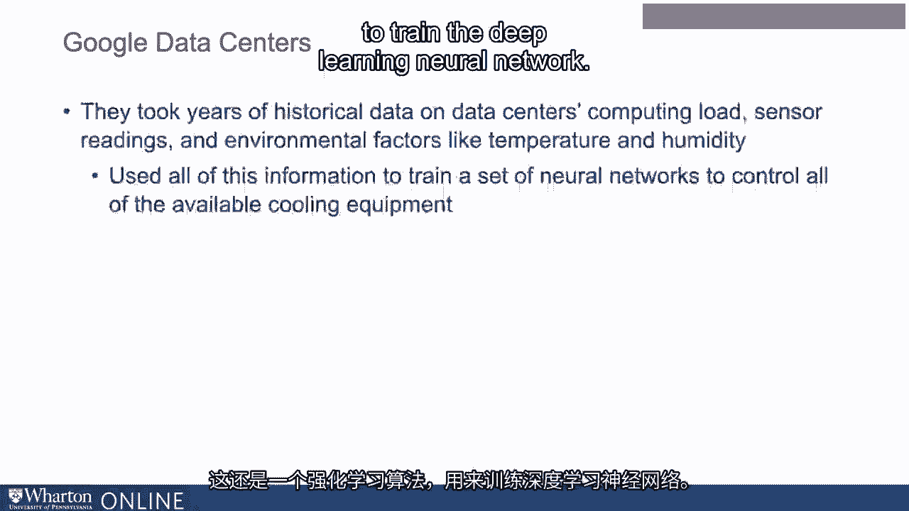

你可以在顶部的这个图表中看到，开始时我们的电力使用效率相当稳定。相当稳定。然后我们启动这个深度思维平台，以减少能耗或提高效率。使其更有效。你可以看到在使用机器学习控制这些温度泵后，效率急剧下降。冷却器及所有与保持服务器冷却相关的系统。随着时间的推移。

您可以看到它显著降低。当系统关闭并恢复人为控制后。您可以看到电力使用的有效性实际上已经回到了之前的水平。系统部署后，能源使用减少了40%。与此相关的能源使用开销也改善了15%。这可能是该领域有史以来最大的改进之一。

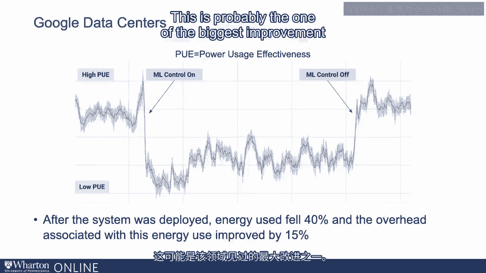

还有许多其他例子，您可能使用过或听说过它们。亚马逊和其他公司显著使用机器学习改善产品推荐。以及库存管理的过程。亚马逊分析使用机器学习预测用户点击的请求。所有这些数据可以用来预测转化率和个人回归的可能性。网站或购买产品。网络安全公司如Deep Instinct已利用这些过程数据更好地进行检测。恶意软件。在许多不同的情况下，他们可以在实际安全漏洞发生之前保护恶意软件。已经发生。保险公司也大量使用机器学习分析他们的客户。数据也可以用来改善他们的客户支持。所有这些都是因为这些公司能够捕捉与其相关的数据。

商业流程，机器学习可以应用，使用数据并应用适当的。算法用于改进他们现有的流程。

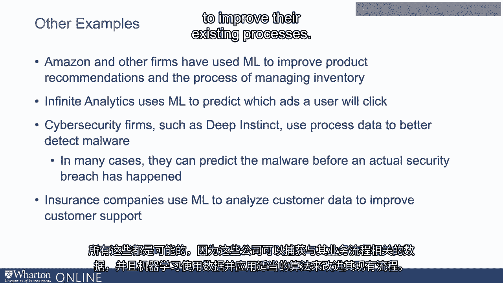

所以我给你展示了一些关于AI和数据分析如何改善流程创新的例子。但要真正看看这是否只是一次性事件，或者这实际上适用于大多数公司。为此，我们实际上对超过300家公司进行了大规模调查。与麦肯锡合作。在这项调查中，我们实际上问了许多关于公司的问题。

而其中一个部分是关于基于流程的创新。所以我们提出了八个问题，询问在一到五的尺度上，可能性有多大。该公司致力于改善他们的流程创新。因此，我们问了这样的问题。多少程度上以下说法描述了。您整个公司的工作实践和环境如何？

其中一个说法是我们具备进行渐进式变更的强大能力。或对我们的业务流程进行改进。我们也问了这样的问题。请列出您主要业务的重要核心活动。如果您列出了流程开发。过程质量、过程管理或改进。然后我们也将您归类为倾向于我们的流程改进的公司。我们也问了这样的问题，您的组织在主动参与方面表现如何。商业领袖们可以完善现有的流程和系统。所以我们汇总了所有这些评分，得分很高的公司。

我们将这些公司标记为对流程创新感兴趣或以此为导向的公司。

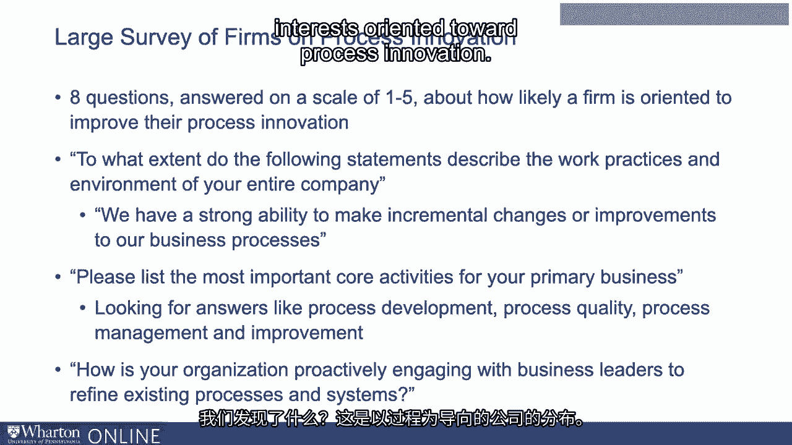

那我们发现了什么？这是我们关注的流程导向公司的分布。你可以看到并不是所有公司都是流程导向的。有些公司较少，有些则更多。但这必须遵循一个相当有趣的钟形曲线，这正是我们所期望的。所以这不是一个大家都说“哦，是的，当然我们对流程感兴趣”的情况。

以及其他所有东西或更高分数的一切。

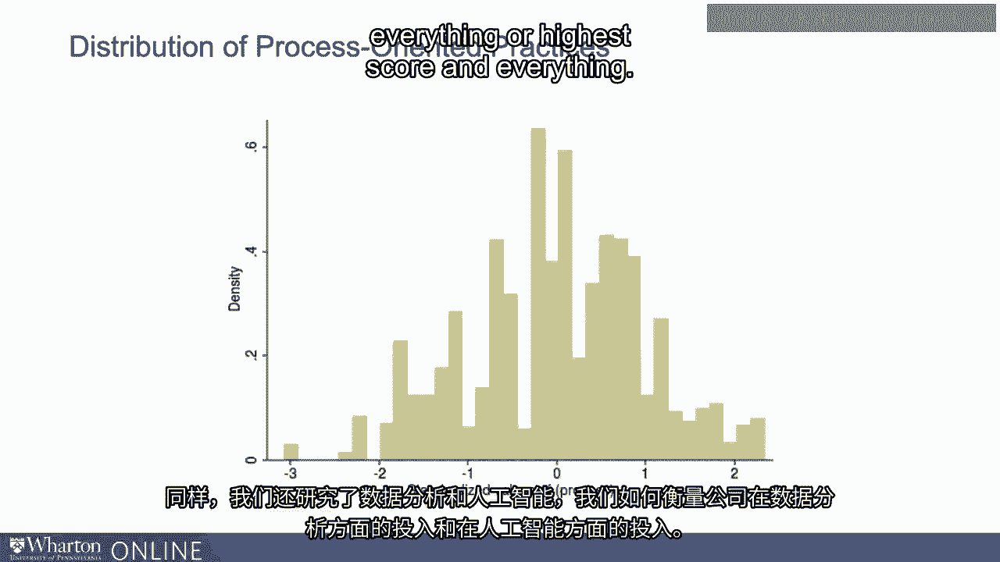

同样，我们也关注了数据分析和人工智能。我们如何衡量公司在数据分析上的投资，以及在人工智能上的投资？

好的。所以我们实际上使用了这些公司的简历数据。因此，我们查看员工技能的数据，看看他们是否具备与数据相关的技能。与人工智能相关的分析和技能。因此，我们可以查看一般的人工智能测量，了解诸如商业等词汇。智能、数据中心、数据驱动、数据整合显示出简历。

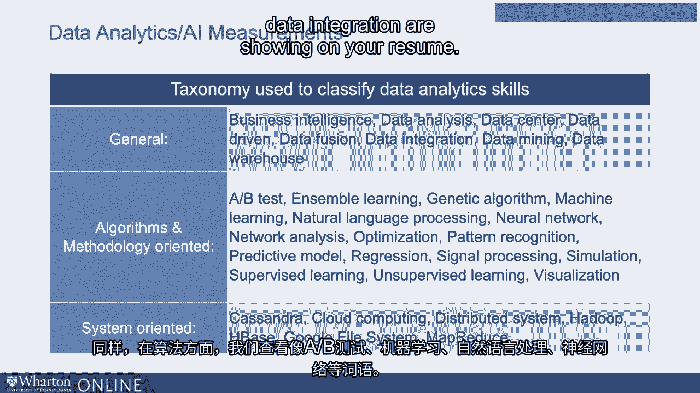

对于算法，我们同样关注像A/B测试、机器学习、自然语言处理等词汇。语言处理、神经网络等等。我们还研究系统和工具，以了解他们是否实际使用人工智能系统或相关系统。向人工智能相关的技术，如云计算、Hadoop、Map of Dues等等。

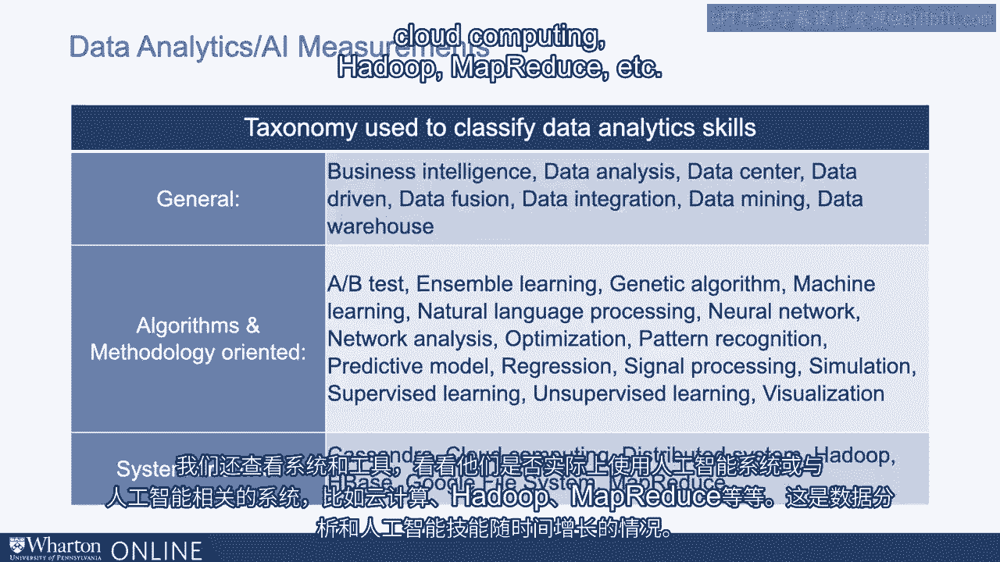

这是数据分析和人工智能技能随时间增长的趋势。你可以看到我们在同一时间线上看到大幅跃升。我们看到数据分析技能有了巨大的改善或大幅增加，数字非常显著。拥有数据分析技能的人，我们看到人工智能技能的增长更加显著。

在最近几年，人工智能技能与数据分析技能呈现出类似的模式。等等，甚至在最近几年稍显戏剧性。

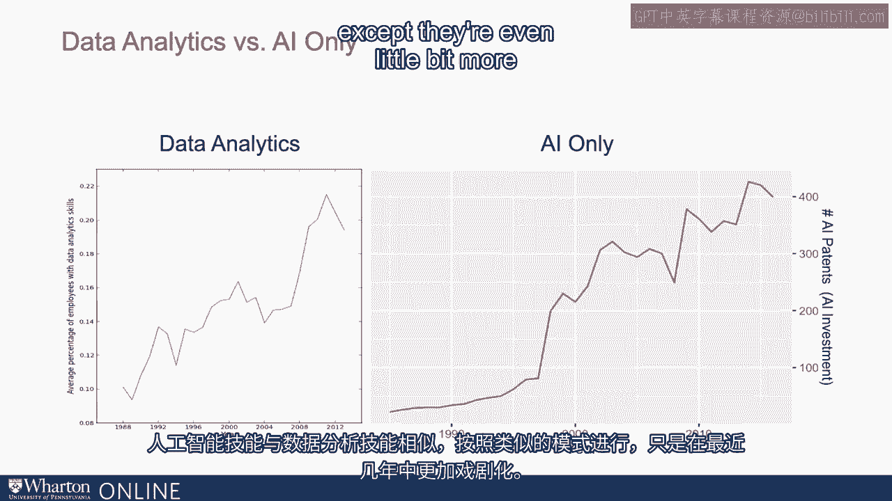

我们发现数据分析和人工智能可以极大促进基于流程的创新。不仅如此，我们发现使用人工智能工具并且面向流程改进的公司。这些公司在收入上衡量的生产力增长甚至更大。我们测量到，投资人工智能工具的标准差增加与。生产力提高7%有关。类似地，如果一家公司投资于人工智能但不关注改善流程。他们将不会体验到那7%的生产力增长。因此我们必须同时具备两者。你既投资于人工智能工具，又面向流程改进。我们看到生产力的提升。这提供了一个因素，可以解释人工智能创新悖论，因为如果。

你在使用人工智能来改善你的流程时，更可能看到更大的收益。

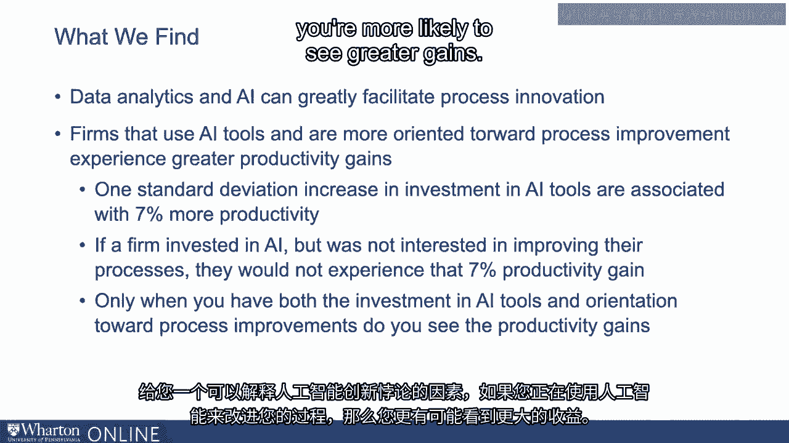

谢谢。[BLANK_AUDIO]。

