# P121：20_管理实践.zh_en - GPT中英字幕课程资源 - BV1Ju4y157dK

在上一个视频中，我们讨论了公司实践，例如组织结构和技能。

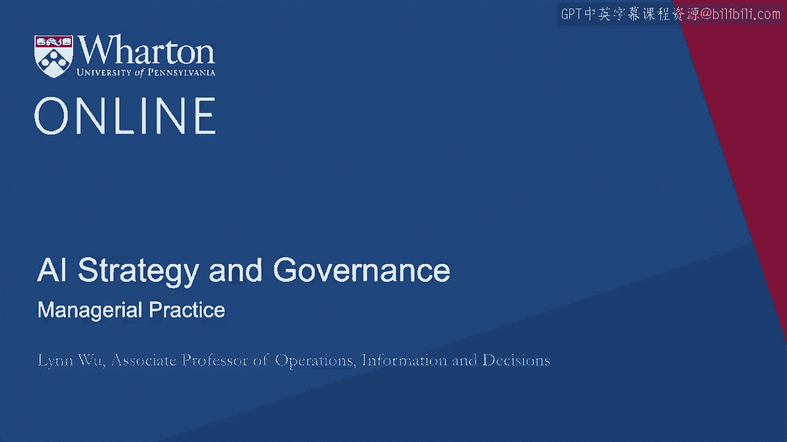

应该是分布式的。在这个视频中，我将讨论其他管理实践和员工管理。

与人工智能相关的实践。这实际上是由人工智能及其相关领域的增长所驱动的。

过去几年的投资增长非常迅速。

这如何改变员工的构成？具体来说。

管理者应如何应对对人工智能日益增长的投资？

那么，哪些公司实践是为了适应这一变化？不仅仅是为了创新。

但总体而言，这种快速自动化涉及各种类型的工作。

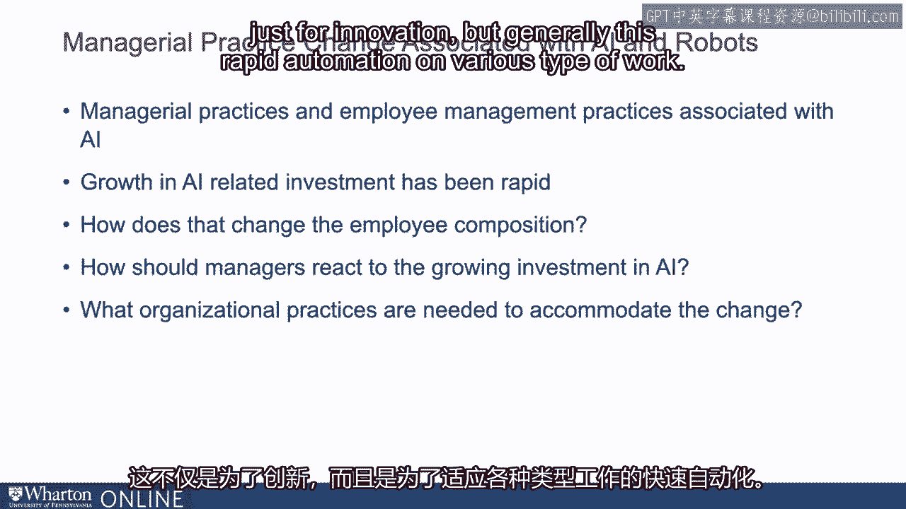

你可能在大众媒体上听到过很多关于机器人的文章。

人工智能和机器人在就业和管理实践方面可能造成巨大的动荡。

你可能听过很多关于机器人的工作文章，机器人现在可以。

然后人工智能机器人会摧毁我们所有的工作，而我们还没有准备好。

这篇文章已在《外交事务》、哈佛商业评论，甚至政策制定者中发表。

欧盟提出了一种机器人税。在2020年的总统竞选中。

德布拉西奥著名地提议在佛教竞选中征收机器人税，然后就此终止。

比尔·盖茨也提议也许机器人应该像人类一样征税。

这些听起来很有趣，但从根本上说，我们实际上不知道人工智能的影响程度。

机器人确实影响就业，管理实践需要在多大程度上进行调整。

以适应这些变化。因此，在我们开始任何政策影响之前。

我们实际上应该有确凿的事实，关于人工智能和机器人如何改变工作的性质。

我们实际上在整个加拿大进行了全国范围的研究。

我们实际上详细捕捉了特定公司中的所有机器人采用情况。

而且这项研究再次使用了税收数据和人口普查数据。

这意味着几乎所有公司都需要响应合规性。因此我们大约有80%。

加拿大90%的公司参与了调查。你可以看到，与制造业相比，服务业的机器人采用正在迅速增长。

所以这与我们之前的想法有些不同，机器人确实在影响着我们。

制造业。但在这里，我们实际上看到服务业的机器人采用速度增长。

尤其是在近几年。当然，你会看到机器人最大的采用者之一是制造业。

你会看到在其他行业，重型机械行业的情况。

你还会看到医疗、科学研究等领域的增长非常迅速。

也涉及其他服务。因此，这不仅仅是一个制造业的故事。

但这实际上是一个全球经济的故事，包括制造业和服务业。

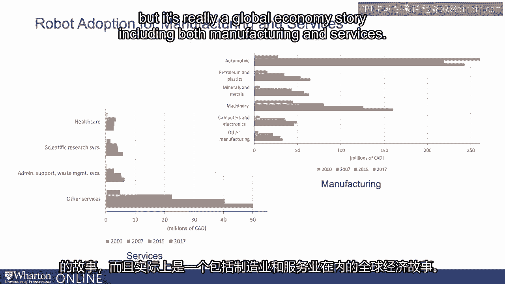

所以我们看到，机器人或人工智能的采用在一段时间内显著增加。

而人工智能可能会反映出这种采用模式，增长可能会更快，因为它是新一代。

人工智能在主流中变得越来越常用。在我们的研究中。

我们实际上看到与机器人采用相关的生产力相当高。

实际上是10倍的因子份额。那么这意味着，如果你采用机器人并保持完全平衡。

你应该得到你机器人价值的确切数字。这类似于投资的多少。

但我在这里告诉你的是，与机器人选择相关的生产力是其价值的10倍。

时间因子份额。所以这意味着与机器人相关的生产力有巨大的提升。

这种分散程度相当高。一些公司在使用机器人方面表现得非常好，而另一些则不然。

这表明与机器人采用相关的补充性组织变化正在发生。

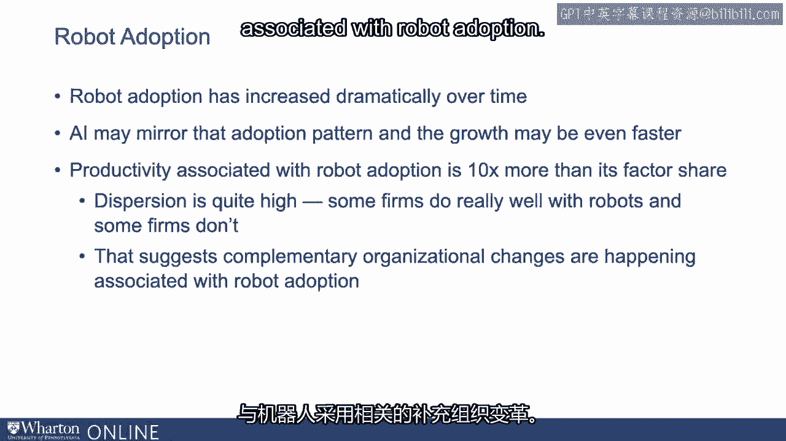

让我给你一个关于机器人和就业现状的概念。

我们将其分解为就业和管理者两个方面。

所以，与流行说法“机器人会消灭所有工作”的相反，你可以看到左侧。

这基本上是事件研究，你可以看到零就是你引入的那一年。

引入机器人和在引入机器人之前的员工数量。

所以负二表示在你引入机器人之前的两年，作为一个公司或正在引入的公司。

正值两表示在你引入机器人后的两年。

Y轴表示机器人对就业变化的影响。

你可以看到在公司引入机器人之前，几乎都是徘徊在零附近。

当他们没有投资任何机器人时，机器人不应该对就业产生影响。

在零的地方你会看到就业的增加。在两三年后逐渐上升。

即使在五、六年后保持平稳，它的水平仍高于最初的水平。

所以这实际上与流行说法相反，机器人实际上在总体上增加了就业。

但这种效果并不是均匀的。如果你看看右侧的图表。

你几乎可以看到完全相反的模式。但是这个图表并不是在衡量总就业。

你在衡量有多少管理人员，在你引入机器人之前和之后。

所以在你引入机器人之前，它仍然徘徊在零附近。在你引入机器人的那一年。

管理类就业已经大幅减少。它在一两年内保持了一些平稳，之后又在第三年大幅下降。

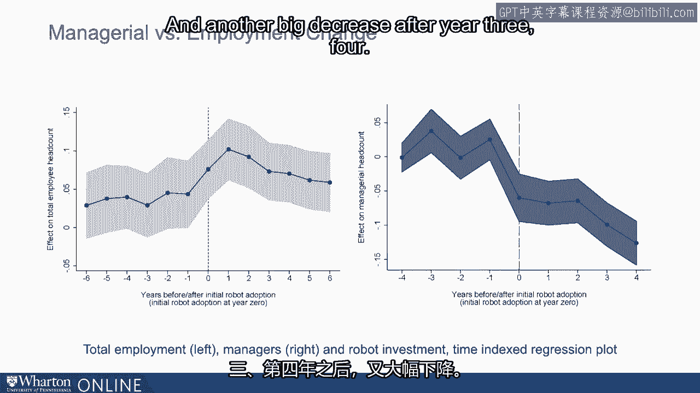

或者四。这与我们所想的不同。那么为什么机器人会增加就业而减少管理岗位呢？

这似乎几乎是反直觉的，因为管理者的定义就是管理其他人。

我们怎么能用机器人来替代他们呢？机器人真的成为我们的管理者了吗？这里到底发生了什么？

这不是统计上的偶然。如果你看看两类公司之间的管理人员。

采用机器人的公司，蓝线，实线蓝线，以及不采用机器人的公司。

红色虚线。我们绘制了管理员工的比例随时间变化的情况。

你可以看到采用机器人的公司逐渐减少了经理和员工的比例。

而不采用机器人的公司，经理的比例基本保持不变。

所以这实际上是关于采用机器人的公司正在发生变化。

而不是那些不采用机器人的公司。那么为什么经理们会这样？好吧。

也许是因为经理真的很贵。所以也许如果你想削减成本。

你想首先摆脱他们。有趣的是，我们实际上可以测量这一点。

在我们调查的部分，我们实际上问了这个问题，以下哪些因素是。

关于你们工作场所一般商业战略的相对重要性？

我想问的一个问题是，降低劳动成本是否真的重要的战略。

优先事项或改善产品服务及其他一些事项。

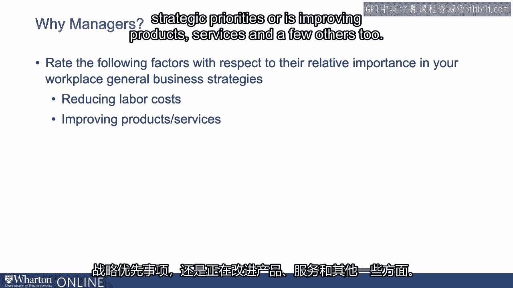

注意，当我们将降低劳动成本作为战略优先事项与机器人采用联系起来时。

事实的大小是零，几乎没有两者之间的关系。

但是如果你坚定的战略优先事项是改善产品服务，那就非常重要。

与采用机器人倾向相关。所以这里并不是关于削减成本的问题。

但这实际上是关于公司如何改善产品服务，这最终驱动了采用机器人的公司。

所以这并不是关于经理真的很贵。

那么为什么人工智能和机器人对管理员工以及管理层有深远的影响？

实践？这背后的真正原因。

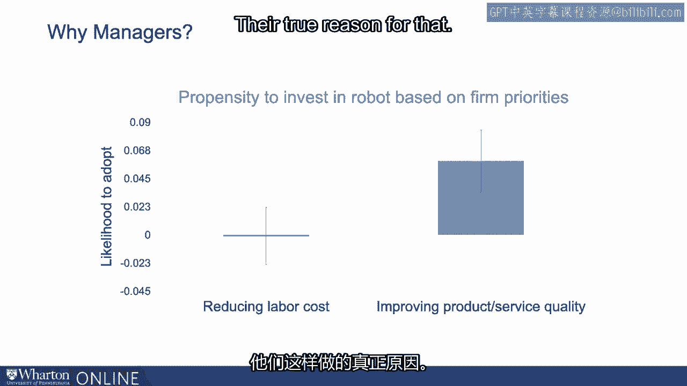

首先，记住我之前给你展示的图表，它最初显著下降。

然后在两年后达到平稳状态并再次下降。

如果你考虑自动化技术是由机器人和人工智能推动的，很多报告。

工具就像谁按时出现，是否完成了他们应该做的事情，打卡。

可以打卡，这些类型的工作可以相对容易地通过技术管理。

所以这让很多经理从事其他类型的工作。

监督角色实际上减少了很多。

所以可能对技术的影响是直接的。基本上技术。

我们扮演了一些管理职能。但他们仍然在管理人员。

技术可以捕捉一些监控技术，可以捕捉某些方面。

其中一些是监督角色，但不能捕捉到全部，甚至不是大部分。

记住两年后还有另一个下降。这很可能是因为就业组成发生了根本变化。

在机器人被采用后发生了变化。我这是什么意思？

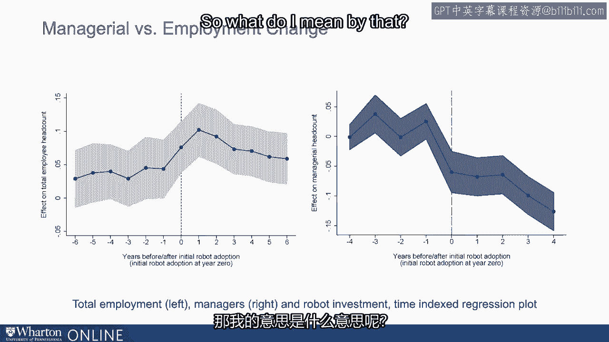

所以我实际上按他们所具备的技能类型对总就业进行了细分。

他们受过高等教育吗？他们是中等技能还是低技能？

高技能工人则是拥有大学学位或研究生学位。

中技能工人是指你高中毕业后拥有一些技能。

一种认证。两年，两个学位，某种职业技能认证。

低技能工人是指只有高中学历或更低的人。好的。

如果你观察机器人对高技能、中技能和低技能工人的影响，看看如何。

他们看起来不同。第一个条形图只是总就业。我已经给你展示过了。

这里的每个条形图显示的是机器人对高中总就业的影响。

员工包括中技能员工和低技能员工。因此每个条形图显示的是效果。

注意到高技能工人的需求显著上升。对高技能工人的需求在机器人之后增加了很多。

与低技能工人相比，数值要小得多。低技能工人的数量也增加了很多。

所以高技能的增加远超过低技能的增加。

但注意到中技能工人的条形图是一个大负数。

尽管机器人提高了所有工人的失业率。

效果是多样的，你会看到一个巨大的影响。

对低技能工人有积极影响。对高技能工人也有一些积极影响。

但对中技能工人影响非常负面。

这很成问题，因为这改变了管理者所需的人才类型。

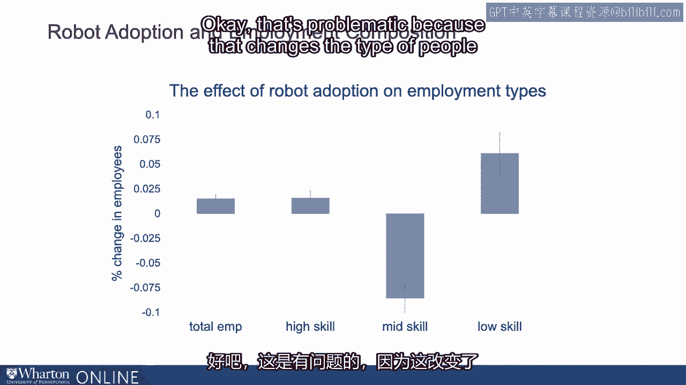

现在管理，进行监督。当就业构成发生如此大的变化时。

你所需的管理者类型也需要进化。

那么，管理高技能和低技能工人意味着什么呢？

管理中技能工人将会非常不同。

低技能工人的工作非常标准化。

你可以考虑亚马逊仓库的拣货和打包。你有相机，你知道的。

看向外面，准时到达与否。你可以在产品上放置每个扫描码。

你知道到底有多少箱产品和流程。

所有这些都可以追踪和监控。所以你可能不需要很多监督者来教低技能工人如何做他们的工作。

工作。几乎不需要培训，而且大部分都是标准化的，可以通过技术轻松监控。

与中技能工作相比，你可能需要更少的监督者。

但管理高技能工人也很不同，因为这些人可能。

专家本身。他们可能比监督者和管理者更了解如何做好自己的工作。

所以他们的管理者可能更像是顾问、教练，帮助他们。

按照应该的方式完成工作，而不是告诉他们具体怎么做。因此再次。

管理高技能工人所需的管理者类型或管理技能。

与中技能工人相比，可能会有很大不同。因此再次。

因为这种就业构成变化，你会看到低技能工人明显增多。

而且许多低中技能工人其实是中等高技能工人。

你确实需要不同类型的管理。

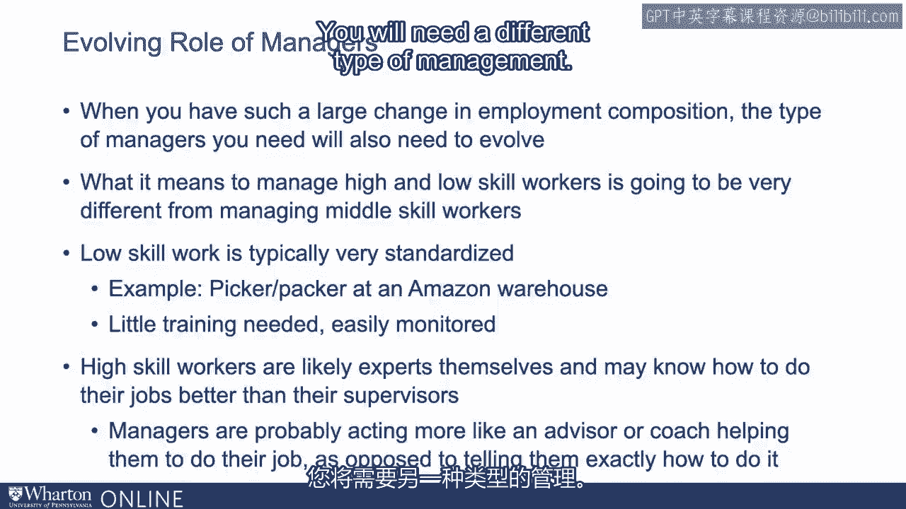

因此，结果是，你会看到平均而言，管理者数量减少。

这主要是因为大部分就业增长来自于低技能工人。

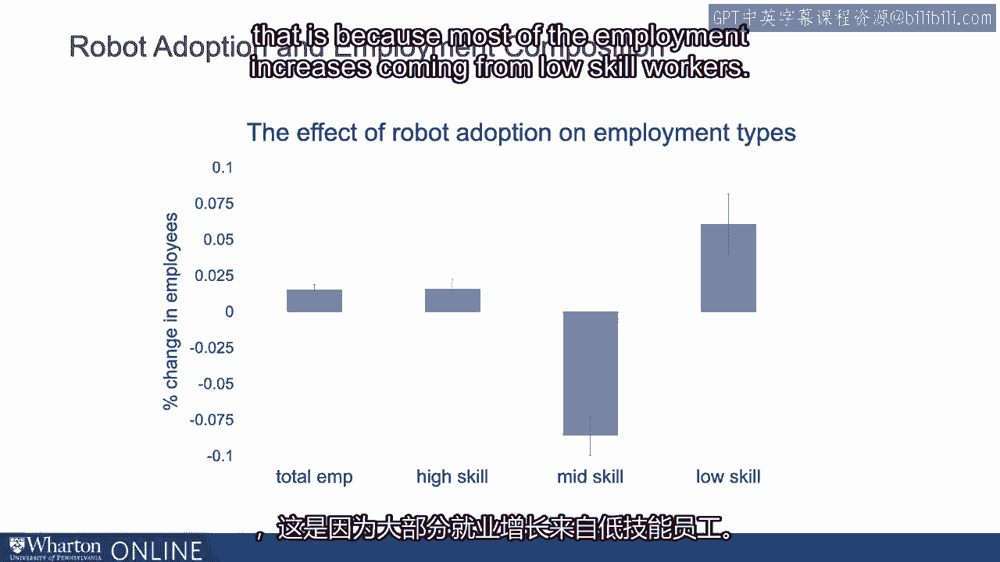

如果大部分就业机会都流向了高技能工人，结果可能会有所不同。

你可能没有看到管理者数量剧减。这是之前的情况。但无论如何。

我们管理的人员类型可能会有所不同。因此。

你所需要的管理者类型是不同的。数量减少。但更重要的是。

企业的运作方式正在改变，以适应或与机器人采纳共同发展。因此，具体来说。

我们考察了三种不同的企业实践。首先我们看控制范围。

平均而言，一个经理能管理多少人？

因此，如果我们的结果是正确的，意味着员工人数大幅增加。

平均而言，管理者数量减少，控制范围也应该增加。

在单个经理之下的人数大幅增加。我们独立测量过，询问经理他们管理多少人。

我们已经独立确认控制范围确实增加了。

因此，管理者必须管理比以前更多的人。

我们还关注工作可预测性。你在什么时候需要工作，实际上能预测到多大程度？

如果你考虑到机器人正在处理所有可预测的部分，你会记得。

AI机器学习是一个极好的预测工具，能够挖掘我们以前未见的模式。

并利用这种模式预测接下来会发生什么。

如果所有可预测的元素都将由机器人完成，可能会留下工人。

在所有不可预测的部分中。而且你确实看到，在引入机器人后，工作和可预测性大幅提升。

这也表明工作性质正在发生变化。最后。

如果你考虑到机器人可以减少生产中的方差，你会记得。

机器人使用算法可以不断重复同样的工作而不感到疲惫，且没有。

上洗手间时，不用休午餐。

他们可以在黑暗的房间里24/7工作，而不需要ECU。这种减少的方差也可能意味着你生产的东西可以被。

这更多地归因于你的努力和能力，而不是一些随机噪声。

因此，现在企业可能能够更准确地捕捉到你的具体贡献。

生产过程。因此，更容易将你的表现归因于你实际付出的努力。

个人薪酬表现也可能上升。我们确实展示了在引入机器人后，绩效薪酬有所增加。

但这些又在不断演变。我们仅仅触及表面。

但总体来看，我们确实看到机器人正在显著改变企业的运作方式，尤其是在如何方面。

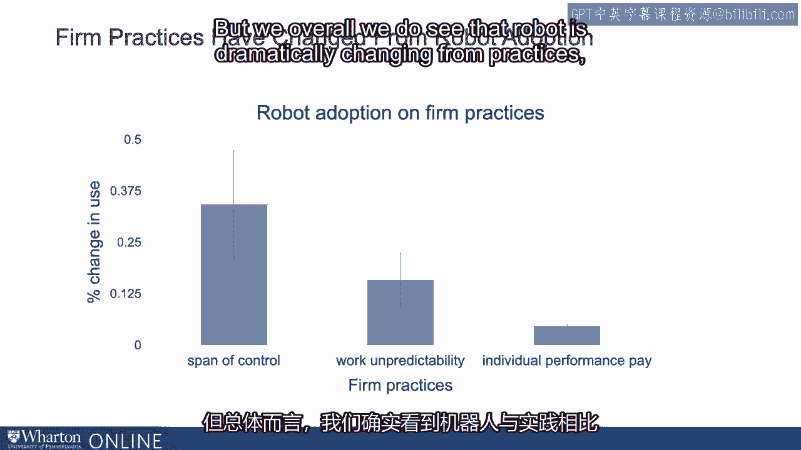

人们是如何被管理的。最后，我想让你看到这种戏剧性的变化不仅仅与人有关。

但是，决策权分配。谁在公司中为这些任务做决定？

你可以看到，机器人采用也在改变谁决定什么。

所以在第一个问题中，我们问谁决定谁接受什么培训？

在机器人采用之前，这就是我们看到的。我们看到中层管理者的情况。

管理者在你应该接受什么培训以及其他方面的决策上减少了很多。

你应该接受培训的内容。员工大多在为自己做这些决策。

在最左侧的条形图中，有九位管理者。因此，决策权正在从管理者转向非管理者，涉及什么类型的决策。

他们需要学习的内容，他们需要培训的种类。

对于CEO高层管理，这一事实几乎为零。

所以这真的是关于将决策权去中心化，从管理者转向非管理者。

我们也看到生产技术选择的决策权。

谁在决定使用什么生产技术？

在这里我们再次看到管理者失去决策权。

我们看到管理者不再像以前那样做决定，因为这一决策正在转移。

针对CEO、高管及其管理者。我们看到对于非管理者。

在这里几乎没有影响。对于管理者，中层管理者，所有者的数量大幅减少。

在CEO层面，这一决策权已经上升。你可以看到管理者的数量不仅在减少。

而且他们的职责也发生了根本变化，决策权也在集中。

去中心化的方式。

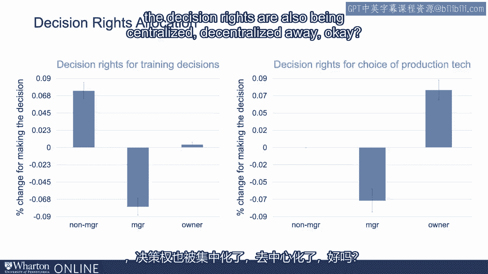

这个故事比以前微妙得多，因为当我们思考时，机器人和人工智能并不是应该。

改变管理者，因为他们管理其他人，人们管理其他人。我们还没有。

机器人能够执行管理任务的事实有点超乎想象。

但在这里我展示的时候并没有那么难，因为机器人可以做很多管理者能做的事情。

但从根本上说，因为管理者的类型和员工的类型都发生了变化。

这最终意味着所需管理者的类型是不同的。当你采用机器人和人工智能时。

这不仅仅是将现有系统插入、取出现有的，而是简单地将人工智能插入。

你实际上需要审视整个过程，因为会有连锁反应。

你所做的每件事，关于决策权、雇佣、流动性以及所需管理者类型。

各种公司实践和薪酬等。

所以说重要而深刻的决策，为此你需要弄清楚影响因素。

这些技术真的在改变吗？你该如何适应这种变化？

所以我给你一些想法，可能在哪里。但对管理者来说，具体审视他们的上下文是非常重要的。

这些过程正在变化。如果管理者认为这些技术会带来改变，可能会看到一些抵抗。

可能会取代管理者。这可能会造成一种情况，促使公司采用机器人或不采用。

而这实际上正是我们数据中某些两个案例发生的情况。

我们实际上看到，采用机器人的公司生产力远高于其他公司。

比非机器人采用公司雇佣更多的人。不论损失是什么。

不论你在大众媒体或早期研究中看到的损失是什么。

国家行业水平的研究表明，随着就业损失，实际上来自于。

不采用机器人的公司正在失去市场份额，失去竞争力，因为他们。

不管什么原因，没有采用机器人。

可能是来自于工人的抵抗，也可能有其他许多原因。但再一次。

机器人采用和人工智能并不是一个小的决策。

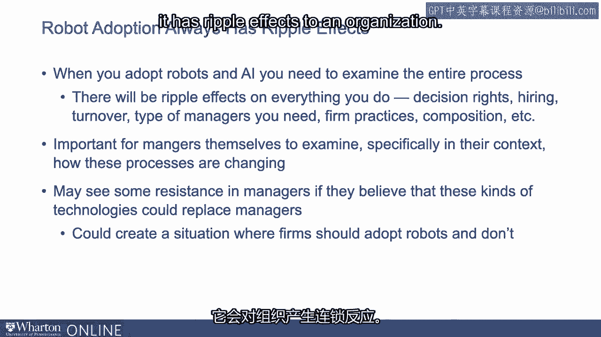

这对组织产生涟漪效应。最终得出的结论是管理者工作的性质正在改变，实践也在不断演变。

因此，我们已经证明，采用机器人技术的公司提高了生产力并雇用了更多人。

但仅适用于已经采用的公司。没有在同一部门采用的公司实际上经历了更大的就业损失。

我们看到这确实向管理者展示，机器人与更少的。

经理们雇佣更高的流动率，这不是由成本驱动的，而是由质量驱动的。因此。

机器人采用后人员的类型与之前的人员类型截然不同。

你提前管理的人。这意味着你会看到更多与管理相关的决策变化。

持续监测这一变化的发展并根据情况进行调整非常重要。

你的特定公司。

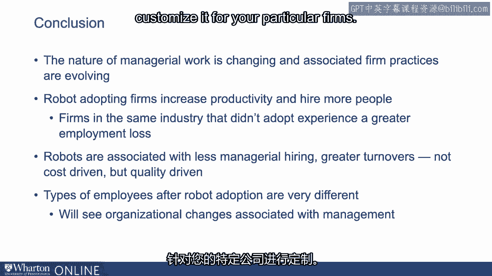

谢谢。[静默]。

