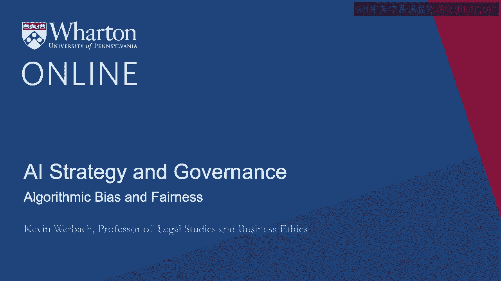
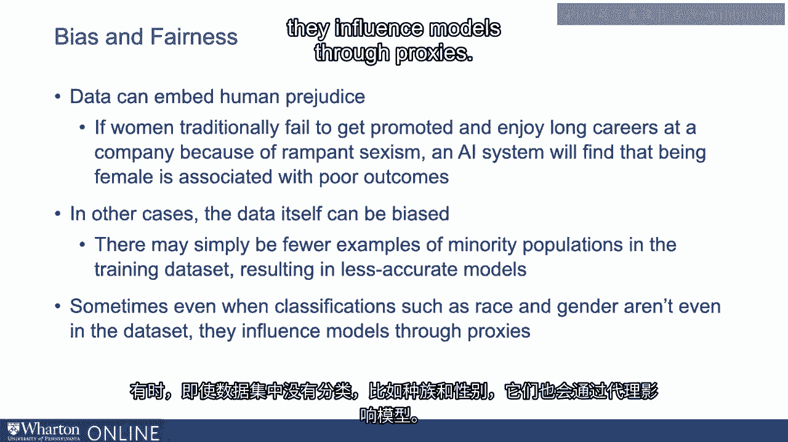
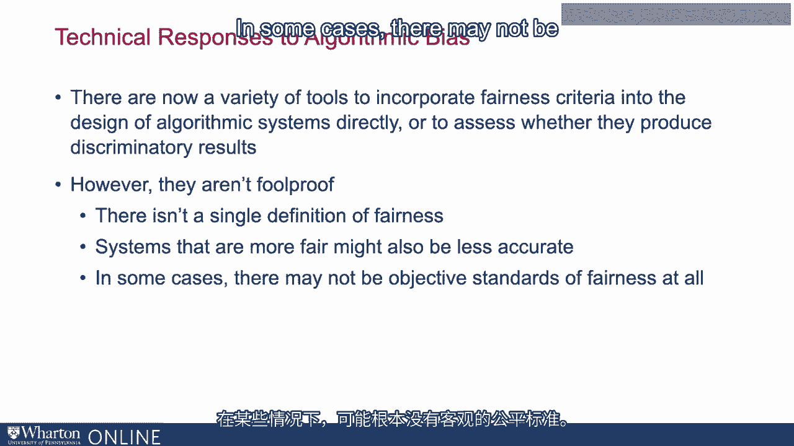
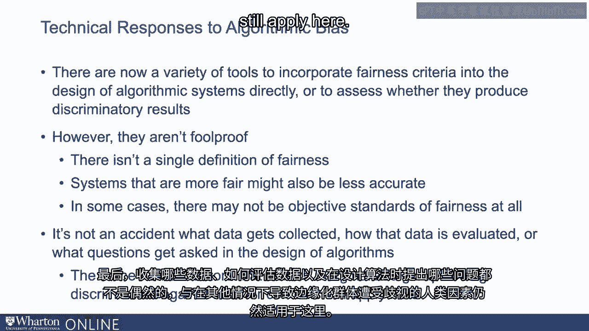
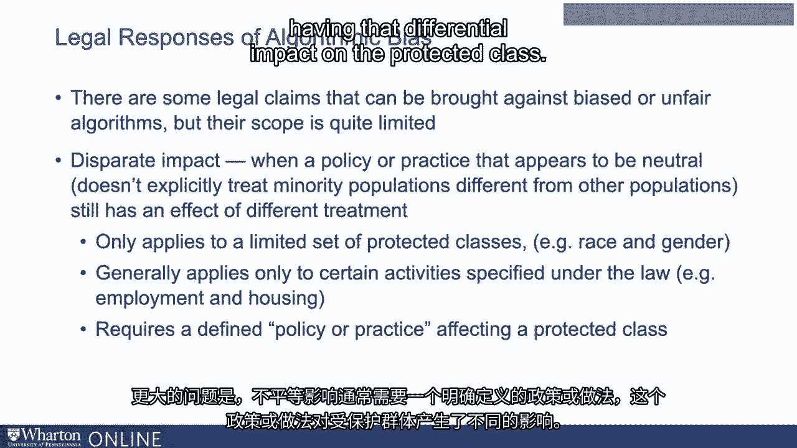
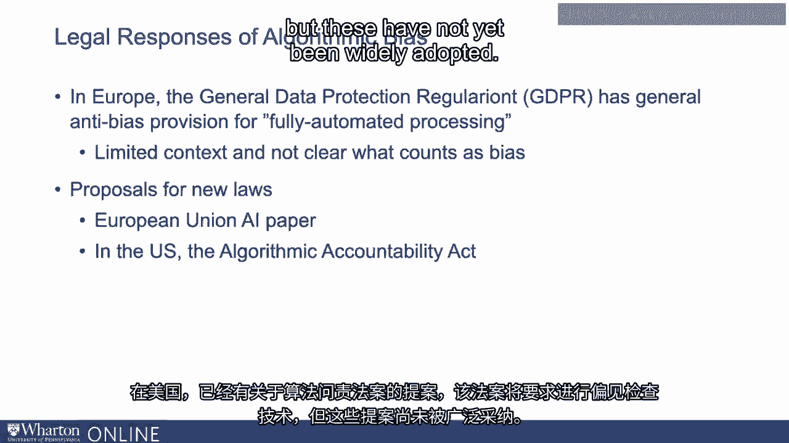
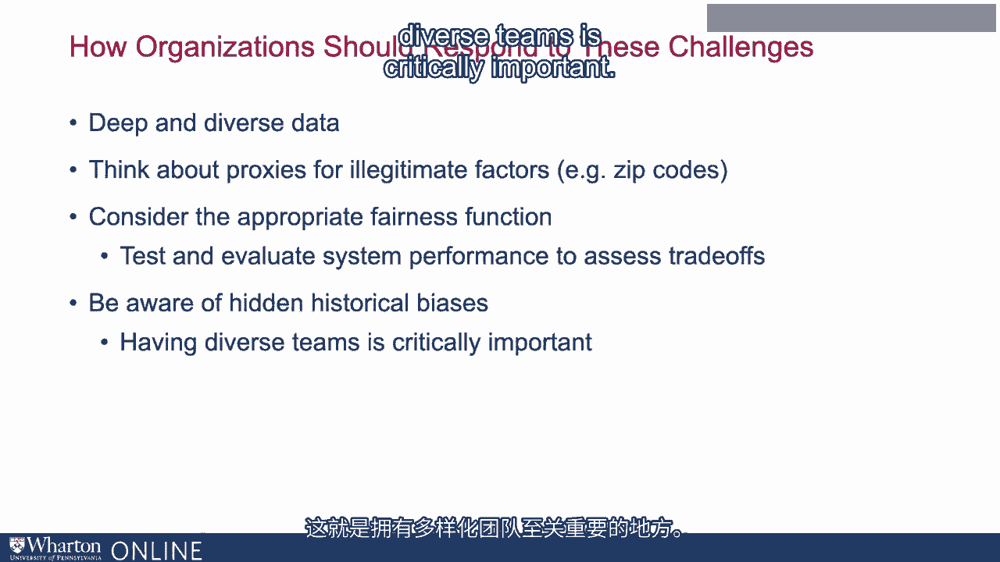

# P124：23_算法偏见和公平.zh_en - GPT中英字幕课程资源 - BV1Ju4y157dK

我是凯文·沃巴克，沃顿商学院法律研究与商业伦理教授，我在工作。

在人工智能和分析的伦理与责任问题上。算法偏见和公平性。你会认为人工智能的一个主要好处是它克服了人类的偏见和盲点。你是对的。人类容易受到刻板印象、隐性偏见甚至明确歧视的影响。一个人工智能系统只是看数据。然而，认为人工智能本质上是客观的，这种想法是危险且误导的。

它实际上可以复制甚至强化人类偏见，产生深刻的不公平。算法偏见在伦理上是错误的。它对边缘化群体有害。这可能会引发员工、客户和其他利益相关者的反感，甚至可能导致。可能会导致法律后果。2019年，一项关于波士顿一家大型学术医院的研究发表在《科学》杂志上。

研究人员发现了一个护理管理算法。如果患者风险较高，算法会推荐他们获得额外资源。该程序所推荐的平均黑人患者的潜在疾病几乎是双倍。与平均白人患者的情况相比。换句话说。黑人患者必须病得更重才能获得同等水平的护理。当研究改变了算法，使得同样生病的白人和黑人患者。它的应用几乎使符合条件的黑人患者的比例增加了三倍。这不是一个独特的问题。人脸识别系统已被证明对深色皮肤的面孔准确性较低。

像亚马逊这样的公司使用的招聘算法，基于简历预测工作表现。已被发现对女性不利。文本生成和机器翻译系统施加性别歧视的关联，有时甚至是种族主义的。关联。例如，如果你从匈牙利语翻译，匈牙利语有性别中立的代词。在匈牙利语中没有他或她，但如果你将匈牙利语文本翻译成英语，在主要搜索中会出现。

在搜索引擎中，它会将“他”作为教授和政治家的代词，而将“她”用于洗衣工。这些菜肴和助手。这里发生了什么？首先，数据可以嵌入人类偏见。如果女性传统上在公司内难以晋升并享有长时间的职业生涯，因为。在普遍的性别歧视下，人工智能系统会发现女性与不良结果相关联。

在医疗保健的例子中，问题在于该算法使用了先前的治疗。成本作为患者病情的代理。问题在于黑人患者的护理通常较差。即使她们同样生病或更严重，花费在她们身上的钱也会更少。在其他情况下，数据本身可能存在偏见。训练数据集中可能少了少数群体的例子。

在较不准确的模型中，这似乎是面部识别中发生的部分原因。系统有时即便在数据中没有种族和性别的分类。这些因素通过代理影响模型。

邮政编码只是一个地址标记，但它可能与种族或。例如，社会经济地位。有多种工具可以将公平标准纳入算法设计。系统直接或评估是否产生歧视性结果。然而。它们并不是万无一失的。首先，公平的定义并不统一。北点指南系统曾用于提供假释建议，颇具名声。对黑人的错误率高于对白人的错误率。然而。给定两个在各方面都相同但种族不同的囚犯，通常会分配相同的评分。在这种情况下，个体和群体层面的公平是衡量公平的两种不同方式。

显示这些目标在数学上是根本不可能同时实现的。必须做出选择和权衡。更公平的系统可能准确性较低。我们必须在这些系统的设计中做出选择。在某些情况下。可能根本没有客观的公平标准。

如何决定社交媒体新闻推送是否对保守派或自由派有歧视。例如，依赖于对什么应为基线的主观决定。符合这些政治类别的内容，等等。这并不是说我们不能评估这种主张。我们只是无法写出一个关于“中立”新闻推送的客观规范。

这并不存在，因此最终数据的收集并非偶然。数据的评估方式或在算法设计中所提出的问题。导致边缘化群体在其他方面受到歧视的人为因素是相同的。这种背景在这里同样适用。

现在可以对有偏见或不公平的算法提出一些法律主张。但它们今天的适用范围相当有限。适用的主要法律类别是所谓的不同影响。一个表面上中立的政策或做法，并不会明确地对待少数族裔群体与其他群体不同。它仍然可能产生不同的待遇效果，这被称为不同影响。

问题是该法律领域通常相当有限。它只适用于有限的受保护类别，通常是种族和性别，及。它通常只适用于法律中规定的某些活动。在美国，这基本上涉及就业和住房。更大的问题是，不同影响通常需要明确的政策。或者实践中对保护类群体产生差异影响的行为。

美国最高法院表示，仅仅显示统计差异是不够的。显示出对保护类群体有更糟影响的证据是不够的。必须采取某些明确的步骤，某项政策，仅仅使用算法是不够的。这本身并不足够。因此，歧视法的结构与算法系统出现的问题之间存在脱节。

与算法系统相关的问题。在欧洲。一般数据保护法规的某些条款中包含反歧视条款。处理所谓的完全自动化处理。但这在其背景上是有限的，而且相当模糊。目前还不完全清楚如何应用这一点。各个司法管辖区提出了多种新法律的提案。欧盟正在考虑一项重大的新人工智能法律，他们已经就此发表了讨论文件。而在美国，关于所谓的算法责任已经提出了一些提案。

该法案将要求进行偏见检查技术。但这些尚未得到广泛采用。

那么，组织应如何应对这些挑战？首先。确保你的训练数据集深厚且多样。它必须在不同的多样性度量上有足够的示例。考虑要警惕的代理因素，那些表面上中立的东西实际上可能编码了。保护类群体的一些特征。思考哪个公平函数对你的应用最有意义。有多种不同的方法可以在数学上定义公平算法是什么。在不同的上下文中，可能适合不同的方案。基于这些指标测试和评估你的系统。再一次。

现在有一些工具可以让你评估其影响。最后，要意识到潜在的历史偏见。这就是多元化团队至关重要的地方。

如果在过程中有经历过歧视的人，他们会。在设计时，他们更可能意识到并标记出出现的问题。一种人工智能系统。[BLANK_AUDIO]。

