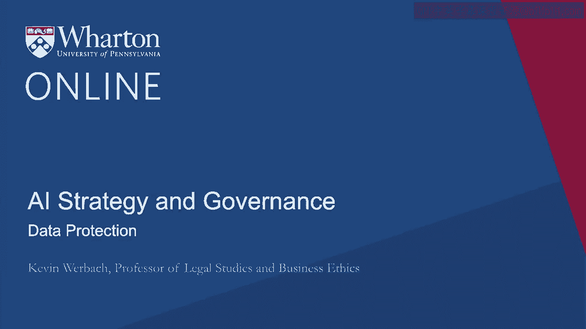
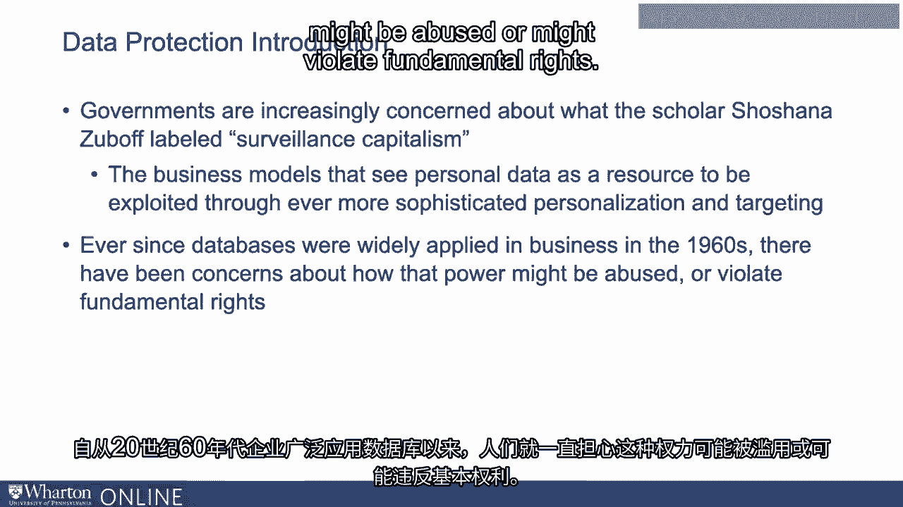
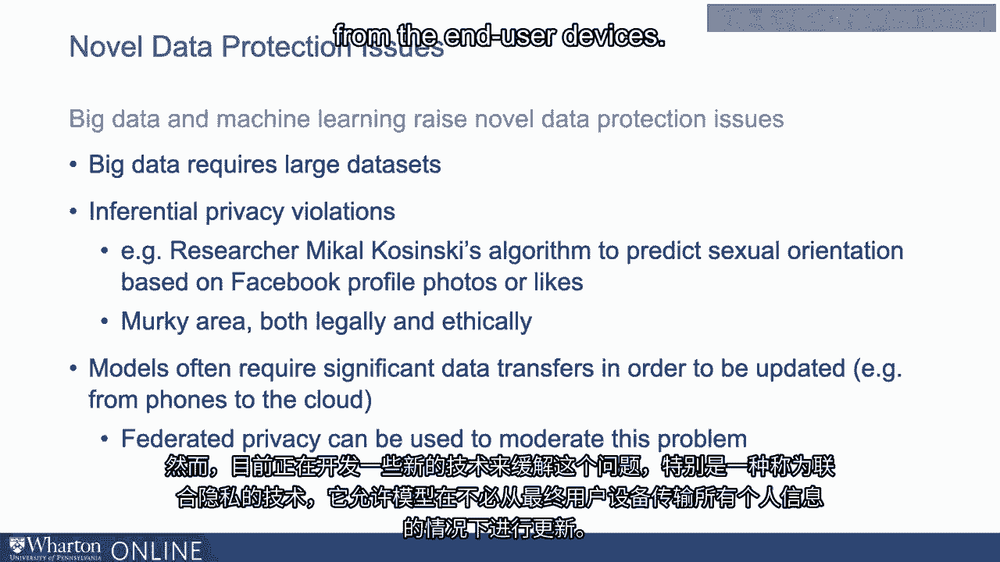
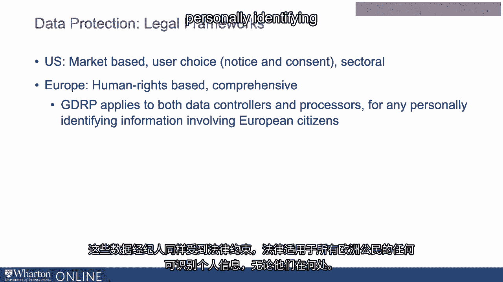
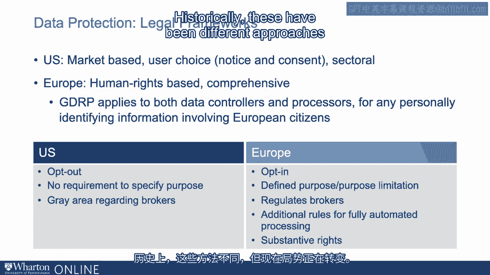
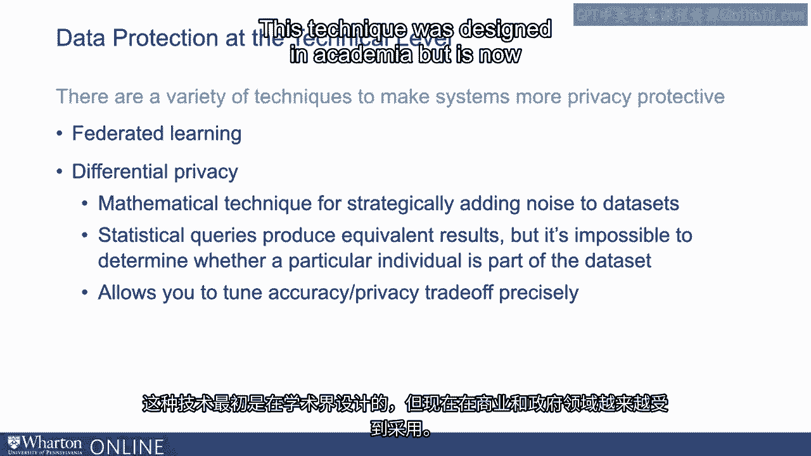
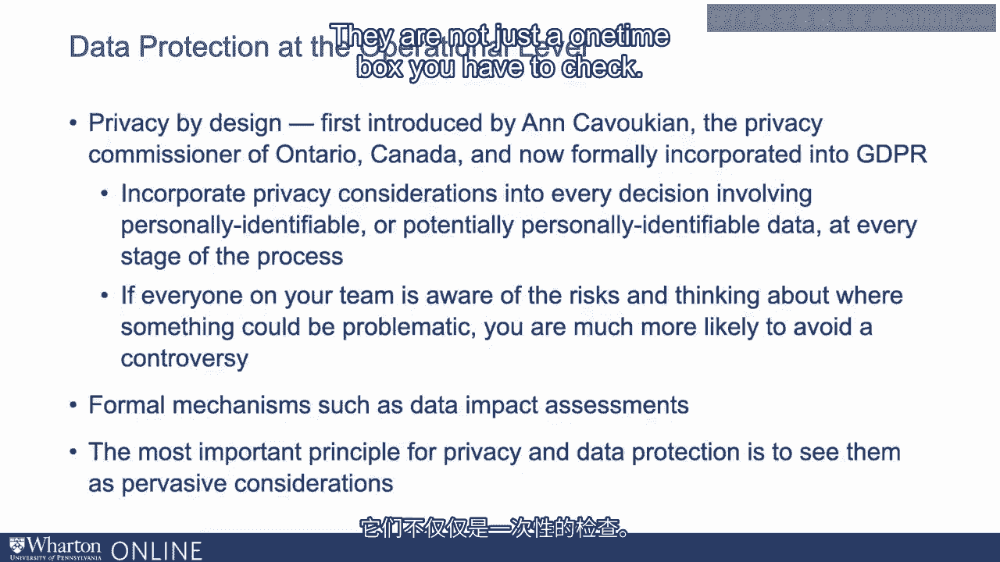

# P126：25_数据保护.zh_en - GPT中英字幕课程资源 - BV1Ju4y157dK

人工智能和分析依赖于数据，大数据。

你在这个课程中学到了聚合和分析的一些技术。并应用数据来推动机器学习和其他类型的算法。与此同时，尽管人工智能取得了飞速发展，但围绕这个问题的关注也在增加。数字隐私的世界。各国政府对学者肖申娜·祖博夫所称的。

“监视资本主义。”商业模型将个人数据视为可以通过不断。更复杂的个性化和定位。这些问题值得注意的是，已经存在很长时间。自从20世纪60年代数据库广泛应用于商业以来，人们就一直对此感到担忧。关于这种权力可能被滥用或可能侵犯基本权利的考虑。

然而，大数据和机器学习引发了新型的数据保护问题。首先。他们需要如此大量的数据。机器学习的价值往往来自于能够使用庞大的数据集。更多的数据意味着需要从更多的人那里收集更多的信息。以及整合不同数据集和不同信息的更多机会。

这些信息单独来看可能并不令人担忧，但总体上构建了一个全面的用户画像。个人。第二个是所谓的推断隐私侵犯的可能性。随着机器学习和其他数据分析技术的发展，有时你甚至不需要。要求某人提供一条可识别个人身份或敏感信息，以便弄清楚。

例如，研究员迈克尔·卡辛斯基构建了一个能够可靠地。根据Facebook个人资料照片预测性取向。系统不需要直接从用户那里收集性别或性取向的信息。它只是通过关联弄清楚了。这是一个模糊的领域，在法律和伦理上都存在问题。

用户通常关心。用户常常认为如果你能够弄清楚某件事，并基于敏感信息定位我。特征在于它类似于或相当于你故意。让我提供这些信息。人工智能机器学习的第三个新问题是，模型通常需要大量数据。更新所需的转移。当数据从许多用户那里收集时。

例如，通过手机活动获取的数据，然后在云中聚合并集中处理。然后必须进行所有这些个人数据在网络中的转移和在云中的存储。然而，有一些新的技术正在开发中，以调节这个问题，尤其是。一种被称为联邦隐私的方式，允许模型在不必。

将所有个人信息从终端用户设备转移。

关于数据保护的第一件事是，它不仅仅是一个问题。关于收集的五个阶段，称为隐私生命周期。每一个都是在开发您的人工智能解决方案时需要考虑的重要因素。第一个阶段是收集。这是获取用户信息的明显环节。第二个是聚合与分析。有时问题不仅在于收集了什么信息，还在于对它的处理。正如我所说，有时用户可能只提供少量信息，但这些数据。集合与其他地方收集的其他数据集整合在一起。有时是数据的分析和特征工程，*最终带来*。

关于隐私的担忧。第三步是存储。而这是一个经常被忽视的问题。如果您使用一个大型数据集来推导机器学习算法，那么。那个数据集就成了巨大的安全风险。我们通常将安全视为与隐私不同，但您拥有的私人数据越多。您拥有的数据越多，您对安全的担忧就越大。

即使您没有做任何非法或不道德的事情，如果您的数据被黑客入侵。而私人数据被外泄，这就成了一个巨大的问题。因此，存储和维护以及关于您存储和保留哪些数据的决策变得至关重要。作为隐私的一项重要事项。第四是使用。有时数据的收集是可以的，但数据被用于用户不认同的原因。

可能会引起担忧。如果例如您的医疗实践收集了非常敏感的健康数据。您可能会觉得这样做没问题。这对您的医疗治疗是必要的。但如果他们随后将其出售给为其他产品营销而使用的聚合商以获取利润。如果它是提供给您的，那么您可能会感到担忧。您认为这不是一个合适的用途。

学者海伦·尼斯巴姆对此有一个影响深远的概念，称为上下文完整性。人们希望数据被用于他们同意收集的上下文中。隐私生命周期的最后阶段是分发。如果公司转移或转售数据，这些数据去向何处？

制造数据是庞大的数据经纪经济的基础。如果根据收集合同授权，通常不算是非法的。并传输数据。但这是一个用户常常非常关心的问题，同时也是一个。这引发了额外的安全担忧。如果您非常小心处理数据，但随后将其转移给第三方。

哪一方不是？这就成了一个问题。因此，您需要考虑五个阶段。基本上，隐私法有两种主要的做法。美国的做法与主要在欧洲发展但已被采纳的方法。在世界上许多其他国家。美国的方法通常是基于市场的。这个理念是创造一个功能市场，其中存在交易。不存在市场失灵。人们没有受到虐待。人们的数据不会被盗取。只要有基本通知和基本同意，用户有一些选择的理念。根据美国的方法，数据是合法的市场。美国的方法也是分部门的。

目前美国没有全面的数据保护或隐私法律。在某些特定领域，如医疗或消费者金融，有适用的规则。在联邦贸易委员会之下有一般的保护措施，主要涉及消费者保护。但在某些情况下，它已适用于隐私。这是美国方法的一般基础。欧洲的方法截然不同。它基于人权。基于数据对我们人性的重要性，这一问题关乎。基本人权。这是全面的。人类法律适用于所有潜在情况下的所有类型的收集。它适用于各种参与者。通用数据保护条例现在是欧洲主要的隐私法律。

欧盟适用于所谓的数据控制者。收集数据的人以及第三方数据处理者。这些数据经纪人同样受到法律的约束。它适用于任何个人识别信息或可能变成个人识别信息的内容。个人识别任何在欧洲的公民，无论他们身在何处。

所以它比美国的方法更广泛、更全面、更详细。这两个框架之间有各种差异。例如，欧洲框架是选择加入。数据收集前必须获得用户的明确授权。必须出于特定的法律目的。你不能收集数据而不知道用途。你必须证明你收集数据的理由是合法的。你必须限制对数据的使用目的，除非你获得进一步的同意。用户的同意。在美国，普遍的默认标准是选择退出。没有普遍要求你具体说明数据收集的目的。

欧洲明确监管经纪人，而在美国则处于模糊地带。欧洲对所谓的完全自动化处理有额外的规则。当算法完全为重要或法律上显著的后果做出决定时。有专门的规则规定可以对数据做什么。而且欧洲有一整套实质性权利。你拥有的明确权利。例如，有能力进入并纠正关于你的不正确信息。所谓的被遗忘权。要求从数据库中移除某些数据的权利。所以历史上这两者的方式是不同的。

但实际上，潮流正在转变。世界正朝着更接近欧洲方法的方向发展。我称之为欧洲方法。但许多其他主要管辖区的法律更像GDPR，而不是美国的方法。像日本、南美的管辖区，甚至是中国这样的巨大市场，许多人。人们通常认为这些地方没有显著的隐私担忧。

中国的消费者和政府。中国私营部门的人们对收集的隐私有严重担忧。针对私营公司收集的数据。大中国数字平台（如腾讯和阿里巴巴）收集的数据隐私。而中国现在的数据保护法虽然并非完全相同，但看起来有些相似。类似于欧洲的全面规则。

因此，世界大多数地方都有全面的隐私法，美国也在朝这个方向发展。在联邦层面上，已经有几个倡议朝着全面隐私法的方向发展。在美国，各州已经通过了相关法律。值得注意的是，加州消费者隐私法案施加了更显著的明确权利。

数据收集的空间限制。欧洲和其他管辖区也在进一步推动更多要求。针对涉及高风险数据收集的AI系统的明确保护。例如医疗数据收集或更容易导致风险的数据收集。关于歧视和偏见的议题。因此，我们似乎在看到一场竞争向更高标准发展的趋势。

我们似乎在全球范围内看到一些国家和其他管辖区的保护不足。随着隐私的提升，跨国公司如果需要，也会获得更多保护。要么遵循主要管辖区内最严格的规则，要么拥有多个系统。通常做出决定的是实施一些更具保护性的措施。因此，这一点你需要理解，当然要了解你所在特定管辖区的规则。但是要意识到你在实践中面临的要求可能更严格。顺便提一下，欧洲GDPR适用于任何地方的欧洲公民的数据。可能在其他地方注册的公司仍然受到这些规则的约束。

非法律合规，你应该怎么办？在构建AI项目时，考虑数据保护至关重要。技术层面和操作层面。如我之前提到的，有多种技术可以使系统更加保护隐私。保护性。联邦学习是其中之一。另一个重要的概念是差分隐私。差分隐私是一种通过战略性地向数据集添加噪声的数学技术。

结果是统计查询产生等效结果，但要确定一个特定个体是否属于数据集是不可能或更困难的。确定某个特定个体是否属于数据集。仅仅执行查询并不会泄露用户在数据集中的信息，而差分隐私则提供了技术保障。隐私允许你调整保护程度，因为存在权衡。

在数据中加入更多噪音，使其更加保护隐私可能会降低准确性。所以通过差分隐私，不同的项目可以决定他们需要多少隐私保护。想要实施。该技术最初是在学术界设计的，但现在越来越多地被商业和。

例如，Uber在内部查询乘客数据时使用差分隐私。苹果在iPhone上收集的数据中使用差分隐私。而美国人口普查正在对其收集的数据集使用差分隐私。关于2020年美国人口普查的每个人的大规模数据集。另一种可以应用的技术是超越这些技术机制进行思考。关于操作层面。操作层面涉及商业技术。在实践中使用的机制，以及你在数据收集周围的组织作为商业事务。以及你的AI系统开发，超越技术设计决策。

该领域有一个主要概念叫做设计隐私。该概念最初由安妮·卡伏基安提出，她当时是安大略省的隐私专员。加拿大，但现在已正式纳入欧洲GDPR和其他机制中。设计隐私的理念是，你应该将隐私和数据保护融入。在涉及个人可识别或潜在个人数据的每个决策中考虑这些因素。可识别的数据。你在每个阶段都要做到这一点。记住。隐私和数据保护不仅仅关乎收集，而是关于所有这五个阶段。如果你团队中的每个人都意识到这些风险，并考虑在哪里可能出现问题。

这可能会有问题，你更有可能避免争议。还有可以应用的正式机制，比如数据影响评估。美国提出的算法责任法等两项法律将会。需要这些机制。这类似于已在政府背景下使用的环境影响评估概念。在环境保护方面，几十年来需要正式报告以识别数据风险。实施一个主要或高风险系统的数据泄露。但这并不适用于每个系统，这样会过于繁琐。只需决定何时需要实施正式流程。

隐私和数据保护最重要的原则是将其视为无处不在。它们不仅仅是你必须检查的一次性项目。

我遵守隐私规定。你可能需要满足特定的法律要求，但你必须始终考虑。这里可能会发生什么？哪里可能出现问题？

我在哪里可以做得对，但第三方或攻击者获取数据和。我受到客户的指责。你需要在每个阶段都考虑隐私问题。[空音频]。

