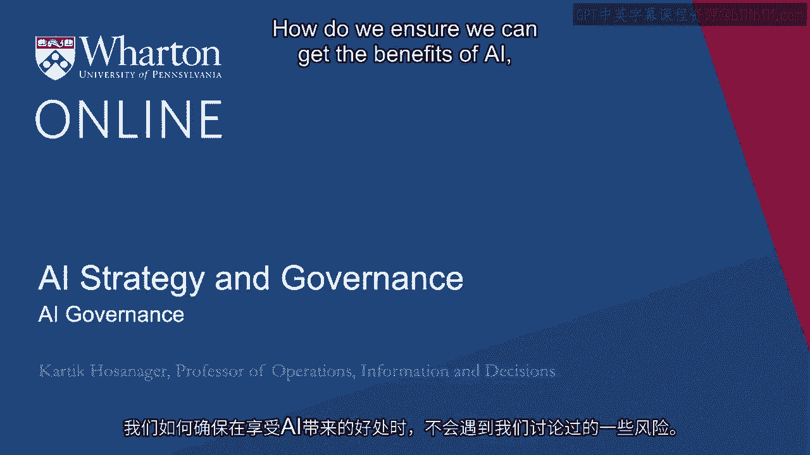
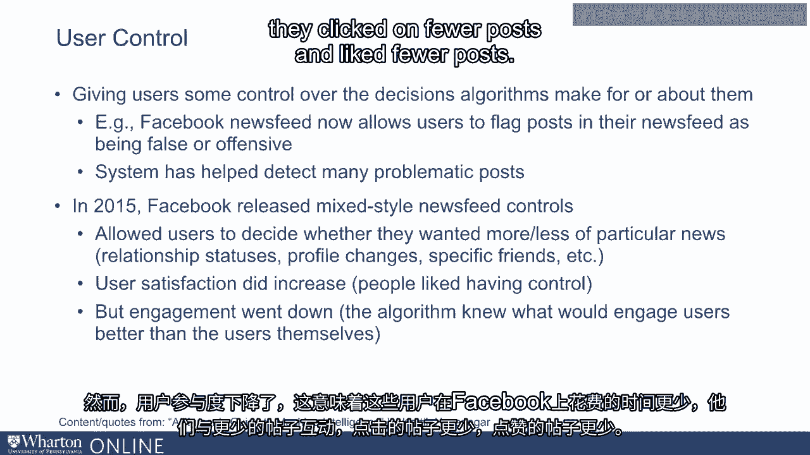
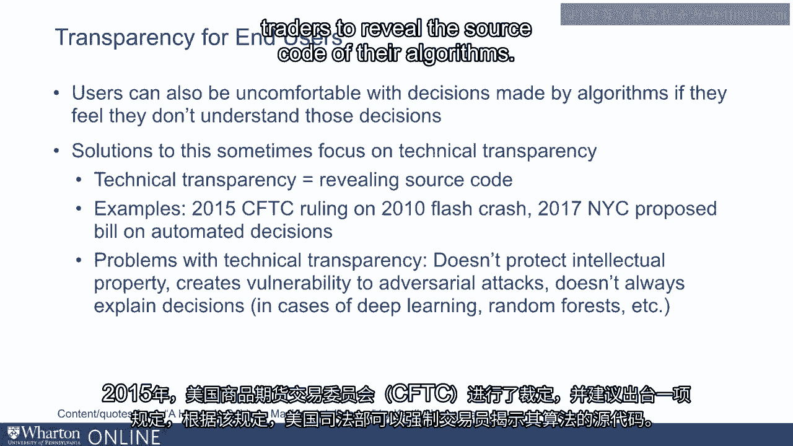
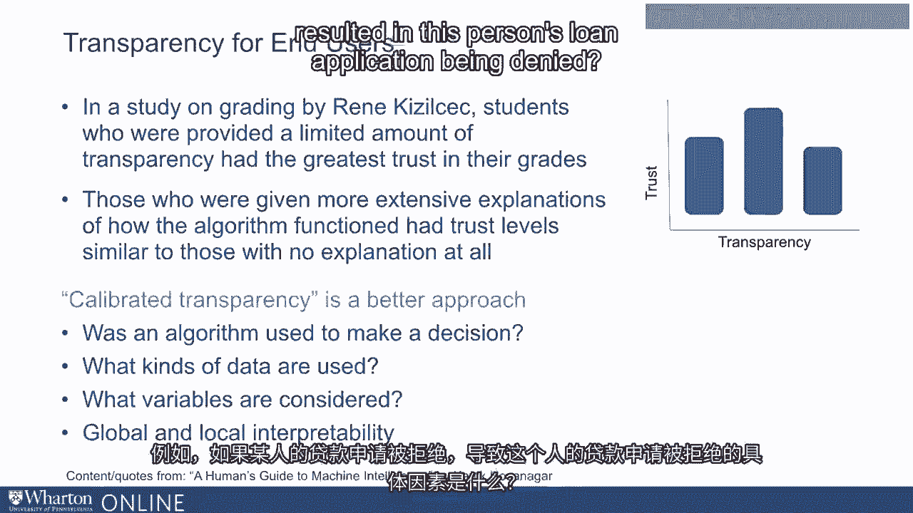
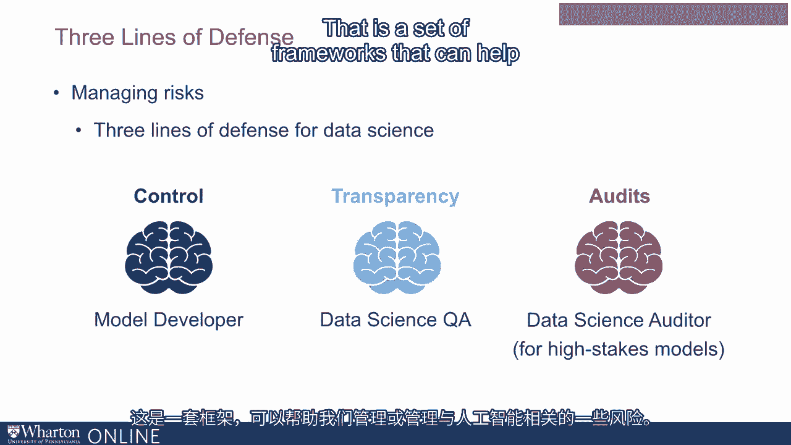

# P128：27_AI治理.zh_en - GPT中英字幕课程资源 - BV1Ju4y157dK

在这次讲座中，我们将讨论AI治理。

我们如何确保在没有风险的情况下获得人工智能的好处。

体验到我们讨论的一些风险？我主张有三个主要原则。

我的书《机器智能的人类指南》，以及他们的用户控制、透明度和审计。

让我们逐一查看每个方面。首先是控制。

这是让用户对方式有一些控制的想法。

算法为他们做出决策，换句话说，就是让人类参与其中。

让我们考虑一些例子。首先，让我们看看Facebook新闻推送。现在。

Facebook的新闻推送在2016年遭遇了一些批评。

因为平台上有一些假新闻故事在传播。对此，Facebook做出了回应。

Facebook实施了许多变化。其中一个关键变化是允许用户。

能够标记他们认为不合适的新闻推送。

这些帖子要么是假新闻，要么在某种程度上具有冒犯性。这个功能让用户控制，并允许用户提供反馈。

向算法本身反馈某些决策。

识别出那些有问题或不正确的内容。这也有助于算法的学习。

实际上，在过去一年中，这个功能。

事实上，这个功能帮助Facebook检测了许多有问题的新闻帖子。现在。

即使控制听起来像个简单的想法，这里有许多细微差别。

需要谨慎对待这个问题。一个需要谨慎对待的例子。

这个概念来源于Facebook。2015年，Facebook发布了几种混合风格的新闻推送控制。

所以用户可以精确控制新闻推送中出现的帖子类型。例如。

他们可以说，给我显示这些朋友的更多帖子，或者减少这些朋友的帖子。

他们可以说，给我显示更多或更少的关系状态。

不显示我不想看到的消息，或者不显示我不想看到的资料变更消息，等等。

Facebook对少数用户测试了这个功能。他们发现这些用户的满意度。

实际上，用户参与度下降了。然而，用户参与度确实增长了。

这意味着这些用户在Facebook上花费的时间更少。他们参与的帖子也更少。

他们点击的帖子更少，点赞的帖子也更少。

所有这些都表明算法在展示用户所需帖子方面并不那么有效。

他们会发现有趣的内容。我们实际上已经在多个其他场合看到了这一点。

特别是算法和人工智能在自主模式下表现良好。

但当用户可以有一些控制时，某些表现实际上会下降。

所以，虽然我建议让用户掌控是好的，但过多的用户控制存在一个风险。

其中一个风险是性能可能下降。所以必须认真考虑如何设计系统。

这使用户能够控制并帮助标记出现的问题。

但同时，又不会因为用户控制过多而遭受一些性能问题。

现在，我的研究以及许多其他人的研究。

建议存在设计这些控制的方法。

一项由我的一些同事在沃顿进行的最新研究。

评估用户控制对信任的影响。在他们的实验中，用户被要求预测。

高中生在标准化考试中的分数。

基于他们对这些高中生的一些信息。

允许用户咨询算法。这些实验中的用户或对象。

被分成四组。第一组对算法没有控制。

他们必须决定是否想使用算法。

但如果他们决定使用算法，那么算法建议的任何内容。

那将是他们的选择。第2组和第3组对算法的控制非常有限。例如。

第2组能够在某些情况下推翻算法或AI。

但总体上非常少见。而第3组被允许推翻算法。

或者通过小幅度改变算法的预测来改变模型。

最后一组对算法拥有完全控制。

然后评估用户对算法的信任。他们多频繁想使用算法？

或者这些用户中有多少希望使用算法？

他们发现没有控制的用户信任度低。他们更不愿意使用算法。

即使只有一点控制的用户，信任度也很高。

他们更愿意使用算法。有趣的是。

他们发现控制的数量并不重要。

无论用户有少量控制还是大量控制。

信任水平持续保持高水平且相似。简而言之，这项研究显示。

一点控制对于建立用户信任非常有效。

但你不一定需要很多控制。另一方面，研究表明。

控制有时会导致性能下降。将两者结合，意味着。

我们需要给用户足够的控制，以便他们可以推翻算法。

或者对算法如何做出决定有一些控制，涉及他们自己。

但这并不意味着算法不能独立做出决定。尤其是。

在这种情况下，目标是给予用户推翻算法的能力。

当他们发现问题时。关于Facebook的想法是，算法会弄清楚。

如何在信息流中对帖子进行排序，用户可以反馈并表示或指示。

当某些问题帖出现时。再次，这里的想法是当事情出错时。

用户可以提供反馈。因此，用户控制的想法。

本质上是给用户在产品设计和用户界面中足够的选项。

这样他们就可以指导算法的表现，实际上。

甚至在他们注意到问题时，可能会否决它。

下一个原则是透明度，意味着给予用户足够的信息。

关于算法如何为他们做出决策。现在，透明度是一个有趣的概念。

对此有许多解释。其中一种解释是透明度。

是我们必须揭示算法的源代码这一想法。

这有时也被称为技术透明度。

2010年美国股市崩盘时。

针对股市闪电崩盘进行了调查，调查表明。

自动交易算法在2015年闪电崩盘中发挥了作用。

CFTC（商品期货交易委员会）做出了一项裁决，并建议一项规定。

他们建议司法部可以强迫交易者公开他们算法的源代码。

交易者和大多数行业专业人士对此表示抵制，因为这将导致。

他们被迫揭示自己的专有知识产权。事实上，最终的裁决。

在2017年，规则被修改，使这些公司不必分享他们的源代码。

纽约市也提出了一项关于自动决策的法案。

该法案要求所有供应商。

提交由市政府使用的软件，这些软件由市政府使用。

进行自动决策的机构将被要求揭示他们的源代码。

并使其公开可访问。供应商再次抵制，因为这。

会导致他们放弃自己的专有知识产权。此外，这还会让黑客。

评估他们的代码，识别代码中的漏洞并攻击代码本身。现在。

在这个实例中，裁决或法案也被修改。

最终决定技术透明度并不是最佳解决方案。因此在许多情况下。

我们已经看到，透明度的概念不应是技术透明度，意味着揭示。

向公众公开源代码。事实上，甚至不清楚这样做是否真的有价值。

因为不清楚普通人是否真的能评估源代码并据此采取行动。

现在，可能有用的透明度类型是更高层次的东西。

研究员Renee Kieselchak最近进行的一项研究评估了透明度如何影响用户信任。

算法中的决定。在研究者进行的实验中。

学生们的作业成绩是通过算法确定的。

一些学生未获得关于算法如何决定成绩的信息。

信任度非常低。另一组学生获得了一些最基本的信息。

关于算法如何决定成绩。换句话说，给予的是高层次的信息。

关于算法所考虑的因素，以及提供他们直觉的一些基本解释。

关于算法的设计。当这种透明度提供时，信任显著提高。

第三组获得了非常高的透明度。

在这里，他们获得了用于算法的详细公式和非常详细的具体信息。

该群体的信任实际上保持较低。这部分是因为这些用户并不是。

能够评估复杂信息并加以利用。

所有这些表明，对于最终用户来说，我们不需要太多透明度。

我们只需要基本信息，例如，是否使用算法做出决策。

算法使用了哪些数据？

考虑了哪些变量，哪些变量对这个决策最重要？

这是一个变得越来越重要的想法。

在机器学习中，有一个专注于可解释决策的子领域。

或者可解释的机器学习。这个领域有两个主要思想——。

全局和局部可解释性。全局可解释性是提供高级反馈。

向用户或其他任何人说明，最重要的变量或因素是什么。

驱动算法或模型的决策或预测的因素。

局部可解释性是关于提供反馈的。

关于驱动特定决策的最重要变量或因素是什么。例如。

如果个人的贷款申请被拒绝，具体的因素是什么。

导致这个人的贷款申请被拒绝？

很多法规正在朝这个方向发展。我之前提到过欧盟有一项叫做GDPR的法规。

这赋予消费者解释的权利。因此，如果公司使用先进的机器学习。

像神经网络或随机森林这样的模型，则需要向消费者提供解释。

而可解释机器学习领域将变得相关，因为它允许他们。

向消费者提供关于驱动模型预测或决策的因素的高级解释。

现在，透明度还有另一个有趣的方面。

我们谈到了透明度与最终消费者的关系。

但透明度与管理者和数据科学家的关系也是如此。现在。

当数据科学家使用非常复杂的模型，如神经网络，来做决策时。

在贷款批准决策中，即使是数据科学家，也可能不知道是什么因素。

驱动模型表现的因素。因此，可解释的机器学习。

这不仅与最终用户相关，也与进行算法部署的数据科学家或管理者相关。

实际上正在部署这些算法。在这里，再次强调全局可解释性。

局部可解释性和全局可解释性都是重要的。正如我所说。

本质上是我们是否能以高水平进行解释的想法。

评估哪些是推动模型预测的最重要变量。

对于贷款批准决策，反馈可能是，贷款批准主要由此决定。

根据申请人的收入，其次是他们的信用历史。

还有第三个变量等等。如我所提到的局部可解释性。

关注的是对特定决策的最重要变量的反馈。

所以如果我的贷款申请没有被批准，那么局部可解释性就会。

涉及解释导致Karthik的贷款申请被拒绝的因素。

现在，这在机器学习中正变得越来越重要。

有许多开源工具和第三方供应商。

提供解决方案的公司，帮助增加可解释性或添加可解释性。

作为其机器学习活动的一部分。这不仅可以向消费者提供解释。

增加信任，它也可以在管理者之间增强信任。

正在尝试部署这些系统的人，此外，它们也可以成为调试的有价值工具。

我提倡的第三个原则是审核算法的理念，特别是。

在高风险环境中。实际上，美国国会这里有一个正在进行的监管提案。

这被称为算法问责法，如果通过的话。

将要求非常大的公司，实际评估其高风险自动化决策。

系统，意味着用于做出高风险决策的机器学习模型，例如贷款批准。

或简历筛选等，为准确性和公正性等方面进行审核。现在。

这个监管尚未通过，也不清楚它是否会被通过。

在其原始形式中。但独立于此，前瞻性公司。

不应等待监管，而应采取主动措施，以赢得消费者信任。

防止算法出现问题，同时确保他们的系统长期稳健。

那么我们来聊聊审核过程可能是什么样子的。

审核过程首先从创建所有机器学习模型的清单开始。

被组织使用。接下来，对于每个模型，我们进行识别。

模型被用于什么样的使用案例。

有时模型可能用于非常简单的决策。

有时模型可能用于更复杂的决策。我们识别出使用案例。

我们还识别出模型的开发者是谁，模型的业务拥有者是谁。

哪个部门拥有它，部门中的哪个个人，可能对此负责。

每个模型可能会被赋予风险评级，评估其社会和财务风险。

如果模型出现问题。这可能成为是否需要审核的决策依据。

如果模型的风险评级相对较低或中等，也许我们不需要审核过程。

但如果这是一个高风险模型，则可能启动审核过程。

审计可以由内部专家进行，或者由请来的外部专家进行。

审计会考虑多个因素。例如，他们会首先查看输入。

进入模型的数据质量如何？训练数据中是否存在偏见？

它会审视模型本身，并将模型与替代模型进行基准比较。

并确认其表现优于其他替代模型。

它还会对模型进行压力测试，使用模拟数据，并确认模型运行良好。

即使数据与训练数据看起来不同。最后，我们还有输出。

这里的想法是查看模型做出的决策或预测，并对其进行评估。

查看解释或阐释，以便我们理解模型是否有效。

更加重视合适的因素。我们也可能会试图观察预测中的异常值。

所以这些都是审计过程的一部分。正如我提到的，有许多风险。

与自动化决策的机器学习模型。

问题从偏见到对模型的不理解。审计过程可以大有裨益。

在实际部署之前对模型进行压力测试。总而言之。

有许多方法可以思考管理风险。控制是一个重要方面。

确保有人的参与。让一些人控制模型。

第二个是透明度，即关于模型如何工作的解释。

最后，我们有审计的概念，以便对模型进行压力测试。事实上。

当你设计数据科学家团队时，可以考虑一个模型开发者。

专注于开发机器学习模型。然后你可能会有数据科学质量保证流程。

这很像软件开发，你有软件工程师在创建软件。

然后你会有测试人员或测试工程师在测试软件。同样地。

你可以有一个数据科学质量保证流程来测试模型。

对于超高风险模型，可能需要更深入或更复杂的测试。

审计的本质就是这个。因此这是一组框架。

可以帮助我们管理或治理与人工智能相关的一些风险。[BLANK_AUDIO]

