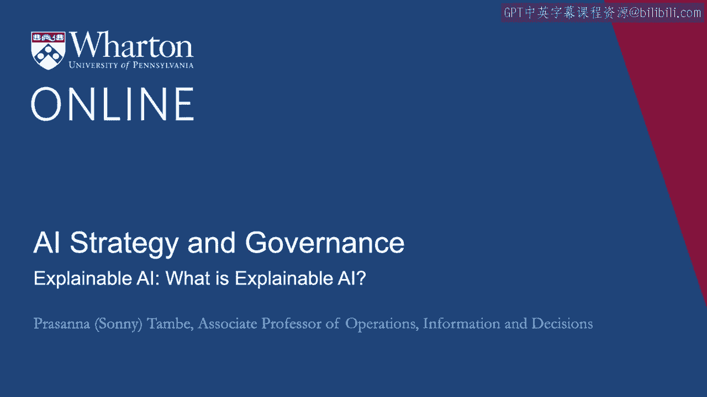
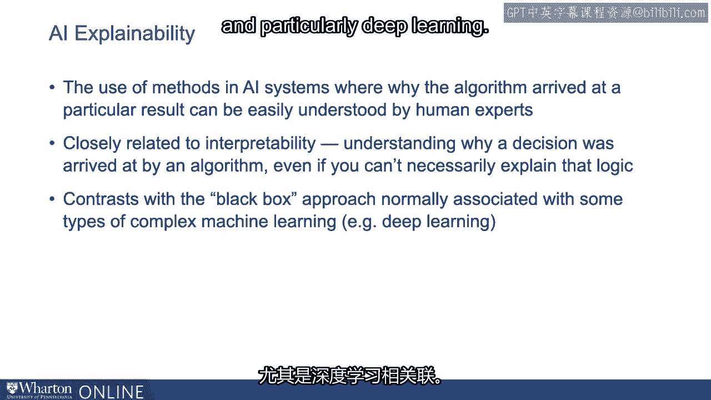
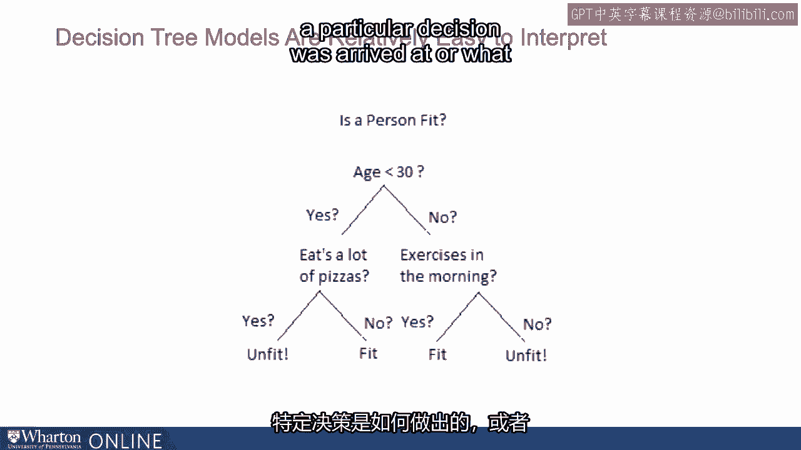
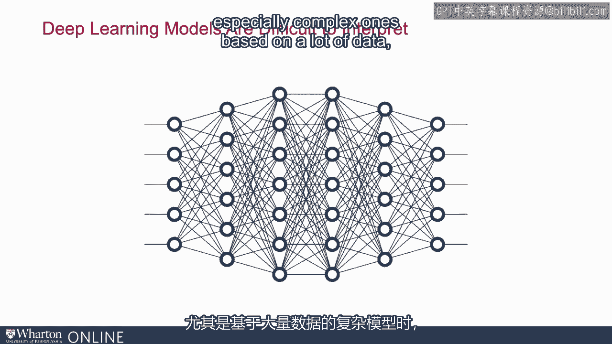
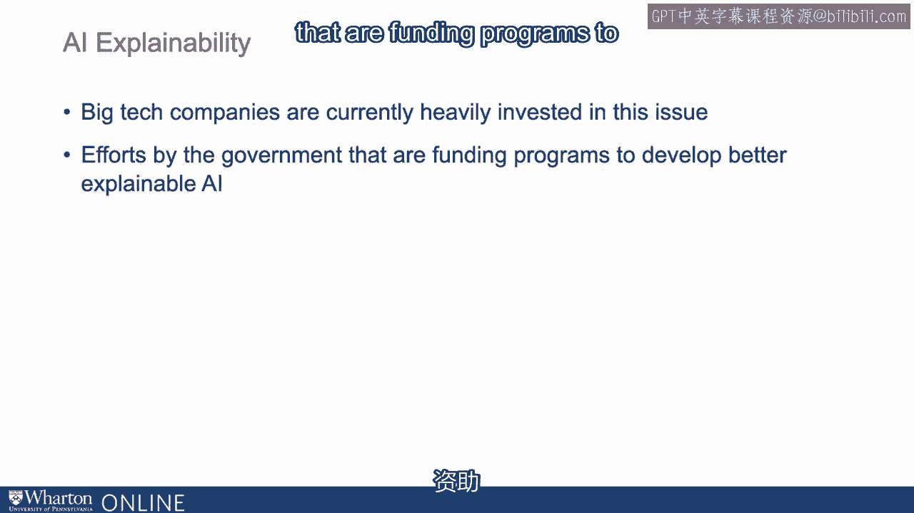

# P130：29_可解释的AI是什么.zh_en - GPT中英字幕课程资源 - BV1Ju4y157dK

使用AI系统的一个主要挑战与可解释性相关。

因此，AI的可解释性是指AI系统中使用的方法，解释算法为何得出这样的结果。

特定结果可以被人类专家轻松理解。

这与可解释性概念密切相关，即理解为什么。

算法是如何得出决策的。即使你能够。

它可能无法解释该逻辑。

这与通常关联的黑箱方法形成对比。

某些类型的更复杂的机器学习，特别是深度学习。

所以稍微对比一下，如果我们的决定是基于基本商业规则。

通常这些是容易解释的。我们是如何得出这个决定的？

哪些因素对得出该决定起了作用？一些更简单的机器学习模型。

基于决策树的模型，例如，相对容易解释。

可以查看决策树，基本上可以了解特定决策是如何得出的。

到底是如何得出决策的，哪些因素对决策起了作用。相反。

当我们考虑基于神经网络的深度学习模型时。

特别是基于大量数据的复杂模型，它们变得相对更难。

去解释。有时很难深入算法内部，理解导致这一结果的原因。

决策被做出。对于更复杂的模型，这存在一个主要的权衡：一方面，它们能够。

处理大量数据并做出非常准确的预测。但另一方面。

它们可能难以解释逻辑。因此，可解释性结果。

在许多背景下，这对采纳至关重要。当你考虑实施时。

即使模型非常准确，无法解释它是如何得出决策的，将成为采纳的主要障碍。

我们会讨论一些例子。但可解释性目前是AI中的一个关键举措。

这是关键的前沿。大型科技公司目前在这一问题上投入了大量资源。

政府也在努力，比如资助相关项目。

开发更好的可解释AI。[BLANK_AUDIO]。

