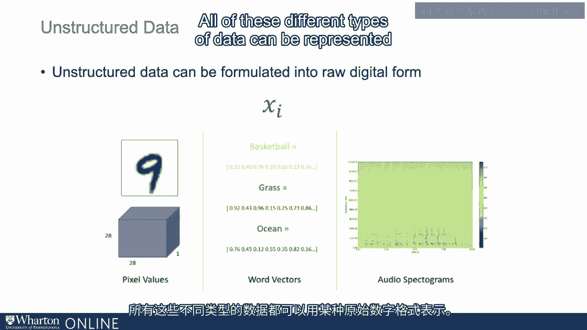
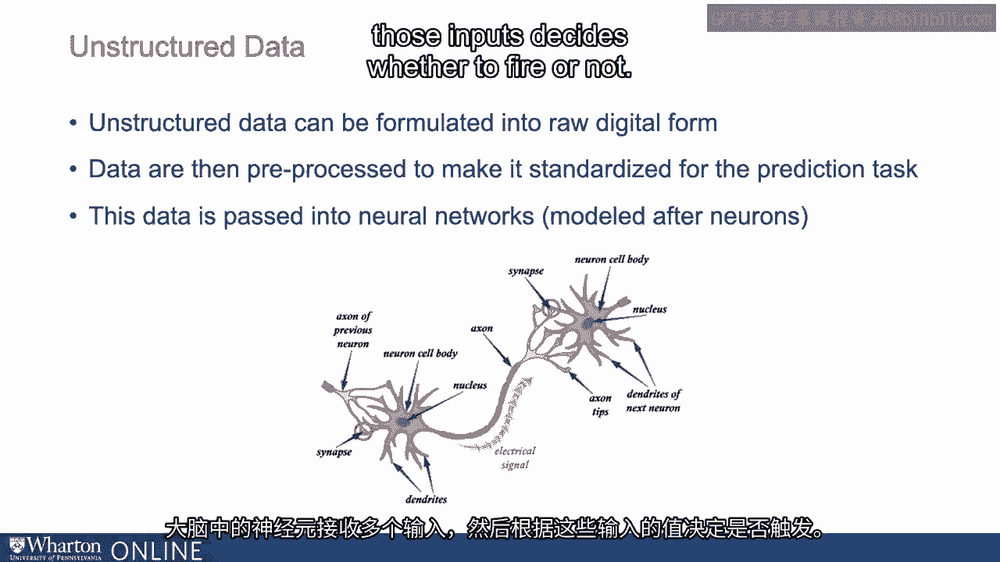
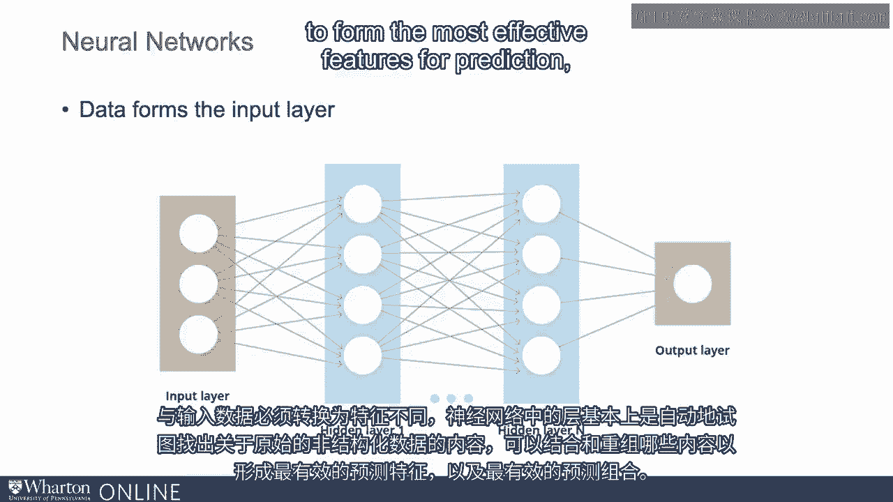
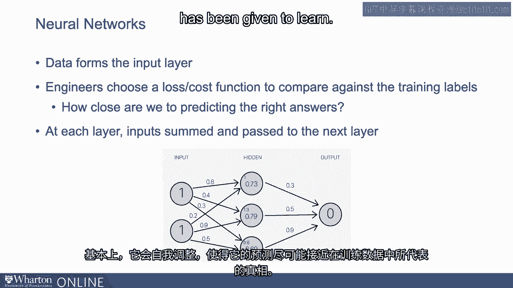
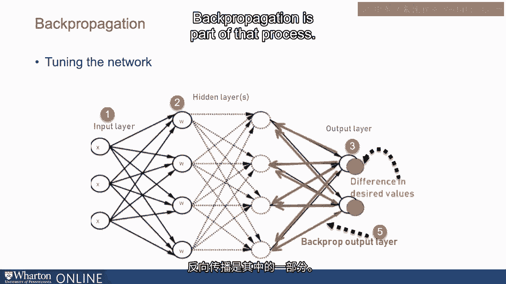
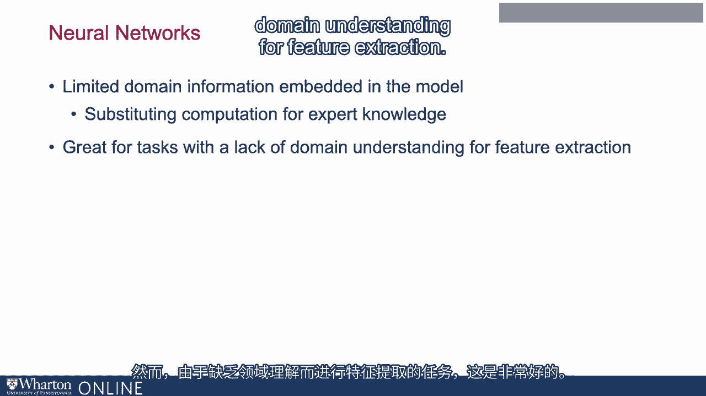
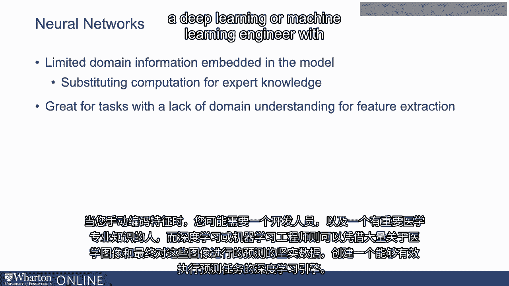
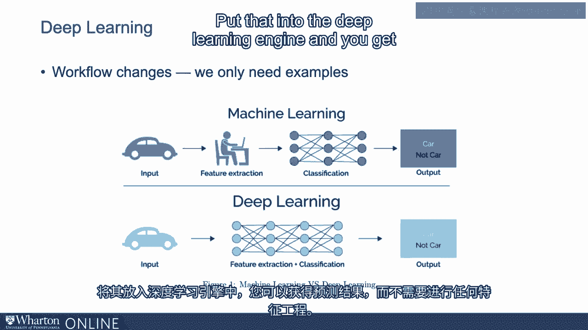

# P16：15_深度学习的工作原理.zh_en - GPT中英字幕课程资源 - BV1Ju4y157dK

深度学习是如何工作的？

我们已经讨论过可以直接使用原始非结构化数据的概念。开始使用深度学习进行预测。我们不需要经历这个特征工程步骤。我们不需要将其转换为列或单独的变量或特征。用于预测。非结构化数据，我们可以从其原始数字表示开始。

首先，任何我们谈论的非结构化数据，包括文本、声音、图像，它们。始终可以以某种数字形式表示。因此，如果是音频，它可能是一个频谱图。图像数据可以通过像素表示。一组文本可以通过单词的向量表示，因此所有这些不同类型。数据可以以某种原始本地数字格式表示。

数据随后以某种方式预处理，使其在预测任务中标准化。一旦数据标准化，就会传递到一种叫做神经网络的东西中。我们之所以称之为神经网络，是因为人们发现这是基于模型的。本质上是继承自神经元。因此，大脑中的神经元接收多个输入，然后根据。

根据这些输入决定是否触发输出。

非常类似地，深度学习中的神经网络在某种方式上非常相似。所以，构成深度学习基础的神经网络，数据，这些原始的本地数据。我们讨论的那个形成输入层，进入神经网络。就像神经元一样，神经网络基本上在查看输入的数据。然后根据数据的值，决定是否触发其输出。或在某个水平上设置其输出。因此，你可以将神经网络想象为一系列决策点或节点或神经元。输入数据从一侧进入。神经网络由一系列层组成，这些层在进行某种观察。所有输入数据的不同组合。因此，输入数据不需要转换为特征。

神经网络中的层基本上是自动尝试弄清楚原始非结构化数据的特征。可以组合和重新组合的数据，以形成最有效的特征用于预测。

最有效的预测组合。因此，这种情况的发生是工程师选择一个损失函数或成本函数来。与训练标签进行比较。这只是说我们离预测正确答案有多近的一种方式。所以在这种情况下，你有训练数据，这是你知道正确答案的数据。让我们回到我们的医疗诊断图像示例。

想象一下，你拥有大量关于人们医疗图像的数据。关于正确答案的数据，这可能意味着你有关于这个人是否有疾病的数据。患者的确有该疾病，这是医生确定的。因此你有医疗数据。医疗图像以及这个人是否实际上有该疾病。因此，神经网络将尝试处理这些图像数据。神经网络中的各层将尝试找到正确的组合。使用原始像素数据进行预测。这个预测将是这个人是否有该疾病。既然我们已经知道训练数据中的正确答案，我们可以开始比较。

我们多么频繁地做出正确决策，以及多么频繁地出错。这就是损失函数或成本函数。这告诉我们与我们拥有的数据所代表的真实情况之间的距离。训练模型。因此，神经网络将开始前后反复进行。重新排列节点上的值、权重等。神经网络的不同部分将开始自我调整，直到它。达到一个点，原始输入数据被组合、加权并传递到。预测层的错误最小化。基本上，它将自我调整到一个预测的点。

尽可能接近训练数据中所代表的真实情况。已被赋予学习的机会。

你可能会听到一些与神经网络相关的术语，比如反向传播。反向传播是调整网络的过程。因此，这些网络应称为前馈网络和反向传播。这些术语指的是数据向前传递，然后不同类型的。信息在网络中前后传递，以便网络可以进行。从数据中学习如何以最优方式进行配置以进行预测。因此，反向传播是该过程的一部分。

深度学习或这些神经网络上下文的一个好处是。模型中嵌入的信息是非常有限的领域信息。因此，你是在用计算来替代专家知识。我的意思是，在这个深度学习案例中，我们所做的是处理医疗。诊断图像，传递给深度学习引擎，它将学习如何进行预测。一个患者是否有疾病。使用我们之前讨论的特征工程步骤，浅层学习是。这是一个步骤，在这个步骤中，某人需要获取图像并查看如何选择和处理。从这些图像中编码个别特征。这是一个非常耗时和困难的过程。

这种深度学习方法需要的领域信息远远少于。这确实需要相当多的计算。不过这很好，但由于特征缺乏领域理解，任务的原因。提取。

所以当你手动编码特征时，你可能需要开发人员和。具备显著医学专业知识的人员，采用深度学习方法，深度学习。或机器学习工程师需要大量医学图像和预测的可靠数据。

最终在这些图像上做出的决策可以自己创建深度学习引擎。或有效执行预测任务的深度学习引擎。一个常见的问题是工程师的角色是什么。在之前的特征工程案例中，工程师的重要性在于能够提取。提取出单独的信息片段。所以再回到图像示例。工程师重要的是处理原始图像，可能提取出特征，比如说。毛细管宽度或颜色阴影等需要图像处理的东西。一些技术专长。在这里你不再有特征工程，那么工程师的角色是什么？

你有原始数据输入神经网络。那么工程师做什么？

好吧，事实证明，仍然有许多事情需要为深度学习设置。方法。这些被称为需要工程知识的超参数值，但通常。较少的领域知识。这些有称为 epochs、batch size、learning rate、regularization。激活函数、隐藏层的数量。

工程师必须决定多种设置，以使网络能够。表现良好。这些超参数值必须由工程师管理，但工作流程最终。变化。

所以再次强调，特征提取不是一个重要的方法，而是没有深度学习。我们有一个工作流程，其中有输入数据，如图像数据，然后有一个耗时的。处理过程是从这些数据中提取单独的列变量或特征。然后将其放入分类或预测步骤，最后你得到输出。

在深度学习方法中，你没有特征提取的步骤。你可以直接从标注良好的原始非结构化数据开始，放入。

深度学习引擎，你可以得到你的预测，而不需要做任何特征工程。这再次是昂贵且不确定的。谢谢。

