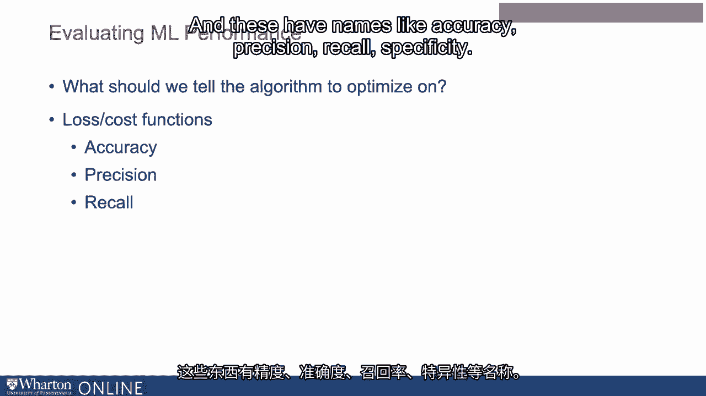
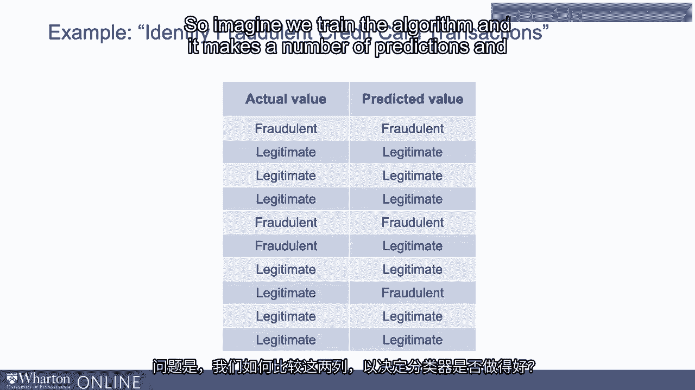
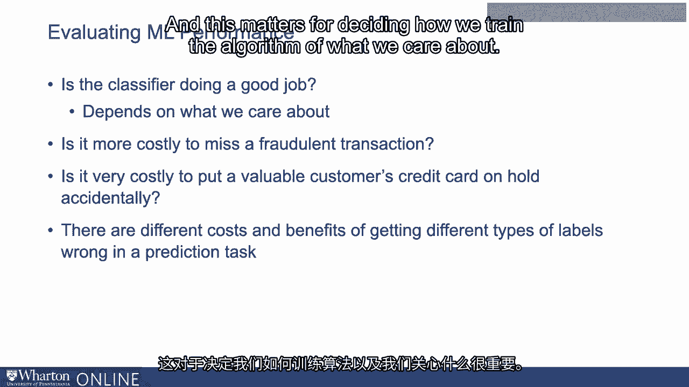

# P18：17_评估机器学习性能.zh_en - GPT中英字幕课程资源 - BV1Ju4y157dK

当我们谈论构建机器学习算法或训练机器学习算法时。

有多种方式可以考虑如何判断算法的表现。

算法表现得好还是不好。当我们构建一个算法时，我们试图教它根据一些标签或。

我们提供的示例。那么问题是，我们应该告诉算法优化什么？

它是否真的在努力尽可能多地正确获取标签，还是它试图。

优化其他事情？例如，确保正确与出错之间可能有不同的成本和收益。

在商业环境中出现的问题。我会在一分钟内给你一个例子。

这可能影响我们如何思考构建一个有效的机器学习算法。

在构建算法时，有许多损失函数或成本函数。

算法试图优化的东西。

有许多事情可以尝试优化。这些有诸如准确性这样的名称。

精度、召回率、特异性。

为什么会有这么多？我们来做个例子。想象有一个应用程序，旨在识别欺诈信用卡交易。

近年来，这是机器学习的一个热门应用。因此。

尝试识别欺诈信用卡交易。在这种情况下。

你有你试图预测的实际值。

你有一些训练数据，这是一组有正确答案的数据集，你在。

尝试以某种方式预测尽可能接近这些答案。

你在训练数据中有实际值，知道交易是否欺诈。

交易是合法的还是欺诈的。然后你有预测值。

交易是否被算法预测为欺诈或合法。

问题是我们如何比较这些列，以决定我们是否会做得好。

想象我们训练算法，它做出了一些预测，我们现在必须判断。

分类器是否表现良好。这个问题看似稍微复杂，因为这取决于。

在这个背景下，从成本和收益的角度来看，我们关心的是什么。

这不仅仅是尽可能多地获得正确答案的问题。例如。

你可能会问，错过一次欺诈交易是否更昂贵。

所以你可以做出的一个决定是，不介意出一些错误。

我只是从不想错过任何一次欺诈交易。另一方面。

可能存在这样的情况：让一个有价值的客户。

信用卡意外被冻结。因此，优化这两种不同类型的事情。

其中之一是你永远不会错过一次欺诈交易。

另一个需要注意的是，你绝不能意外标记一个合法的交易为欺诈。

这些在某种程度上是相互竞争的，当你建立算法时，你必须选择其中一个。

成本更高但收益更高。这些不同的术语特异性、精确度和召回率旨在捕捉这个概念。

在获取不同类型标签错误时，有不同的成本和收益。

预测任务。这对决定我们如何训练算法以及我们关心的内容很重要。

在下一节中，我们将讨论一些具体的损失函数及其工作方式。

计算的结果以及它们中有些可能比其他更重要的情况。[BLANK_AUDIO]。

