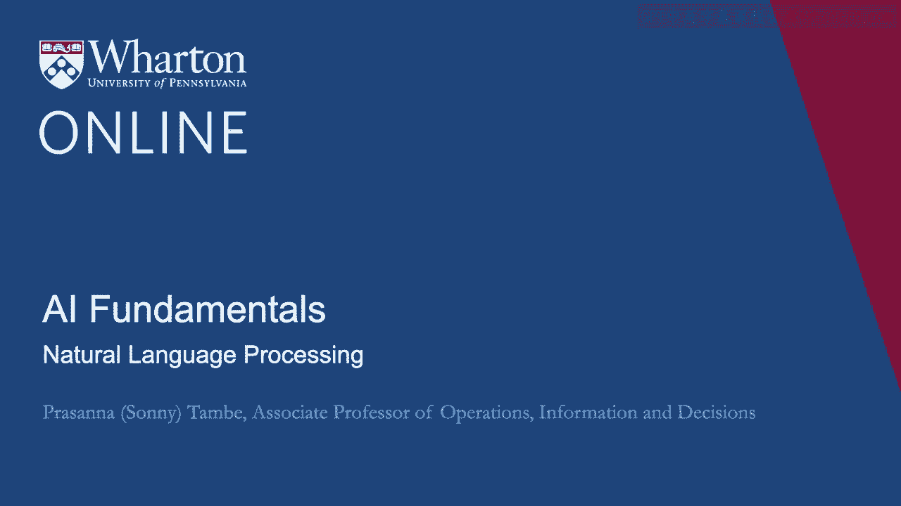
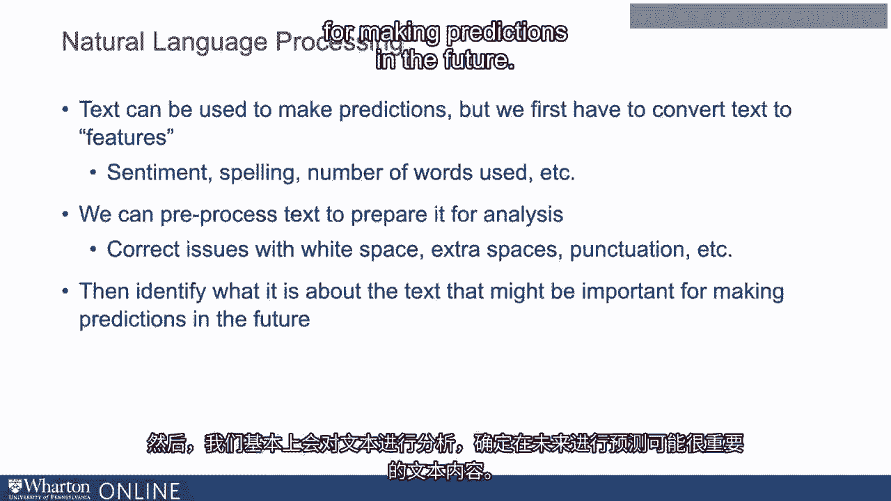
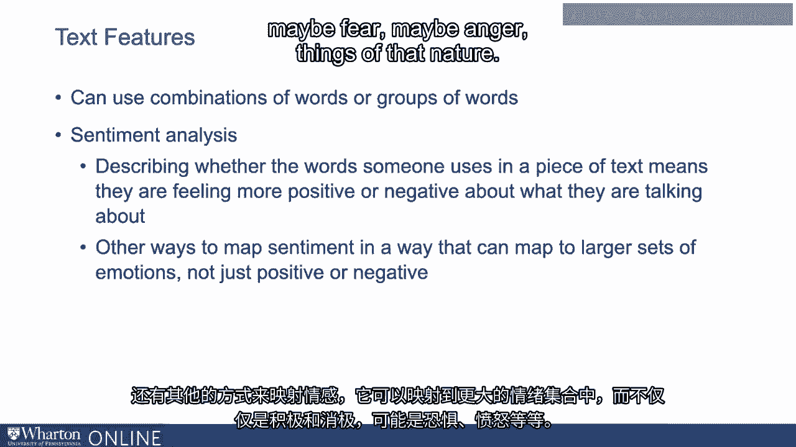
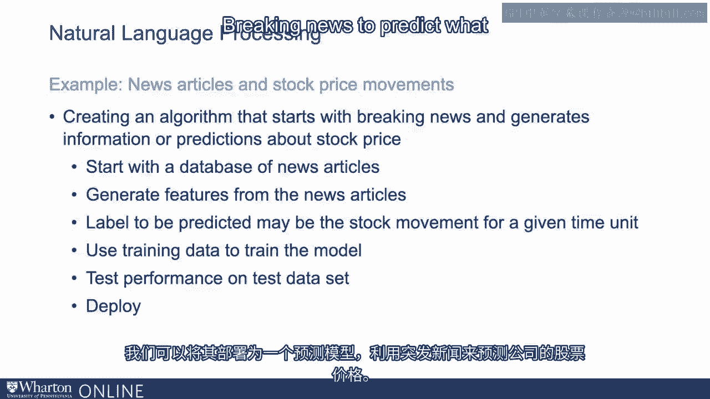
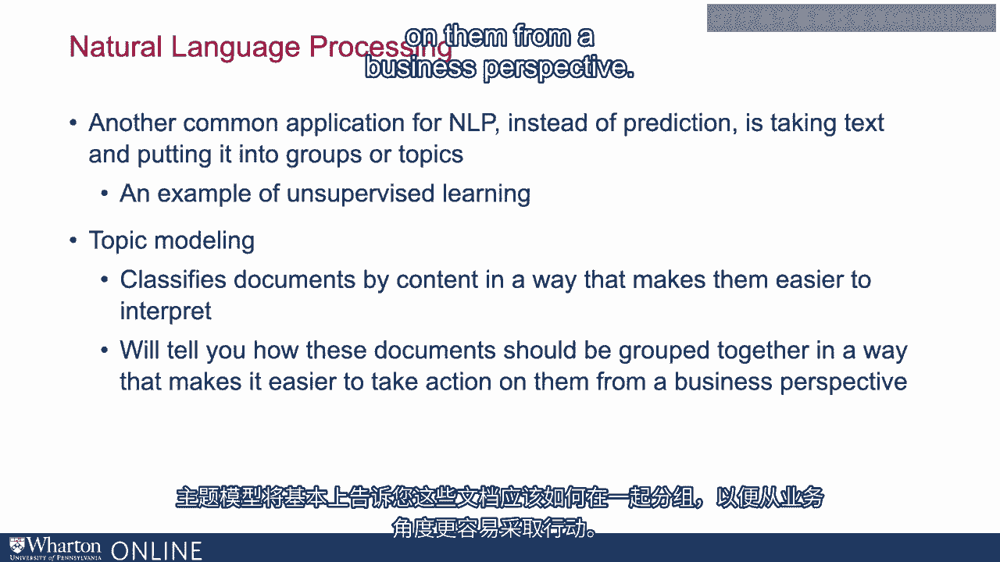

# P25：24_自然语言处理.zh_en - GPT中英字幕课程资源 - BV1Ju4y157dK

随着文本成为越来越有价值的无结构数据形式。

对自然语言处理的关注越来越多。因此，文本可以提供。

当然，这些都是关于市场和商业决策的有价值信号。例如。

在线评论可以告诉我们很多关于产品的信息。它们可以告诉我们很多关于客户的信息。

在线讨论可以告诉我们金融市场活动的一些信息。

所以有很多无结构文本的应用，可以为业务提供一些预测价值。

所以文本可以用于做出预测，但我们首先需要将文本转换为特征。

我们必须查看文本，找出对做出预测或决策重要的内容。

所以当我们考虑将文本转换为不同特征时，有很多候选项。

这包括情感、拼写、文本中使用的单词数量。

我们的做法是首先对文本进行预处理，以便为分析做好准备。

在这里有很多事情可以做，比如修正问题，例如。

空格、额外的空格或标点符号的移动等等。

然后我们基本上会对文本进行处理，识别文本中可能重要的内容。

用于将来的预测。所以文本中特征的最简单例子就是一个单词。

例如，我们可能会查看不同文本中出现的单词，并用它来预测结果。

作为例子，对于在线评论，我们可能会关注具有特定含义的词。

用于对产品销售或重复购买进行预测。

以判断评论是否被认为有帮助。

这由我们选择这些词可能是什么，它们如何呈现。

它可以是情感词，正面、负面词。也可以是关于产品的词。

如果是相机，例如，可能是存储方面的问题，或者可能是其他方面。

关于它使用的格式类型。很多单词可以触发或识别，我们可以用来做基于预测。

关于文本中的语言。不是单个单词。

我们也可以稍微扩展一下，使用更复杂的功能。我们可以使用词的组合。

我们可以使用两个到三个单词组合在一起的词组。

我们也可以构建整体的情感度量等。

因此，情感分析是提取或创建特征的最常见示例之一。

从文本中。这基本上描述了某人在文本中使用的词，任何东西。

从在线评论到推文，再到Facebook帖子。

这就是情感分析，它将说明所使用的语言。

在这些文本片段中意味着某人对什么事情感到更积极。

他们谈论的内容或对所谈论的内容更负面。

还有其他方式可以映射情感，以映射到更大的情感集合。

不仅仅是积极和消极，可能是恐惧，可能是愤怒，这类情感。

我们有这些特征，我们把文本拿出来，提取这些情感等特征。

比如使用了什么类型的词汇。我们也可以考虑在线评论的长度作为一个特征。

我们可以考虑在线评论中使用的拼写或语法质量。

一旦从文本中提取这些特征，就能帮助我们预测结果。

例如，情感可以预测购买行为。

这是一种自然语言或语言将在机器中使用的方式。

学习算法。因此，我们提取语言，创建特征，然后用于预测。

现在深度学习给了我们更多的灵活性，因为它可以开始结合文本内容。

以更丰富或更有意义的方式，而不是我们在手动编码时可能受到的限制。

不同的特征。因此，深度学习给了我们更多的灵活性，但概念上运作方式类似。

举一些例子。让我们谈谈像新闻文章或突发新闻与股票价格变动这样的例子。

所以你可能会考虑创建一个从突发新闻开始的算法。

新闻并生成关于股票价格的信息或预测。

想象一下我们有一个新闻文章或突发新闻的数据库。

然后我们可以从新闻文章中生成特征，比如情感。

比如出现在新闻中的词汇，可能是名字，出现在新闻中的内容。

国家或政治领导人的名字。待预测的标签可能是特定时间单位内的股票变动。

为了更精确，可能我们正在查看特定公司的新闻文章。

我们有突发新闻。我们将考虑报道该公司的新闻。

你将开始生成指示对该公司积极性的特征。

可能涉及到新产品发布、创新或专利的内容。

待预测的标签是该公司在特定时间单位内的股票变动。

所以我们现在有这个训练数据。我们有很多关于新闻中提取的语言特征的数据。

公司。我们有训练标签，即该公司在该时刻的股票表现。

新闻正在突发。我们可以用这个来训练模型。

模型将学习在新闻中提到该公司时使用的语言可能如何。

这将影响或至少预测股票价格的变动。我们将使用训练数据。

我们将保留一些测试数据，以确保模型在运行时的准确性。

我们将模型设置为在测试数据集中表现良好的方式。

然后我们可以将其作为预测模型，使用突发新闻来预测一家公司的。

股票价格将会如何变化。所以这是使用文本的一个应用类型。

使用自然语言处理来进行预测。

自然语言处理的另一个常见应用，而不是预测，是处理。

将文本或语言分组或分类成不同的主题。

这是所谓的无监督学习的一个例子。

我们并不是试图预测标签、类别或分类。

我们基本上试图将大量文本放入不同的组或主题中。

所以主题建模是一个用于描述一种处理文档并进行分类的方法的术语。

按内容对它们进行分类，使其更容易解释。

如果你有一个关于不同主题的大型文本消息或电子邮件数据库。

你可以考虑使用主题建模来处理大约一百万条消息并进行分类。

将它们分成五到十个类别或主题，这样可以更好地理解如何。

根据这些主题做出决策。因此，主题模型基本上会告诉你这些文档应该如何分组。

将它们以一种更便于从商业角度采取行动的方式组合在一起。

以我们的新闻示例为例，想象一下我们有很多。

来自不同机构的各种突发新闻，主题也各不相同。

我们希望处理每天涌入的成千上万的新闻文章。

并将它们分类到商业、科技、科学或娱乐等领域。

这种分类显然使消费者更容易导航和。

找到他们感兴趣的主题或文章。

所以这是主题建模或无监督学习的一个例子，处理大量。

对于非结构化数据，使用自然语言处理将这些非结构化数据转化为。

我们可以以更便捷的方式处理更少的主题，从消费者的角度来看。

从消费者的角度或商业决策的角度。[BLANK_AUDIO]。

