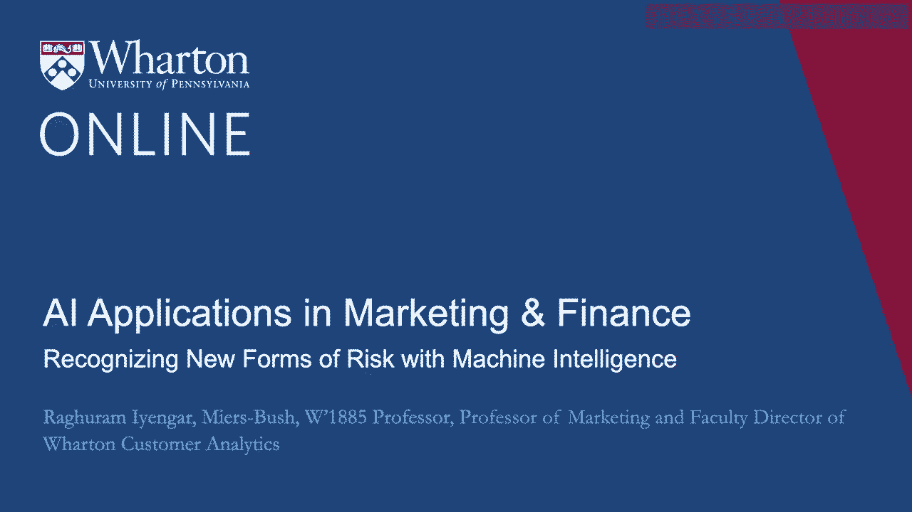
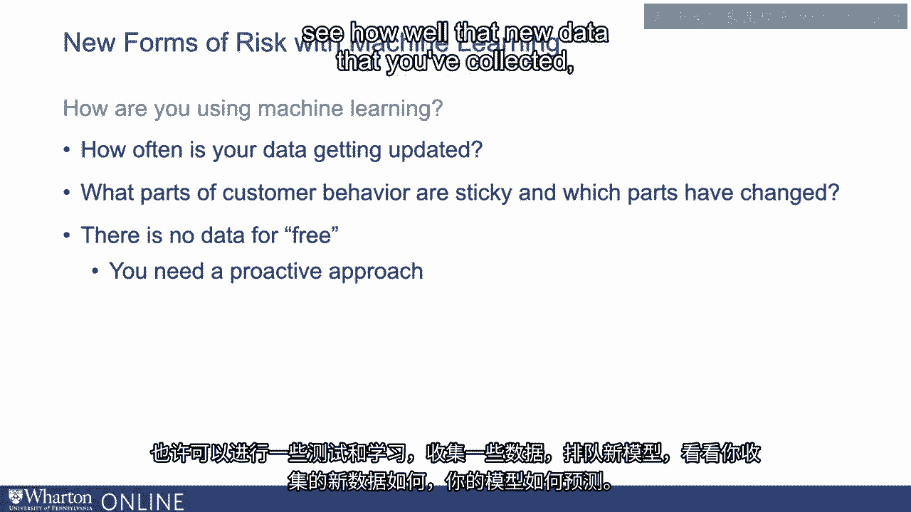

# P39：5_利用机器智能识别新的风险形式.zh_en - GPT中英字幕课程资源 - BV1Ju4y157dK

我想让你关注一下，当你时可能会发生什么样的问题。

开始使用机器学习和AI模块。我们讨论了很多关于客户旅程的内容。我们讨论了很多机器学习算法或。AI软件能为你做什么。但同时，我认为理解存在的风险是重要的。也同样出现。因此，一个风险的例子是理解数据的来源。我会给你两个例子，但我认为这些例子，你当然会看到有些。这只是冰山一角。这些例子来自亚马逊。当然，亚马逊是一家大公司。还有许多其他公司也参与了这些例子。我只是想给你一个来自亚马逊的例子，但你会看到这些例子有多普遍。

示例是。一个例子是亚马逊放弃了一种秘密的AI招聘工具。这里的问题是什么？问题在于亚马逊，像许多公司一样。可能有很多人想在某种意义上成为亚马逊的员工。好吧。他们有很多人提交简历。在这种情况下。如果我没记错的话，问题是关于软件开发人员的。很多人想成为亚马逊的软件开发人员。那么他们想做什么呢？

他们希望加快这一过程。那么他们是怎么做到的？他们基本上说。如果你能拥有一个可以浏览的AI工具，那会多好。其中一些简历，试图找出哪些简历可能有最高的。成功的机会是哪些人？他们是以什么为基准的？

他们以当前员工和他们自己的简历作为基准。然后他们开始寻找最佳的预测方式。问题是什么？

问题在于他们拥有的历史数据，也就是当前员工的数据。这些开发者主要是男性软件开发人员。那么他们最终做了什么呢？不幸的是。AI工具最终对女性产生了偏见。我注意到这并不完全是工具本身的错。这是数据的问题。因此，仔细考虑数据来源是非常重要的。

数据的普遍性如何，还有许多其他类似的问题。我再给你一个例子。这是关于亚马逊和你在这里看到的种族歧视算法的例子。再次，显然非常有争议。那么让我们讨论这个例子。然后我们还会谈论争议。在这种情况下。亚马逊正在考虑扩展他们在美国提供的亚马逊Prime服务。因此，这个例子和这个问题尤其在波士顿地区。发生的情况是，他们在考虑向哪里提供亚马逊Prime。他们在查看不同的邮政编码。然后他们基本上进行了以下计算。

所以让我们在某些邮政编码中提供这个，那里有机会变得更有利可图。这很有道理。一旦他们开始关注这个问题，那么我们这些来自波士顿的人。他们可能会认出这个地方。波士顿有一个地区叫罗克斯伯里。这是一个稍微低收入的地区。所以这最终成了他们所称的亚马逊问题。

这是一个像甜甜圈一样的区域，环绕着罗克斯伯里。他们为罗克斯伯里提供了亚马逊Prime。但你可以想象这是非常有争议的。另一方面，你也可以想象，在罗克斯伯里没有很多商店的人。在他们周围，那些人实际上将是从亚马逊Prime中受益最多的人。

那么为什么会发生这种情况？因为他们在查看数据，但没有跟进去看看。这些算法在做什么。所以我想你在开始使用客户数据进行预测时要注意的第一个问题。缩短旅程，无论情况如何。关于这些数据的可推广性，首先是涉及到不同的客户。

你所拥有的，并开始仔细考虑这些数据的代表性。下一个问题是关于数据集和隐私。首先，客户隐私是一个巨大问题。在欧洲，你有 GDPR，在加州，你有加州隐私法。还有很多。还有许多其他隐私法将会出台。我会建议你在开始考虑如何使用客户数据时，或许可以。目标客户，旅程的匹配，定制化，个性化旅程，情况如何。可能会。开始仔细考虑一下，并展示客户隐私，你能做些什么。确保你不侵犯他们的隐私。让我给你举个例子。

这个例子来自一家叫 Strava 的公司。现在 Strava 是一家在某种意义上构建全球热图的公司。这就是他们所谈论的。这是一个为非常活跃的人提供的大型社交网络。如果你在 Strava 上，你可以发布，能说，“好吧，我去慢跑了五英里。”

“等等。所以在某种意义上，他们注意到了他们正在构建一个全球热图。这些人非常活跃。发生了什么？好吧。他们自己的数据是匿名的，他们非常确保他们的数据集。在某种意义上是不可识别的。但有些人做了什么？

他们最终在此基础上叠加了谷歌地图。结果发生了什么？好吧，在某种意义上。他们能够找到一些人，我相信是在阿富汗等地方。在那里的美军是谁。所以显然，这正是这个头条所谈论的。Strava 热图以及其中的秘密。这里的主要概念是什么？

这里的主要想法是，你自己的数据集可能是匿名的，但越来越多的，很多。有很多人正在整理数据集。这是一件需要非常小心的事情，即不仅仅是你的数据集。应该确保隐私，但要非常仔细地思考数据集的组合可能会如何影响。最终要关注隐私。第三个问题是你如何使用机器学习。这与我们之前提到的数据本身的想法有关，但更多的是。不仅仅是数据的代表性。更重要的是，你的数据更新的频率。也就是说，你使用的数据是两年前的，一年前的。

看一下客户旅程，看看客户购买你产品的频率。旅程是怎样的？客户旅程的哪些部分是“粘性”的？哪些部分在变化？

因为当然，随着新技术的出现，新的竞争者的出现，所有这些。旅程的变化。因此，仔细思考你如何使用数据，你如何使用模型。数据更新的频率以及旅程变化的情况是至关重要的。当然，数据不是免费的。这意味着。我认为当你开始考虑使用新技术时，无论是机器学习，还是人工智能。无论情况如何，你需要采取主动的态度。也许进行一些测试和学习，收集一些数据，启用新模型，看看效果如何。你所收集的新数据，以及你的模型在多大程度上能够预测这些数据。

所以你做得越多，就越能在理解方面保持敏捷。机器学习和人工智能软件在获取新数据方面是所谓的“更新”。以及那些旧模型可能需要调整的地方。谢谢。[BLANK_AUDIO]

