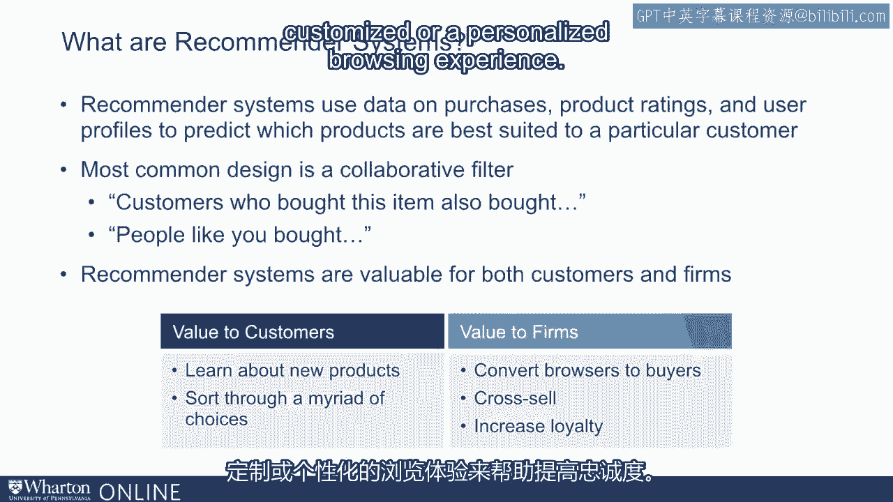
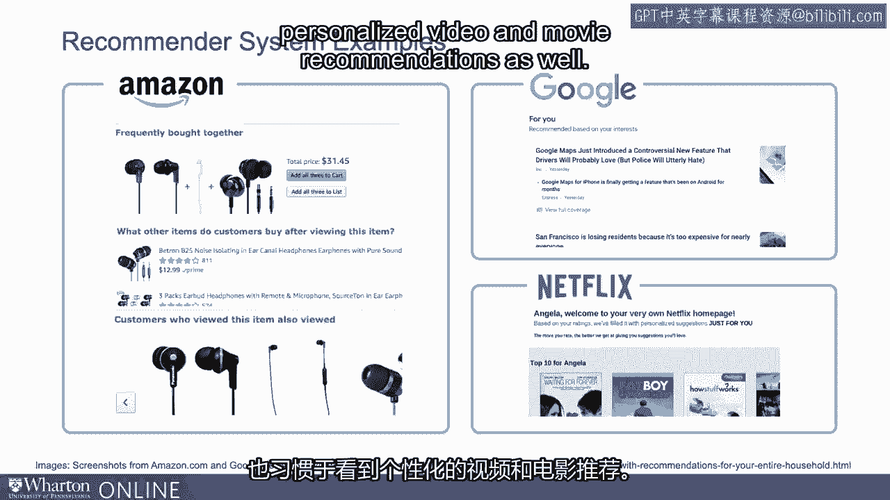
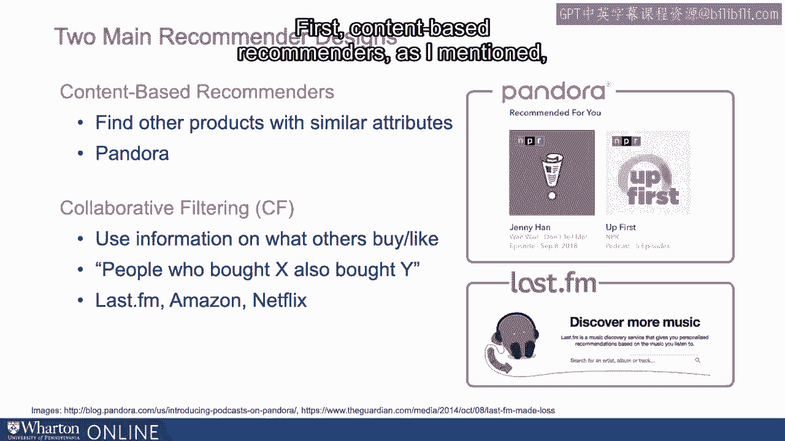
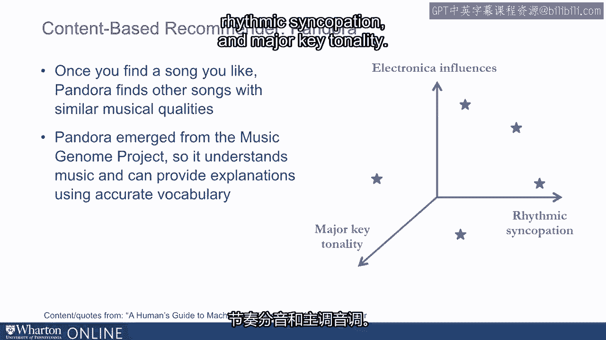
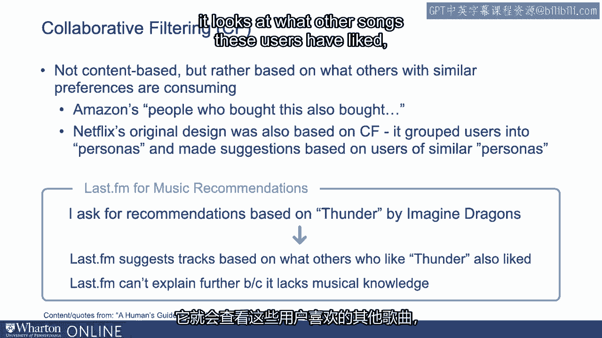
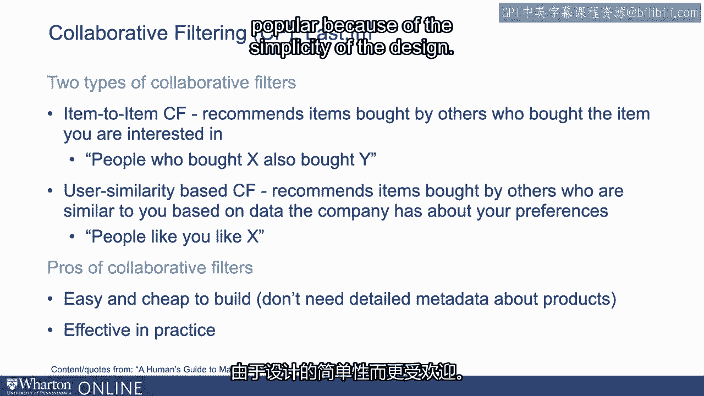
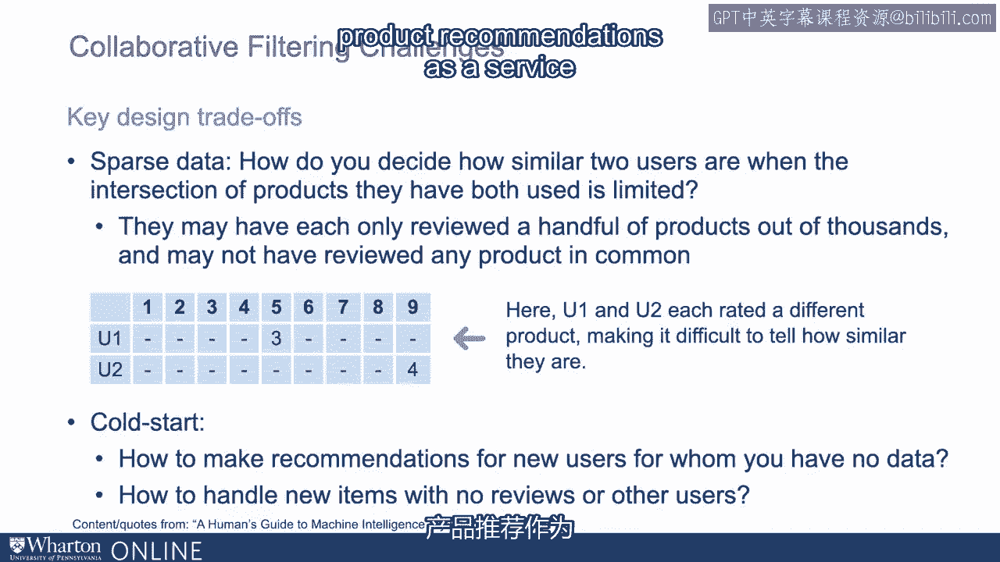

# P42：8_个性化推荐系统.zh_en - GPT中英字幕课程资源 - BV1Ju4y157dK

在本次讲座中，我们将从网络个性化的介绍开始。

我会具体说明。

深入探讨推荐系统。现在推荐系统。

有时也被称为推荐系统，这些系统。

这些系统试图预测哪些项目、产品或内容对消费者感兴趣。

基于客户的一些信息，例如他们的用户档案。

根据他们过去的购买或评分。推荐系统最常见的例子是协同过滤。

这是一个使用标签或短语进行推荐的系统，比如购买此产品的客户。

也购买了这个，或者查看此产品的客户也查看了那个产品，或者人们。

就像你购买了这些其他产品。现在，这些推荐系统是独特的，因为它们为客户增加了价值。

对于消费者，它们帮助他们了解新产品，并帮助他们筛选。

大量选择，意味着当你有很多选择时，它们帮助识别最合适的。

相关选择。对于公司来说，它们有助于将浏览者转化为买家。

它们有助于交叉销售产品，并通过提供定制或个性化的浏览体验来提高忠诚度。

现在有很多这样的例子。你可能习惯于看到这样的消息：购买此产品的人也购买了这些其他产品。

在 Google 新闻上，你可能习惯于看到个性化的新闻推荐。

在 YouTube 或 Netflix 上，你可能习惯于看到个性化的视频和电影推荐。

现在如果你从高层次看这些系统的设计。

行业内主要使用两种设计。

第一个被称为基于内容的推荐系统，这些系统尝试。

基于一些产品属性的信息来找到其他消费者感兴趣的产品。

例如，如果你喜欢一个产品，这些系统会查看这些产品的属性。

他们喜欢的，并找到其他类似的产品。

其中一个例子是 Pandora 的音乐推荐系统。

另一种设计被称为协同过滤。

协同过滤并没有真正深入产品属性。相反。

协同过滤基于其他人正在消费的内容来推荐项目。

所以它们尝试找到有类似品味的其他人，并推荐其他内容。

他们可能喜欢的。因此，例如，购买此产品的人也购买了这个。

所以让我们深入探讨这两个例子，详细看一下。首先。

基于内容的推荐系统。

正如我提到的，他们倾向于关注内容属性或产品属性。

倾向于找到具有相似属性的其他产品。

一个例子就是Pandora，这是一个在线音乐服务。

而Pandora本质上推荐并播放可能引起消费者兴趣的歌曲。

Pandora源于一个名为音乐基因项目的项目。

本质上在这个项目中，许多艺术家，数百甚至可能成千上万的艺术家。

听取了数百万首歌曲，并对这些歌曲进行了多维度或属性的评分。

所以例如，你可能会说某一首歌在电子方面得分很高。

影响，但在歌曲的节奏性方面得分较低，也被称为。

作为有节奏的切分音，或者在大调音色方面可能得分较低。

这些是歌曲的不同音乐特质。另一首歌在节奏切分音方面可能得分很高，但可能得分较低。

在电子影响方面得分较高，但在大调音色方面得分较低。

诸如此类。在这个例子中，我提到的只是三种不同的音乐属性或音乐特质。

一首歌的属性包括电子影响、节奏切分音和大调音色。

但实际上，Pandora针对任何给定的歌曲有超过150种不同的属性。

鉴于这些属性，以及大量歌曲的数据库，具有非常深刻的。

有关每首歌音乐特质的信息，Pandora的目标是现在开始推荐。

歌曲。Pandora的运作方式是，用户登录后首先表示他们喜欢某些。

喜欢的歌曲。例如，我可能登录Pandora并表示我喜欢Imagine的《Thunder》这首歌。

Imagine Dragons。现在Pandora查找其数据库，找到其他具有类似音乐特质的歌曲。

然后推荐这些歌曲。例如，当我登录Pandora并表示我喜欢Imagine Dragons的《Thunder》时。

Pandora接下来播放了21 Pilots的《ride》，并特别指出推荐了这首。

这首歌因为它有dub制作，带有雷鬼风格，且有一段原声节奏钢琴。

它使用弦乐合奏，并且具有大调音色。

这是Imagine Dragons的《Thunder》这首歌的属性，它在《ride》中也找到了。

由21 Pilots演唱。正如你所看到的，这基于对所推荐产品或内容的深入了解。

这种设计只有在你拥有大量有关音乐或产品的元数据时才能使用。

一般来说。这些系统可以适应，例如，如果我听一首歌并给它一个不喜欢的反馈。

换句话说，如果我告诉Pandora我不喜欢那首歌，Pandora就可以整合。

反馈并学习，这就是学习的过程，并即时调整。

向我们展示更接近我们偏好的不同歌曲，与之不同的歌曲。

我们不喜欢的歌曲。因此，这是构建这些算法的关键部分。

另一种不同于基于内容设计的设计是协作过滤。

协作过滤不需要对正在被推荐的产品有非常深入的了解。

推荐，所以它们不需要歌曲或其他产品的属性。

相反，它们是基于其他人消费的信息。

例如，亚马逊的“购买此商品的人也购买了那件商品”是基于协作的。

过滤。实际上，当Netflix最初推出其流媒体服务时，最初的设计是。

基于协作过滤。本质上，它根据用户的评分和观看行为将用户分组到不同的特征中。

模式，然后根据其他人喜欢的内容向人们提出建议或推荐。

其他具有相似特征的人喜欢什么。现在最后。

fm是一个在线音乐服务，用户利用协作过滤。

制定推荐。这种方法是，如果我去最后。

fm并表示我喜欢Imagine Dragons的《Thunder》。现在最后。

fm不一定对《Thunder》的音乐特性有深入的了解。

相反，它会查看其他用户喜欢《Thunder》的内容，一旦识别出。

其他这样的用户，它查看这些用户喜欢的其他歌曲，并推荐他们的。

歌曲。因此，这两种主要设计在协作过滤中有许多变体。

设计。例如，有一种设计称为物品到物品的协作过滤，本质上。

此设计根据其他人消费的内容向用户推荐歌曲，但输入。

此设计是您已表示喜欢的特定项目。

比如我开始说我喜欢Imagine Dragons的《Thunder》，这就是。

系统用于开始推荐歌曲的输入，因此该设计。

是一种物品到物品的协作过滤。另一种设计本质上使用有关用户的信息作为输入，而不是特定的。

项目。这种设计被称为基于用户相似性的协作过滤。

因此，这种设计的本质是，它查看我们所有的过去历史并观察。

查看我们过去喜欢的所有产品，并找到其他具有。

相似偏好的原因。我提到Netflix以前使用过一种设计，它本质上创建了人们的特征。

然后找到了其他有相似特征的人，并推荐了他们喜欢的其他东西。

这是一种基于用户相似性的协作过滤。

这两种设计都不需要对被推荐的产品有深入了解的另一种方式。

因此，它们非常容易构建，且构建成本也非常低，这就是它们。

也非常受欢迎。他们受欢迎的另一个方面是实际上非常有效。

所以我们都习惯在像亚马逊这样的零售网站或其他网站上看到推荐。

我们知道，YouTube影响我们做出的选择，实际上协同过滤设计。

虽然它们比基于内容的设计简单得多，但同样有效，因此。

因为它们设计的简单性，基于内容的推荐系统更受欢迎。

同时，构建这些系统也存在一些挑战。

无论你是构建基于内容的推荐系统还是协同过滤，你都必须面对。

你拥有多少数据以及需要足够的数据来开始推荐。

特别是协同过滤会导致与内容不同的数据集。

基于内容的推荐系统。基于内容的推荐系统需要大量关于产品属性的信息。

推荐相对而言，协同过滤使用其他人消费的信息。

这需要很多关于他人消费的信息。

实际上一个挑战是数据可能会很稀疏。

考虑到用户可能只对数百万种不同产品中的五到六个项目进行评分。

一家公司的视频或歌曲，因此现在公司必须想出如何推荐。

基于这些有限推荐向人们推荐歌曲或视频。

这些系统必须弄清楚如何使用或彼此相似，尽管它们。

每个人仅对五首歌曲进行评分，而这五首歌曲可能实际上非常。

不同的歌曲重叠极少，因此稀疏数据是一个问题。

另一个问题是所谓的冷启动。

换句话说，冷启动基本上是如何开始做出推荐的问题。

对新用户，当你对他们过去的选择、兴趣或偏好没有信息时。

还有，如何推荐尚未被其他人购买的新项目。

或者尚未被其他人评分，但刚刚被添加到目录中。

想要开始进行推荐。这是另一个挑战。

因此，存在许多设计挑战，数据科学家会花大量时间思考。

通过一些设计挑战，但这是一个相当成熟的领域。

针对这些问题有一些非常好的答案。

所以，今天构建这些系统并不是很复杂。

公司也可以选择使用第三方系统，因此如果你不想构建。

如果你想自己做，有第三方公司提供产品推荐。

作为公司可以整合的服务。总之，推荐系统有很多设计。

最流行的两种设计是基于内容的设计和协同过滤设计。

这些设计在实践中是非常不同的。两者都相当有效，并且在这些设计上有不同的权衡。

在讲座中，我们将实际深入探讨这些权衡的一些方面。 [BLANK_AUDIO]。
