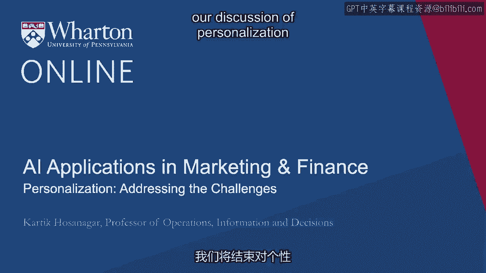
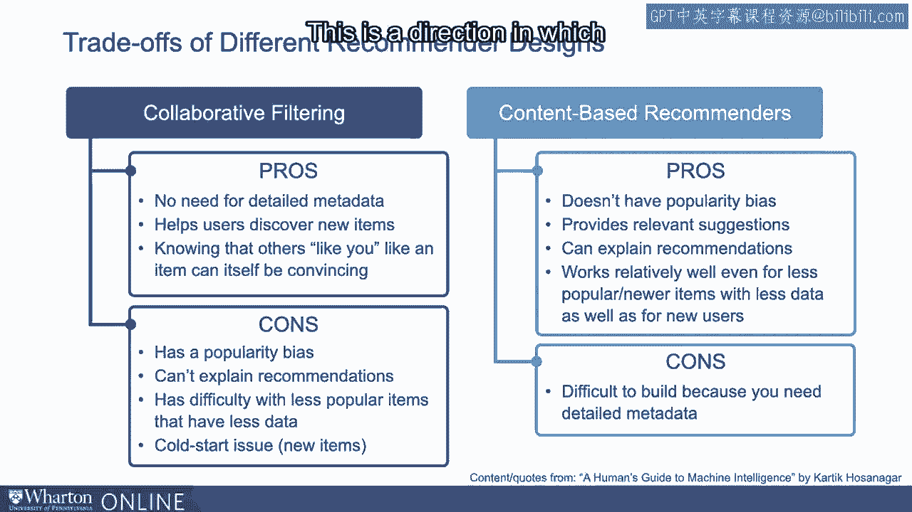
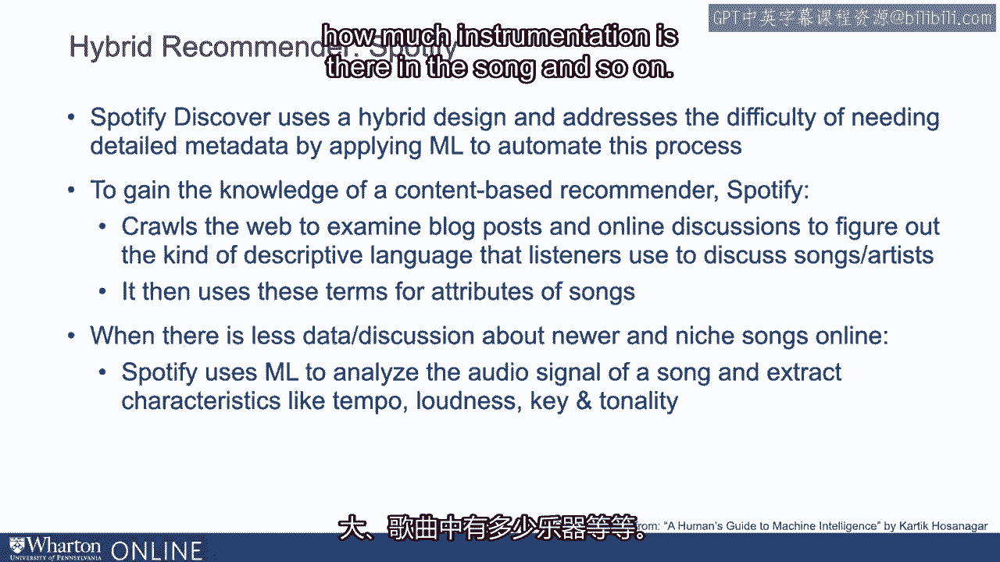
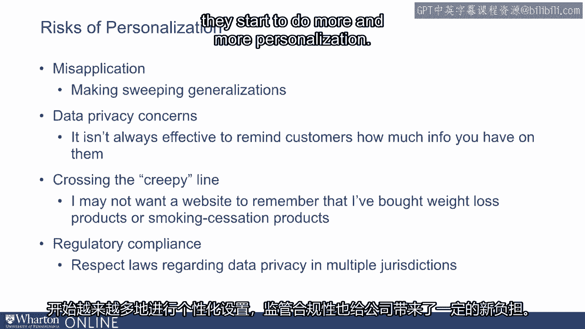

# P44：10_解决个性化的挑战.zh_en - GPT中英字幕课程资源 - BV1Ju4y157dK

嗨，在这节课中，我们将结束关于个性化和推荐的讨论。

系统。回想一下在上次讲座中，我们讨论了与此相关的某些挑战或权衡。推荐设计。回顾一下讨论。协作过滤的主要优势之一是。它不需要关于所推荐产品的深度元数据，因此它。非常容易构建。与此同时，它相当有效，并已证明有助于消费者发现。新产品。这具有良好的社交吸引力，例如。知道其他人像我一样喜欢或消费某些歌曲，会增加我对那首歌的兴趣。然而，这种设计也有一些缺点。我们讨论了协作过滤设计的受欢迎程度偏差。

挑战，尤其是如果作为零售商你想让客户接触你的旧目录。还有。因为这些系统对所推荐的产品没有深入的了解。它们无法解释为什么某些产品被推荐给用户。最后。它们也往往面临新用户和新产品的挑战。相对而言。基于内容的推荐系统实际上没有受欢迎程度偏差。它们也非常有效，并且对所推荐的产品有深刻的了解。被推荐的产品，它们可以向消费者解释推荐背后的理由。但建立起来相当昂贵，因为你需要关于推荐产品的详细元数据。

被推荐的产品。因此，出现的问题是是否有办法实际上结合这两者。这样你就能获得两者的好处。这是许多公司近年来所走的方向。

一个例子是 Spotify。所以对于那些习惯使用 Spotify 的用户。你可能对 Spotify 的 Discover Weekly 推荐非常熟悉，Spotify 为你策划了一系列歌曲供你收听。现在 Spotify 的 Discover Weekly 最初是基于协作过滤设计的。所以最初 Spotify 的推荐系统纯粹基于协作过滤。

但随着时间的推移，它也结合了基于内容的推荐设计原则。现在，为了做基于内容的推荐，需要关于音乐的非常丰富的元数据。歌曲的质量。如果你打算按照 Pandora 最初的方式去收集，这会很昂贵。启动其服务。意味着让艺术家听歌曲并对这些歌曲进行评分。

所以一个替代方案是使用机器学习自动提取歌曲的属性。Spotify 通过两种方式做到这一点。Spotify 爬取网络，查看关于歌曲的博客帖子或任何在线讨论。并查看人们在讨论或描述歌曲时使用的描述性语言。它使用那些描述性词语作为歌曲的属性。

现在，这对已经存在一段时间并受到讨论的歌曲非常有用。这一点相当重要。新歌或小众歌曲代表着一个挑战，因为它们在网上讨论得不多。为了解决这个问题，Spotify使用机器学习分析每首歌曲的音频信号。现在它能够提取许多音乐特征，例如歌曲的节奏。

歌曲是否具有大调音调，歌曲有多响，乐器使用多少。歌曲中存在的内容等等。

最终，Spotify可以使用所有这些通过提取的内容属性。机器学习并结合协作过滤类型的功能，查看什么。其他人正在消费，因此结合了这两种世界的优点。这是Netflix以及许多主要媒体公司发展的方向。在线公司也朝着结合这两种不同优势的方向发展。推荐设计。当然，我们花了很多时间讨论产品推荐。主要是因为它们非常普遍，并且对零售商或消费者都有显著价值。企业和消费者也是如此。但重要的是要承认，个性化不仅仅是产品推荐。

还涉及跨不同渠道定制客户体验。与可能在你的网站上，可能在移动应用上的客户互动。电子邮件或可能是在商店。这是实际弄清楚如何提供整体集成体验的能力。这就是个性化的核心。例如。如今，公司甚至在个性化电子邮件。因此，电子邮件发送到客户数据库，但电子邮件中的某些内容可能会。当客户打开电子邮件时，实时填充信息。因此，电子邮件可能以HTML格式发送，意味着与网页格式相同。当客户打开电子邮件时，可能会调用某个JavaScript，查看。

客户打开电子邮件时的位置，可能会定制图像。例如。如果电子邮件是关于夹克促销的，可能会是这样的内容。个性化，客户在一个当前下雨的地方打开时。客户在一个当前下雨的地方打开时，可能会看到一件雨衣。如果在下雪，他们可能会看到一张雪衣的图像，这种个性化是在。当客户打开电子邮件时，根据运行脚本，可能会显示与天气相关的内容。能够查看客户的过去数据。说到这些。个性化为消费者和企业都增添了很多价值，但也带来了某些风险。

这些风险之一是误用，这意味着当你的推荐或个性化。算法对客户做出笼统的概括，并做出非常糟糕的推荐。这最终使客户对个性化产生反感。另一个关注点是数据隐私。消费者对隐私的敏感性显著增加，尤其是考虑到信息量之大。

企业对客户的了解，以及由于某些公司对客户数据的肆意滥用。企业，因此企业在使用时必须非常谨慎。数据及其呈现个性化结果的方式，因为很容易越界。对消费者而言，这显得有些 creepy。最后，基于非常敏感的消费者数据的过度个性化还有另一个风险。

监管者可能会介入，实际上在许多管辖区，监管者正在介入。发布了多项不同的数据隐私法规，因此合规性也成为一个问题。随着企业越来越多地进行个性化，这给它们带来了新的负担。

以上是个性化的概述，以及机器学习特别是如何影响个性化。人工智能总体上正在产生影响。接下来，我们将讨论机器学习在金融服务中的应用。[BLANK_AUDIO]。
