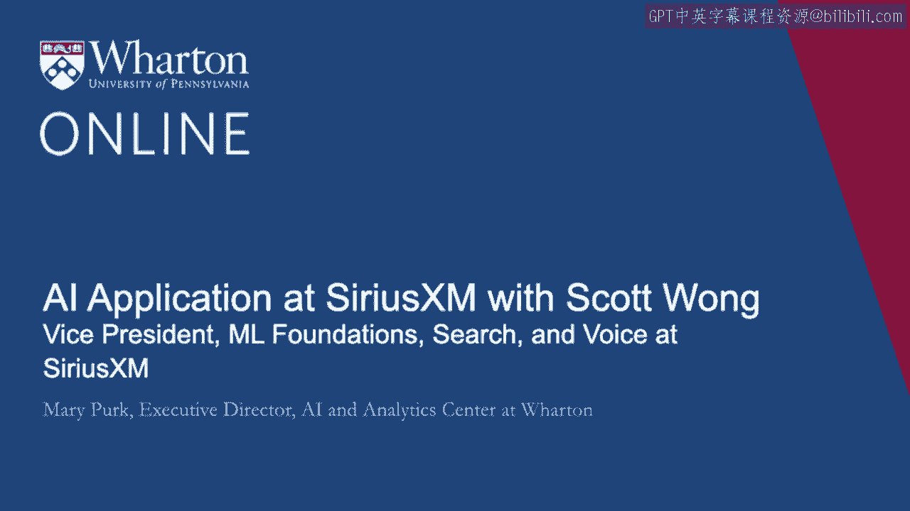
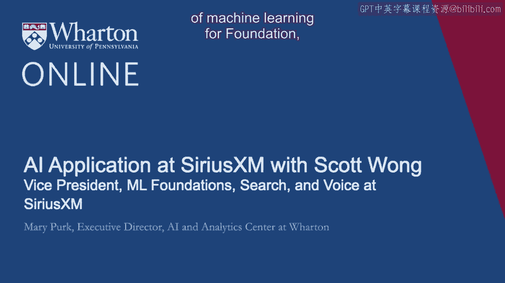

# P45：11_Scott Wong访谈.zh_en - GPT中英字幕课程资源 - BV1Ju4y157dK

斯科特·王是SiriusXM基础搜索与语音科学的机器学习副总裁。

他的团队构建可重用的机器学习系统，为SiriusXM的推荐和发现提供动力。

Pandora和其他产品。欢迎并很高兴今天能和你们交流。

为了让我们更好地理解你的视角，能否谈谈你在Pandora担任机器学习搜索与语音副总裁的角色及你的职业历程？

是的，感谢你今天的邀请，玛丽。我是Pandora和SiriusXM产品开发组织中的副总裁，专注于机器学习。

我的团队负责基础机器学习系统、搜索和语音的研究与开发。

基础系统是可重用的机器学习组件，例如听众及其兴趣的核心表现。

它们是推荐策略和实验框架的组合，例如多臂老虎机系统。

在搜索方面，我们构建基于机器学习的排名模型，帮助听众找到他们所寻找的内容。

在语音方面，我们使用自然语言理解、对话管理和内容标记。

个性化和其他一些技术帮助听众以创新的方式探索音频娱乐。

我认为大约20年前，Pandora源于许多人可能不知道的音乐基因项目。

这对你来说是一个小趣闻。它成为了第一个面向消费者的音乐推荐系统。

那么，你能描述一下音乐基因项目是如何构思的，以及Pandora是如何从这个项目发展而来的吗？

是的，当然可以。音乐基因项目是一项倡议，专业音乐学院的团队每天坐下来聆听音乐曲目。

注释超过450种关于这些曲目的不同属性。

这包括节拍、和声、声乐、流派和时期等方面。

工具、语言以及有关任何给定曲目真实内涵的无数不同维度。

如果你理解这些基因，即构成你所听音乐属性的元素。

你真的可以识别出相似的曲目和相似的艺术家。

这成为了推荐系统中一种叫做内容推荐策略的基础。

这对于冷启动场景非常有用，在这个阶段你还没有与用户的互动。

你只是想让事情起步。所以这个初始策略非常成功，正是它让Pandora起步。

此外，音乐基因真的很有趣，也很有趣味。

观看你正在听的东西而你甚至不知道它们的存在，这感觉很有趣。

只是一种有点刺耳的和声或鼻音，男性声乐或类似的东西。

所以，查看每一首音乐和你自己喜欢的东西真的很有趣。

直到今天，音乐基因组项目仍然是一个巨大的数据资产，我们正在继续发现新的。

每天都有创新的方法来利用它。这就像发现了音乐的DNA。

我也喜欢你提到的冷启动场景。

这是人们在启动不同项目时需要理解的一个非常重要的术语。

因此，更深入地钻研Pandora中的推荐。

个性化从一开始就是客户体验的一个主要焦点，当Pandora能够让听众表示他们的喜好和厌恶时。

你知道，赞成，反对。那么你的团队如何利用这个持续反馈循环，并且为什么听众能继续享受Pandora平台，尽管它是基于这种技术开始的。

这开始于15年前，这非常了不起。是的，没错。所以正如我提到的。

音乐基因组项目真正使第一轮基于内容的推荐系统策略成为可能。

但在用户开始使用产品并实际聆听之后。

提供隐式和显式反馈，这确实是数字黄金的下一个来源。

我会说。你知道，听众反馈数据真正推动了下一代推荐策略。

因此，在推荐系统中还有其他几种广泛的策略类别。

我们讨论了基于内容的策略。基于用户的策略包括，例如，你知道的。

和你相似的人也喜欢其他事物。因此你可以。

你可以根据人们的行为进行解释和学习，发现内容与偏好之间隐藏的相似性。

还有一些策略称为协同过滤策略，在这些策略中，你同时观察哪些听众是相似的。

哪些内容是相似的，并且你几乎是同时做到这一切。所以这个飞轮。

一旦开始运行，效果极为强大。你提到的赞成。

赞成和反对是关于听众在特定电台上喜欢或不喜欢曲目的非常明确的信号。

而这个框架对我们来说非常强大。在个体层面。

它让人们可以个性化自己的电台，使其更符合个人口味。但总体来看。

还有更强大的东西在发生。因此，赞成形成了一个标记的训练集，你知道的。

关于哪些曲目在哪些电台上成功。因此一般来说。

这就是机器学习真正发挥作用的地方。这是一个。

类似于一个监督学习问题，其中你实际上拥有标记数据。

你知道哪些曲目在每个不同电台上总的来说是成功的。

除了这些一般性之外，你知道，自始至今，我们在内容基础策略上也有所改进。

我们在元数据上有了改进，包括在摄取层以及利用机器学习学习和识别不同元数据源之间的相似性。

所以你可能知道，早些时候你有自己的Napster账号，下载过10个不同版本的同一轨道。

所有这些歌曲的艺术家名称和时长略有不同。

我们需要使用机器学习来识别这些实际上是同一个轨道。

更进一步，这个音乐项目已经持续了20年。

因此在这个项目中，我们大约有200万首曲目经过人工分析。

但我们有数千万的曲目供听众每天播放。

那么我们如何将人类所拥有的最佳和这些基因的最佳结合起来，并将其规模化呢？

大得多的曲目目录。所以我们有一个常说的短语：人类提供质量。

为规模服务的机器。所以我们开发了一个叫做机器监听系统的系统。

模型直接监听不同歌曲的音频。

背景目录中的歌曲，当它们新来的时候。

而且考虑到我们从音乐基因组项目获得的标签训练数据。

我们可以预测许多关于新音乐的属性，而内部没有人听过这些。

所以当你将所有这些不同的技术结合在一起时。

我们可以为算法电台提供动力，起始于超过3000万种不同的来源。

你能否逐步带我们了解你的团队如何为三个不同的利益相关者使用机器学习，因为我们的听众或观众会对此感兴趣。

一类是市场营销人员和广告商。这是一个利益相关者。

另一个利益相关者是歌曲创作者和你们服务的播客制作者。

还有我这样的人，听众。

如果你能给我们举个例子就好了。

或许在这些不同的利益相关者之间，以及你们如何利用机器学习来实现这一点。是的。

当然。所以广告和市场营销通常被我们归类在一起，因为它们都是以商业为重点的关注点。

但其中有不同的用例。所以当我们考虑市场营销时。

我们所做的一个伟大事情是思考如何在订阅上进行增销。

我们称之为智能转换。我们如何看待你在应用中的行为呢？

什么时候是针对增销的合适人选，目标对象是谁？

我们应该同时包含任何类型的促销活动吗？

我们建立机器学习模型以最大化这些干预措施的有效性。

类似地，对于推送和电子邮件活动，合适的设计布局是什么？

适合的主题是什么？哪些话题合适？

如果你给某人发了一封电子邮件，他们说，快回来，听这个艺术家。

我们想找到对那个人最合适的艺术家。

所以我们需要在内容本身中使用推荐。最后，在广告方面。

我们花了很多时间研究的一件事是我们的广告效果如何。

我们每天都在市场上向企业销售广告。

我们需要证明它们确实提供了价值。

所以我们能否利用系统内部的工具，比如调查和验证，来建模和学习我们的广告在不同背景下的有效性？

是的，对于创作者来说，创作者和听众围绕推荐形成了一个良好的市场。

一方面，创作者真的想找到我的目标受众是谁？谁会喜欢我？

我有一个信息想要传达出去。所以我们帮助了很多创作者。

特别是那些尚未被发现或刚进入市场的创作者。

确定最有可能对他们的内容感兴趣的听众。

这是一种推荐。另一种推荐是，好的。

你是一个听众。我想找到最适合你的东西。实际上。

机器学习在面向听众的系统中无处不在。所以广播。

接下来播放的歌曲是基于机器学习的。

我们称之为你的主页正在尝试帮助你基于机器学习发现新事物。

搜索、语音、自然语言理解，深入了解播客和现场广播等内容。

所有这些都利用机器学习来增强听众体验。它无处不在。你在这里。

这使你不断成长。这很好，我认为理解这一点很重要。

另外，早些时候你在给出一些例子时。

你谈到了隐含和明确信号。所以我们将稍微深入探讨，因为我们讨论了数据的收集。

当你构建模型并进行训练时，你给出了明确和隐含信号的例子。

那么你能否定义这些，并举一个你在这些利益相关者中如何同时使用隐含和明确数据的例子？

你刚刚提供的例子？是的，是的，绝对如此。所以。

我认为明确信号是最容易定义的。当听众进入并说。

不一定非得是听众，但我会以听众的例子进行说明。

听众进入并说，是的，我真的非常喜欢这个。

这看起来像是对一个电台的点赞或点踩。

或者将其添加到你自己的个人收藏或收藏夹，以便你可以稍后再次找到它。

隐含信号则对听众的意图描述得不够具体。

那么你是否完成了一首曲目？你在同一个电台听了多长时间？

你是否点击了推荐并阅读了艺术家的描述和简历？

所有这些信息使我们了解你在这个应用中感兴趣做什么？

你的核心兴趣是什么，我们如何帮助你实现目标？所以。

我认为在一天结束时，当你收集数据时，不要扔掉任何东西。

你想保持所有内容。你想保持尽可能良好的结构。

你需要认真考虑，以确保人们可以在未来发现它。

当你坐下来试图构建模型并训练机器学习模型时。

你想知道你真正想做的是什么。将正确的数据与正确的模型结合以适应正确的业务用例是机器学习科学家、工程师或数据科学家的核心挑战。

这不仅仅是坐下来调整一些参数并训练模型。

这真的是在识别这些数据中有意义的东西。所以，例如。

我之前提到过点赞。我们如何在广播中使用它？我们如何将其用于机器学习？

那么，当你收听广播电台时，我们关心哪些指标呢？

一件事肯定是你听的时间，但那有点难以预测。

如果我知道你会长时间收听，那我在系统中甚至要怎么处理这些？

预测的一个更可操作的事情是，如果你现在对这首歌点赞，它上升或下降的概率是什么？

然后我作为记录系统的工作是为你提供大量歌曲在电台上。

我认为你会赞成。所以那些明显的信号像点赞成为我们可以识别特征的标签训练集。

我们可以进行错误分析，以识别哪些我们认为会被赞成但实际上却被反对的内容。

因此，整个端到端的管道中需要大量工作。

然后最后一步是，一旦你开发了模型。

一旦你认为你有一个可以工作的东西，你就得测试它。

你得看看它是否真的有效。所以我们对生产日志进行离线分析。

但我们也每天在应用程序中直接进行实验。

我们使用其他因果推断技术来学习如何最好地演进系统。哇。

感谢你将测试纳入隐含和显性信号的回答中。

这也引导我们进入下一个领域，因为你非常关注数据以及数据的重要性、问题和测试。

但让我们稍微谈谈模型，特别是关于公司如何选择准确模型和平衡的问题。

你知道，准确性与可解释性。具体来说，在你的角色中，流行病潘多拉是我们的。

他们如何评估这两个目标的价值，或者同时的价值。

他们是否以不同的方式看待它们，你知道，分开。如果你能稍微谈谈准确性。

可解释性，特别是考虑到你刚刚给了我们这么多关于如何处理数据的好信息。

所以，也许你可以告诉我们你如何处理这两个术语在模型中的应用。是的，是的，像。

像所有有趣的事物一样，这并不是一刀切的。所以这很大程度上取决于你想做的具体事情。

我会说，有几件重要的事情值得在早期考虑。这，你知道。

任务是什么。所以这是那种出错成本非常高的事情吗。

或者这是那种事情，你知道，没关系的。如果。

如果对预测的准确性有一些灵活性。

接下来是模型的消费者是谁。那个人对系统的信任程度如何。

他们愿意投入多少来与之建立关系。所以，例如。

在我们的为你推荐页面上，我们认为客户是为了发现新音乐而去那里。

而且你希望有新的播客、新的节目，以及所有类似的新话题。

所以当有人去那里时，你希望推动对有用和有趣事物的边界。

但你也要确保它是可解释的，因为人类。

当你遇到朋友时，他们说，哦，你必须试试这个东西。因为你喜欢这个。

你会喜欢这样的。所以，归根结底，拥有一个模型是可以的。

这将探索更多领域，承担一些风险，并能自我解释。

当你更深入系统时，有一位科学家每天都在试图改进模型。

他们可能已经对系统有较高的信任。他们知道它的来源。

他们尝试了很多不同的事情。他们在真正强大的东西上进行了深入投资。

坦率地说，能对他们进行解释的内容与对听众能解释的内容会有所不同。

他们对每种技术擅长或不擅长的领域具有特定知识。

所以在那种情况下，你可能更倾向于采用那些对公众较难解释的复杂模型，然后在推荐之后再找出并解释可能的原因。

但绝对没有一种通用的答案。

我们都会考虑这些事情。在许多背景下，我们都在思考这两件事。

我非常感谢你将信任与可解释性结合起来，以及可解释性的水平。

你不必解释数据科学家可能知道的事情。

但它确实需要解释到一定程度，以建立与服务或公司的信任。

不要减弱这一点，以至于你必须达到那种解释的水平。

非常感谢你的解释。我们稍微谈了一下市场中的测试。

A/B 测试。我不知道是否还有其他的，如果你想更深入地探讨一下。

如果你能解释 AI 如何提高 Pandora 测试的效率，那就能提供一些见解。

是的，我认为了解某事是否产生变化的金标准是。

使系统的改进或削弱使用因果推断技术。

A/B测试是一个明确的方式，可以说：“我进行了干预。”

我有一组随机样本的人，他们体验了我们产品的一个版本，还有一组随机样本的人，他们体验了我们产品的不同版本。

“而且正好有一个差异，你可以将任何持续变化归因于此。”

所以这是一个非常清晰的方式来理解你所做的更改实际上是导致指标变化的原因，而不仅仅是与指标变化相关。

A/B测试是确保事情确实按照你的期望运行的标准方法。

在推出A/B指标之前，你想要有信心你所做的事情实际上会是好的。

因此，我们进行了许多实验，我们称之为离线实验。

它们并不是在实际的产品中与真实的听众、营销人员、广告商或创作者一起运行的。

它们是针对我们的日志进行的。因此，你可以进行回测和分析，以找出在那种情况下表现如何。

因为你想保留A/B实验的有效性。

你仍然希望能够以足够大的样本来识别差异。

进一步的步骤是一个称为多臂赌博机的框架，在这个框架中，你可以同时进行多个实验。

因此，不仅仅是A/B，而是考虑A/B/C/D/E/F/A。还有这些不同的臂。

这在时间上是自适应的。所以你一开始尝试了解每个臂的一点情况。

随着进展，表现更好的那些，你真的想开始引导人们朝向那种体验。

因此，你在探索和利用之间进行平衡，以高效地了解处理之间的差异。

并尽快获得最佳处理效果。

在进行A/B测试和多臂赌博机时。

你是否在利用人工智能的力量来帮助确定你想进行的具体A/B测试参数？

我很好奇你是如何使用人工智能和机器学习来选择可能的多臂赌博机以及在A/B测试中的应用？

是的，有很多方法可以设计好的测试，无论是A/B还是多臂赌博机。

其中一些是基于产品直觉，你可能会说：“哦，你知道吗。”

我觉得我们在广播产品中引入了太多的重复内容。

让我调整这个旋钮，尝试几种不同的方案，看看效果如何。

其他方面则是非常依赖机器学习的，你已识别并首先离线运行以进行验证。

“我有一整套超参数需要调整。”

我可以对我拥有的数据进行这样的操作。

但你不想将成功几率较低的实验带入产品，因为A。

你不想冒险给人们带来非常糟糕的体验。但B。

你需要让足够的听众接触到任何给定的处理，以测量变化。

所以你对有影响的信心越大，就越不可能让人们接触到随机变化。

所以你真的能够准确缩小应该推向市场的测试，因为再一次。

你不想这样做。此外，你对信任和你所做事情的可解释性非常谨慎，因为你真的不想让听众知道你也在测试这些东西。

我是说，你想要信息等，但你不想破坏那种关系。

我认为那真的很棒。所以你早些时候提到的一个领域是搜索和语音。

那么，你的团队如何将消费者搜索和语音请求整合到推荐模型中，并在这些模型中使用更多的自然语言处理？

是的，搜索是一个我们可以捕捉到的非常早期的信号。

当现实世界发生某件事情时，就会发生意外。

有一部新电影的发布或类似的事情。

人们开始搜索可能在那天结婚的配乐或特定艺术家。

因此，人们会在整体收听尚未大幅可检测变化之前开始搜索。

所以你可以将其作为输入，一个趋势信号，并将其输入推荐算法。

“嗯，我认为人们现在更想要这个。”所以这是一个有用的搜索方式。在语音方面。

我认为我们语音科学与推荐之间的关系与你想的有点不同。

语音产品确实推动了额外的产品用例。例如。

我们已经看到人们在语音中会询问非常主题化的查询。他们会说。

“播放90年代的RMB，女声。”然后你会想，“哇，我该如何满足这个请求？”

你可以直接在搜索和语音中解决这个问题，尝试识别这些轨迹并将其反馈给某人。

或者你可以从根本上查看底层。

“我需要建立电台，让人们拥有那种灵活性。”

那么，我们在语音产品中看到的发现如何影响更广泛的科学路线图，坦率地说，这是我工作中最有趣的部分之一。

我可以理解他们为什么把这些结合在一起，因为在发现和创新方面它们都是相互关联的。

所以最后，展望未来，我真的很想看到的是，你认为Pandora和SiriusXM的结合优势对消费者来说在哪里？

是的，SiriusXM在两年多前收购了Pandora。从一开始。

它们是一个很好的补充。SiriusXM在北美的音频娱乐领域是一个成熟的领导者。

它嵌入在汽车中。它有一个非常高的利润卫星广播业务。

Pandora在美国的竞争激烈的数字流媒体环境中非常有名。

这是个性化的。它在你和算法之间建立一对一的关系，能够完全适应你是谁。

而广播是一对多的关系。你编程一个频道，整个美国的每个人都可以收听。

从一开始，我们就一直想如何通过将内容从一个领域引入另一个领域来交叉传播听众体验？

我们如何制作更好的订阅套餐？我们如何对已知用户进行更好的营销？

我们如何为所有不同产品构建广告平台？

从科学的角度来看，我们如何从这些不同的数据和跨领域的专业知识中学习？

所以一定要利用我们从Pandora获得的所有反馈数据，以及如何将类似的东西构建到广播体验中？

事实上，针对2019年开始推出的新车队。

我们实际上开始收集很多指标反馈，以便能够开始直接个性化汽车内的体验。

哇，这真令人兴奋。我刚买了一辆2018年的新车，所以我对此非常期待。

非常感谢你，斯科特。与您交谈非常愉快，了解到Pandora如何利用AI和ML以及您所谈到的隐式和显式数据，让我们享受更个性化的音乐选择。

非常感谢您今天的参与。谢谢你，玛丽。好的。[空白音频]。
