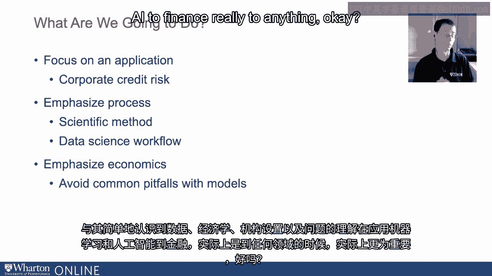
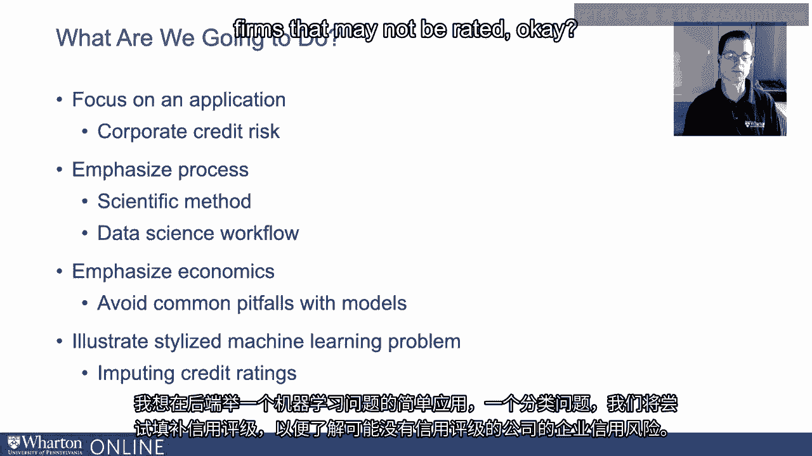
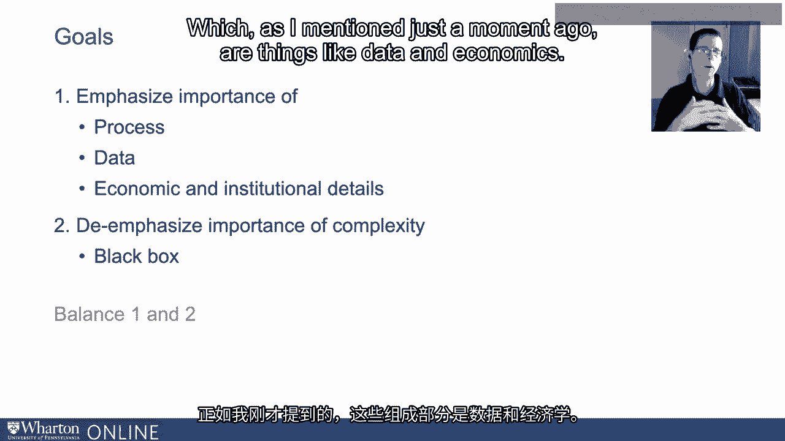

# P46：12_简介.zh_en - GPT中英字幕课程资源 - BV1Ju4y157dK

嗨，我是迈克尔·罗伯茨。我是威廉·H·罗伯茨教授。

我是宾夕法尼亚大学沃顿商学院的金融学劳伦斯教授。

在这一系列视频中，我们将讨论金融、机器学习。

以及人工智能。因此，当我想到金融、数据和技术时，我认为没有什么新意。

金融一直是以技术为导向、以数据为导向以及以模型为导向的。我是说。

你可以追溯到20世纪初的穆迪手册。

数据在金融中始终扮演着核心角色，技术的发展也是如此。

因此，机器学习和人工智能在大众中的近期关注。

从某种意义上说，金融领域的新闻并不是什么新鲜事，它一直处于前沿。

数据技术的前沿，以及建模。至于应用方面，随便谷歌一下，金融领域。

在机器学习或金融和人工智能的领域，你将会得到一大堆信息。

我意识到我在说这句话时有些过时，但你会看到一个非常长的列表。

我在这一张幻灯片上列出了一些常见示例，但这个列表还在不断延续。

实际上，如果你仔细想想，很难找到一个金融应用，其中数据不发挥核心作用。

而且根据你对机器学习的具体定义。

机器学习当然存在，回归分析自从人们在20世纪上半叶手动进行时就已经存在。

20世纪。因此，考虑到该主题的广度和深度，金融、机器学习和人工智能。

我们在这里要做什么？我想专注于一个应用，以提供一种感觉。

以说明其用法，而不是在你可以找到800篇不同文章的更流行的环境中。

我想专注于企业信用风险。我要强调的是这个过程，特别是科学方法。

以及数据科学工作流程。我想强调经济学。

对经济现象和经济原则的理解。

企业信用风险背后的制度细节。

这样我们就可以避免一些常见的陷阱和错误，这些通常与盲目推动有关。

通过一些复杂模型、黑箱来处理数据，我们只能交叉手指，寄希望于结果。

它为我们提供了某个问题的正确答案。实际上。

我认为，对人工智能和机器学习的失望与实际应用有很大关系。

这与对模型和算法的过度依赖有关，认为它们是解决一切的灵丹妙药。

解决问题，而不仅仅是认识到数据、经济学和制度。

对问题的设定和理解在任何应用中都至关重要。

机器学习和人工智能在金融中真的适用于任何东西。

我想在后端展示一个机器学习问题的简单应用。

这是一个分类问题，我们将尝试推测信用评级。

信用风险的感觉，企业信用风险对于可能未被评级的公司。

那我们要怎么做呢？如果你还没有想明白。

这将是非正式的。我想进行一场对话。

我从来不喜欢脚本对话。尽管听起来更清晰，但对我来说显得有些不自然。

但我们将以非脚本方式进行。因此你会听到我口吃、结巴。

我会犯错并努力纠正自己，希望如此。

不是太频繁，并且希望不会以令人分心的方式出现，而是让你容易理解的方式。

这在你脑海的背后潜意识或意识上与之互动。

我也希望这能是动态的。就像你坐在我旁边，我们一起在电脑前工作。

我们正在回顾一些数据、模型等。在这个意义上。

你能够了解或洞察我的思维过程或想法。

更广泛地说，过程的呈现。因此总体来说。

这种非正式的动态方法希望，至少能如此。

目的是希望这能导致更有趣且更具生产力的结果。

以及教育经验。背景噪音来了。那么，目标是什么呢？

目标是我想确保传达一些关于实证分析的想法。

或金融分析。尤其是，我想强调重要性。

正如我之前提到的，过程，具体的过程。

并不是说它们会限制创造力。

但它们会规范我们分析数据的方式。

我想强调数据的重要性。我也想强调经济和制度细节的重要性。

与此同时，我希望在一定程度上弱化复杂性、魅力、算法的重要性。

流行词汇，实际上是过程的黑箱方面。

我想在这里小心，因为我真正想做的是传达重要性。

在这两种理想之间找到平衡。理解并具备领域专业知识的理想。

对于我所研究的现象，数据和经济的清晰理解。

但我也必须理解算法或模型的重要性。

将数据处理并输出我感兴趣问题的答案。

所以我真的想强调这两个方面的平衡。

因为我过去几年的经验是，人工智能和机器学习。

这个组件受到了大量关注，关注过于不成比例。

在一定程度上，这是有充分理由的，因为有了很大的进展，但代价是什么呢？

我相信这些都是整体金融分析过程中同样重要的组成部分。

正如我刚才提到的，这些是数据和经济学等内容。[BLANK_AUDIO]。

