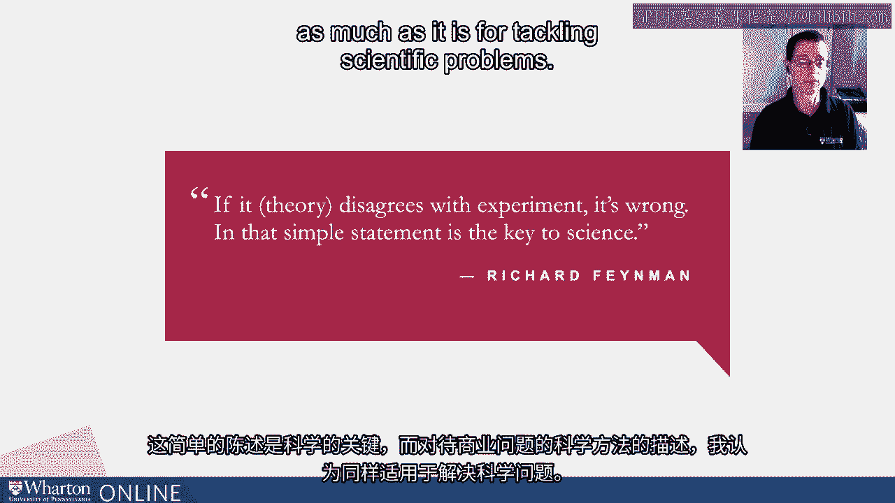
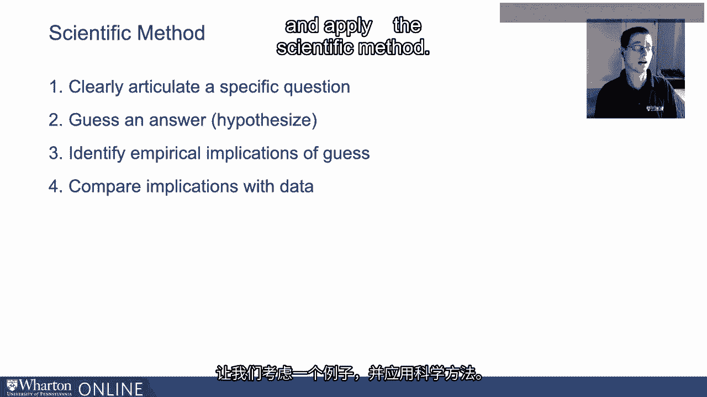
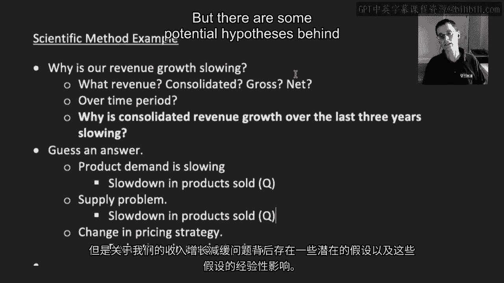
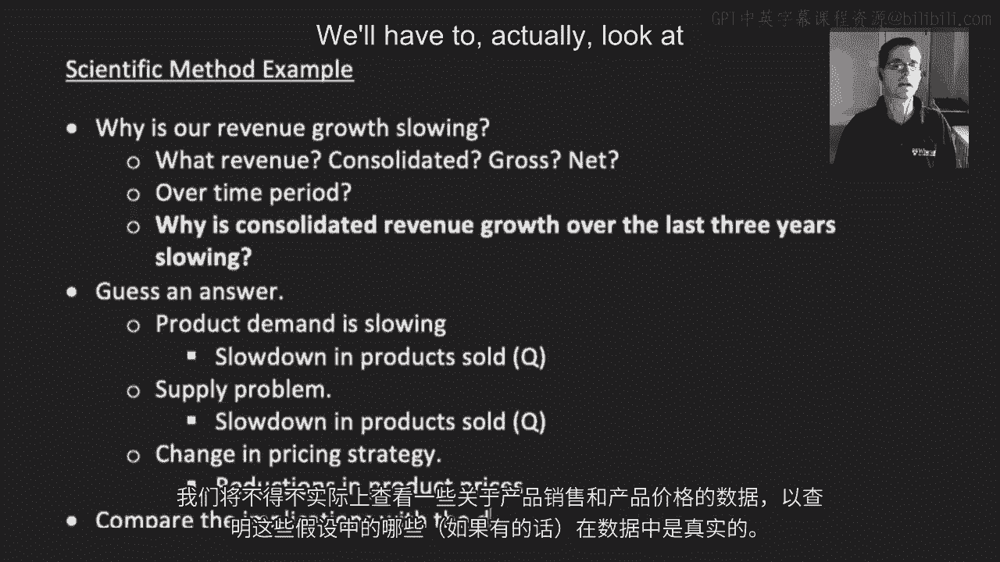
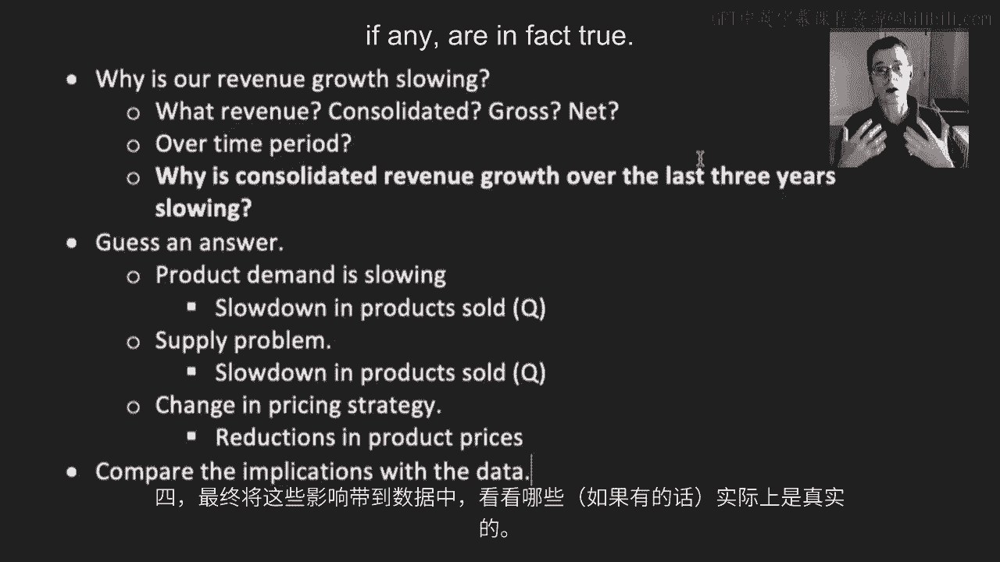

# P47：13_过程科学方法.zh_en - GPT中英字幕课程资源 - BV1Ju4y157dK

因此，在任何形式的机器学习或人工智能，或者更一般的财务分析工作之前。

我们总是希望有一个解决问题或提问的流程。

我认为最经过考验的方法是大多数人所称的科学方法。

方法。我喜欢理查德·费曼这位伟大物理学家的这句名言，它很好地总结了。

以非常简洁而优雅的方式描述科学方法。如果是，他指的是理论。

与实验相悖就是错误的。而这个简单的陈述是科学的关键。

我认为对解决问题的科学方法的这种描述是。

对于解决商业问题来说，这非常有用，就像解决科学问题一样。

那么让我们在这里更明确一些。那么什么是科学方法？

有许多方式可以描述它，我发现以下这种方法非常有用。

所以首先，你要清楚地表述一个具体的问题。

你想解决什么问题？然后你猜一个答案。

统计学家会说你假设一个答案。同样的思路。

所以你提出一些潜在的答案或假设、解决方案、建议的解决方案。

针对这个问题。第三步，我们希望识别这些假设或猜测的经验含义。

对于这个问题的答案或假设。如果答案或假设是正确的。

我们在数据中应该看到什么？最后，我们希望将我们猜测的经验含义与实际观察到的进行比较。

在数据中看到的。如果我们的假设是正确的，这就是我们在数据中看到的。

我们应该在数据中看到，但我们实际上在数据中看到吗？这实际上是最后一步。

那么让我们考虑一个例子并应用科学方法。

这里有一个人可能会问的问题。为什么我们的收入增长在放缓？

许多商业领袖可能会问他们的公司什么问题。现在看起来答案是明确的。

这是一个具体的问题，但实际上，我对那个问题有很多疑问。

如果我们想查看数据以提取答案，其实并没有那么明确。

对于那个问题的答案。那么例如，我们在谈论什么收入？我们是在谈论合并的？总收入。

净收益、折扣等等。时间跨度是多少？

那么我们是在讨论过去一年的收入增长，还是过去两年的收入增长。

五年？所以如果我们想要“说”数据，我们需要非常谨慎。

要具体且清晰地提出问题。所以让我们想象一下，我们真正感兴趣的是为什么收入增长在。

过去三年？抱歉，打字有误。我们假设这是在综合层面上进行的。

而不是针对特定产品。为什么过去三年的合并收入增长放缓？

我最终会学会在这里打字。这就是我们的问题。

记住第二步是猜测一个答案。一些潜在的答案是什么？你认为为什么。

实际上，暂停视频并尝试提出一些答案？

你不知道我们讨论的是哪家公司的事实并不重要。

只需运用你的商业常识和对推动收入的一般理解。

尝试对此问题提出一些答案。好的，希望你回来了。

如果你想到了什么，那么这里可能的答案是什么？

有一些假设可以解释为什么收入增长放缓。可能有一件事情正在发生，那就是需求。

产品需求在放缓。可能还存在其他情况，实际上需求并没有放缓。

但我们面临供应问题。因此，我们的产品需求量很大。

但出于某种原因，我们就是无法将产品上架。

也许正在发生的事情是定价策略发生了变化。记住。

收入等于价格乘以数量。因此，收入随时间减少或增长放缓。

更准确地说，可能通过数量或价格渠道实现。

因此，我们可以测试一些假设。然后第三步是确定我们猜测的经验含义。

这些不同假设的经验含义实际上相对简单。

如果定价策略发生变化，我们可以查看数据中的定价。

我们的产品是否在降低价格，也许过于激进以维持需求。

所以我们应该看到产品价格的降低。也许正在发生的事情是，我们看到的却是产品销售数量的放缓。

有趣的是，这是我们在供应问题中看到的相同含义。

增长将影响数量。因此，如果事实证明我们只是销售的单位减少了。

我们稍后将需要更深入地探讨一下。

但关于我们收入增长放缓的问题，还有一些潜在的假设。

作为这些假设的一些经验含义。

最后一步是将这些含义与数据进行比较。这是我们的最后一步。

所以我们需要查看一些关于产品销售和产品价格的数据，以了解。

如果这些假设在数据中确实存在。

这虽然是一个非常风格化的例子，但希望能强调其重要性。

清晰地阐明一个具体问题，以便你可以进行数据分析。第二。

猜测一些问题的答案或假设。三。

确定这些假设的经验含义。这是我们在数据中应该看到的。

最终将这些含义带入数据中，以查看哪些是存在的，若有的话。

事实上是真的。[BLANK_AUDIO]。

