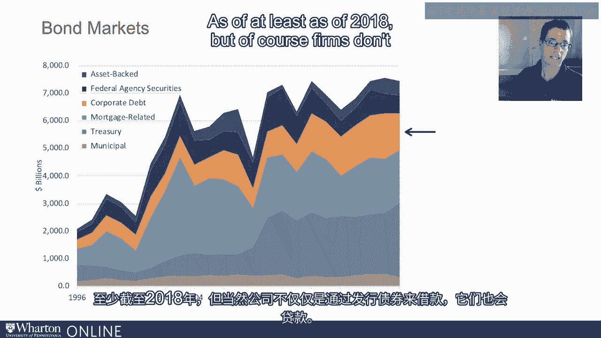
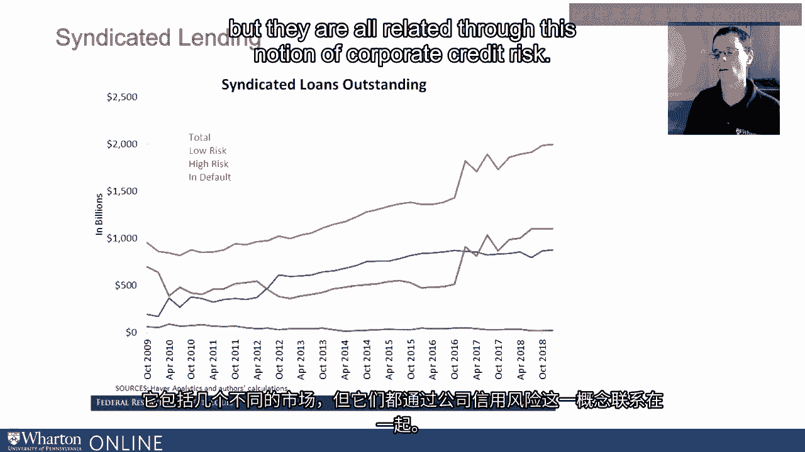
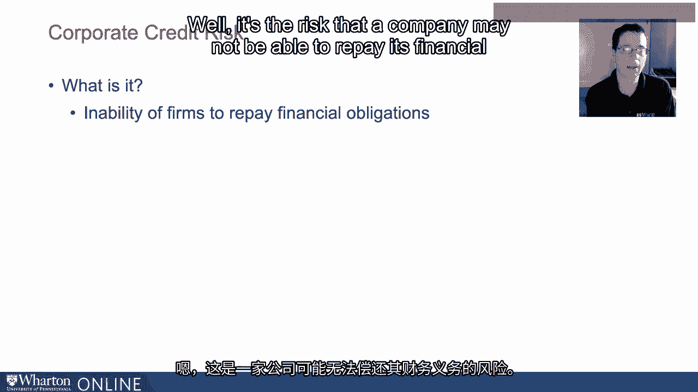
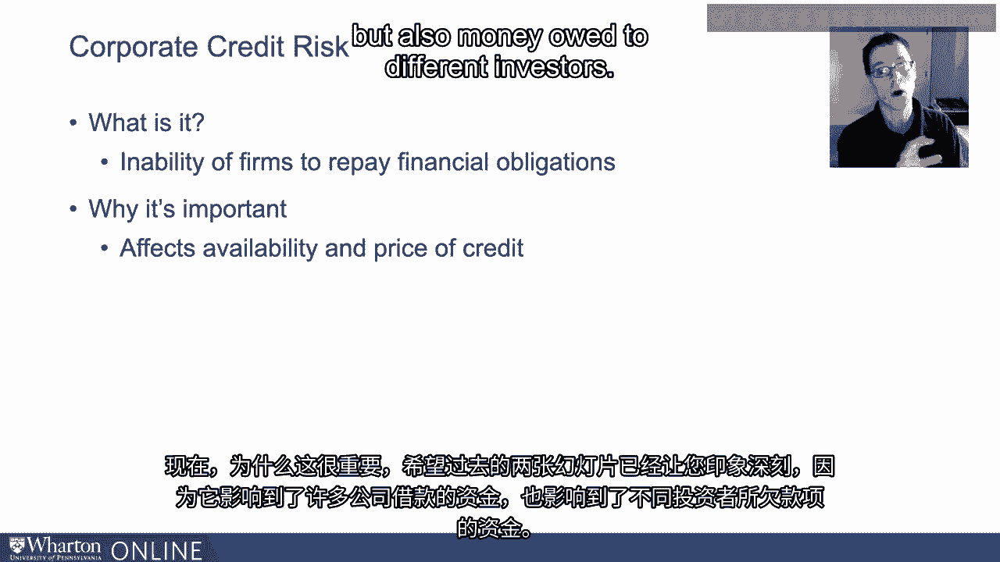
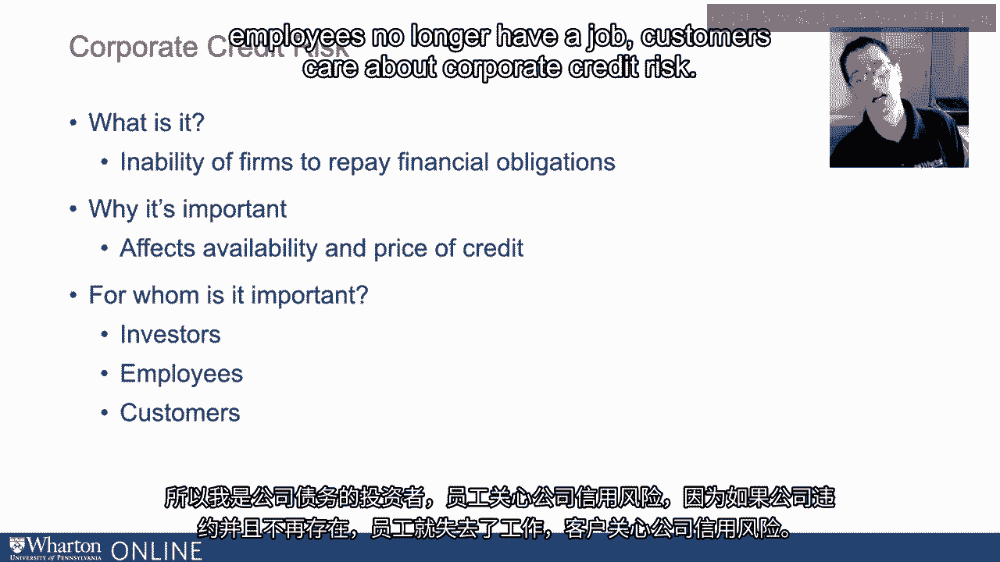
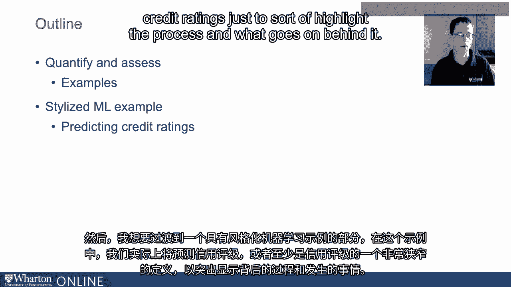
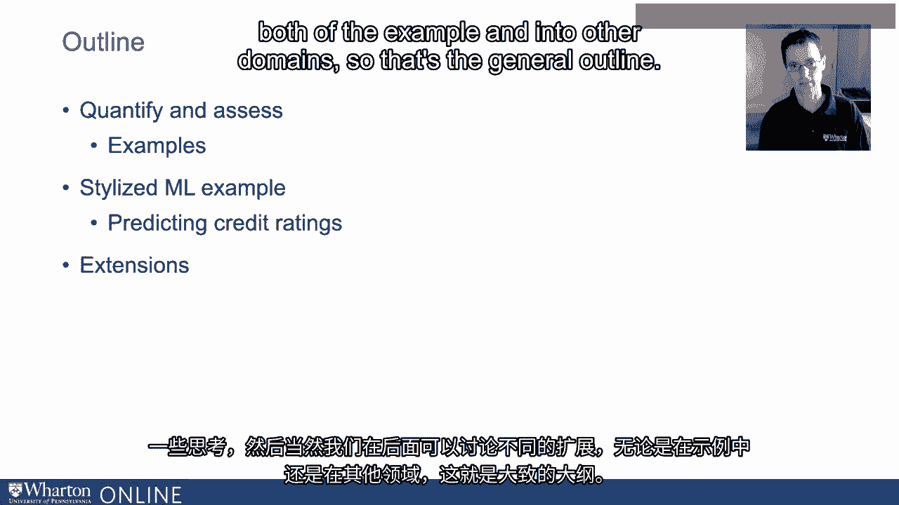

# P49：15_企业信用风险.zh_en - GPT中英字幕课程资源 - BV1Ju4y157dK

所以我现在想在这个视频中开始讨论我们的。

这是金融分析和一些机器学习的应用或示例。

我想讨论的背景是企业信用。

风险。因此，作为一些动机的背景，这里有一个新义务的图示。

在美国经济中不同发行者的债券发行情况。

好的，我们在这里有资产支持，称其为棕色。海军色是。

联邦机构证券。这种橙色代表企业债务。我们有抵押。

相关的债券发行情况。国债是联邦政府发行的债务。

这里是绿色的政府和市政债券，由各州和市政当局发行的债务。

我们将要关注的。

本部分的橙色部分。因此，我们将重点关注企业债券。

发行情况，从这个图的比例来看，几乎在。

截至2018年，金额达到数万亿美元，但当然公司不只是。

通过发行债券来借款，它们还会申请贷款，所以如果我只看一个。

在这种情况下，联合贷款是贷款市场中的一个小组成部分。

联合贷款的金额，而联合贷款只是由几个不同的金融机构所有的贷款。

由几个不同的金融机构拥有的联合贷款。

而不是仅由一家机构拥有。你可以看到金额。

目前未偿债务至少超过两万亿美元。

总体而言，你可以看到相对风险的轻微区分，低风险与高风险。

这两张图片的重点是强调企业。

企业债务贷款是贷给公司的一个非常大的市场。

包含几个不同的市场，但它们都通过这一点相关联。

企业信用风险的概念，那么我们所说的企业信用风险是什么意思呢？

这就是一家公司可能无法偿还其财务义务的风险。

现在，这为何重要，希望最后两张幻灯片给人留下深刻印象。

这影响了借款金额，涉及到大量资金。

企业所欠的款项以及不同投资者所欠的款项，因此它影响到。

信贷的可获得性影响信贷价格。那么，信贷是给谁的？

风险对许多不同利益相关者非常重要，因此有投资者。

我恰好拥有债券共同基金的股份，所以我是一个。

企业债务的投资者。员工关心企业信用风险。

因为如果公司违约并不再存在，员工将不再有工作。

客户关心企业信用风险，想想我总是回想起。

2008年的大萧条以及汽车公司的遭遇，你不会。

想从即将破产的汽车制造商那里买车。

因为一方面你可能在车上得到一个好交易，另一方面。

如果公司破产，你将从中获得服务。反面情况是。

当然，供应商对信用风险的担忧。

将会更加不愿意向他们的。

购买者如果面临大量信用风险和可能的违约风险。

最后我列出了纳税人，因为再次要考虑。

回到2008年金融危机或大萧条，你知道最后的结果是。

纳税人承担了某些债务的风险。

财务中介无法支付。这就是，救助的原因。

所以让我给你一个大纲，介绍我们在接下来的这些视频中要讨论的内容。

我想思考如何量化和评估企业信用风险，我不想通过示例来做。

我想要。

然后进入一个风格化的机器学习示例，实际上我们正在。

将预测信用评级，或者至少是信用的一个非常狭窄的定义。

评级只是为了突出这一过程以及其背后的运作。

思考的内容。然后我们当然可以在后端讨论。

示例的不同扩展以及其他领域的应用。所以那就是。

大致大纲。[BLANK_AUDIO]。

