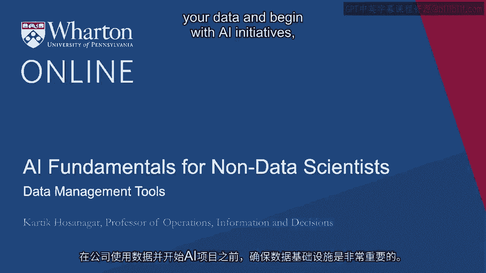
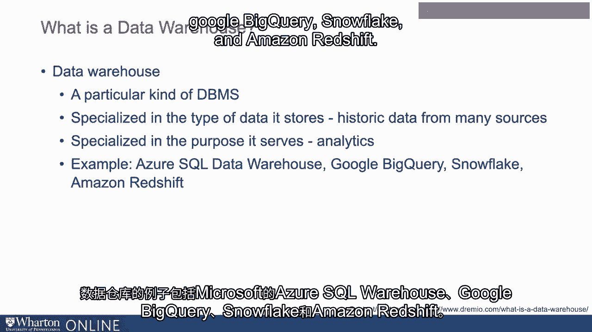
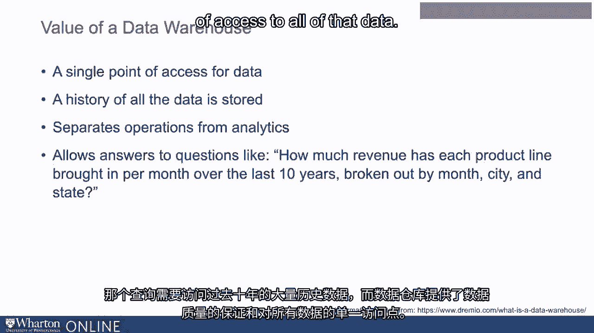
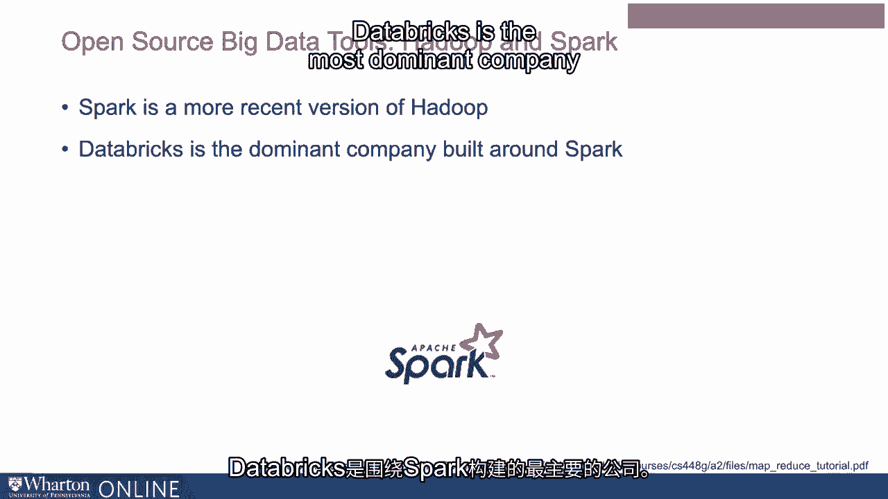

# P5：4_数据管理工具.zh_en - GPT中英字幕课程资源 - BV1Ju4y157dK

在你的公司能够使用数据并开始AI项目之前。

建立数据基础设施是很重要的。在这次讲座中。我将讨论公司在开展大规模AI项目之前必须具备的数据管理工具。首先，我们将稍微谈谈数据仓储。首先。很多人可能对数据库的概念比较熟悉。数据库可以简单地理解为一个结构化的数据集合。非常简单。Excel电子表格可以被视为一种数据库。现在，在实际操作中。我们通常需要更好的工具来管理数据。所以数据库管理系统或DBMS是允许用户更好地访问和管理数据库的系统。所以Excel再次提供了一些简单的功能。

但来自微软、Oracle和其他许多公司的更先进数据库确实帮助企业更好地管理他们的数据。有时我们也简单地称数据库管理系统为数据库。数据仓库是一种特定类型的数据库管理系统。它在两个方面是专业化的。首先，它在数据仓库存储的数据类型上是专业化的。

通常这是来自企业许多来源的历史数据。数据仓库在其服务的目的上也是专业化的，那就是分析。普通数据库可能服务于操作。例如。当一家银行的客户登录网站并想查看他们的当前账户信息时。然后你实际上与一个操作数据库进行交互，或者说客户正在与之互动。它能够快速提取数据并响应客户查询，比如他们的当前余额。相比之下，分析需要访问公司可能拥有的所有数据或大部分数据。其目的通常不是速度，而是能够提供更全面的。

并且提供公司所有数据的全局视图。数据仓库则服务于该目的。它不一定是最快的数据库。但它是专门用于分析功能的。因此，它提供了一个更完整的组织数据视图。数据仓库的例子包括微软的Azure SQL数据仓库和Google BigQuery。Snowflake 和 Amazon Redshift。

现在，我们来谈谈数据仓库的工作原理。通常在大多数公司。操作数据分散存储在许多不同地方。例如。客户数据可能存储在CRM系统中。还有一些其他的企业信息。包括关于合作伙伴和供应链的信息，可能存储在ERP系统中。

客户账单信息可能存储在另一个独立的数据库中。现在。如果我们想要一个公司所有数据的统一视图。我们首先需要将所有数据提取到数据仓库中。ETL工具对此很有用。ETL代表提取、转换和加载。这些工具将数据从不同的单独数据库中提取出来。

例如，他们将从CRM系统中提取客户数据。客户的账单数据从账单系统中提取等等。所有这些数据都被提取出来。数据按需转换，然后加载到数据仓库中。流行的ETL工具包括由Informatica和Stitch等公司构建的工具。

现在，它是一个名为Talon的公司的一部分，还有许多其他公司。数据仓库现在包含来自所有不同来源的所有数据。一旦我们将这些数据集中在一个地方，你现在可以构建报告和数据可视化工具。在此基础上。例如，像Tableau这样的商业智能工具位于数据仓库之上。

当分析师输入查询时，这些系统可以进入数据仓库。并提取必要的信息。接下来，让我们谈谈数据仓库的价值。数据仓库的主要目的或价值在于它作为单一访问点。公司的所有数据的中心。并且它存储所有数据的历史。正如我之前提到的，数据仓库帮助将操作与分析分开。通常操作数据是快速的，以便当客户登录时。你可以快速提取数据并响应客户余额等信息。另一方面，某些分析查询可能需要更全面的访问。

历史数据和数据质量的保障。例如，如果分析师想知道。在过去10年中，各产品线带来了多少收入？

我们希望这些数据按月份、城市和州分开。这样的查询需要访问过去10年的大量历史数据。数据仓库提供数据质量保障和单一访问点。关于所有这些数据。现在，关于数据仓库就稍微介绍到这里。

作为数据基础设施的一部分，我们还应该谈谈大数据工具，如Hadoop和Spark。现在，像Hadoop这样的工具有两个主要目的：存储和处理。现在。存储大数据通常面临一些独特的挑战。如果我们想存储少量数据。几个文件，我们通常可以将其存储在我们的计算机中。

但如果有大量数据怎么办？过去10年中数百万或数亿客户的数据。20年来的数据。这样的数据无法存储在单台计算机上。所以像Hadoop这样的一个大数据工具的作用之一就是将其存储在。以分布式方式在多台计算机或多个节点之间。接下来，这些系统也会。

处理这些数据。通常这种处理涉及分布式处理。在多个节点或多台机器之间处理数据并进行并行化。尽可能多地进行计算或数据处理，这有助于提高速度。Hadoop是一个由Apache基金会提供的开源工具，Apache基金会是一个非营利组织。

提供开源软件的基础。Hadoop最受欢迎的发行版是由一家。一家名为Cloudera的公司，尽管还有其他几家公司。而Spark是一个更新的版本。实际上，我会说它是Hadoop的一个更具主导性的替代品，二者的目的相似。但解决了Hadoop过去面临的一些问题。Data bricks是最好的。

以Spark为核心的主导公司。接下来我们将更详细地讨论数据。在我们与Snowflake的一位高管讨论中，提到了房屋以及像Hadoop和Spark这样的大数据工具。

[BLANK_AUDIO]。
