# P52：18_信用风险信用评级预测.zh_en - GPT中英字幕课程资源 - BV1Ju4y157dK

好的，现在让我们过渡到考虑机器学习的背景。企业信用风险，特别是在预测信用评级的背景下。

所以我们应该根据科学方法精准一点，明确我们所做的事情。

我们正在尝试做的事情。

我想做的是开发一个能够区分的模型。在投资级评级公司和投机级评级公司之间。

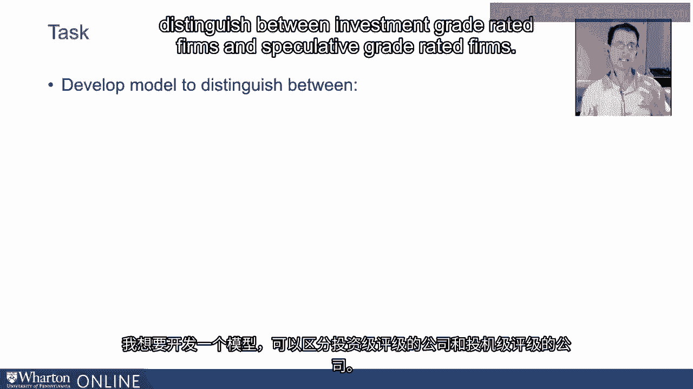

为了提醒你，让我回顾几张幻灯片，明确我们所指的内容。通过投资级和投机级。记住。这条线就在我正在悬停的地方，三重之间的界线。标准普尔或惠誉评级中B减和双B加之间。B双A三和B单A一，这条线划分了投资级，对应于。对于所有在该线以上评级的公司和投机级，这对应于所有。评级低于该线的公司。这就是我们想要做的。

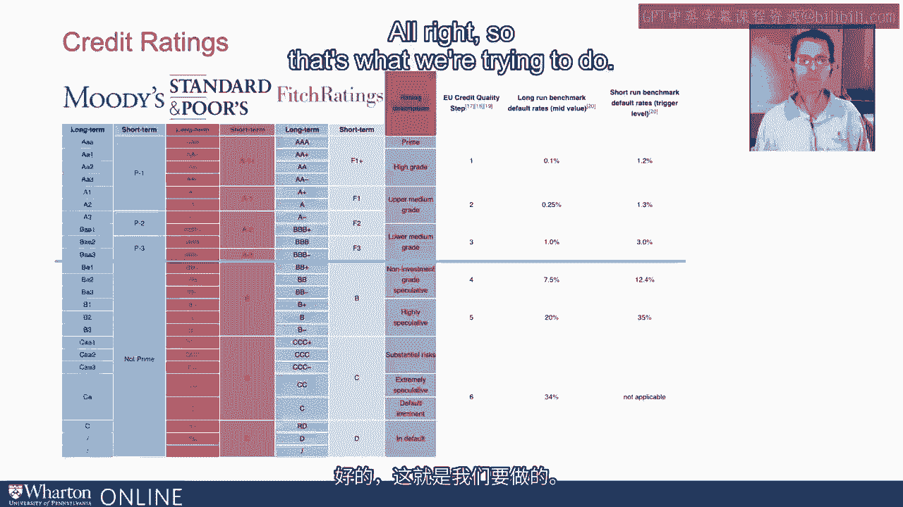

现在我们可以更加精准，开发一个模型，分类每个。级别。因此理论上我们可以区分AAA和AA+评级。我们可以写出一个模型，区分这些单个的。

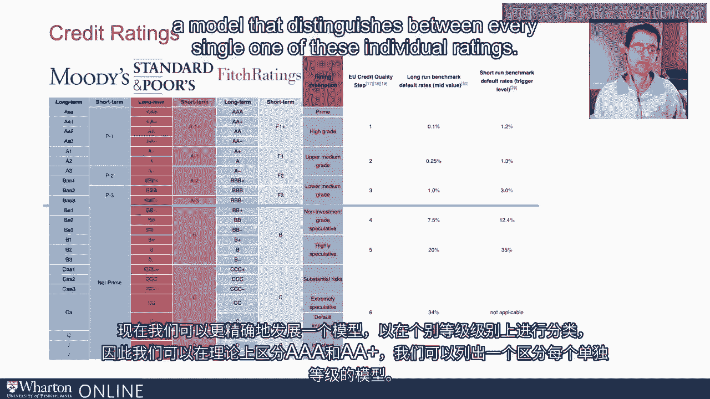

但暂时我们还是保持相对简单，试着分配给。

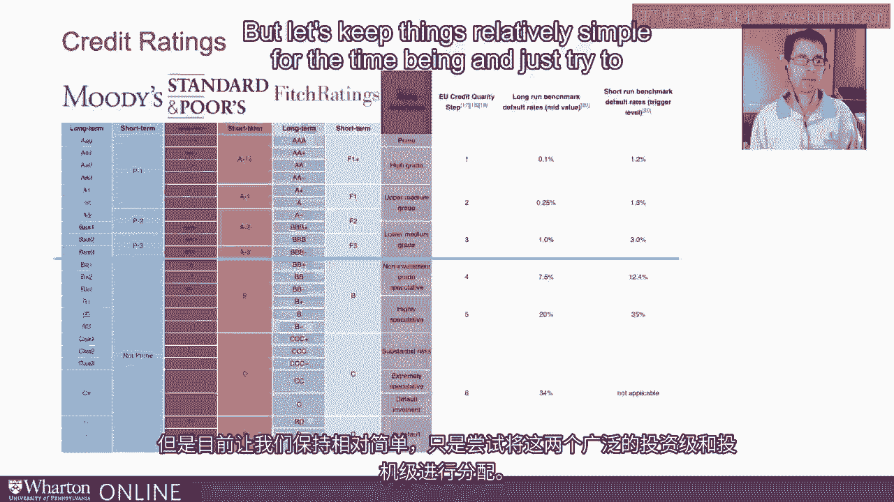

这两个大类的投资级和投机级。

现在问题是，你知道，我们将如何衡量成功？

我们如何知道我们的模型表现良好？这并不像你想的那么简单。换句话说，我们的原假设是什么？让我们在这里假设。一种假设是。你知道，我们有一个表现好于仅仅抛硬币的模型。换句话说。每当我们看到可以是投资级或投机级的观察时。

我们总是可以抛硬币。希望我们的模型表现好于这个。

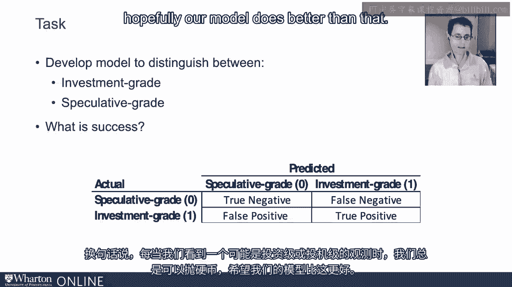

但想象以下模型。想象一个为每个公司预测的模型。我们将讨论在不同时间点的公司。

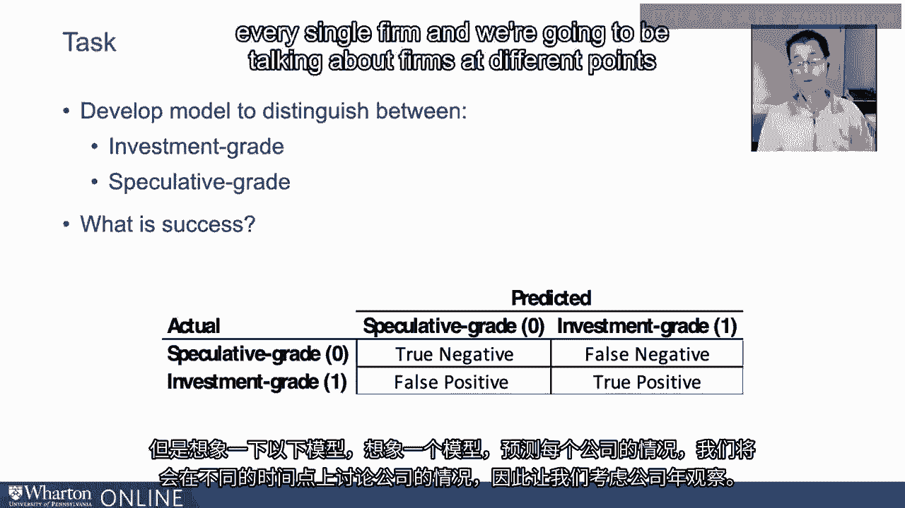

那么让我们思考公司年度观察，对吧？例如。例如2014年的英特尔或2017或2018年的AAMD。让我们想象一个模型，总是预测投资级。所以如果我们预测每家公司的年度观察，因为我们会跟踪公司，随着时间的推移。但是如果我们，我们观察的公司的每一个预测都是这样的。

如果是投资等级，投资等级公司的分类准确率将为100%。当然，投机等级公司的分类准确率将为零。我们会每一个都错，因为我们会将那些投机等级公司分类。现在一方面，你可能会想，嗯，我们每个。我们对投资等级公司100%正确。另一方面。我们没有正确分类任何投机等级公司。所以这实际上归结为清晰地。清晰地定义成功。在这种情况下，以及大多数分类上下文中。这分解为你可能犯的不同类型错误的成本。

所以让我们把这些整合到一个视觉图中，以便我们能更清楚地讨论。所以看看幻灯片和幻灯片上的每个框。每一行对应于数据中的实际观察。

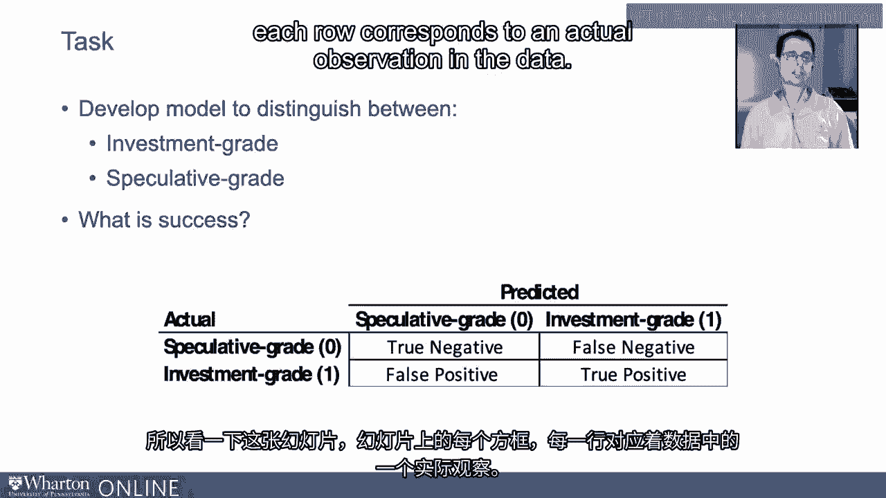

所以在数据中我们将拥有的每一个公司年观察，例如2014年的英特尔。或者2018年的AMD，无论是什么，要么是投机等级，要么是投资等级。

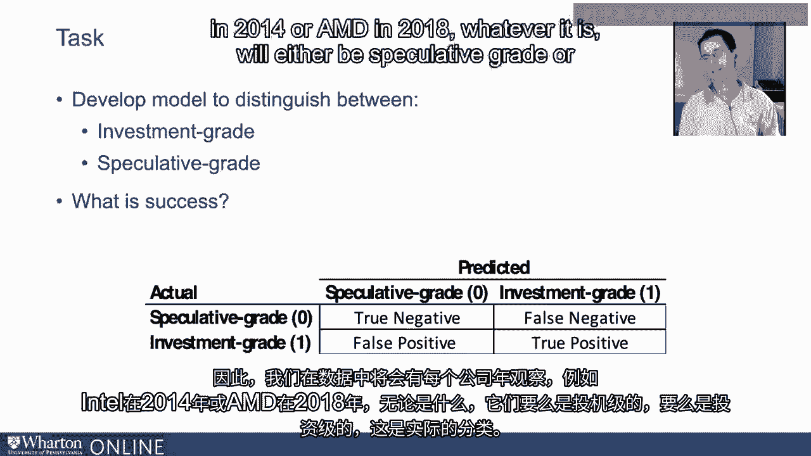

这就是实际的分类。我们的模型将预测为投机等级或投资等级。所以我们可以看到四种可能的实际预测组合，对吧？

我们可以正确预测一个被称为真实负例的投机等级公司。或者我们可以正确预测一个投资等级的公司，真实的正例。

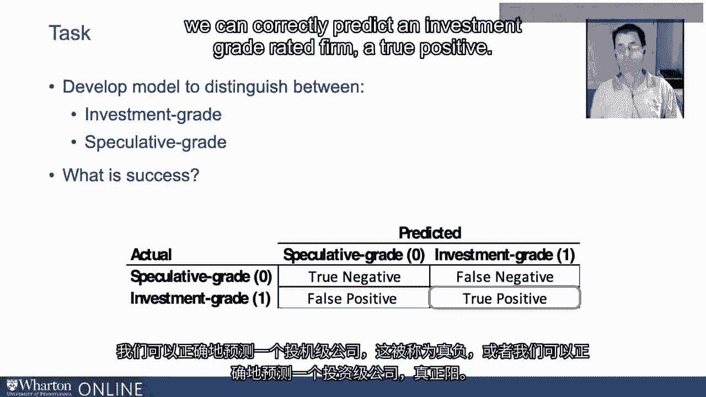

正如我所说，存在两种类型的错误。我们可能错误地将投机等级公司预测为投资等级公司。或者我们可能错误地将投资等级预测为投机等级公司。

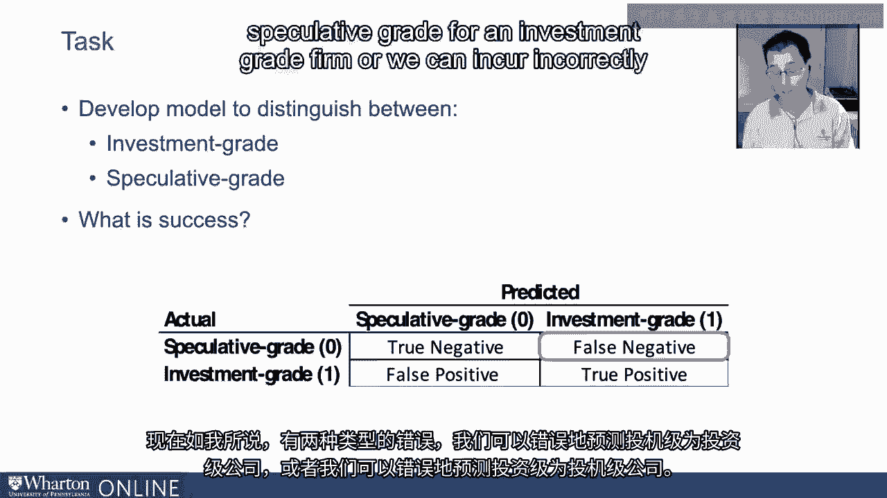

现在我刚才说过，使用那种总是预测投资等级的天真模型，我们可以。使我们的真实正例率达到100%，对吧？但是我们永远不会正确分类任何投机等级。

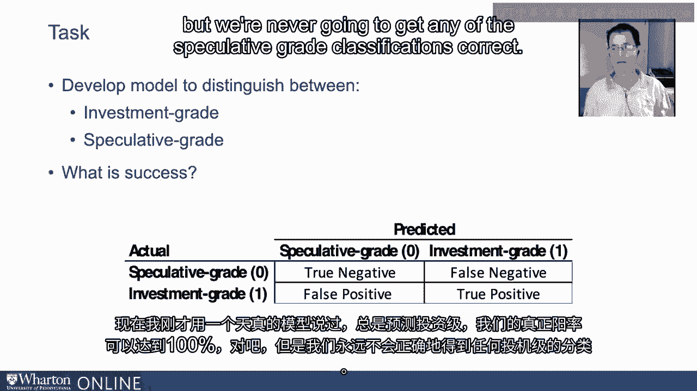

所以我们需要认真思考的是，造成这两种错误的成本是什么？

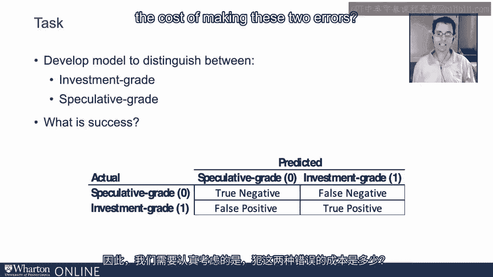

如果它们是相同的，如果错误地将投机等级分类为投资等级的成本。将公司视为投资等级的成本与错误地将投资等级分类的成本相同。如果等级公司是投机等级，那么我们只想平衡这两种错误，对吧？

或者等效于两种准确率，两种分类的准确率。

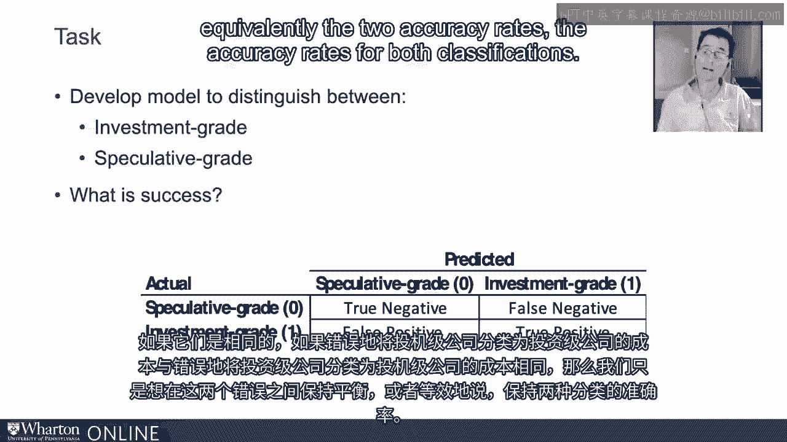

如果另一方面，相对另一种错误的成本特别高，那么。我们将更重视避免这些代价高昂错误的模型。好的，让我们用一个例子来具体化。打开你的银行，借钱给你。

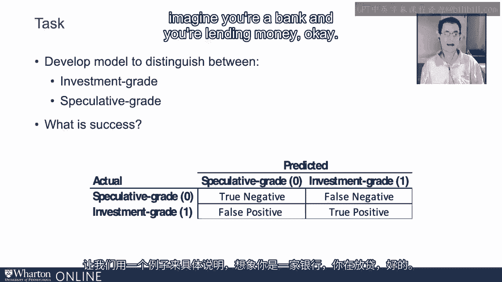

现在，如果你错误地将潜在借款人归类为投资级，而他们实际上不是。实际上，投机级的确可能非常昂贵，因为你将无法赚到足够的钱。你将给该公司提供相对宽松的贷款条件，低利率。可能会有松散的契约，这样你就更可能在那笔贷款上亏损。

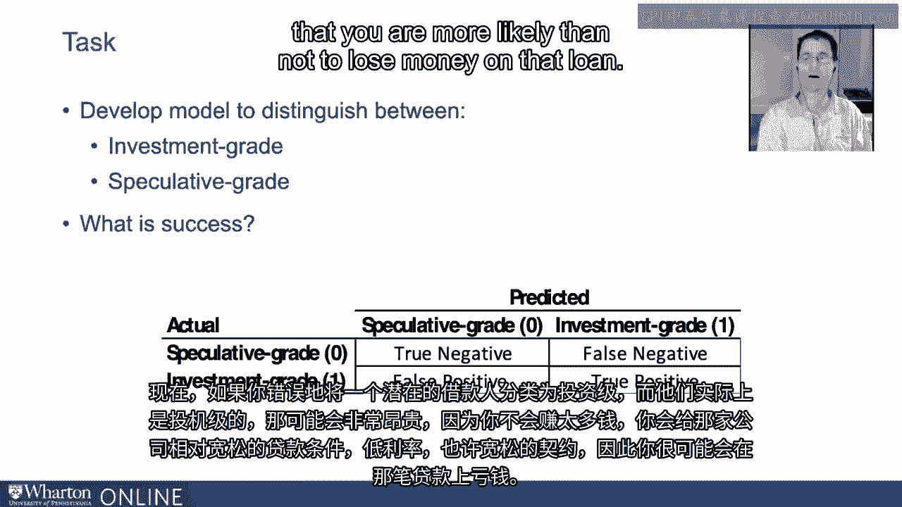

而如果你将投资级公司分类为投机级，那损失就很大。假设他们接受贷款，这并不是太糟糕，对吧？因为你将向安全公司收取相对高的利率。

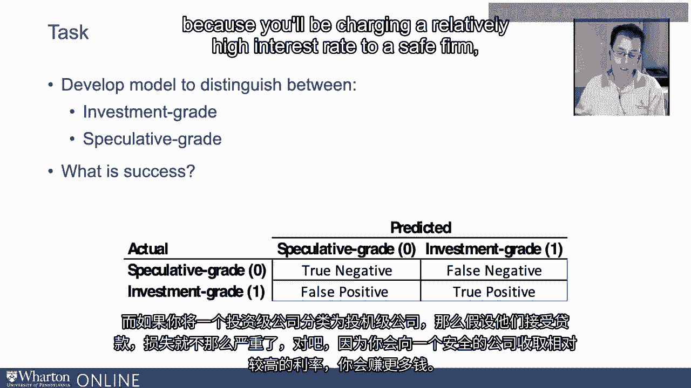

你会赚更多的钱。当然，论点是，如果你尝试这样做，你不会获得业务。首先，这也有成本。

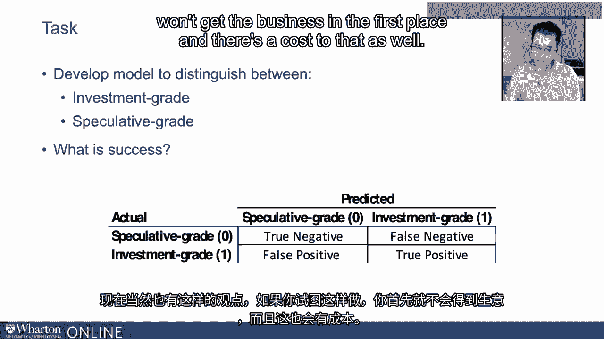

但有人可能认为将风险公司错误地归类为安全公司可能特别。在任何重大时间段或大量交易中，给贷方带来的成本都很高。

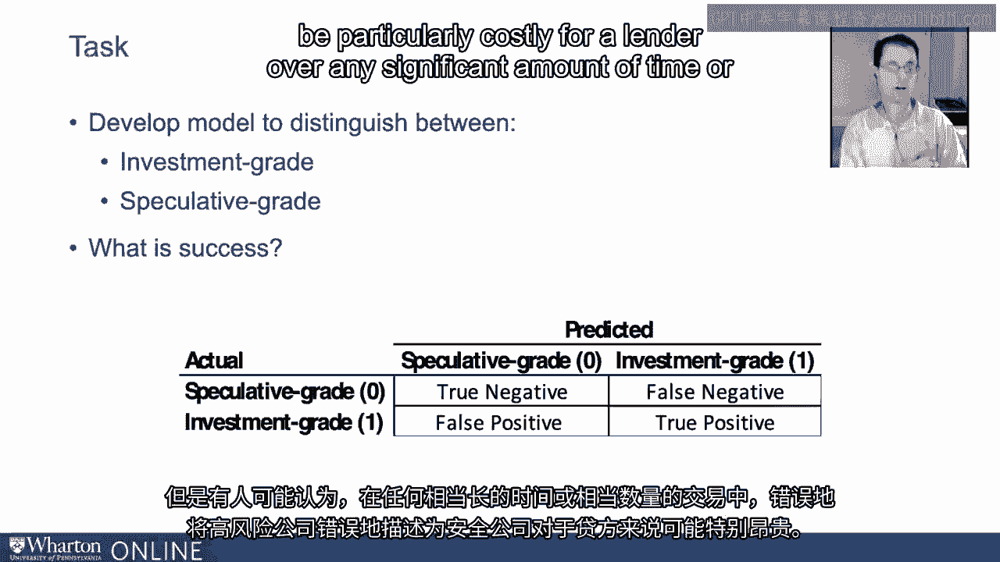

在这种情况下，我们特别关注的就是这些错误的负面。我们不希望错误地将投机级公司归类为投资级。所以我们真的想减少那些错误。

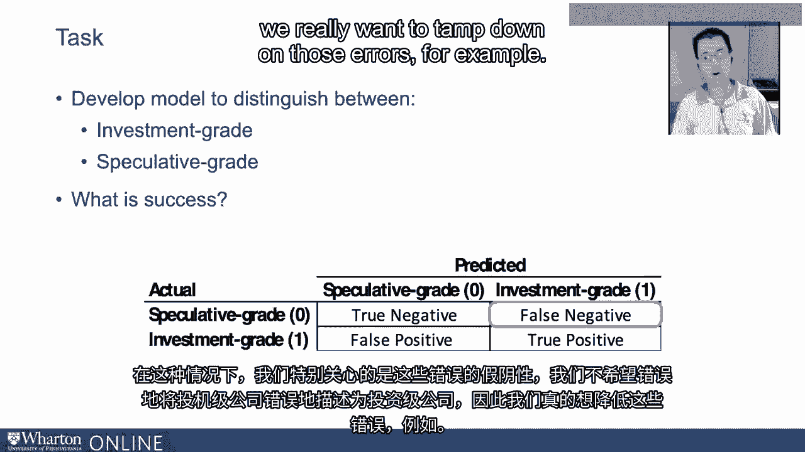

例如，当然，如果我们开始收费，这里并不是没有成本。每一个安全的借款者走进门时，利率都很高。

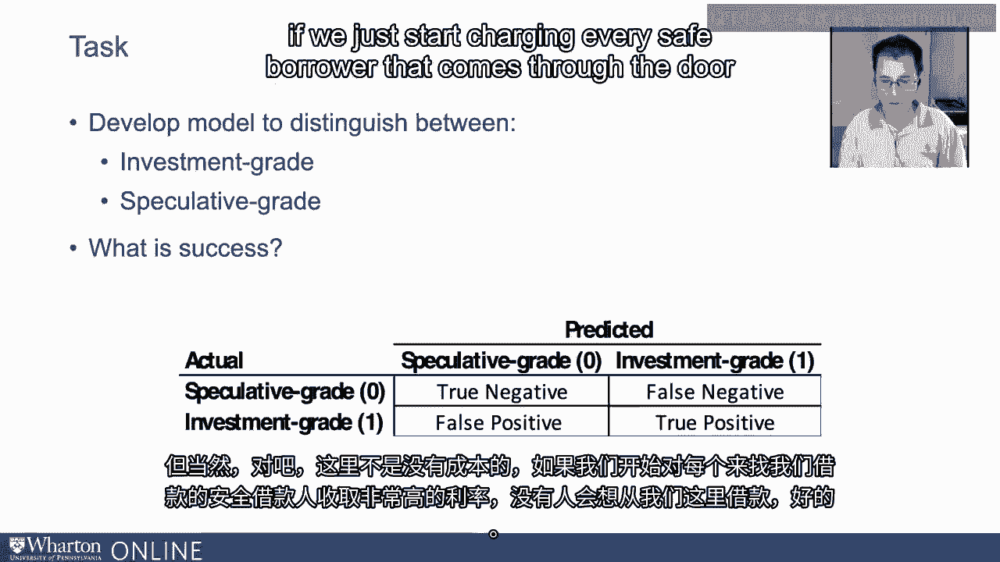

没有人会想从我们这里借款。好的。这只是一个例子，说明不同类型的错误可能会带来相对不同的成本。与不同类型错误相关的成本。因此，成功的模型真的取决于你的目标函数是什么。这在你开始建模过程之前需要清楚表达。换句话说。

我们需要回答这个问题。成功是什么？在我们深入建模之前，要非常清楚和准确地定义。尝试达成。好的。让我来总结一下。我们的目标是尝试开发一个模型，区分投资级和投机级公司。成功在我们的例子中将是一个能最小化这两种错误的结果。

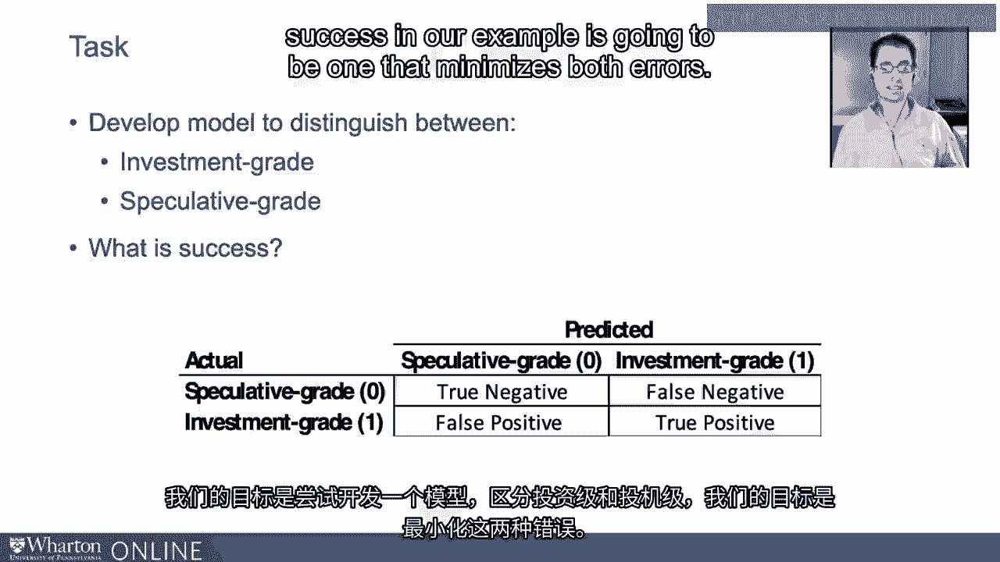

我们不会对任何单独的层施加更多或更少的权重。我们将看看我们能多准确地分类投机级和投资级。

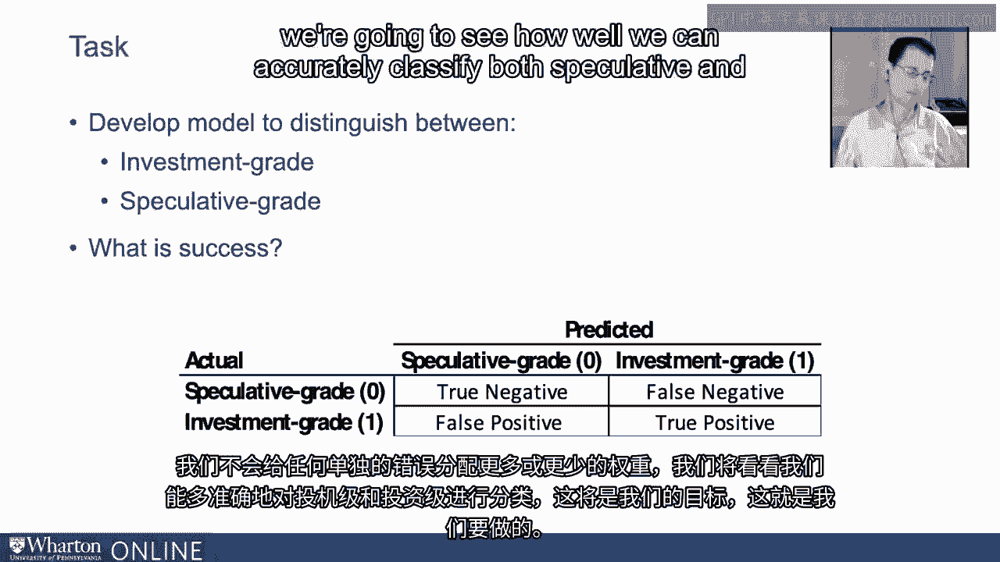

这将是我们的目标。我们要去的方向。好的。

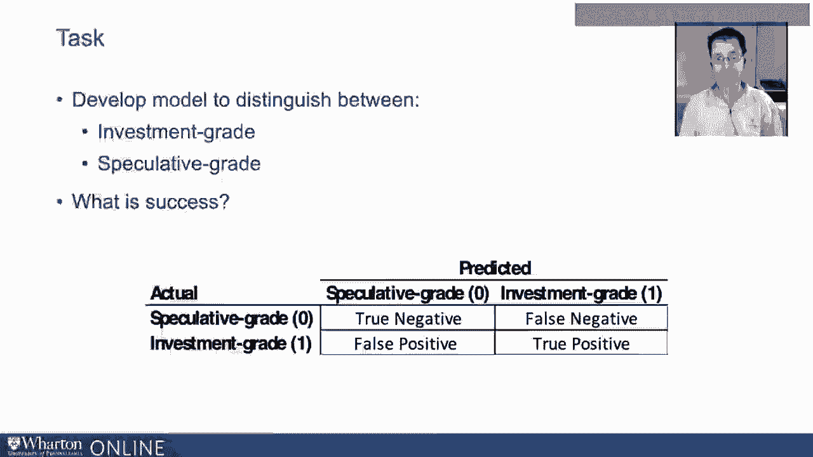

好的。好的。好的。好的。
