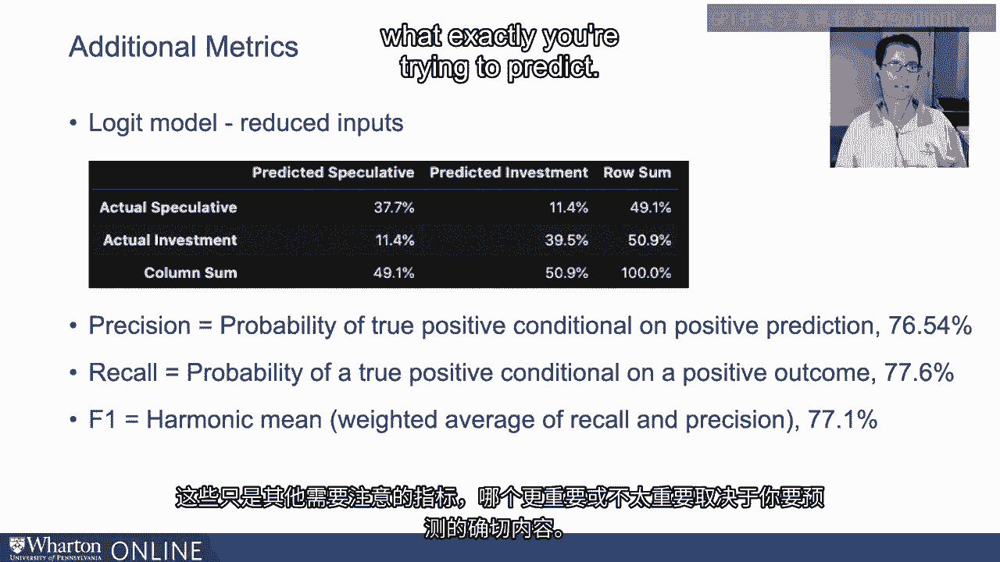
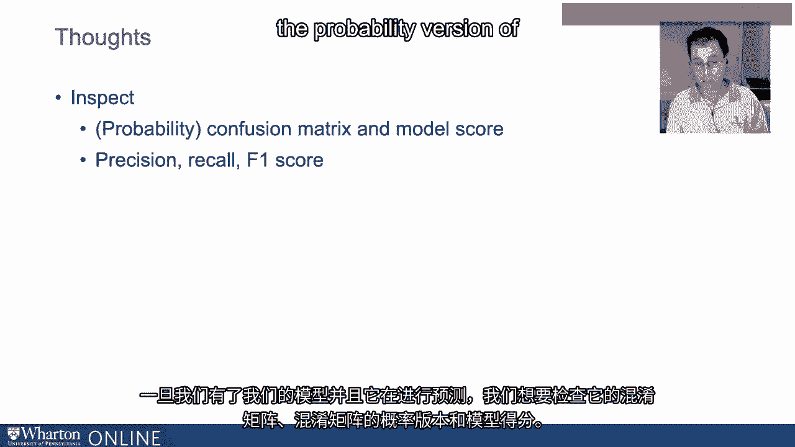
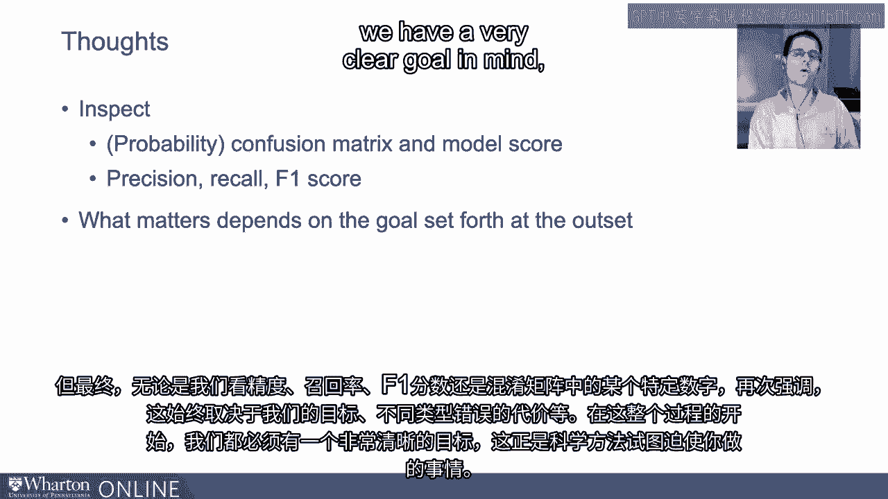
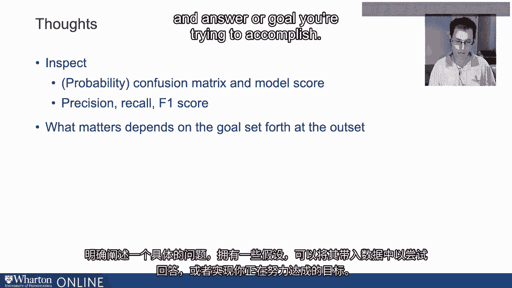

# P55：21_信用风险模型训练.zh_en - GPT中英字幕课程资源 - BV1Ju4y157dK

好的，现在让我们训练我们的模型。我们来估计一下，看它在训练数据上的表现如何。

我将使用一个相对基础的logit模型。试图预测我们的训练数据中的投机级别和投资级别结果。训练样本。我在屏幕上显示的表格称为混淆矩阵。这正是我们在之前视频中讨论的内容。但这些是模型的实际结果。所以请记住。行对应于数据中的实际观察结果。列对应于模型的预测，在这种情况下是logit模型。我们的训练数据中总共有8,432个观察结果。

432个观察结果被分配到这四种不同的可能结果中，具体如下。现在，准确的预测在对角线上。因此，当一家公司实际上被预期为。今天的挣扎实际上是投机级别，我们为该公司预测投机级别。我们对的次数为3,181次。同样，当一家公司是投资级别时。

我们预测其投资级别时，对的次数为3,330次。我们错的次数略低于1。在两种情况下都为000次。所以当我们在数据中有一家投资级别公司时。但我们预测投机级别的次数为959次。同样适用于投机级别的公司。但我们预测投资级别的次数为962次。我已在表的周边统计了行和列的总和。所以我总是发现混淆矩阵并不混淆。这是你认为我会说的，但我总是发现它是其他统计数据的基础。我认为这些更具信息量。所以我将把这里的所有内容转换为概率。

特别是，我将对每个数字进行分析，让我回顾一下。我将取这些数字中的每一个并将其除以8432。要获取矩阵中间这四个数字的正确值。然后我将再次进行。计算列和行的总和。这些数字告诉我概率。我认为这些统计数据更容易解释。所以我们正在得到。我们正确预测投机级别公司的比例为37.7%。投资级别的比例为39%。因此，我们的模型得分，模型评分。请原谅我，准确率为77.2%。我们准确分类投机级别。

投资级别观察结果的比例为77.2%。那算好还是坏？再一次。这取决于这些错误的代价，对吗？我们有22个。我们在8%的时间里犯错，但这肯定比随便抛硬币要好得多。在这种情况下，我们的准确率大约在50%左右。鉴于数据的平衡性，几乎一半的数据是投资级别。一半是投机级别。所以模型在相对那个基准下表现得很好。但我们在这里犯了不少错误。现在，考虑到之前的讨论，我想做一些事情。我们在早期视频中提到的，我想看看会发生什么。

如果我删除一堆我称之为冗余的变量，对吧？最初，在这个模型中我们有。有11个变量用于预测这个结果。如果我去掉其中七个会怎样？

我只关注当前比率、利息覆盖率、债务与 EBITDA 比率和债务与资产比率。换句话说，我从流动性覆盖率中选择了一个，从杠杆比率类别中选择了两个。这个模型在只有四个输入变量的情况下表现如何，相对于包含所有变量的模型？

这是概率混淆矩阵。在这种情况下，模型评分较低，为76.5%。但与11个变量的模型相比，仅差0.7%。所以，你知道。这是一个重要的区别吗？可能是。这0.7%可能非常昂贵。另一方面，我们有一个非常简约的模型，一个小巧紧凑的模型。

这可能更有可能在样本外做出更好的预测，而不是更大的模型。这是一个参数化更高的模型，包含11个输入。我的意思是。拥有11个变量与4个变量相比，在计算上并不会增加我们的成本。但我在考虑样本过拟合和样本外预测。

当我转向这个更简约的模型时，在某种意义上。鉴于每个信用 KPI 组内的高相关性，这样做几乎不令人惊讶。流动性覆盖率和杠杆比率。我在这个视频中想要讨论的最后一件事是我们可以查看的一些额外指标。对吧？我们在实际和预测结果方面拥有丰富的数据。

在模型评分中，还有一些额外的指标经常出现。尤其是在二元分类中，精准度的概念。这是在正向预测的情况下，真正正面的条件概率。也就是说。准确分类投资级公司有多大的概率？

条件是预测观察到的是投资级别吗？

你实际上可以通过取真正正面的数量得到这个数字，76.5%。结果，基于预测正面结果的总数。召回率是真正正面结果的概率。但这次是基于实际结果，而不是预测结果。因此，我将准确分类的投资级结果数量除以。通过投资级观察总数来计算召回率。在这种情况下，77.6%。现在，精准度和召回率之间存在权衡。如果你在一个方面有所改善。你在另一个方面会表现得更差。两者之间存在这种推拉张力。

所以还有一个额外的指标叫做 F1 分数，这只是。这是一个华丽的名称或简单名称，用于称为调和平均数的内容。只是精准度和召回率的加权平均，结果大约是77.1%。看。这些只是需要注意的其他衡量标准。哪一个更重要则取决于你究竟想预测什么。所以这里有一些结束的想法来将这一切结合在一起。一旦我们得到了模型并且它在进行预测。

我们希望检查它的混淆矩阵，即混淆矩阵的概率版本。

模型评分。但是最终，无论我们查看精准度、召回率、F1评分。或者混淆矩阵中的某个特定数字，这总是取决于我们的目标。制造不同类型错误的成本等等。所以在整个过程的最外层是至关重要的。我们心中有一个非常明确的目标，这正是科学方法真正想要强加的。

你需要做的就是明确并清晰表达一个具体的问题，并有一些假设。可以采取的数据来尝试回答你想要实现的目标。

[BLANK_AUDIO]。

