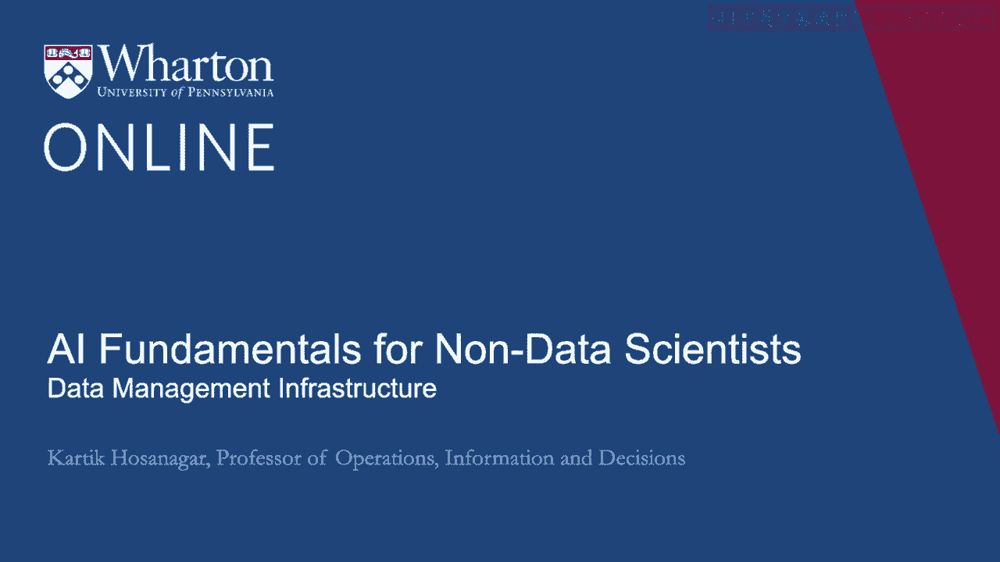

# P6：5_数据管理基础设施.zh_en - GPT中英字幕课程资源 - BV1Ju4y157dK

欢迎回来。在本次会议中，我们将深入探讨数据基础设施。

公司在开展大规模 AI 驱动的业务之前需要做好准备。转型。为了帮助我们理解公司需要什么样的数据基础设施。我们已经准备好了，今天在这里的是产品管理总监**克里斯·查尔德**。在Snowflake。克里斯，欢迎你。请告诉我们一下你在这个领域的背景。

谢谢，Karthik。我很高兴在这里。所以，正如你提到的，我在Snowflake工作，负责计算。这是一个云数据仓库公司。我在数据领域工作了我的整个职业生涯。作为投资者和现在的运营者，我帮助构建有助于发展的系统。公司能够做出更好的决策，并真正更好地运营业务。所以，克里斯，我。

我们开始的好地方是谈谈，您知道，数据库到底是什么。企业到底是如何考虑各种不同类型的数据库的？这是什么。过去几年中的演变一直是这样吗？当然。实际上，这里有两种类型。大多数公司最终需要的数据库。第一个是我们所称的事务性数据库。

数据库。这是一个记录重要信息的系统。一种日常经营业务的方式。因此，如果我们以银行为例。银行会有一个事务性数据库，用于记录所有客户的余额。每当有人开始交易时，你都会使用这个来找出原因。如果他们的账户中有足够的资金来借记或贷记他们的账户。并保持持续的余额。这些非常有用，并且它们需要非常快速。它们往往非常昂贵。另一方面，你最终得到的是所谓的**分析性**。数据库或分析系统用于处理更大、更大规模的数据集，持续很长时间。

一段时间。所以，继续以银行的例子，我可能想要保留一个历史记录。我所有客户曾经拥有的每一笔交易和每一个余额。它将是。保持这部分在我的事务数据库中非常昂贵。于是，我将那些数据转移到一个单独的。将数据库转换为分析数据库，以便我可以保留这些庞大的历史记录。然后在那里。

我可以问这样的问题：“我想要一份所有客户的名单，他们的余额增加了。”

在过去五年中的四年里至少增加了10%。我的事务数据库将无法。要回答这个问题，我的分析数据库会这样做。"所以，转向分析数据库。显然，这将涉及基础设施的投资。我们所谈论的是什么类型的基础设施？

关于这个？是的，所以当你最初设置数据仓库或分析数据库时。你需要购买特殊的硬件。你需要购买非常昂贵的软件。来自不同的供应商。再说一次，我们谈论的是20、30年前的事情。这套存储数据的方法论就是在这里发挥作用的。因此，随着。

人们从许多不同来源收集的数据量，不管那是什么。来自移动应用、网站、营销活动，甚至是你正在收集的数据。你在商店里对发生的事情的实际情况，或来自整个供应链的信息。这里有。许多不同的数据来源开始涌入。这些类型的专业分析。

在特殊硬件上运行的数据库开始变得非常昂贵，运营成本逐渐增加。并不能真正满足那海量数据的性能需求。所以。这次我们经历了某种第一次重大演变。然后从。这些定制构建的专业分析数据仓库，巨量的数据开始。存储在一个名为Hadoop的新系统中。Hadoop是由Google开发的，用于处理。他们收集和追踪的大量网络数据，此外还被设计为可运行在。一张由非常廉价的硬件组成的庞大网络。因此，不再需要这些专用的、非常昂贵的。服务器，你可以在数百台非常便宜的服务器上运行。结果就是这样。

一种更具成本效益的方法来管理和处理这些大量、巨大的数据。现在。这难道不是创建数据湖的真正意义所在吗？我们难道不在一个过程中吗？

看到许多公司转向更新的大数据工具或技术，如**Spark**等，您有什么看法？

当然。因此，数据湖是人们用来指代基本上是庞大数据集的术语。硬盘中存储着所有这些数据。所以这是一个你可以倾倒的地方。像湖泊一样的大量数据，然后你可以使用像Hadoop或现在的Spark这样的工具。这是一个更现代的Hadoop计算引擎版本，用于从数据湖中提取数据。

对其进行一些计算和转换，然后再放回去，以便你可以。稍后再找到它。通常我们看到的是，一旦人们完成所有这些。计算，他们希望能够非常快速地查询这些数据。所以他们会结束。把这些数据放入他们最初使用的数据仓库中。现在他们已经开始。

将这些称为数据集市，这里是你的一小部分客户或内部数据所在的地方。用户可以获取数据的一个子集。但为了加载一个新的数据集，你。必须回去编写Hadoop或Spark作业，以便将数据转换并加载到。那些数据集市或数据仓库。对于那些不熟悉的你们，Hadoop和Spark。

这些是用于存储和处理大量数据的技术，基本上涉及分布式存储。数据的分布式处理和大量并行化的创建有助于它们。数据处理变得更快。现在回到你身边，克里斯。我们现在也看到了向云数据仓库的转型。那么你能具体说明什么是数据仓库吗？

这在整个对话中如何适应？

公司将数据迁移到数据湖和数据集市的趋势如何？绝对如此。很多人发现使用这些数据湖和数据集市时，它是。仍然很难跟踪所有数据。数据分散在多个庞大的地方。大量的它。它是一种不一致的格式。访问它时常常需要你的。工程团队实际上编写可以在这些大型并行系统上运行的代码。大约十年前，许多研究开始关注现在所称的内容。云数据仓库。这些是来自亚马逊、谷歌或雪花公司的系统。对传统数据仓库的重新构想。它们旨在在大规模并行环境中运行。

一组廉价硬件，就像Hadoop一样。一般来说，它们运行在你。从像亚马逊、谷歌或微软这样的云服务提供商租用，而不是自己管理这些。自己搭建服务器。但从外部来看，它们的外观、操作和性能都很相似。传统数据仓库的。 所以这意味着他们使用一种语言与它们进行交流。

被称为SQL，这是数据仓库和数据库使用的。这意味着你可以原生地。直接使用 Tableau、Looker 或其他分析和商业智能工具。因为。他们使用那个标准语言，同时也能很好地与大量工具集成。所以。正如我们之前稍微提到的，你真正想从你的数据平台中获得的东西。

整体上，这是一个存储所有这些数据的地方，你需要一套数据摄取工具。那么你该如何做呢？

如何将数据导入你的数据平台？由于是基于SQL的，你可以使用多种不同的方式。专门为此构建的工具。然后你需要一组变换来。获取传入的原始数据并将其转化为有用的信息。正如我相信你已经知道的。在这节课中谈到的技术之一是机器学习，你可以。

用于处理这些原始数据并对其进行评分，预测并弄清楚接下来会发生什么。但是也有简单的事情，比如，我可能会获取关于一组动作的数据。用户每天都在进行这项操作。而实际上，我想从每月的角度来审视这一点。所以一个转变就是将其汇总为按月进行。然后是最终的。

你需要的部分是一个查询和可视化引擎。正如我们提到的**Tableau**或**Looker**。或其他类似工具，实际上运行查询的一种方式，让你的分析团队能够构建。仪表盘基本上是在数据经过转换后提出问题。因此，人们在使用Hadoop或基于Spark的技术时面临的一个重大挑战。

生态系统是这些工具往往需要为该生态系统量身定制的。 而。如果你使用云数据仓库，你将获得高性能，你将获得Hadoop的可扩展性。但你也可以访问标准工具生态系统。所以克里斯。当我们开始交谈时，我提到在公司可以开始之前。

使用机器学习或其他预测技术时，他们需要建立数据基础设施。建立这一数据基础设施显然需要资金，且不能。不可轻视。那么，管理者在进行这样的练习之前应该问哪些问题呢？

绝对是这样。因此，我看到人们反复犯的一个错误是认为。拥有这样的数据基础设施本身就是一件重要的事情。因此。他们会设置这个并加载大量数据，还会购买一堆工具。他们实际上不会从中获得任何价值，因为他们没有提前思考。

关于他们试图解决什么问题，他们希望解决哪些困难的时间。用数据解决问题。所以我建议任何准备开始这段旅程的人。首先仔细考虑你希望问但却不能问的那些问题类型。因为你没有所有的数据，正在回答的问题类型。今天，但这需要很长时间。一个例子是你问某人任何事情。让你团队花两周时间收集数据并在Excel中进行分析，这些都是。如果你拥有适当的资源，能够在几分钟内解决的问题的**合适候选者**。需要建立正确的数据基础设施。最后，思考你需要哪些数据。

为了回答这些问题。一般来说，收集每一个单独的东西并没有太大用处。你能想到的任何一条数据。相反，哪些数据是重要的呢？

对于您的业务，这些将帮助您回答那些关键的商业问题。让你可以更好、更高效地经营你的业务。实际上，这一切归根结底。这就是最终目标。**克里斯**，这是一套非常有帮助的提示和概述。数据基础设施是公司需要深入思考的内容。非常感谢你的参与。

谢谢你，Karthik。非常感激。感谢你让我参与。 [BLANK_AUDIO]。

