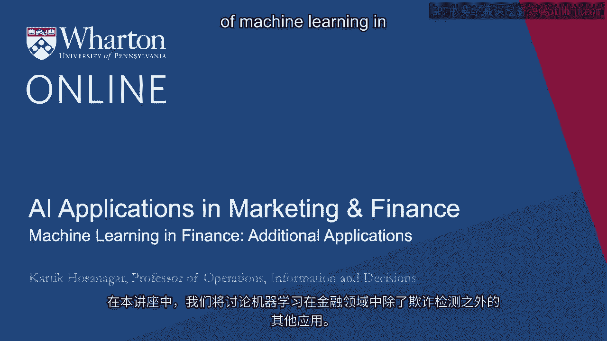
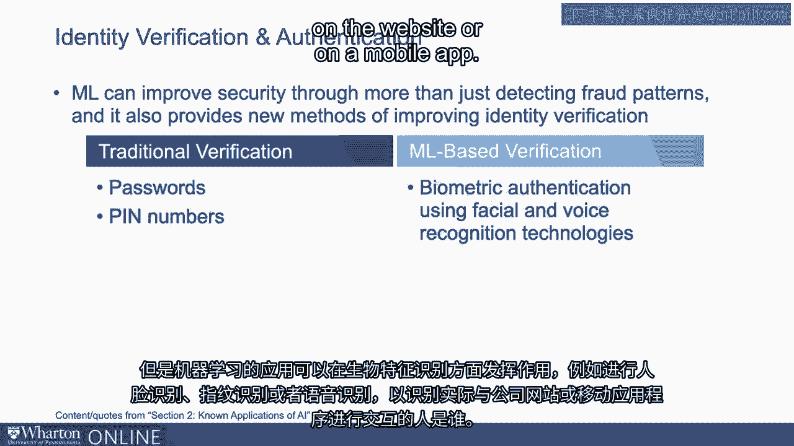
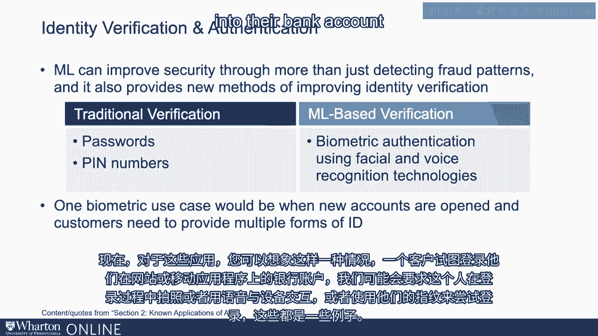
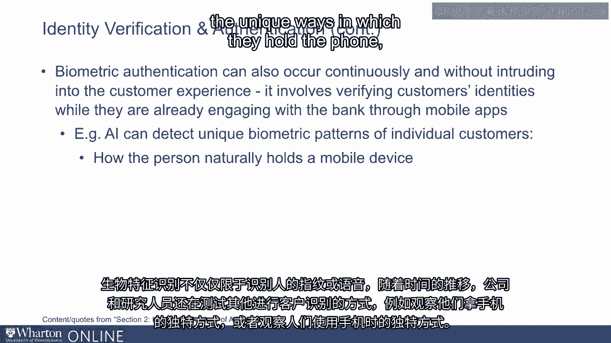
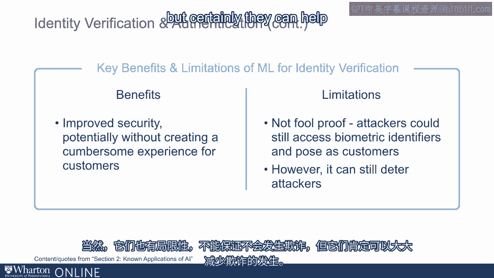
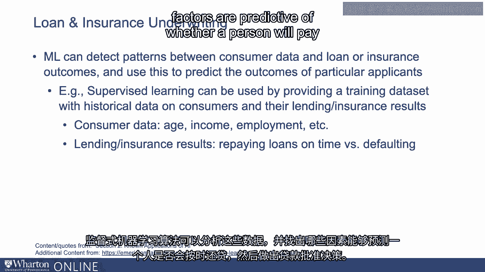
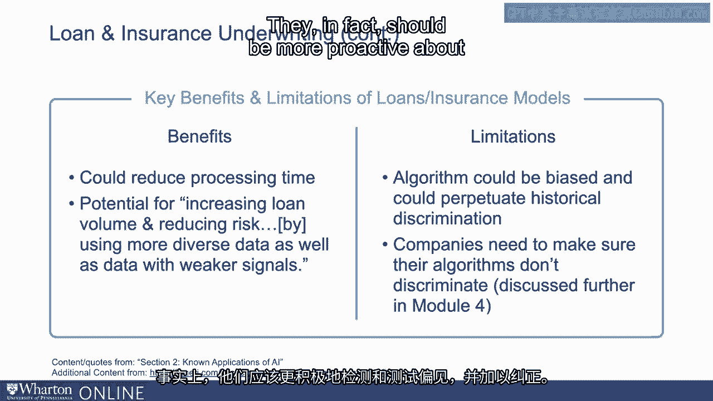
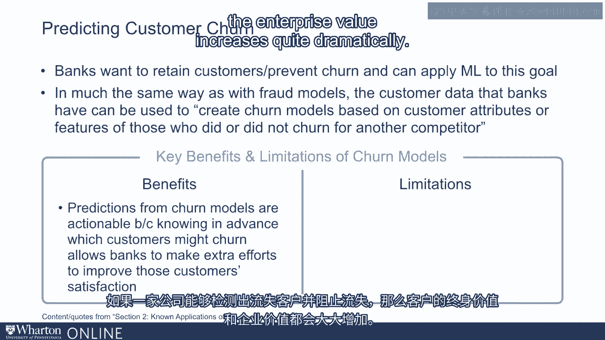

# P61：27_金融其他应用中的机器学习.zh_en - GPT中英字幕课程资源 - BV1Ju4y157dK

在本讲座中，我们将讨论机器学习在金融中的其他应用。

超越仅仅是欺诈检测。在与APU的对话中，我们谈到了这些例子。

但在本讲座中，我们将深入探讨如何将机器学习应用于各种。

在金融服务中存在不同的需求。首先。

让我们讨论身份验证和身份确认。

这在金融服务中极其重要，因为如果允许消费者。

进行交易或转账，我们希望确保实际操作的人。

启动交易的人是他或她声称的那个人。

所以我们需要进行身份验证。传统的身份验证方法是使用密码或PIN码。

数字方面，机器学习的应用将体现在生物识别识别上。

例如，进行人脸识别、指纹识别或语音识别。

识别以确定谁实际上在与公司的网站互动。

或在移动应用程序上。现在就这些应用而言。

你可以想象一种情况，顾客正在尝试。

在网站或移动应用上登录他们的银行账户，我们可能会询问那个人。

在登录过程中拍摄自己的照片或对着设备说话或。

也许使用指纹尝试登录。因此，这些是一些例子。事实上。

在中国的银行中，ATM使用人脸识别并不少见。

所以当顾客走到ATM前时，ATM上的摄像头实际上可能。

识别客户，然后对其进行身份验证，允许他们使用ATM。

而这实际上现在正在中国的多家银行使用。

生物识别识别不必仅仅关注一个人的指纹。

或他们的声音。随着时间的推移，企业和研究人员也在测试其他客户识别的方法。

比如观察他们握手机的独特方式或其他独特方式。

人们轻触手机。这项技术尚不够成熟。

目前尚不清楚它是否会在实践中被使用。

但如今生物识别在身份识别方面有多种用途，所有这些用途往往。

依赖机器学习来进行识别。

这些技术的优势当然是生物识别提供的额外安全性。

相对于密码等内容，提供相对的安全性。当然，限制是它们并非万无一失。

它们并不能保证不会发生欺诈。

但它们肯定可以显著减少这种情况。

机器学习的另一个应用是在贷款和保险的承保中。

因此，如果你查看贷款批准决策，今天是由贷款官根据。

一些关于客户的信息。但是，越来越多的人对将机器学习算法应用于指导表示兴趣。

或者自己做出贷款决策。因此，这些算法通常是监督式机器学习算法，因此它们会获得一个。

训练数据集。训练数据集将包括多个特征或协变量或X变量。

包括客户数据，如他们的年龄、收入、就业及其过去的历史。

他们的信用评级等等。同时，还将包括干净标记的结果变量，比如他们的信用。

过去的评分或他们按时还款的历史，或者是否。

他们是否违约。因此，如果你查看数据，你可以看到数据是如何被使用的。

你可以看到数据是如何被使用的。

你可以看到数据是如何被使用的。你可以看到数据是如何被使用的。

你可以看到数据是如何被使用的。你可以看到数据是如何被使用的。

你可以看到数据是如何被使用的。你可以看到数据是如何被使用的。

你可以看到数据是如何被使用的。你可以看到数据是如何被使用的。

你可以看到数据是如何被使用的。你可以看到数据是如何被使用的。

你可以看到数据是如何被使用的。你可以看到数据是如何被使用的。

你可以看到数据是如何被使用的。你可以看到数据是如何被使用的。

你可以看到数据是如何被使用的。你可以看到数据是如何被使用的。

你可以看到数据是如何被使用的。你可以看到数据是如何被使用的。

你可以看到数据是如何被使用的。你可以看到数据是如何被使用的。

你可以看到数据是如何被使用的。你可以看到数据是如何被使用的。

你可以看到数据是如何被使用的。你可以看到数据是如何被使用的。

你可以看到数据是如何被使用的。你可以看到数据是如何被使用的。

你可以看到数据是如何被使用的。你可以看到数据是如何被使用的。

你可以看到数据是如何被使用的。你可以看到数据是如何被使用的。

你可以看到数据是如何被使用的。你可以看到数据是如何被使用的。

你可以看到数据是如何被使用的。你可以看到数据是如何被使用的。

你可以看到数据是如何被使用的。你可以看到数据是如何被使用的。

你可以看到数据是如何被使用的。你可以看到数据是如何被使用的。

你可以看到数据是如何被使用的。你可以看到数据是如何被使用的。

你可以看到数据是如何被使用的。你可以看到数据是如何被使用的。

你可以看到数据是如何被使用的。你可以看到数据是如何被使用的。

你可以看到数据是如何被使用的。你可以看到数据是如何被使用的。

你可以看到数据是如何被使用的。你可以看到数据是如何被使用的。

你可以看到数据是如何被使用的。你可以看到数据是如何被使用的。

你可以看到数据是如何被使用的。你可以看到数据是如何被使用的。

你可以看到数据是如何被使用的。你可以看到数据是如何被使用的。

你可以看到数据是如何被使用的。你可以看到数据是如何被使用的。

你可以看到数据是如何被使用的。你可以看到数据是如何被使用的。

你可以看到数据是如何被使用的。你可以看到数据是如何被使用的。

你可以看到数据是如何被使用的。你可以看到数据是如何被使用的。

你可以看到数据是如何被使用的。你可以看到数据是如何被使用的。

你可以看到数据是如何被使用的。你可以看到数据是如何被使用的。

你可以看到数据是如何被使用的。你可以看到数据是如何被使用的。

你可以看到数据是如何被使用的。你可以看到数据是如何被使用的。

你可以看到数据是如何被使用的。你可以看到数据是如何被使用的。

你可以看到数据是如何被使用的。你可以看到数据是如何被使用的。

你可以看到数据是如何被使用的。你可以看到数据是如何被使用的。

你可以看到数据是如何被使用的。你可以看到数据是如何被使用的。

你可以看到数据是如何被使用的。你可以看到数据是如何被使用的。

你可以看到数据是如何被使用的。你可以看到数据是如何被使用的。

你可以看到数据是如何被使用的。

你可以看到数据是如何被使用的。你可以看到数据是如何被使用的。

你可以看到数据是如何被使用的。你可以看到数据是如何被使用的。

你可以看到数据是如何被使用的。你可以看到数据是如何被使用的。

你可以看到数据是如何被使用的。你可以看到数据是如何被使用的。

你可以看到数据是如何被使用的。你可以看到数据是如何被使用的。

你可以看到数据是如何被使用的。你可以看到数据是如何被使用的。

你可以看到数据是如何被使用的。你可以看到数据是如何被使用的。

你可以看到数据是如何被使用的。你可以看到数据是如何被使用的。

你可以看到数据是如何被使用的。你可以看到数据是如何被使用的。

你可以看到数据是如何被使用的。你可以看到数据是如何被使用的。

你可以看到数据是如何被使用的。你可以看到数据是如何被使用的。

你可以看到数据是如何被使用的。你可以看到数据是如何被使用的。

你可以看到数据是如何被使用的。你可以看到数据是如何被使用的。

你可以看到数据是如何被使用的。你可以看到数据是如何被使用的。

你可以看到数据是如何被使用的。你可以看到数据是如何被使用的。

你可以看到数据是如何被使用的。你可以看到数据是如何被使用的。

你可以看到数据是如何被使用的。你可以看到数据是如何被使用的。

你可以看到数据是如何被使用的。你可以看到数据是如何被使用的。

你可以看到数据是如何被使用的。你可以看到数据是如何被使用的。

你可以看到数据是如何被使用的。你可以看到数据是如何被使用的。

你可以看到数据是如何被使用的。你可以看到数据是如何被使用的。

你可以看到数据是如何被使用的。你可以看到数据是如何被使用的。

你可以看到数据是如何被使用的。你可以看到数据是如何被使用的。

你可以看到数据是如何被使用的。你可以看到数据是如何被使用的。

你可以看到数据是如何被使用的。你可以看到数据是如何被使用的。

你可以看到数据是如何被使用的。你可以看到数据是如何被使用的。

你可以看到数据是如何被使用的。你可以看到数据是如何被使用的。

你可以看到数据是如何被使用的。你可以看到数据是如何被使用的。

你可以看到数据是如何被使用的。你可以看到数据是如何被使用的。

你可以看到数据是如何被使用的。你可以看到数据是如何被使用的。

你可以看到数据是如何被使用的。你可以看到数据是如何被使用的。

你可以看到数据是如何被使用的。你可以看到数据是如何被使用的。

你可以看到数据是如何被使用的。

[空白音频]。
